# Algorithm

<h1> 정렬 </h1>
<details>
<summary>정렬</summary>
<div markdown="1">

# 정렬

<details>
<summary>버블 정렬 </summary>
<div markdown="1">

## 버블 정렬

### 개념

인접한 두 개의 원소를 비교하며 정렬하는 알고리즘

### 정렬 과정

배열이 {30, 15, 2, 8, 21, 7}일 때를 가정한다.

원소는 자신의 오른쪽 값과 비교하기 때문에, 첫 사이클에서 비교할 마지막 index는 n-2이다. n-1(마지막 원소)와 비교를 하면 한 사이클이 끝나기 때문이다.

그렇게 한 사이클이 지나면 가장 큰 값이 배열의 오른쪽에 위치하여 다음 사이클에서는 비교 대상에서 제외된다.

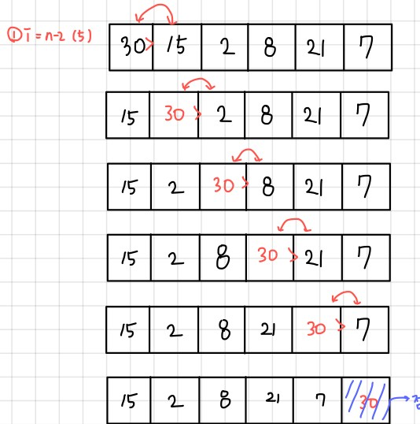

두 번째는 30을 제외하고 다섯개의 원소만 비교하며 같은 과정을 반복한다. 이 사이클이 끝나면 두 번째로 큰 원소인 21이 자신의 위치를 찾아간다.

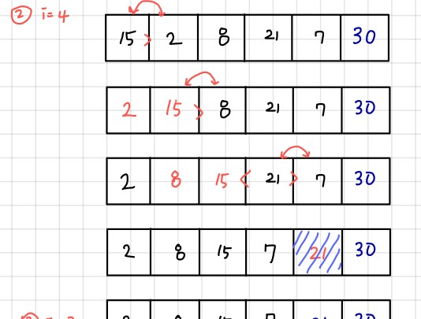)

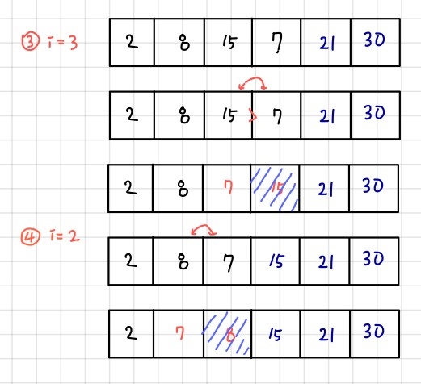

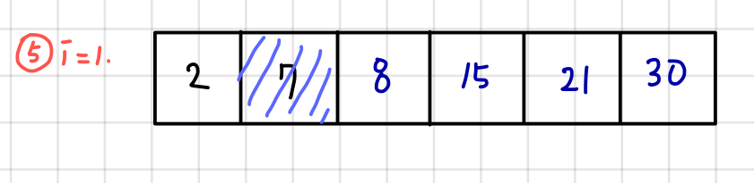

이렇게 반복하다보면 i가 1일때, 두 번째로 작은 원소인 7이 정렬되고, 자동으로 가장 작은 원소인 2는 비교 대상이 없기 때문에 모든 정렬이 끝난다.

### 코드

```java
package sort;

import java.util.Arrays;

public class BubbleSort {
	public static void main(String[] args) {
		int[] arr = { 30, 15, 2, 8, 21, 7 };
		bubbleSort(arr);
		System.out.println(Arrays.toString(arr));

	}

	static void bubbleSort(int[] arr) {
		for (int i = arr.length - 1; i > 0; i--) {
			for (int j = 0; j < i; j++) {
				if (arr[j] > arr[j + 1]) {
					swap(arr, j, j + 1);
				}
			}
		}
	}

	static void swap(int[] arr, int i, int j) {
		int tmp = arr[i];
		arr[i] = arr[j];
		arr[j] = tmp;

	}
}
```

</div>
</details>

<details>
<summary>선택 정렬 </summary>
<div markdown="1">


## 선택 정렬

### 개념

주어진 자료들 중 가장 작은 값의 원소부터 차례대로 선택하여 위치를 교환하는 방식으로 정렬하는 알고리즘

시간 복잡도: O(n^2)

### 정렬 과정

1. 첫 번째 원소를 두 번째부터 마지막 원소까지 비교하여 가장 작은 값과 자리 교환

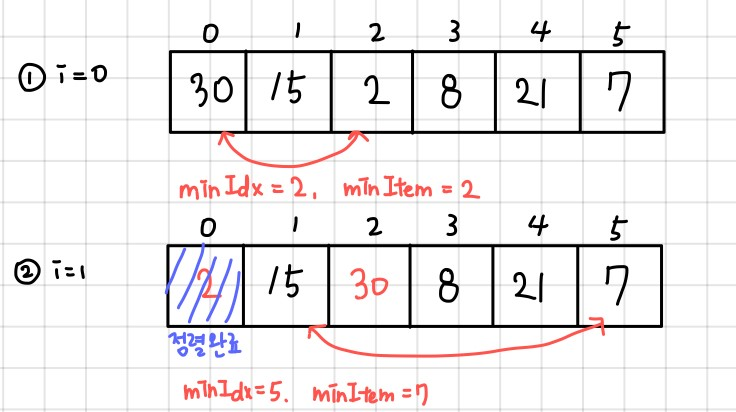

2가 가장 작은 원소이고, 그 값의 index는 2이므로 arr[0]과 arr[1] 교환, arr[0]은 가장 작은 값으로 정렬 완료

1. 두 번째, 세 번째 … 끝에서 두 번째 원소까지 같은 과정을 반복함

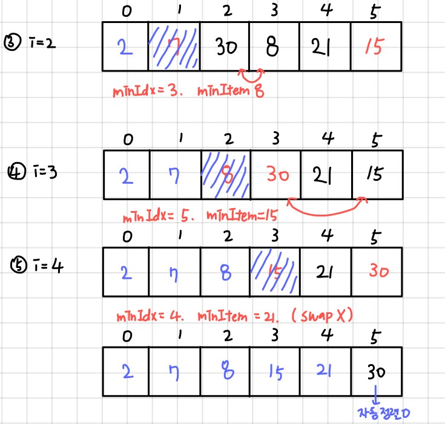

### 코드

```java
package sort;

import java.util.Arrays;

public class SelectionSort {
	public static void main(String[] args) {
		int[] arr = { 30, 15, 2, 8, 21, 7 };
		selectionSort(arr);
		System.out.println(Arrays.toString(arr));

	}

	static void selectionSort(int[] arr) {
		for (int i = 0; i < arr.length - 1; i++) {
			int minIdx = i;
			int idx = i;
			while (idx < arr.length) {
				if (arr[idx] < arr[minIdx]) {
					minIdx = idx;
				}
				idx++;

			}
			swap(arr, i, minIdx);
		}
	}

	static void swap(int[] arr, int i, int j) {
		int tmp = arr[i];
		arr[i] = arr[j];
		arr[j] = tmp;
	}

}
```
</div>
</details>

<details>
<summary>카운팅 정렬</summary>
<div markdown="1">

## 카운팅 정렬

데이터끼리 비교 없이 데이터의 개수를 세어 정렬하는 알고리즘

### 제한

정수나 정수로 표현할 수 있는 자료에 대해서만 한정

데이터의 입력 범위가 제한적인 경우에 효율적

- 데이터의 수는 적지만, 데이터 값의 범위가 큰 경우(ex. 1~10억) count 배열이 메모리를 과다하게 사용하여 비효율적!

### 시간복잡도

O(n+k)

- n: 배열의 길이
- k: 정수의 최대값

### 과정

1. 정렬할 배열에서 가장 큰 정수를 크기로 하는 count 배열을 선언한다..
2. 데이터 값이 i인 경우, count[i]를 1씩 증가시킨다.
3. count가 모두 끝나면, 앞에서부터 누적합하여 count배열을 수정한다.
    
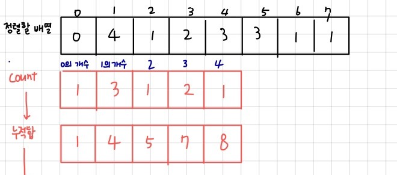)
    
4. 기존 배열의 맨 마지막 index부터 정렬을 시작한다. arr[n-1]이 k일 경우, count[k]의 값을 찾아, 그 값을 1감소 시킨 후 해당 값을 index로 하는 위치에 넣는다.
    
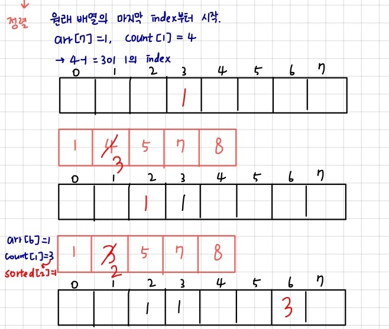)
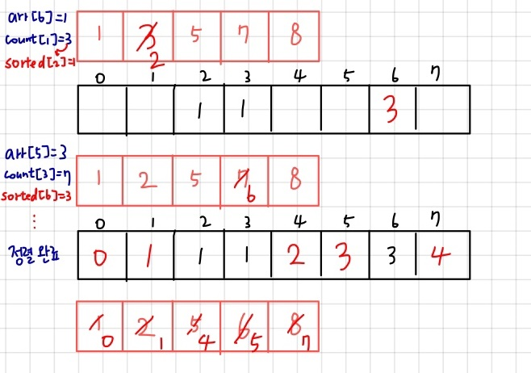)
    

### 자바 구현

```java
package sort;

import java.util.Arrays;

public class CountingSort {
	public static void main(String[] args) {
		int[] arr = { 0, 4, 1, 2, 3, 3, 1, 1 };

		System.out.println(Arrays.toString(countingSort(arr)));

	}

	static int[] countingSort(int[] arr) {
		// max 값 찾기
		int max = 0;
		for (int i = 0; i < arr.length; i++)
			if (max < arr[i])
				max = arr[i];
		int[] count = new int[max + 1];

		// 각 수를 count
		for (int num : arr) {
			count[num]++;
		}

		// 누적합
		for (int i = 1; i < count.length; i++) {
			count[i] += count[i - 1];
		}

		// tmp 배열에 정렬
		int[] tmp = new int[arr.length];

		for (int i = arr.length - 1; i >= 0; i--) {
			int idx = --count[arr[i]];
			tmp[idx] = arr[i];
		}
		return tmp;
	}

}
```
</div>
</details>


<details>
<summary>삽입 정렬 </summary>
<div markdown="1">


## 삽입 정렬

0번째부터 i번째까지 정렬된 배열의 크기를 증가시키며 정렬하는 알고리즘

이미 정렬된 i개짜리 배열에 하나의 원소를 더하여 정렬된 i+1개짜리 배열 만들기!

시간 복잡도: $O(n^2)$

### 과정

i번째 원소를 정렬할 차례

1. i-1번째까지의 원소들은 정렬되어 있음
2. i-1부터 0까지의 원소들과 i번째 원소(key)를 비교하며, i번째 원소보다 작은 원소를 만나면 break, i번째 원소보다 크다면 해당 원소를 오른쪽으로 한 칸씩 shift
3. break한 원소 다음 자리에 i번째 원소를 삽입
4. 1부터 마지막 원소까지 반복

---

1 0번째 원소는 정렬된 상태

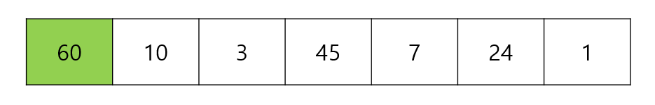

i=1, 10 < 60이므로 60을 한 칸 shift

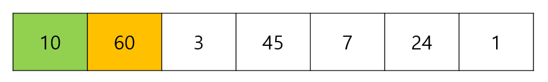

i=2, 3 < 10, 3 < 60이므로 한 칸씩 shift

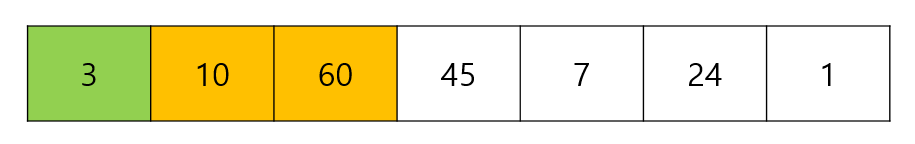

i=3, 45 < 60, 45 > 10이므로 10에서 break, 45는 10 다음에 삽입

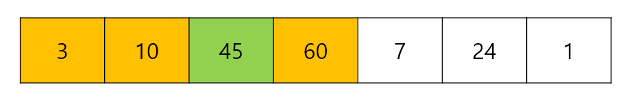

i = 마지막까지 반복

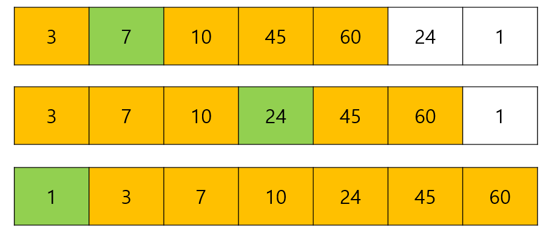

### 자바 구현

```java
package sort;

import java.util.Arrays;

public class InsertionSort {

	public static void main(String[] args) {
		int[] arr = new int[] { 60, 10, 3, 45, 7, 24, 1 };
		insertionSort(arr);
		System.out.println(Arrays.toString(arr));

	}

	static void insertionSort(int[] arr) {
		for (int i = 1; i < arr.length; i++) {
			int key = arr[i];
			int j;
			for (j = i - 1; j >= 0; j--) {
				if (arr[j] <= key)
					break;
				else
					arr[j + 1] = arr[j];
			}
			arr[j + 1] = key;

		}

	}

}
```

</div>
</details>


</div>
</details>

---


<h1> 검색 </h1>
<details>
<summary>검색</summary>
<div markdown="1">

# 검색

자료에서 원하는 항목을 찾는 작업

## 종류

순차 검색

이진 검색

인덱싱

<details>
<summary>순차 검색</summary>
<div>


## 순차 검색

일렬로 되어 있는 자료를 순서대로 검색

장점: 배열, 연결 리스트 등에서 유용

단점: 자료의 크기가 큰 경우에 비효율적

### 정렬X

첫 번째 원소부터 마지막 원소까지 키 값이 같은 원소가 있는지 검색

동일한 원소를 찾으면 검색을 중지하고 그 인덱스를 반환

마지막 원소까지 키를 찾지 못하면 실패

시간 복잡도: O(n)

### 정렬O

첫 번째 원소부터 키 값보다 큰 원소가 나올 때까지 검색

동일한 원소를 찾으면 반환, 키 값보다 큰 원소가 나왔는데 찾지 못하면 검색 실패

시간 복잡도: O(n)

그러나 정렬되지 않았을 때보다 평균 비교 횟수가 절반으로 줄어든다. 


</div>
</details>

<details>
<summary>이진 검색</summary>
<div>

## 이진 검색

자료의 가운데에 있는 항목의 키 값과 비교하여 다음 검색의 위치를 결정하고 계속해서 검색을 진행

검색을 수행할 때마다 범위가 반으로 줄어들어 효율적인 알고리즘

시간 복잡도: O(log n)

조건: 자료가 정렬되어 있어야 함

### 과정

1. 자료의 중앙에 있는 원소 선택
2. key값과 중앙 원소 비교
3. key값이 더 작으면 중앙 원소의 왼쪽에서, key 값이 더 크면 중앙 원소의 오른쪽에서 검색 수행

### 코드

```java
package search;

public class BinarySearch {
	static int[] arr = { 2, 6, 8, 13, 22, 30, 46 };

	public static void main(String[] args) {
		int successKey = 6;
		int failKey = 24;

		System.out.println(binarySearch(successKey));
		System.out.println(binarySearch(failKey));
	}

	static int binarySearch(int key) {
		// 성공하면 index를, 실패하면 -1을 반환
		int start = 0;
		int end = arr.length - 1;
		while (start <= end) { // start가 end보다 커지면 검색 종료
			int mid = (start + end) / 2;
			if (key == arr[mid])
				return mid;
			else if (key < arr[mid]) {
				end = mid - 1; // mid의 왼쪽
			} else {
				start = mid + 1; // mid의 오른쪽
			}

		}
		return -1;
	}

}
```

</div>
</details>

<details>
<summary>완전 검색</summary>
<div>

## 완전 검색

가능한 모든 경우의 수를 확인하는 기법

Brute-force, Generate-and-Test 기법

경우의 수가 작을 때 유용함

### Baby-Gin

임의의 숫자 6개를 뽑아 run과 triplet으로만 구성된 카드 = baby-gin

- run: 3장의 카드가 연속적인 번호를 갖는 경우
- triplet: 3장의 카드가 동일한 번호를 갖는 경우

**모든 경우의 수 구하기 (순열)**

6개의 숫자는 6!개의 순열이 가능

1. 먼저 6개 숫자에서 가능한 세 자리 순열(6P3)을 구하여 run 또는 triplet에 해당하는지 검사
2. true를 반환한다면, 다시 남은 3가지 수 중에서 순열을 구하여 run 또는 triplet에 해당하는지 검사

```java
for (int i = 0; i < arr.length; i++) {
			int i1 = arr[i]; // 첫 번째 자리
			for (int j = 0; j < arr.length; j++) {
				if (j != i) {
					int i2 = arr[j]; // 두 번째 자리
					for (int k = 0; k < arr.length; k++) {
						if (k != i && k != j) {
							int i3 = arr[k]; // 세 번째 자리
							int num = i1 * 100 + i2 * 10 + i3; // run과 triplet을 체크할 세 자리 수
							if (isRun(num) || isTriplet(num)) { // 이 수가 해당한다면
								for (int l = 0; l < arr.length; l++) {
									if (l != i && l != j && l != k) {
										int o1 = arr[l]; // 네 번째 자리
										for (int m = 0; m < arr.length; m++) {
											if (m != i && m != j && m != k && m != l) {
												int o2 = arr[m]; // 다섯 번째 자리
												for (int n = 0; n < arr.length; n++) {
													if (n != i && n != j && n != k && n != l && n != m) {
														int o3 = arr[n]; // 여섯 번재 자리
														int other = o1 * 100 + o2 * 10 + o3;
														if (isRun(other) || isTriplet(other)) {
															return true;
														}
													}
												}
											}
										}
									}
								}
							}
						}
					}
				}
			}
		}
```

**run 확인**

정렬 후 값들의 차이가 1이면 true

```java
static boolean isRun(int N) {

		ArrayList<Integer> run = new ArrayList<>();
		int i1 = N / 100;
		int i2 = (N / 10) % 10;
		int i3 = (N % 10) % 10;
		run.add(i1);
		run.add(i2);
		run.add(i3);
		Collections.sort(run);

		if (run.get(1) - run.get(0) == 1 && run.get(2) - run.get(1) == 1) {
			return true;
		}

		return false;

	}
```

**triplet 확인**

세 수가 같으면 true 반환

```java
static boolean isTriplet(int N) {
		int i1 = N / 100;
		int i2 = (N / 10) % 10;
		int i3 = (N % 10) % 10;
		if (i1 == i2 && i2 == i3) {

			return true;
		}
		return false;
	}
```

전체 코드

```java
package search;

import java.util.ArrayList;
import java.util.Collections;
import java.util.Scanner;

public class ExhaustiveSearch_babygin {

	public static void main(String[] args) {
		Scanner sc = new Scanner(System.in);
		int[] arr = new int[6];
		for (int i = 0; i < 6; i++) {
			arr[i] = sc.nextInt();

		}
		System.out.println(makePermut(arr));

	}

	static boolean makePermut(int[] arr) {
		for (int i = 0; i < arr.length; i++) {
			int i1 = arr[i];

			for (int j = 0; j < arr.length; j++) {
				if (j != i) {
					int i2 = arr[j];

					for (int k = 0; k < arr.length; k++) {
						if (k != i && k != j) {
							int i3 = arr[k];
							int num = i1 * 100 + i2 * 10 + i3;
							if (isRun(num) || isTriplet(num)) {
								for (int l = 0; l < arr.length; l++) {
									if (l != i && l != j && l != k) {
										int o1 = arr[l];
										for (int m = 0; m < arr.length; m++) {
											if (m != i && m != j && m != k && m != l) {
												int o2 = arr[m];
												for (int n = 0; n < arr.length; n++) {
													if (n != i && n != j && n != k && n != l && n != m) {
														int o3 = arr[n];
														int other = o1 * 100 + o2 * 10 + o3;
														if (isRun(other) || isTriplet(other)) {
															return true;
														}
													}
												}
											}
										}
									}
								}
							}
						}
					}
				}
			}
		}
		return false;
	}

	static boolean isRun(int N) {

		ArrayList<Integer> run = new ArrayList<>();
		int i1 = N / 100;
		int i2 = (N / 10) % 10;
		int i3 = (N % 10) % 10;
		run.add(i1);
		run.add(i2);
		run.add(i3);
		Collections.sort(run);

		if (run.get(1) - run.get(0) == 1 && run.get(2) - run.get(1) == 1) {
			return true;
		}

		return false;

	}

	static boolean isTriplet(int N) {
		int i1 = N / 100;
		int i2 = (N / 10) % 10;
		int i3 = (N % 10) % 10;
		if (i1 == i2 && i2 == i3) {

			return true;
		}
		return false;
	}

}
```


</div>
</details>

</div>
</details>

---

<h1> 조합론 </h1>
<details>
<summary>조합론</summary>
<div markdown="1">

<details>
<summary>이항계수</summary>
<div markdown="1">

## 이항계수

[https://shoark7.github.io/programming/algorithm/3-ways-to-get-binomial-coefficients](https://shoark7.github.io/programming/algorithm/3-ways-to-get-binomial-coefficients)

### 정의

이항 계수는 집합에서 원하는 개수만큼 순서없이 뽑는 조합의 가짓수를 의미한다. 즉 nCr을 구하는 알고리즘이다.

### 구현 1: 팩토리얼 이용

$$
nCk = \frac{n!}{{n-k}!*k!}
$$

첫 번째 정의는 팩토리얼 재귀함수를 이용하여 알고리즘으로 구현할 수 있다.

```java
public class MyBinoCo {

	public static void main(String[] args) {

		int N = 10;
		int K = 3;
		// 팩토리얼
		System.out.println(fact(N) / fact(N - K) / fact(K));
	}

	static int fact(int N) {

		if (N == 0 || N == 1)
			return 1;
		int tmp = N;
		for (int i = 2; i < N; i++)
			tmp *= i;
		return tmp;

	}
}
```

### 구현 2: DP, 재귀 함수 이용

그리고 n개에서 k개를 뽑는 가짓수는, n을 포함하지 않고 n-1개에서 k개를 뽑는 가짓수와 n을 포함하고 n-1개에서 k-1개를 뽑는 가짓수의 합과 같다.

$$
\binom{n}{k} = \binom{n-1}{k} + \binom{n-1}{k-1}
$$

두 번째는 다음 성질을 이용한다. 그런데 재귀를 활용해서 

```java
bino(N, K) = bino(N-1, K) + bino(N-1, K-1);
```

라고 구하면 가짓수가 많아져 메모리 낭비가 심하기 때문에 memoization을 이용한다.

```java
static int bino(int N, int K) {
		if (memo[N][K] > 0)
			return memo[N][K]; // memo가 되어있으면 바로 return
		if (N < K)
			return 0; // N보다 K(뽑는 수)가 더 크면 0
		if (K == 0 || N == K)
			return 1; // 정의 상 K가 0일 때 (안 뽑을 때), K가 N일 때(모든 가짓수를 다 뽑기)는 1
		memo[N][K] = bino(N - 1, K) + bino(N - 1, K - 1); // 성질 이용
		return memo[N][K];

	}
```

### 전체 코드
```java
package combinatorics;

public class MyBinoCo {

	static int[][] memo;

	public static void main(String[] args) {

		int N = 10;
		int K = 3;
		// 팩토리얼
		System.out.println(fact(N) / fact(N - K) / fact(K));

		// dp
		memo = new int[N + 1][K + 1];
		System.out.println(bino(N, K));

	}

	static int fact(int N) {

		if (N == 0 || N == 1)
			return 1;
		int tmp = N;
		for (int i = 2; i < N; i++)
			tmp *= i;
		return tmp;

	}

	static int bino(int N, int K) {
		if (memo[N][K] > 0)
			return memo[N][K]; // memo가 되어있으면 바로 return
		if (N < K)
			return 0; // N보다 K(뽑는 수)가 더 크면 0
		if (K == 0 || N == K)
			return 1; // 정의 상 K가 0일 때 (안 뽑을 때), K가 N일 때(모든 가짓수를 다 뽑기)는 1
		memo[N][K] = bino(N - 1, K) + bino(N - 1, K - 1); // 성질 이용
		return memo[N][K];

	}

}
```


</div>
</details>


</div>
</details>

---

<h1> 기본 수학 </h1>

<details>
<summary>순열/조합</summary>
<div markdown="1">


## 순열/조합

순열, 조합, 중복 순열, 중복 조합을 dfs를 이용하여 구할 수 있다.

백준의 N과 M시리즈가 순열/조합을 공부하기 좋은 문제들이다.

[https://www.acmicpc.net/workbook/view/2052](https://www.acmicpc.net/workbook/view/2052)

### 1. 순열

순열은 N개의 수에서 R개의 수를 뽑아 순서대로 나열하는 것이다.

{1, 2, 3, 4} 4개의 수에서 2개의 수를 뽑아 나열하는 경우의 수는

{1, 2} {1, 3} {1, 4} {2, 1} {2, 3} {2, 4} {3, 1} {3, 2} {3, 4} {4, 1} {4, 2} {4, 3} 의 12가지다.

$$
nPr = n*(n-1) * ... (n-r+1)
$$

순열을 구하기 위해서는 dfs를 활용한다.

```java
static void dfs(int N, int M, int cnt) {

		if (cnt == M) { // 배열의 개수가 M이 되면 출력하고 return
			for (int i = 0; i < M; i++) {
				sb.append(result[i] + " ");
			}
			sb.append("\n");
			return;
		}
		for (int i = 1; i <= N; i++) {
			if (!check[i]) { // 방문하지 않은 노드
				check[i] = true; // 방문 체크
				result[cnt] = i; // result값에 대입
				dfs(N, M, cnt + 1); // 다시 재귀적으로 dfs (cnt 1 증가)
				check[i] = false; // i를 false로
			}

		}

	}
```

- 종료 조건

cnt 즉, dfs의 깊이가 M이 되면 M개의 수를 찾은 것이다. 그때 결과 배열에 있는 값들이 순열의 한 경우의 수가 된다.

- 재귀 조건

1부터 N까지의 수 중에서 방문하지 않은 노드를 만나면, boolean 배열에 check 표시를 하고, 결과값의 cnt(깊이)에 i를 대입한다.

다시 깊이를 1 증가시켜 dfs를 진행한다.

그리고 check[i]를 false로 만들어야 한다. 해당 dfs 함수가 종료된 후에는 같은 수가 다시 순열에 추가될 수 있기 때문이다.

(1,2)와 (2,1)이 다른 경우의 수라는 것을 이해하면 쉬울 것이다.

- 전체 코드

```java
package Silver.s3;

import java.util.Scanner;

public class BOJ_15649_NandM {
	static boolean[] check;
	static int[] result;

	static StringBuilder sb = new StringBuilder();

	public static void main(String[] args) {
		Scanner sc = new Scanner(System.in);
		int N = sc.nextInt();
		int M = sc.nextInt();
		check = new boolean[N + 1];
		result = new int[M + 1];
		dfs(N, M, 0);
		System.out.print(sb);

	}

	static void dfs(int N, int M, int cnt) {

		if (cnt == M) { // 배열의 개수가 M이 되면 출력하고 return
			for (int i = 0; i < M; i++) {
				sb.append(result[i] + " ");
			}
			sb.append("\n");
			return;
		}
		for (int i = 1; i <= N; i++) {
			if (!check[i]) { // 방문하지 않은 노드
				check[i] = true; // 방문 체크
				result[cnt] = i; // result값에 대입
				dfs(N, M, cnt + 1); // 다시 재귀적으로 dfs (cnt 1 증가)
				check[i] = false; // i를 false로
			}

		}

	}

}
```

### 2. 조합

조합은 N개의 수에서 R개의 수를 뽑는 것인데, 순서를 고려하지 않는 것이다.

즉 순열과 달리 (1,2)와 (2,1)은 같은 경우의 수가 된다.

$$
nCr = \frac{n!}{n-r!*r!} 
$$

{1, 2, 3, 4}에서 2개를 뽑는 조합은

{1, 2} {1, 3} {1, 4} {2, 3} {2, 4} {3, 4} 6개가 된다.

[N과M2](https://www.acmicpc.net/problem/15650) 가 조합을 구하는 문제인데, 문제 조건에 수열을 오름차순으로 출력한다고 되어 있다.

순열에서는 1,2 와 2,1이 모두 출력 가능했지만 조합에서는 1,2만 출력 가능하다.

```java
	static void dfs(int N, int M, int cnt, int k) {

		if (cnt == M) { // 배열의 개수가 M이 되면 출력하고 return
			for (int i = 0; i < M; i++) {
				sb.append(result[i] + " ");
			}
			sb.append("\n");
			return;
		}
		for (int i = k; i <= N; i++) {
			if (!check[i]) { // 방문하지 않은 노드
				check[i] = true; // 방문 체크
				result[cnt] = i; // result값에 대입
				dfs(N, M, cnt + 1, i + 1); // 다시 재귀적으로 dfs (cnt 1 증가)
				check[i] = false;
			}

		}

```

조합의 코드에서 달라진 것은 k 매개변수가 추가되었다는 점이다.

깊이가 증가할수록 자신보다 큰 수만 수열에 담을 수 있기 때문에 k는 for문을 탐색하는 시작 값이 된다. 깊이가 1 증가하면 k는 자기 자신+1이 된다.

- 전체 코드

```java
package Silver.s2;

import java.util.Scanner;

public class BOJ_15650_NandM2 {
	static boolean[] check;
	static int[] result;

	static StringBuilder sb = new StringBuilder();

	public static void main(String[] args) {
		Scanner sc = new Scanner(System.in);
		int N = sc.nextInt();
		int M = sc.nextInt();
		check = new boolean[N + 1];
		result = new int[M + 1];

		dfs(N, M, 0, 1);

		System.out.print(sb);

	}

	static void dfs(int N, int M, int cnt, int k) {

		if (cnt == M) { // 배열의 개수가 M이 되면 출력하고 return
			for (int i = 0; i < M; i++) {
				sb.append(result[i] + " ");
			}
			sb.append("\n");
			return;
		}
		for (int i = k; i <= N; i++) {
			if (!check[i]) { // 방문하지 않은 노드
				check[i] = true; // 방문 체크
				result[cnt] = i; // result값에 대입
				dfs(N, M, cnt + 1, i + 1); // 다시 재귀적으로 dfs (cnt 1 증가)
				check[i] = false;
			}

		}

	}

}
```

### 3. 중복 순열

중복 순열은 N개의 수에서 중복을 허용하여 R개의 수를 뽑아 **순서대로** 나열하는 것이다.

$$
_n\pi _r = n^r
$$

{1, 2, 3, 4}에서 2개를 뽑는 중복 순열은

{1,1} {1, 2} {1, 3} {1, 4} {2, 1} {2, 2} {2, 3} {2, 4} {3, 1} {3, 2} {3, 3} {3, 4} {4, 1} {4, 2} {4, 3} {4, 4} 의 16가지다.

중복 순열을 코드로 구현할 때에는 방문 여부를 조사할 필요가 없다. 중복을 허용하기 때문이다.

순열을 구하는 코드에서 방문 여부를 제외하면 중복 순열을 구하는 코드와 같다.

```java
static void perm(int N, int[] out, int depth, int r) {

		if (depth == r) {

			for (int i = 0; i < out.length; i++) {
				sb.append(out[i] + " ");
			}
			sb.append("\n");
			return;
		}

		for (int i = 1; i <= N; i++) {
			out[depth] = i;
			perm(N, out, depth + 1, r);

		}
	}
```

코드의 for문 내부를 보면 방문 여부를 조사하지 않고 out 배열에 i를 그대로 담는 것을 확인할 수 있다.

### 4. 중복 조합

**중복 가능한 n개중에서 r개를 선택하는 경우의 수**를 의미한다.

조합 중에서 중복을 허용하는 경우라고 생각하면 된다.

$$
_nH_r = _{n+1-c}C_r
$$

{1, 2, 3, 4}에서 2개를 뽑는 중복 조합의 경우의 수는

{1, 1} {1, 2} {1, 3} {1, 4} {2, 2} {2, 3} {2, 4} {3, 3} {3, 4} {4, 4}

조합의 코드와 달라진 점은 조합에서는 start에 i+1을 넣었다면, 중복 조합은 i와 같은 경우도 허용하기 때문에 i+1이 아닌 i를 매개변수로 활용한다는 점이다.

```java
static void comb(int N, int[] out, int start, int depth, int M) {
		if (depth == M) {
			for (int i = 0; i < out.length; i++) {
				sb.append(out[i] + " ");
			}
			sb.append("\n");
			return;
		}

		for (int i = start; i <= N; i++) {
			out[depth] = i;
			comb(N, out, i, depth + 1, M);
		}
	}
```


</div>
</details>


<details>
<summary>다음 순열</summary>
<div markdown="1">

## 다음 순열

바로 큰 다음 순열을 구하기

1 2 3 4

1 2 4 3

1 3 2 4 

…

4 3 2 1

### 방법

1. 꼭대기(A): index = i, 오른쪽에서 출발, 가장 높은 곳
2. 낭떠러지(B): 꼭대기 왼쪽
3. 낭떠러지보다 큰 수(C): index = j,오른쪽에서 출발 → 오른쪽에서 출발, 최초로 발견된 낭떠러지보다 큰 수
4. B와 C를 교환(i-1, j)
5. 가장 오른쪽부터 꼭대기까지 순서를 뒤집음 (i부터 끝까지)

```java

	static void nextPerm(int[] arr) {
		int a = -1; // 꼭대기
		int c = 0; // a-1보다 큰 수 찾기
		for (int i = 1; i < arr.length; i++) {
			if (arr[i - 1] < arr[i])
				a = i;
		}

		if (a == -1) {
			System.out.println(-1);
			return;
		}
		for (int i = arr.length - 1; i >= 0; i--) {
			if (arr[i] > arr[a - 1]) {
				c = i;
				break;
			}
		}
		// a-1과 c를 swap
		int tmp = arr[a - 1];
		arr[a - 1] = arr[c];
		arr[c] = tmp;
		// a부터 끝까지 거꾸로
		for (int i = 0; i < a; i++)
			System.out.print(arr[i] + " ");
		for (int i = arr.length - 1; i >= a; i--) {
			System.out.print(arr[i] + " ");
		}
	}
```

</div>
</details>


<details>
<summary>비트 연산자 & 부분집합</summary>
<div markdown="1">


# 비트 연산자

`&`둘 다 1 이면 1 / 해당 비트가 있는지 검사!

```java
System.out.println(3 & 5);
// 3 = 011
// 5 = 101
// --------
//     001 -> 1
```

`|` 하나라도 1이면 1

```java
System.out.println(3 | 5);
// 3 = 011
// 5 = 101
// --------
//     111 -> 7
```

`^` XOR - 서로 다르면 1

```java
System.out.println(3 ^ 5);
// 3 = 011
// 5 = 101
// --------
//     110 -> 6
```

`A << B` A라는 비트를 B번 왼쪽 이동, A * (2^B)

```java
System.out.println(1<<3);
// 1*(2^3) = 8
```

`A >> B` A라는 비트를 B번 오른쪽 이동, A / (2^B), 기존에 있던 1은 날아감

```java
System.out.println(5>>1);
// 5 / (2^1) = 2
// 101 -> 010 = 2
```

## 부분집합

N개의 원소를 가진 집합에서 전체 부분집합의 개수 = 2^N

### 1. 재귀

부분집합은 공집합부터 원소가 1개, 2개, … N개인 원소까지의 집합을 의미함

즉, N개의 원소를 포함하거나/포함하지 않거나의 두 가지 경우가 N번 반복되는 것

이를 boolean 배열을 활용하면 재귀로 부분집합을 구할 수 있다.

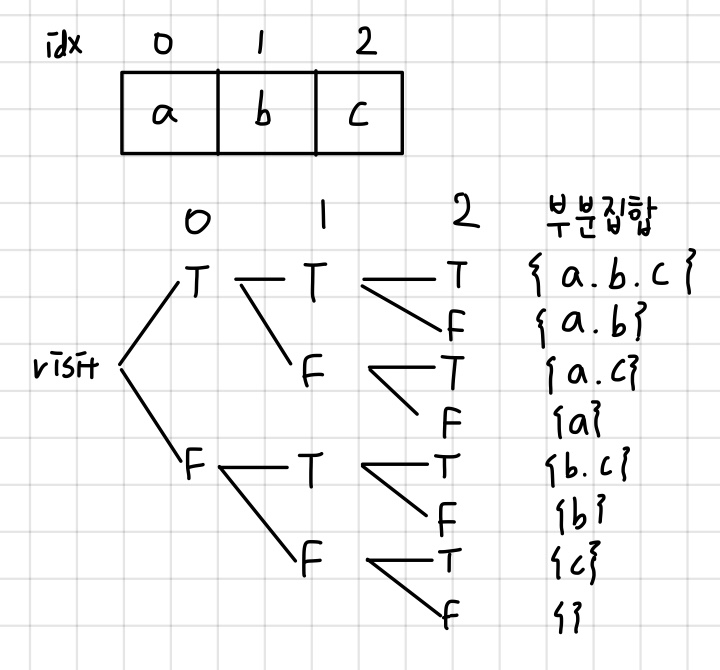

```java
public class MathPowerSet_재귀 {
	static int[] nums = { 1, 3, 4, 6 };
	static int N = 4;
	static boolean[] visited = new boolean[N];

	public static void main(String[] args) {
		powerset(0);
	}

	static void powerset(int idx) {
		if (idx == N) {
			for (int i = 0; i < N; i++)
				if (visited[i])
					System.out.print(nums[i] + " ");
			System.out.println();
			return;
		}

		visited[idx] = true; // idx번째의 원소를 포함
		powerset(idx + 1);
		visited[idx] = false; // idx번째의 원소를 포함하지 않음
		powerset(idx + 1);
	}
}
```

### 2. 비트 연산자

비트 연산자에서 `<<`를 사용하면 전체 부분집합의 개수를 구할 수 있다

원소가 N개인 집합의 전체 부분집합의 개수는 `1<<N`이다.

그리고 각 부분집합에 어떤 원소가 포함되었는지를 확인하기 위해서 `&`연산자를 활용한다.

N이 4고, 해당 부분집합의 수가 5라면 이를 이진수로 나타내면 `0101`이 된다.

`0101` 은 index가 0, 2인 원소가 포함되었다는 것이다.

이를 활용해 반복문으로 전체 부분집합의 경우의 수를 구한다.public class MathPowerSet_비트연산자 {
	static int[] nums = { 1, 3, 4, 6 };
	static int N = 4;

	public static void main(String[] args) {
		for (int i = 0; i < (1 << 4); i++) {
			for (int j = 0; j < N; j++)
				if ((i & (1 << j)) > 0)
					System.out.print(nums[j] + " ");
			System.out.println();
		}
	}
}

```java
public class MathPowerSet_비트연산자 {
	static int[] nums = { 1, 3, 4, 6 };
	static int N = 4;

	public static void main(String[] args) {
		for (int i = 0; i < (1 << 4); i++) {
			for (int j = 0; j < N; j++)
				if ((i & (1 << j)) > 0)
					System.out.print(nums[j] + " ");
			System.out.println();
		}
	}
}
```

</div>
</details>


<h1> 집합 </h1>

<details>
<summary>유니온 파인드</summary>
<div markdown="1">

# 유니온 파인드 (Union-Find)

## 서로소 집합(Disjoint-sets)

서로 중복 포함된 원소가 없는 집합들 → 교집합이 없다

집합에 속한 하나의 특정 멤버를 통해 각 집합들을 구분, 이를 대표자(representative)라고 함

## 연산

Make-Set(x): 원소 x로만 구성된 집합을 만든다

Find-Set(x): 원소 x를 가진 집합을 알아낸다

Union(x, y): 원소 x를 가진 집합과 원소 y를 가진 집합을 하나로 합친다

## 표현 방법

연결 리스트, 트리

### 1. 연결 리스트

같은 집합의 원소들은 하나의 연결리스트로 관리

연결리스트의 맨 앞의 원소를 집합의 대표원소로 삼음

각 원소는 집합의 대표원소를 가리키는 링크를 갖는다

### 2. 트리

하나의 집합을 하나의 트리로 표현

자식 노드가 부모노드를 가리키며 루트노드가 대표자가 됨

```java
Make-Set(x) {
	p[x] <- x;
}

Find-Set(x) {
	if (x==p[x]) return x;
	else
		return Find-Set(p[x])
}

Union(x, y) {
	p[Find-Set(y)] <- Find-Set(x);
}
```

## 연산의 효율을 높이기

### 1. Rank를 이용한 Union

- 각 노드는 자신을 루트로 하는 subtree의 높이를 랭크(rank)라는 이름으로 저장
- 두 집합을 합칠 때 rank가 낮은 집합을 rank가 높은 집합에 붙임

```java
Make-Set(x) {
	p[x] = x;
	rank[x] = 0;
}

Union(x,y) {
	x` = Find-Set(x);
	y` = Find-Set(y);
	if (rank[x`] > rank[y`])
		p[y`] = x`;
	else {
		p[x`] = y`;
		if (rank[x`] = rank[y`])
			rank[y`] = rank[y`]+1;

	}	
}

```

### 2. 경로 압축(Path compression)

Find-Set을 행하는 과정에서 만나는 모든 노드들이 직접 root를 가리키도록 포인터를 바꿔줌

여러 번 과정을 거칠 때 효율적

```java
Find-Set(x) {
	if (p[x]!=x)
		p[x] = Find-Set(p[x]);
	return p[x];
}
```

</div>
</details>


<h1> 그래프 </h1>
<details>
<summary>BFS & DFS</summary>
<div markdown="1">

# BFS & DFS

그래프에서 모든 정점을 방문하는 방법


### [참고] 그래프의 인접 노드 구현

<details>
<summary>그래프의 인접 노드 구현</summary>
<div markdown="1">

1. 인접 행렬
    
    n * n 행렬에 (i, j) (j, i)를 1 (또는 가중치)로 할당함
    
    - 장점
    
    이해하기 쉬움
    
    간선의 존재 여부를 빠르게 알 수 있음
    
    - 단점
    
    n^2에 해당하는 공간이 필요
    
    모든 원소를 채우는 데에도 시간이 오래 걸림
    
2. 인접 리스트
    
    보통 연결 리스트를 사용, 각 정점마다 인접한 정점들을 연결 리스트에 표현
    
    - 장점
    
    행렬에 비해 공간 낭비가 없다. (간선의 총 수에 비례하는 양만큼만 공간이 필요)
    
    - 단점
    
    만약 거의 모든 정점에 대해 간선이 존재한다면 (dense) 연결 리스트의 정보를 표현하기 위한 오버헤드가 많이 든다.
    
    간선이 존재하는지 알아볼 때 리스트에서 차례로 훑어야 하기 때문에 인접 행렬보다 시간이 오래 걸릴 수 있음
    
    → 간선의 밀도가 높으면 행렬, 간선의 밀도가 낮으면 리스트가 유리함!
    
3. 인접 배열
    
    앞 두 방식의 장점을 활용
    
    - 장점
    
    연결 리스트의 링크 정보를 위한 공간 절약
    
    index로 인접 여부를 체크하기 편하다
    
</div>
</details>


<details>
<summary>BFS </summary>
<div markdown="1">


## 너비 우선 탐색: BFS

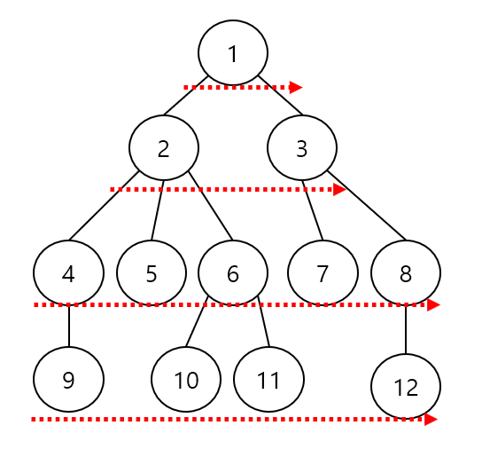

### 과정

1. 루트의 자식을 차례로 방문
2. 루트 자식의 자식을 차례로 방문
3. 리프 노드까지 반복

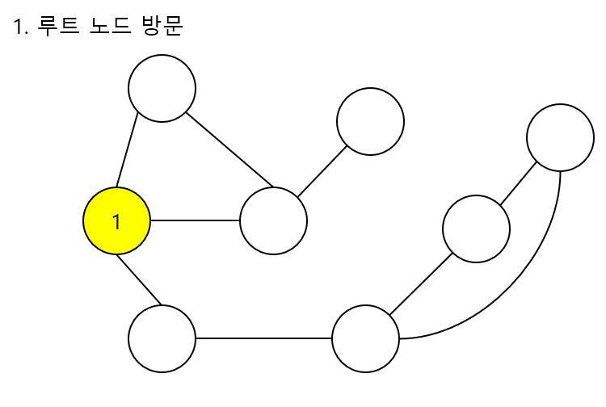

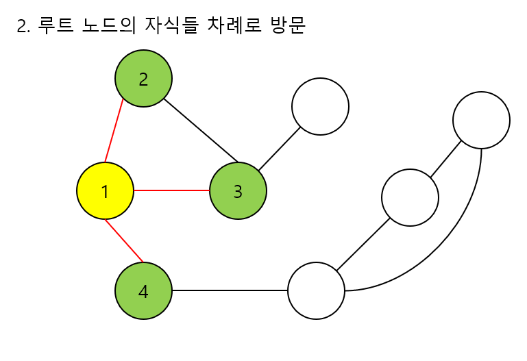

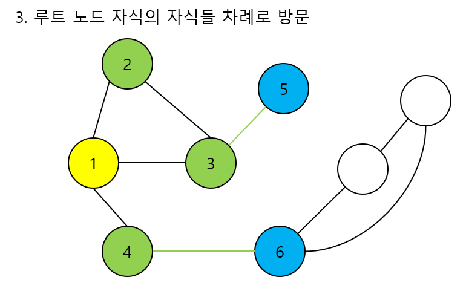

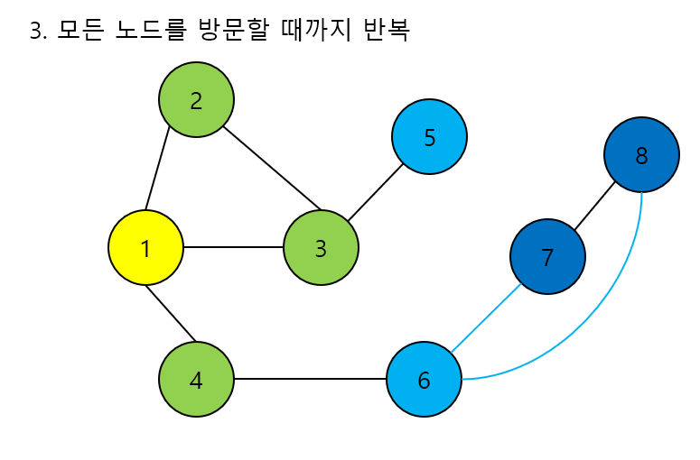


### 코드 구현

큐 활용

1. 시작 정점을 제외한 모든 정점의 visited를 false로
2. 큐의 맨 앞에 있는  정점을 빼내고, 이에 인접한 정점 중 방문하지 않은 정점을 모두 visited = true로 표시하고 큐에 넣는다.
3. 큐가 empty일 때까지 2를 반복

```java
package graph;

import java.util.LinkedList;
import java.util.Queue;

public class Bfs {

	static boolean[] visited;
	static int[][] list;

	public static void main(String[] args) {
		// 구현
	}

	static void bfs(int v) {
		Queue<Integer> q = new LinkedList<>();
		q.offer(v);
		visited[v] = true;

		while (!q.isEmpty()) {
			int temp = q.poll();
			System.out.println(temp);
			for (int i = 0; i < list[temp].length; i++) {
				int link = list[temp][i];
				if (!visited[link]) {
					visited[link] = true;
					q.offer(link);
				}
			}
		}
	}
}
```

### 수행 시간

Θ(V+E)

</div>
</details>

<details>
<summary>DFS </summary>
<div markdown="1">


## 깊이 우선 탐색: DFS

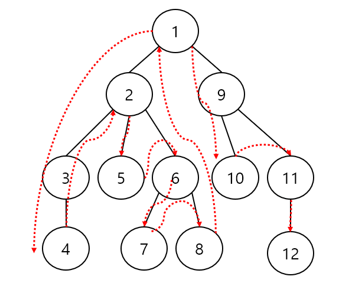

### 과정

1. 루트의 자식 정점을 하나 방문, 그 자식의 자식을 방문 … 더 이상 내려갈 수 없을 때까지 방문함
2. 위로 되돌아오다가 내려갈 곳이 있다면 (다른 자식 노드가 있으면) 다시 내려가서 반복

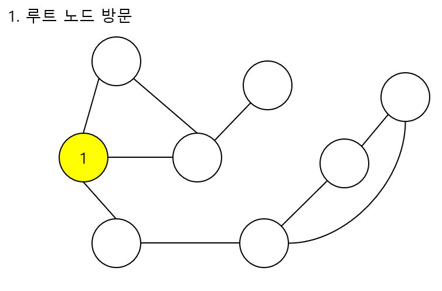

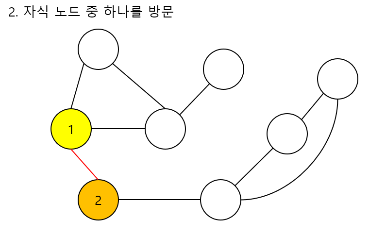

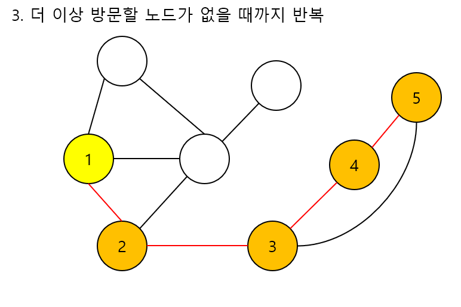

BFS와 달리 DFS는 한 노드에서 인접하고 방문하지 않은 노드가 있으면 계속해서 방문한다. 5까지 갔을 때, 5는 인접한 노드 중 방문하지 않은 노드가 없다.

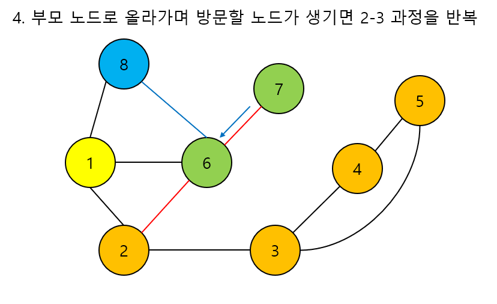

그러면 5에서 4로, 4에서 3으로 방문할 노드가 있을 때까지 백트래킹한다. 2는 방문하지 않은 인접한 노드가 있으므로 이를 6으로 칠하고 앞의 과정을 반복한다.

다시 7까지 칠하고, 6으로 돌아와 8을 방문하면 모든 노드를 방문한다.

### 코드 구현

1. 정점이 호출되면 정점 v를 방문하였다(visited=true)로 표시
2. 인접하지 않은 정점 중 방문하지 않은 정점에 대해 DFS 호출

```java
package graph;

public class DFS {
	static boolean[] visited;
	static int[][] list;

	public static void main(String[] args) {
		// 구현
	}

	static void dfs(int v) {

		visited[v] = true;
		System.out.println(v);
		for (int i = 0; i < list[v].length; i++) {
			int link = list[v][i];
			if (!visited[link]) {
				visited[link] = true;
				dfs(link);
			}
		}

	}
}
```

### 수행 시간

Θ(V+E)

</div>
</details>

</div>
</details>


<details>
<summary>최소 신장 트리</summary>
<div markdown="1">


## 최소 신장 트리 (MST)

신장트리: 그래프의 **모든 정점과 간선**의 부분 집합으로 구성되는 트리

최소신장트리: 신장 트리 중에서 사용된 가중치의 합이 최소인 트리

- 특징
    - 무방향 가중치 그래프
    - 그래프의 가중치 합이 최소여야 한다
    - N개의 정점을 가지는 그래프에 대해 반드시 N-1개의 간선을 사용
    - 사이클을 포함하면 안된다.
- 필요성
    
    도로망, 통신망, 유통망 등 여러 분야에서 비용을 최소로 해야 그만큼 이익을 본다
    

### 크루스칼 알고리즘

간선을 하나씩 선택해서 MST를 찾는 알고리즘

1. 최초, 모든 간선을 가중치에 따라 올므차순으로 정렬
2. 가중치가 가장 낮은 간선부터 선택하면서 트리를 증가
    - 사이클이 존재하면 다음으로 가중치가 낮은 간선 선택
        
        (사이클 존재: 대표가 같으면 사이클(Find-Set))
        
3. n-1개의 간선이 선택될 때까지 2)를 반복

```java
Kruskal(G) {
	A <- 0 // 0 공집합
	for vertex v in G.V // G.V 그래프의 정점 집합
		Make-Set(v) // G.E: 그래프의 간선 집합
		
	G.E 간선들을 가중치 w에 의해 정렬

	for 가중치가 가장 낮은 간선 (u,v) in G.E 선택 (n-1개)
		if (Find-Set(u) != Find-Set(v)) // 사이클 확인
			A = A U {(u,v)}
			Union(u,v);
	return A;

}
```

```java
public class Mst_Kruskal {
	static int[] p;

	public static void main(String[] args) {
		Scanner sc = new Scanner(System.in);
		int V = sc.nextInt();
		int E = sc.nextInt();

		int[][] edges = new int[E][3];
		for (int i = 0; i < E; i++) {
			edges[i][0] = sc.nextInt(); // 시작
			edges[i][1] = sc.nextInt(); // 도착
			edges[i][2] = sc.nextInt(); // 가중치
		}

		// 1. 정렬
		Arrays.sort(edges, new Comparator<int[]>() {

			@Override
			public int compare(int[] o1, int[] o2) {
				// TODO Auto-generated method stub
				return o1[2] - o2[2]; // 가중치 순서
			}

		});

		// 대표 저장
		p = new int[V];
		// make-set 1-나 자신을 대표로 초기화
		for (int i = 0; i < V; i++)
			makeSet(i);

		// 간선 선택
		int ans = 0;
		int pick = 0;
		for (int i = 0; i < E; i++) {

			if (findSet(edges[i][0]) != findSet(edges[i][1])) {
				union(findSet(edges[i][0]), findSet(edges[i][1]));
				ans += edges[i][2];
				pick++;
			}

			if (pick == V - 1)
				break;
		}
	}

	static void makeSet(int x) {
		p[x] = x;
	}

	static int findSet(int x) {
		// path compression
		if (x != p[x])
			p[x] = findSet(p[x]);
		return p[x];

	}

	static void union(int x, int y) {
		p[findSet(y)] = findSet(x);

	}
}
```

### 프림 알고리즘

하나의 정점에서 연결된 간선들 중 하나씩 선택하면서 MST를 만들어가는 방식

cf. 크루스칼: 간선을 하나씩 선택함, 프림: 정점을 선택

1. 임의 정점을 하나 선택해서 시작
2. 선택한 정점과 인접하는 정점들 중 최소 비용의 간선이 존재하는 정점을 선택
3. 모든 정점이 선택될 때까지 1, 2를 반복

```java
MST_Prim(G, r)
	for u in G.V
		u.key = ∞
		u.π = null
	r.key = 0
	Q = G.V // 우선순위 큐
	while (Q != 0) // 빈 q가 아닐 동안
		u = extract_min(Q) // key 값이 가장 작은 정점
		visited[u]=true
		for (v in G.Adj[u]) // u의 인접 정점 v
			if (!visited[v] and w(u, v) < v.key) // v의 key 값 갱신
				v.π = u
				v.key = w(u,v)
	
```

```java
import java.util.ArrayList;
import java.util.List;
import java.util.PriorityQueue;
import java.util.Scanner;

public class Mst_Prim_pq {

	static class Edge implements Comparable<Edge> {
		int st, ed, cost;

		public Edge(int st, int ed, int cost) {
			this.st = st;
			this.ed = ed;
			this.cost = cost;
		}

		@Override
		public int compareTo(Edge o) {
			return this.cost - o.cost; // 최소 힙
		}

	}

	static String input = "7 11\r\n" + "0 1 32\r\n" + "0 2 31\r\n" + "0 5 60\r\n" + "0 6 51\r\n" + "1 2 21\r\n"
			+ "2 4 46\r\n" + "2 6 25\r\n" + "3 4 34\r\n" + "3 5 18\r\n" + "4 5 40\r\n" + "4 6 51\r\n" + "";

	public static void main(String[] args) {
		Scanner sc = new Scanner(input);
		int V = sc.nextInt();
		int E = sc.nextInt();

		// 인접 리스트
		List<Edge>[] adjList = new ArrayList[V];
		for (int i = 0; i < V; i++)
			adjList[i] = new ArrayList<>();

		for (int i = 0; i < E; i++) {
			int st = sc.nextInt();
			int ed = sc.nextInt();
			int cost = sc.nextInt();

			adjList[st].add(new Edge(st, ed, cost));
			adjList[ed].add(new Edge(ed, st, cost));
		} // 입력

		boolean[] visited = new boolean[V];

		PriorityQueue<Edge> pq = new PriorityQueue<>();

		visited[0] = true;
		// 인접한 v들을 pq에 넣어줌
		pq.addAll(adjList[0]);
		int pick = 1;
		int ans = 0;
		while (pick < V) {
			Edge edge = pq.poll();
			if (visited[edge.ed]) // 이미 뽑은 정점
				continue;

			ans += edge.cost;

			pq.addAll(adjList[edge.ed]);
			visited[edge.ed] = true;
			pick++;
		}
		System.out.println(ans);

	}

}
```

</div>
</details>


<details>
<summary>최단 경로</summary>
<div markdown="1">


## 최단 경로

간선의 가중치가 있는 그래프에서 두 정점 사이의 경로들 중 간선의 가중치의 합이 최소인 경로

- 하나의 시작 정점에서 끝 정점까지의 최단 경로

다익스트라 (dijkstra): 음의 가중치 허용x

벨만-포드(Bellman-Ford) : 음의 가중치 허용o

- 모든 정점들에 대한 최단 경로

플로이드-워샬(Floyd-Warshall) 알고리즘

### 1. Dijkstra 알고리즘

시작 정점에서 거리가 최소인 정점을 선택해 나가면서 최단 경로를 구하는 방식

탐욕 기법을 사용 - 프림 알고리즘과 유사

시작 정점(s)에서 끝 정점(t)까지의 최단 경로에 정점 x가 존재

이때 최단 경로는 s에서 x까지의 최단 경로와 x에서 t까지으 ㅣ최단 경로로 구성됨

s→t = s→x + x→t 

시간복잡도 : `O(ElogV)`

**과정** 

1. 시작 정점을 입력 받음
2. 거리를 저장할 배열을 ∞로 초기화, 시작점에서 연결된 정점들의 비용을 기록해둠
3. 최단 거리가 가장 짧은 정점을 집합에 포함
4. 아직 방문하지 않은 점들이 가지고 있는 거리 값과 현재 정점에서 방문하지 않은 정점까지의 가중치의 합이 작다면 update
5. 모든 정점을 방문할 때까지 3,4를 반복

```java
MST_Dijkstra(G, r)
	for u in G.V
		d[u] = ∞
	d[r]=0
	
	Q = G.V // 우선순위 큐
	while (Q != 0) // 빈 q가 아닐 동안
		u = extract_min(Q) // key 값이 가장 작은 정점
		visited[u]=true
		for (v in G.Adj[u]) // u의 인접 정점 v
			if (!visited[v] and  d[v] > d[u] + weight(u, v))  // 거리 갱신
					d[v] = d[u]+weight(u,v)
					prev[v]=u;
			
```

```java
private static void dijkstra(int st) {

		PriorityQueue<Node> pq = new PriorityQueue<>();
		boolean[] visited = new boolean[V];

		pq.add(new Node(st, 0));
		dist[st] = 0;

		while (!pq.isEmpty()) {
			Node curr = pq.poll();

			visited[curr.v] = true;
			// 연결된 노드
			for (Node node : adjList[curr.v])
				if (!visited[node.v] && dist[node.v] > dist[curr.v] + node.weight) {
					dist[node.v] = dist[curr.v] + node.weight;
					pq.add(new Node(node.v, dist[node.v]));
				}

		}

	}
```

### 2. 벨만-포드 알고리즘

간선의 가중치가 음의 값을 허용하는 실수인 경우의 최단 경로 알고리즘

(정점 - 1)번 반복하며 모든 간선을 전부 확인하면서 모든 노드간의 최단 거리를 구해나간다. (다익스트라와 차이)

시간 복잡도: `O(VE)`

```java
BellmanFord(G, r)
	for u in V
		d[u] = ∞
	d[r] = 0;
	for (i=1 to V-1)
		for each (u, v) in E // (변동이 생긴 점에 대해서 확인하면 좀 더 효율적)
			if (d[u] + weight(u, v) < d[v])
				d[v] = d[u]+weight(u, v)
				prev[v] = u;
	
	// 음의 사이클 존재 확인
	for each (u, v) in E
			if (d[u]+ w(u, v) < d[v]) print("음의 사이클 존재")
```

i번째 루프가 끝나면 최대 i개의 간선을 사용해서 이를 수 있는 최단 경로가 계산됨

가능한 간선의 개수가 V-1이기 때문에 V-1까지 탐색한다

벨만-포드 알고리즘은 음의 가중치를 허용하지만, 음의 사이클이 존재하는 경우는 최단 경로를 구할 수 없다.

V-1번 탐색을 통해 모든 간선을 확인한 후에도 `d[u]+ w(u, v) < d[v]`라면 음의 사이클이 존재하는 것을 확인할 수 있다.

```java
static boolean bellmanFord(int r) {
		dis[r] = 0;

		for (int i = 0; i < N; i++) {
			for (int j = 0; j < adjList.size(); j++) {
				int st = adjList.get(j).start;
				int ed = adjList.get(j).end;
				long weight = adjList.get(j).weight;
				if (dis[st] == INF)
					continue;

				if (dis[ed] > dis[st] + weight) {
					dis[ed] = dis[st] + weight;
					if (i == N - 1)
						return false; // cycle
				}
			}
		}

		return true;

	}
```


</div>
</details>


# Dynamic Programming
<details>
<summary> DP </summary>
<div markdown="1">


# Dynamic Programming

## 동적 프로그래밍으로 문제를 풀기 위한 조건

1. 최적부분 구조를 이룬다.
    
    최적 부분 구조: 큰 문제의 해답에 그보다 작은 문제의 해답이 포함되어 있는 경우
    
2. 재귀적으로 구현했을 때 중복 호출로 심각한 비효율이 발생한다.
    
    재귀적 구현에서 중복이 발생하지 않는 경우는 DP xx
    

## 방식

1. Top-down
    
    Memoization, 주로 재귀
    
2. Bottom-up
    
    아래에서 위로 저장해가면서 해를 구함, for문
    

최적 부분 구조를 찾아 점화식을 찾는 게 중요함!


</div>
</details>

<details>
<summary> LCS 최장 공통 부분 순서 </summary>
<div markdown="1">


## LCS (Longest Common Subsequence) 최장 공통 부분 순서

### LCS의 길이 찾기

$$
x_m = y_n 이면 LCS(X_m, Y_n) = LCS(X_{m-1}, Y_{n-1})+1
$$

$$
x_m \neq y_n 이면 LCS(X_m, Y_n) = max(LCS(X_{m-1}, Y_{n}), LCS(X_{m}, Y_{n-1}))
$$

$$
C_{ij}= \begin{cases} 0 & \text{if i=0 or j=0}  \\ C_{i-1, j-1} + 1& \text{if } i, j>0 \text{ and } x_i=y_j   \\ max\{C_{i-1,j}, C_{i,j-1}\} &\text{if } i, j>0 \text{ and } x_i \neq y_i
\end{cases}
$$

[https://velog.io/@emplam27/알고리즘-그림으로-알아보는-LCS-알고리즘-Longest-Common-Substring와-Longest-Common-Subsequence](https://velog.io/@emplam27/%EC%95%8C%EA%B3%A0%EB%A6%AC%EC%A6%98-%EA%B7%B8%EB%A6%BC%EC%9C%BC%EB%A1%9C-%EC%95%8C%EC%95%84%EB%B3%B4%EB%8A%94-LCS-%EC%95%8C%EA%B3%A0%EB%A6%AC%EC%A6%98-Longest-Common-Substring%EC%99%80-Longest-Common-Subsequence)

문제 예시

[9251번: LCS](https://www.acmicpc.net/problem/9251)

C[i-1][j] = A의 i-1번째, B의 j번째까지의 LCS

Xi와 Yj가 같지 않다면 새로운 값을 추가할 수 없으니, 이전의 LCS값인 C[i-1][j]와 C[i][j-1] 중 큰 값을 LCS로 update한다.

모든 배열을 채우고 최대값이 LCS의 길이가 됨

```java
String str1 = sc.next();
String str2 = sc.next();
int[][] dp = new int[str1.length() + 1][str2.length() + 1];

int ans = 0;
for (int i = 1; i <= str1.length(); i++)
	for (int j = 1; j <= str2.length(); j++) {
		if (str1.charAt(i - 1) == str2.charAt(j - 1)) {
			dp[i][j] = dp[i - 1][j - 1] + 1;
			ans = Math.max(dp[i][j], ans);
			} else {
			dp[i][j] = Math.max(dp[i - 1][j], dp[i][j - 1]);
		}
	}
```

###  LCS 찾기
1. LCS배열의 마지막 값에서 시작 → C[i][j]를 C[i-1][j]와 C[i][j-1] 비교
2. 둘 중 하나(또는 둘 다)와 같다면 X_i와 Y_j는 같지 않다는 의미이므로 LCS에 추가x, 해당 index로 이동
    
    둘 다 같지 않다면 X_i와 Y_j는 같다는 의미 → result에 해당하는 문자를 추가,  C[i-1][j-1]로 이동
    
3. i와 j 둘 중 하나가 0이 될 때까지 1,2를 반복
4. result 배열을 역순으로 출력

```java
char[] result = new char[ans];
int r = str1.length();
int c = str2.length();
int idx = 0;
while (r >= 1 && c >= 1) {
	if (dp[r][c] == dp[r - 1][c])
		r -= 1;
	else if (dp[r][c] == dp[r][c - 1])
		c -= 1;
	else {
		result[idx] = str1.charAt(r - 1);
		r -= 1;
		c -= 1;
		idx++;
	}
}
```

</div>
</details>


</div>
</details>
