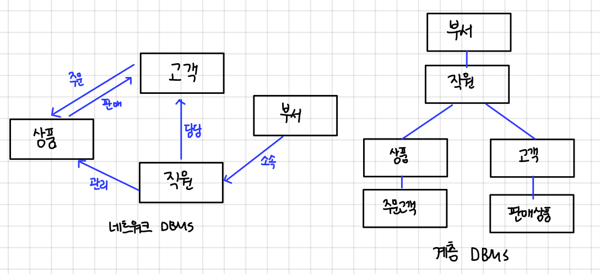
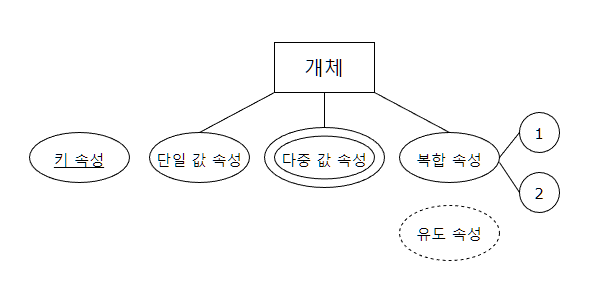

# DB

# 데이터베이스

여러 사람이 공유하고 사용할 목적으로 통합 관리되는 정보의 집합

논리적으로 연관된 하나 이상의 자료의 모음으로 그 내용을 고도로 구조화함으로써 검색과 갱신의 효율화를 꾀한 것

몇 개의 자료 파일을 조직적으로 통합하여 자료 항목의 중복을 없애고 자료를 구조화하여 기억시켜 놓은 자료의 집합체

<h1> DBMS </h1>

<details>
<summary>DBMS</summary> 
<div markdown="1">


## DBMS(Database Management System)

데이터베이스 관리 프로그램

데이터베이스 조작 인터페이스 제공 (데이터의 무결성 보장)

효율적인 데이터 관리 기능 제공

데이터베이스 구축 기능 제공

데이터 복구, 사용자 권한 부여, 유지보수 기능 제공

</div>
</details>

<h1> SQL</h1>

<details>
<summary>SQL</summary> 
<div markdown="1">

# 관계형 데이터 베이스

테이블 기반의 데이터베이스

데이터를 테이블 단위로 관리

- 하나의 데이터(record)는 여러 속성(Attribute)을 가진다
- 데이터 중복을 최소화
- 테이블 간의 관계를 이용하여 필요한 데이터 검색 가능

테이블(Table)

- 실제 데이터가 저장되는 곳
- 행과 열의 2차원 구조를 가진 데이터 저장 장소

**관계형 데이터 베이스 관리 시스템 (Relational Database Management System)**

# SQL

Structured Query Language

관계형 데이터 베이스에서 데이터 조작과 데이터 정의를 위해 사용하는 언어

- 데이터 조회
- 데이터 삽입 삭제 수정
- DB Object 생성 및 변경 삭제
- DB 사용자 생성 및 삭제, 권한 제어

## 특징

배우고 사용하기 쉽다

대소문자를 구별하지 않는다 (데이터의 대소문자는 구분)

절차적인 언어가 아니라 선언적 언어

DBMS에 종속적이지 않다

- DML(Data Manipulation Language): 데이터 조작 언어
    - 데이터베이스에서 데이터를 조작하거나 조회할 때 사용
    - 테이블의 레코드를 CRUD (Create, Read, Update, Delete)
- DDL(Data Definition Language): 데이터 정의 언어
    - 데이터 베이스 객체(table, view, user, index)의 구조를 정의
- TCL(Transaction Control Language): 트랜잭션 제어 언어
    - 트랜잭션 단위로 실행한 명령문을 적용하거나 취소
- DCL(Data Control Language): 데이터 제어 언어
    - Database, Table 접근 권한이나 CRUD 권한 정의
    - 특정 사용자에게 테이블의 검색권한 부여/금지

## 종류

| 분류 | 문장(키워드) | 설명 |
| --- | --- | --- |
| DML | SELECT | 데이터 조회 |
|  | INSERT | 테이블에 새 행을 입력 |
|  | UPDATE |  기존 행을 변경 |
|  | DELETE | 테이블에서 행을 삭제 |
| DDL |  CREATE | 테이블 등 데이터 객체 생성 |
|  | ALTER | 테이블 등 데이터 객체 변경 |
|  | DROP | 테이블 등 데이터 객체 삭제 |
|  | RENAME | 테이블 등 데이터 객체의 이름을 변경 |
| TCL | COMMIT ROLLBACK | DML문이 변경한 내용을 관리 변경사항을 저장(COMMIT)하거나 취소(ROLLBACK)할 때 사용  DML변경 내용은 트랜잭션 단위로 그룹화 가능 |
| DCL | GRANT | 데이터베이스 접근권한 부여 |
|  | REVOKE | 데이터베이스 접근권한 삭제 |


</div>
</details>

<h1> JDBC</h1>

<details>
<summary>JDBC</summary> 
<div markdown="1">


# JDBC

[https://shs2810.tistory.com/18](https://shs2810.tistory.com/18)

[https://devlog-wjdrbs96.tistory.com/139](https://devlog-wjdrbs96.tistory.com/139)

JDBC = Java Database Connectivity

자바와 데이터베이스를 연결해서 데이터를 주고 받게 해주는 프로그래밍 인터페이스

각 DBMS에 맞는 드라이버가 필요함!

## 작업 순서

1. JDBC 사용 (Driver Loading)
2. DB 연결 (Connection 생성)
3. SQL 준비 및 실행
4. DB 연결 해제 (종료)

### 1. JDBC 사용 (Driver Loading)

```java
Class.forName("com.mysql.Jdbc.Driver");
```

### 2. DB 연결 (connection)

```java
String url = "jdbc:mysql://localhost:3306/board?serverTimezone=UTC";

public Connection getConnection() throws SQLException {
		return DriverManager.getConnection(url, username, password);
	}
```

[localhost:3306](http://localhost:3306) = 로컬 환경에서 MySQL의 포트 번호

board : 가져오려는 schema 이름

username과 password는 MySQL에서의 username과 password

이 과정을 통해 연결 가능

### 3. SQL 준비 및 실행

1. Statement + SELECT

```java
Statement stmt = con.createStatement();

String sql = "SELECT * from board";
ResultSet result = stmt.executeQuery(sql);
```

```java
conn = util.getConnection();
stmt = conn.createStatement();
rs = stmt.executeQuery(sql);

while (rs.next()) {
		Board board = new Board();
		board.setId(rs.getInt("id"));
		board.setTitle(rs.getString("title"));
}		
```

`rs.getString`, `rs.getInt` = column의 index 또는 column의 label 이름으로 데이터를 가져올 수 있음

`rs.next()` : DB의 row 한 줄을 불러옴, false일 경우 더 이상 불러올 row가 없다는 뜻

1. PreparedStatement + UPDATE / DELETE / INSERT

예시는 insert

```java
String sql = "INSERT INTO board (id, title, content) VALUES (?,?,?)";
Connection conn = util.getConnection();

PreparedStatement pstmt = conn.prepareStatement(sql);

pstmt.setString(1, board.getId());
pstmt.setString(2, board.title());
pstmt.setString(3, board.getContent());

int result = pstmt.executeUpdate(); // 영향 받은 row의 개수
System.out.println(result);
```

- `pstmt.setString(parameterIndex, x)` = ‘?’의 순서에 따라 x값을 할당해줌
- `executeUpdate()` : 테이블의 내용을 변경하는 문장에 사용(create, drop, insert, delete, update)
    - 영향받은 row의 개수를 반환, 아무 것도 반환하지 않으면 0
        
        ```java
        either (1) the row count for SQL Data Manipulation Language (DML) statements
        		or (2) 0 for SQL statements that return nothing
        ```
        

### [참고] Statement와 PreparedStatement의 차이?

[https://flatsun.tistory.com/386](https://flatsun.tistory.com/386)

[https://devbox.tistory.com/entry/Comporison](https://devbox.tistory.com/entry/Comporison)

- Statement

```java
Statement stmt = con.createStatement();
ResultSet result = stmt.executeQuery(sql);
```

- createStatement 메소드에 파라미터가 없다.
- 실행 전까지는 무슨 쿼리를 실행하는지 알 수 없음 (executeQuery의 매개변수로 sql을 넣음)
- 쿼리문을 실행할 때마다 생성하며 반복 실행되는 경우에 효율이 떨어짐 (수행하는 과정에서 매번 컴파일)
- 쿼리문을 프로그램 외부에서 작성한 뒤 내부에서 실행하는 SQL Injection 공격에 취약
- 전달되는 SQL문은 완성된 형태 → 한눈에 파악하기 쉬움

- PreparedStatement

```java
String sql = "SELECT * FROM board WHERE id =?"; // ? -> 미완성
pstmt = conn.prepareStatement(sql);
pstmt.setInt(1, id);
rs = pstmt.executeQuery(); // 실행 시 매개변수 x
```

- ‘?’ = Bind 변수, 값을 가변적으로 바꿀 때 사용
- 쿼리문을 미리 생성함 (`prepareStatement()` 메소드를 통해)
- 쿼리를 파라미터에 넣지 않고 수행 → 실행시마다 쿼리를 생성하지 않아서 속도가 빠름
- Bind 변수로 인해 SQL문이 완성된 형태가 아님 → 한눈에 파악하기 어려움


### 4. DB 연결 해제

Connection, Statement, ResultSet에 대해 close

```java
public static void close(Connection conn, PreparedStatement pstmt) {
		try {
			if(pstmt != null) {
				pstmt.close();
			}
		}catch (Exception e) {
			e.getStackTrace();
		}
		try {
			if(conn != null) {
				conn.close();
			}
		}catch (Exception e) {
			e.getStackTrace();
		}
	}

```

```java
/**
	 * 사용한 리소스들을 정리한다. Connection, Statement, PreparedStatement, ResultSet 모두
	 * AutoCloseable 타입 ... 을 이용하므로 필요에 한번에 정리가능
	 *
	 * @param autoCloseables
	 */
	public void close(AutoCloseable... autoCloseables) {
		for (AutoCloseable ac : autoCloseables) {
			if (ac != null) {
				try {
					ac.close();
				} catch (Exception e) {
					// TODO Auto-generated catch block
					e.printStackTrace();
				}
			}
		}
	}
```

</div>
</details>


---

<h1> 데이터베이스 개론</h1>

<details>
<summary>01 데이터베이스 기본 개념</summary> 
<div markdown="1">

# 데이터베이스 기본 개념

## 01 데이터베이스의 필요성

데이터: 현실 세계에서 단순히 관찰하거나 측정하여 수집한 사실이나 값, 자료

정보: 데이터를 의사 결정에 유용하게 활용할 수 있도록 처리하여 체계적으로 조직한 결과물

정보 처리: 데이터에서 정보를 추출하는 과정 또는 방법

정보 시스템: 조직 운영에 필요한 데이터를 수집하여 저장해두었다가 의사 결정이 필요할 때 처리하여 유용한 정보를 만들어주는 수단

## 02 데이터베이스의 정의와 특징

### 데이터베이스의 정의

데이터베이스 = 특정 조직의 여러 사용자가 ‘공유’하여 사용할 수 있도록 ‘통합’해서 ‘저장’한 운영 데이터의 집합

- 공유 데이터(shared data)
    - 특정 조직의 여러 사용자가 함께 소유, 이용
    - → 사용 목적이 다른 사용자들을 두루 고려하여 구성해야 한다
- 통합 데이터(integrated data)
    - 데이터 중복성 허용x (의도적으로 허용하는 경우도 있음)
    - 데이터의 중복을 최소화, 통제가 가능한 중복만 허용
- 저장 데이터(stored data)
    - 컴퓨터가 접근할 수 있는 매체에 저장
- 운영 데이터(operational data)
    - 조직을 운영, 조직의 주요 기능을 수행하기 위해 꼭 필요
    - 지속적으로 유지

### 데이터베이스의 특징

- 실시간 접근 가능
    - 사용자의 데이터 요구에 실시간으로 응답
- 계속 변화
    - 현실 세계의 상태를 정확히 반영
    - 삽입, 삭제, 수정 → 동적인 특징
- 동시 공유 가능
    - 여러 사용자가 동시에 이용
    - 여러 사용자가 서로 다른 데이터를 동시에 사용 + 같은 데이터를 동시에 사용
- 내용으로 참조 가능(content reference)
    - 저장된 주소나 위치가 아닌 값, 내용으로 참조할 수 있음

## 03 데이터 과학 시대의 데이터

### 형태에 따른 데이터 분류

- 정형 데이터
    - 구조화된 데이터
    - 엑셀의 스프레드 시트, 관계 데이터베이스의 테이블
- 반정형 데이터
    - 데이터 내용 안에 구조에 대한 설명이 함께 존재
    - → 구조를 파악하는 ‘파싱’과정이 필요
    - 주로 파일 형태로 저장
    - HTML, XML, JSON 문서나 웹 로그, 센서 데이터 등
- 비정형 데이터
    - 정해진 구조가 없이 저장된 데이터
    - 소셜 데이터의 텍스트, 영상, 이미지, 음성, 워드나 pdf 문서 - 멀티미디어 데이터

### 특성에 따른 데이터 분류

- 범주형 데이터
    - 종류를 나타내는 값을 가진 데이터
    - 예: 성별, 학년 등
    - 명목형 데이터
        - 서열이 없는 값을 가지는 데이터(성별, 성격 유형)
    - 순서형 데이터
        - 서열이 있는 값을 가지는 데이터(학년, 회원 등급)
    - 대부분 문자 타입, 질적 데이터(크기 비교나 산술적인 연산x)
- 수치형 데이터
    - 양적 측면에서 크기 비교와 산술적인 연산이 가능한 숫자 값을 가진 데이터
    - 양적 데이터
    - 이산형 데이터
        - 단절된 숫자 값을 가지는 데이터
        - 주로 정수
    - 연속형 데이터
        - 연속적으로 이어진 숫자 값을 가지는 데이터
        - 주로 실수
    

</div>
</details>

<details>
<summary>02 데이터베이스 관리 시스템</summary> 
<div markdown="1">

# 데이터베이스 관리 시스템

## 01 데이터베이스 관리 시스템의 등장 배경

과거-파일 시스템을 이용

- 파일 시스템
    - 장점: 별도의 구매비용x
    - 응용 프로그램마다 파일을 따로 유지
    
    문제점
    
    - 같은 내용의 데이터가 여러 파일에 중복 저장
    - 응용 프로그램이 데이터 파일에 종속적
        - 데이터 종속성: 사용하는 파일의 구조를 변경하면 응용 프로그램도 함께 변경해야 한다
    - 데이터 파일에 대한 동시 공유, 보안, 회복 기능이 부족하다
    - 응용 프로그램을 개발하기 쉽지 않다

## 02 데이터베이스 관리 시스템의 정의

### 데이터베이스 관리 시스템(DBMS: DataBase Management System)

정의: 파일 시스템의 데이터 중복과 데이터 종속 문제를 해결하기 위해 제시된 소프트웨어

조직에 필요한 데이터를 데이터베이스에 통합하여 저장하고 이에 대한 관리를 집중적으로 담당함

데이터베이스에 들어 있는 데이터를 삽입 삭제 수정 검색하고, 모든 응용 프로그램이 데이터베이스를 공유할 수 있게 한다.

**데이터 독립성 확보**: 데이터베이스 구조나 접근 방법이 변경되어도 사용자가 미리 알거나 응용 프로그램을 변경할 필요가 없다

### 기능

정의 기능: 데이터베이스 구조를 정의하거나 수정할 수 있다

조작 기능: 데이터를 삽입 삭제 수정 검색하는 연산을 할 수 있다

제어 기능: 데이터를 항상 정확하고 안전하게 유지할 수 있다(무결성 유지, 장애 회복, 보안)

## 03 데이터베이스 관리 시스템의 장단점

### 1. 장점

- 데이터 중복을 통제할 수 있다
    - 데이터베이스에 데이터를 통합하여 관리
    - 데이터 일관성 유지
- 데이터 독립성 확보
    - 파일 시스템의 데이터 종속 문제(파일 구조가 바뀌면 응용 프로그램도 함께 수정)
    - DBMS가 데이터베이스에 접근, 관리 → 응용 프로그램이 영향 받지 않음
    - 독립성: 응용 프로그램과 데이터베이스 사이에 독립성
- 데이터 동시 공유 가능
    - 데이터베이스에 통합된 데이터를 여러 응용 프로그램이 공유하여 같은 데이터에 동시 접근
    - DBMS가 동일한 데이터를 다양한 구조로 제공해줄 수 있고, 동시 접근을 제어하는 기술을 보유하고 있음
    - 불필요한 데이터 중복 젷나
- 데이터 보안 향상
    - 데이터를 중앙 집중식으로 관리 - 데이터에 대한 효율적인 접근 제어 가능
    - 권한이 없는 사용자의 접근, 허용되지 않은 데이터와 연산에 대한 요청 차단
- 데이터 무결성 유지
    - 데이터 무결성: 저장된 데이터 값의 정확성
- 표준화
- 장애 발생 시 회복 가능
- 응용 프로그램 개발 비용 절감

### 2. 단점

- 비용이 많이 든다
    - 파일 시스템에 더하여 따로 설치
- 백업과 회복 방법이 복잡
- 중앙 집중 관리로 인한 취약점 존재
    - 데터베이스나 관리 시스템에 장애가발생하면 전체 시스템의 업무 처리가 중단
    - 가용성, 신뢰성에 치명적인 영향

## 04 데이터 베이스 관리 시스템의 발전 과정

### 1. 1세대 데이터베이스 관리 시스템: 네트워크·계층 DBMS



네트워크 DBMS

- 간선을 이용해 데이터 간 관계를 표현 - 구조가 복잡하고 변경하기 어려움
- IDS(Integrated Data Store)(1960)

계층 DBM

- 트리 형태
- 네트워크 DBMS보다 구조가 단순
- 현실 세계의 모습을 트리 형태만으로 표현하기 어려움
- 여전히 구조 변경이 어렵다
- IMS(Information Management System)

### 2. 2세대 데이터베이스 관리 시스템: 관계 DBMS

데이터베이스를 테이블 형태로 구성하는 관계 데이터 모델 사용

- 데이터베이스를 단순하고 이해하기 쉬운 구조로 구성
- 지금도 널리 사용, 오라클 MS SQL 서버, MySQL, MariaDB, Access

### 3. 3세대 데이터베이스 관리 시스템: 객체지향·객체관계 DBMS

더 다양하고 복잡한 응용 분야의 데이터를 관리하려는 사용자 요구를 충족시키기 위해 제안

- 새로운 유형의 데이터 저장
- 데이터에 대한 복잡한 분석 및 처리 지원
- 오투, 온투스, 젬스톤
- 객체관계 DBMS: 오라클

### 4. 4세대 이후 데이터베이스 관리 시스템: NoSQL·NewSQL DBMS

NoSQL - Not Only SQL

배경

- 소셜 네트워크 서비스 - 비정형 데이터 대량 생산
- 클라우드 컴퓨팅, 빅데이터 개념 - 관계 DBMS의 비효율성

특징

- 비정형 데이터를 저장하고 처리하는 데 적합
- 확장성이 뛰어남 - 여러 대의 서버 컴퓨터에 데이터를 분산하여 저장, 처리하는 환경에 적합
- 몽고디비, H베이스, 카산드라, 레디스, 네오포제이, 오리엔트DB

한계

- 기업에서 처리하는 데이터 중 정형 데이터가 차지하는 비중이 높음
- NoSQL을 추가로 도입해야 하는 부담

NewSQL DBMS

- 안정성과 일관성을 유지 + SQL을 이용해 다양하고 복잡한 데이터 처리
- 관계 DBMS의 장점 + NoSQL의 확장성 및 유연성 모두 지원
- 구글스패너, 볼트DB, 누오DB

</div>
</details>


<details>
<summary>03 DBMS</summary> 
<div markdown="1">


# 03 데이터베이스 시스템

## 01 데이터베이스 시스템의 정의

데이터베이스에 데이터를 저장하고, 저장된 데이터를 관리하여 조직에 필요한 정보를 생성해주는 시스템

- 데이터베이스: 데이터를 저장해두는 곳, 저장된 데이터의 집합
- 데이터베이스 관리 시스템: 데이터베이스에 저장된 데이터를 관리
- 데이터베이스 시스템: 데이터베이스와 데이터베이스 관리 시스템을 이용해 조직에 필요한 정보를 제공하는 ‘전체 시스템’

→ 데이터베이스 시스템의 핵심 구성 요소 = 데이터베이스, 데이터베이스 관리 시스템

+사용자, 데이터 언어, 컴퓨터 등

## 02 데이터베이스의 구조

### 1. 스키마

schema

데이터베이스에 저장되는 데이터 구조와 제약조건을 정의

ex. 고객- 고객번호(INT), 이름(CHAR(10)), 나이(INT), 주소 (CHAR(20))

인스턴스: 정의된 스키마에 따라 데이터베이스에 실제로 저장된 값

### 2. 3단계 데이터베이스 구조

3단계 데이터베이스 구조(3-level database architecture) (미국의 표준화 기관 ANSI/SPARC)

- 외부 단계: 개별 사용자 관점
- 개념 단계: 조직 전체의 관점
- 내부 단계: 물리적인 저장 장치의 관점

내부 → 외부: 추상화 레벨이 높아짐

---

**외부 단계** 

각 사용자는 데이터베이스 전체에 관심x

사용자마다 업무 내용, 사용 목적이 달라 필요한 데이터 내용이 다르다

개별 사용자가 데이터베이스를 어떻게 보는가를 표현 - 사용자마다 생각하는 데이터베이스의 구조가 다름

외부 스키마 = 외부 단계에서 사용자에게 필요한 데이터베이스를 정의, 각 사용자가 생각하는 데이터베이스의 모습

서브 스키마라고도 한다

**개념 단계** 

데이터베이스를 이용하는 사용자들의 관점을 통합, 데이터베이스를 ‘조직 전체의 관점’에서 이해하고 표현

개념 스키마 = 데이터베이스 관리 시스템/관리자의 관점에서 모든 사용자에게 필요한 데이터를 통합하여 전체 데이터베이스의 논리적 구조를 정의

조직 전체의 관점에서 생각하는 데이터베이스의 모습

데이터, 데이터에 대한 보안 정책, 접근 권한에 대한 정의 포함 

그러나 데이터를 물리적으로 저장하는 방법, 데이터 저장장치와 독립적

하나의 데이터베이스에는 하나의 개념 스키마만 존재

**내부 단계**

데이터베이스를 디스크나테이프 같은 **저장 장치**의 관점에서 이해

내부 스키마 = 전체 데이터베이스가 저장 장치에 실제로 저장되는 방법을 정의

파일에 데이터를 저장하는 레코드의 구조, 레코드를 구성하는 필드 크키, 레코드 접그 ㄴ경로등 정의

하나의 데이터베이스에 하나만 존재

### 3. 데이터 독립성

각각의 스키마는 데이터베이스를 바라보는 관점이 다를 뿐 모두 같은 데이터베이스를 표현

→ 세 가지 스키마 사이에는 유기적인 대응 관계가 성립해야 한다

사상 / 매핑 : 스키마 사이의 대응 관계

- **논리적 데이터 독립성** (외부-개념)

개념 스키마가 변경되더라도 외부 스키마가 영향을 받지 않는 것

전체 데이터베이스의 논리적인 구조가 변경되어도 관련된 외부/개념 사상 정보(대응 관계)만 적절히 수정해주면 직접 관련이 없는 외부 스키마는 변경할 필요가 없다

응용 인터페이스라고도 함

- **물리적 데이터 독립성** (개념-내부)

내부 스키마가 변경되더라도 개념 스키마가 영향을 받지 않는 것 → 결과적으로 외부 스키마도 영향받지 않음

### 4. 데이터 사전

저장된 데이터를 올바르게 관리하고 이용하기 위해 필요한 부가 정보 저장 (스키마, 사상 정보)

- 데이터 사전(data dictionary) /시스템 카탈로그(system catalog)

데이터베이스에 저장되어 있는 데이터를 정확하고 효율적으로 이용하기 위해 참고해야 하는 스키마, 사상 정보, 다양한 제약조건 등을 저장

데이터에 대한 데이터 = 메타 데이터라고도 함

시스템 데이터베이스라고도 한다 - 데이터를 저장하는 데이터베이스의 일종

- 데이터 디렉터리: 데이터 사전에 있는 데이터에 실제로 접근하는 데 필요한 위치 정보 관리

데이터 사전: 사용자도 접근 가능

데이터 디렉터리: 시스템만 접근 가능

## 03 데이터베이스 사용자

### 1. 데이터베이스 관리자

데이터베이스 시스템을 운영 / 관리

조직 내의 사용자를 위해 데이터베이스를 설계, 구축, 제어

- 주요 업무
    - 데이터베이스 구성 요소 선정
    - 데이터베이스 스키마 정의
    - 물리적 저장 구조와 접근 방법 결정 (인덱스를 만들 기준 필드)
    - 무결성 유지를 위한 제약조건 정의
    - 보안 및 접근 권한 정책 결정
    - 백업 및 회복 기법 정의
    - 시스템 데이터베이스 관리
    - 시스템 성능 감시 및 성능 분석
    - 데이터베이스 재구성

### 2. 최종 사용자

데이터를 조작(삽입 삭제 수정 검색)하기 위해 데이터베이스에 접근하는 사람들 (일반 사용자)

주로 데이터 조작어 사용

- 캐주얼 사용자: 이론적 지식 O, 데이터 조작어 사용
- 초보 사용자: 초보 수준으로 이용, 데이터 조작어보다는 메뉴나 GUI로 이용

### 3. 응용 프로그래머

프로그래밍 언어로 응용 프로그램을 작성할 때 데이터베이스에 접근하는 데이터 조작어를 삽입하는 사용자

주로 데이터 조작어 사용

## 04 데이터 언어

### 1. 데이터 정의어

DDL: Data Definition Language

새로운 데이터베이스를 구축하기 위해 스키마를 정의하거나 기존 스키마의 정의를 삭제, 수정하기 위해 사용

- 새로 만들려는 데이터베이스의 스키마를 설명, 이미 정의된 스키마의 구조나 제약조건을 변경/삭제

정의된 스키마는 데이터 사전에 저장, 반영

### 2. 데이터 조작어

DML: Data Manipulation Language

데이터의 삽입 삭제 수정 검색 등의 처리를 데이터베이스 관리 시스템에 요구

스키마에 따라 조작에 필요한 실제 데이터 값(인스턴스)이 저장

사용자가 실제 데이터 값을 활용하기 위해 사용함

- 절차적 데이터 조작어
    
    사용자가 어떤 데이터를 원하고 해당 데이터를 얻으려면 어떻게 처리해야 하는지를 구체적으로 설명
    
- 비절차적 데이터 조작어
    
    사용자가 어떤 데이터를 원하는지만 설명 → 어떻게 처리해야 하는지는 데이터베이스 관리 시스템에 맡긴다
    
    선언적 언어
    

### 3. 데이터 제어어

DCL: Data Control Language

데이터베이스에 저장된 데이터를 여러 사용자가 무결성과 일관성을 유지하며 문제없이 공유할 수 있도록, 내부적으로 필요한 규칙이나 기법을 정의

다음 특성을 보장

- **무결성**: 데이터베이스에 정확하고 유효한 데이터만 유지
- **보안**: 허가받지 않는 사용자가 데이터에 접근하는 것을 차단, 허가된 사용자가 접근 권한이 있는 데이터에만 접근할 수 있게 함
- **회복**: 장애가 발생해도 데이터의 일관성 유지
- **동시성**: 여러 사용자가같은 데이터에 동시에 접근하여 처리할 수 있게 함

## 05 데이터베이스 관리 시스템의 구성

### 1. 질의 처리기

사용자의 데이터 처리 요구를 해석하여 처리하는 역할

구성 요소

- DDL 컴파일러 - 데이터 정의어로 작성된 스키마의 정의 해석
- DML 프리 컴파일러 - 응용 프로그램에 사입된 데이터 조작어를 추출하여 DML 컴파일러에 전달
- DML 컴파일러 : 데이터 조작어로 작성된 데이터의 처리(삽입 삭제 수정 검색) 요구를 분석하여 해석
- 런타임 데이터베이스 처리기: 저장 데이터 관리자를 통해 데이터베이스에 접근, DML 컴파일러로부터 전달받은 데이터 처리 요구를 데이터베이스에서 실제로 실행
- 트랜잭션 관리자: 데이터베이스에 접근하는 과정에서 사용자의 접근 권한이 유효한지 검사, 데이터베이스 무결성을 유지하기 위한 제약조건 위반 여부를 확인

### 2. 저장 데이터 관리자

디스크에 저장된 데이터베이스와 데이터 사전을 관리, 여기에 실제로 접근하는 역할


</div>
</details>


<details>
<summary>04 데이터 모델링</summary> 
<div markdown="1">


# 04 데이터 모델링

## 01 데이터 모델링과 데이터 모델의 개념

- 데이터 모델링: 현실 세계에 존재하는 데이터를 컴퓨터 세계의 데이터베이스 옮기는 변환 과정
- 추상화(abstraction): 데이터베이스에 저장하여 관리할 만한 가치가 있는 중요 데이터를 찾아내는 과정

현실 세계 → (개념적 모델링) → 개념 세계 → (논리적 모델링) → 컴퓨터 세계

- 개념적 모델링: 현실 세계에서 중요 데이터를 추출하여 개념 세계로 옮기는 작업
- 논리적 모델링: 개념 세계의 데이터를 데이터베이스에 저장할 구조를 결정하고 이 구조를 표현하는 작업
- 데이터 모델: 데이터 모델링의 결과물을 표현하는 도구
    - 데이터 구조
        - 개념적 데이터 모델-현실 세계를 개념 세계로 추상화했을 때 어떤 요소로 이루어져 있는지를 표현하는 개념적 구조
        - 논리적 데이터 모델-데이터를 어떤 모습으로 저장할 것인지를 표현하는 논리 구조
        
        자주 변하지 않고 정적
        
    - 연산: 데이터 구조에 따라 개념 세계나 컴퓨터 세계에서 실제로 표현된 값을 처리하는 작업
        
        값이 연산에 의해 변경될 수 있으므로 동적이다
        
    - 제약조건: 데이터 무결성 유지
        - 구조적 측면의 제약 사항
        - 의미적 측면의 제약 사항

## 02 개체-관계 모델

1976년 피터 첸

개체(entity)와 개체 간의 관계를 이용해 현실 세계를 개념적 구조로 표현하는 방법

개체-관계 다이어그램(E-R Diagram): 현실 세계를 개념적으로 모델링하여 그림으로 표현

### 1. 개체

현실 세계에서 저장할 만한 가치가 있는 중요 데이터를 가지고 있는 사람이나 사물 등

꼭 물리적 존재x - 개념/사건처럼 개념적으로 존재해도 가능

- 특징

다른 개체와 구별되는 이름을 갖고 있음

각 개체만의 고유한 특성, 상태(속성)을 하나 이상 가지고 있음

개체 타입: 개체를 고유한 이름과 속성들로 정의한 것 

개체 인스턴스/개체 어커런스: 개체를 구성하고 있는 속성이 실제 값을 가짐으로써 실체화된 개체

개체 집합: 특정 개체 타입에 대한 인스턴스들을 모아 놓은 것

- 예시
    - 개체 타입: 고객 (이름, 주소, 연락처, 적립금)
    - 개체 인스턴스: <정소화, 서울시 구로그, 010-1111-1111, 0> . . .

파일 구조에서 개체=레코드, 속성=필드, 개체 타입=레코드 타입, 개체 인스턴스=레코드 인스턴스

E-R 다이어그램에서 사각형으로 표현

### 2. 속성

개체가 가지고 있는 고유한 특성

그 자체만으로는 의미가 없지만 관련 있는 속성들을 모아 개체를 구성하면 하나의 중요한 의미 표현 가능

의미 있는 데이터의 가장 작은 논리적 단위

E-R 다이어그램에서 타원으로 표현

종류

- **속성 값의 개수**
    - 단일 값 속성: 특정 개체를 구성하는 속성 값이 하나인 경우 (이름, 적립금)
    - 다중 값 속성: 속성이 값을 여러개 가질 수 있는 경우 (연락처-집, 휴대폰) (이중 타원)
- **의미의 분해 가능성**
    - 단순 속성: 의미를 더 분해할 수 없는 속성 (적립금, 가격, 이름)
    - 복합 속성: 의미를 분해할 수 있어 값이 여러 개의 의미 포함 (주소, 생년월일 등)
    
    복합 속성이더라도 전체 단위로 입력/검색되는 경우 단순 속성으로 처리해도 됨
    
- **기존 속성 값에서 유도**
    - 유도 속성: 값이 별도로 저장x, 기존의 다른 속성 값에서 유도 (가격+할인율 → 판매가격) (점선 타원)
- 널 속성
    
    아직 결정되지 않았거나 모르는 값 
    
    해당되는 값이 없는 (존재하지 않는) 값
    
    공백이나 0과는 다르다
    
- 키 속성
    
    개체 집합에 존재하는 각 개체 인스턴스들을 식별하는 데 사용(밑줄)
    
    이 값으로 개체 인스턴스를 식별할 수 있어야 한다.
    



### 3. 관계

개체와 개체가 맺고 있는 의미 있는 연관성

개체 집합들 사이의 대응 관계, 매핑을 의미

E-R 다이어그램에서 마름모로 표현

**관계의 유형**

- 개체타입의 수
    - 일대일 관계 (남편-아내)
    - 일대다 관계 (부서-사원)
    - 다대다 관계 (고객-책)

**관계의 참여 특성**

필수적 참여/전체 참여: 개체 A의 모든 개체 인스턴스가 관계에 반드시 참여해야 한다

선택적 참여/부분 참여: 일부만 참여해도 된다 

필수적 참여 관계: 이중선

**관계의 종속성**

개체 B가 독자적으로 존재할 수 없고 다른 개체 A의 존재 여부에 종속적

존재 종속: 개체 A가 존재해야 개체 B가 존재, 개체 A가 삭제되면 개체 B도 함께 삭제

개체 B(다른 개체의 존재 여부에 의존적) - 약한 개체

개체 A(다른 개체의 존재 여부를 결정) - 강한 개체

학부모 - 학생, 직원 - 부양가족

일반적으로 일대다 관계, 약한 개체는 강한 개체의 관계에 **필수적 참여** 

식별→ 구별자, 부분키 (부양가족 개체의 키: 직원번호, 이름)

## 03 논리적 데이터 모델

### 1. 논리적 데이터 모델의 개념과 특성

E-R 다이어그램으로 표현된 개념적 구조를 데이터베이스에 표현하는 행태를 결정 → 데이터베이스 관리 시스템 종류가 중요하다

정의: 사용자 입장에서 선택한 데이터베이스 관리 시스템에 따라 E-R 다이어그램으로 표현된 개념적 구조를 데이터베이스에 어떤 형태로 저장할지를 논리적으로 표현한 구조

데이터베이스 스키마: 논리적 데이터 모델로 표현된 데이터베이스의 논리적 구조

종류: 관계 데이터 모델, 계층 데이터 모델, 네트워크 데이터 모델

### 2. 계층 데이터 모델

논리적 구조가 트리 형태

개체 간 관계는 링크(연결선) - 일대다 관계만 표현할 수 있음

- **특징**

다대다 관계를 표현할 수 없음 - 별도의 개체를 추가로 생성하여 이를 표현

루트 역할을 하는 개체가 존재, 사이클이 존재하지 않음

일대다 관계를 맺는 개체들 사이에 상하 관계가 성립 (부모-자식 개체)

부모 개체 하나는 자식 개체를 여러 개 가질 수 있지만, 자식 객체는 부모 개체를 하나만 가질 수 있음

단점-제약이 존재해서 자연스럽게 모델링하기 어려움

  -데이터의 삽입 삭제 수정 등을 연산하거나 원하는 데이터를 검색하기 쉽지 않다 

### 3. 네트워크 데이터 모델

데이터베이스의 논리적 구조: 그래프 또는 네트워크 형태

화살표로 관계를 표현 - 일대다 관계만 표현하 수 있음

계층 데이터 모델과 달리 **두 개체 간의 관계를 여러 개 정의**할 수 있음

일대다 관계의 개체: 오너-멤버 관계

오너 개체 하나가 맴버 개체 여러 개, 멤버 개체 하나가 오너 개체 여러 개와 관계를 맺을 수 있음

- **특징**

같은 개체들 사이의 관계를 2개 이상 표현 가능 (좀 더 자연스럽게 모델링)

계층 데이터 모델보다 구조가 복잡해질 수 있다 - 연산, 데이터 검색이 계층 데이터 모델보다 어려워진다


</div>
</details>