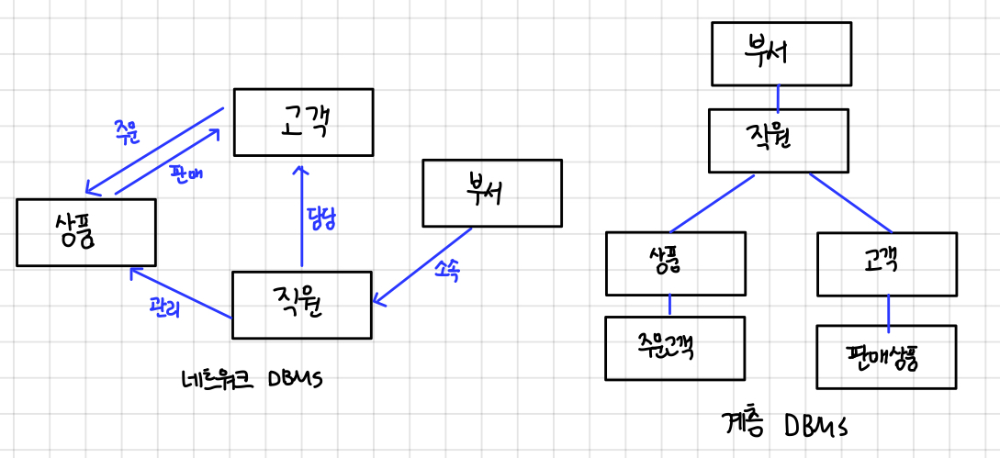

# 데이터베이스 관리 시스템

## 01 데이터베이스 관리 시스템의 등장 배경

과거-파일 시스템을 이용

- 파일 시스템
  - 장점: 별도의 구매비용x
  - 응용 프로그램마다 파일을 따로 유지
    문제점
  - 같은 내용의 데이터가 여러 파일에 중복 저장
  - 응용 프로그램이 데이터 파일에 종속적
    - 데이터 종속성: 사용하는 파일의 구조를 변경하면 응용 프로그램도 함께 변경해야 한다
  - 데이터 파일에 대한 동시 공유, 보안, 회복 기능이 부족하다
  - 응용 프로그램을 개발하기 쉽지 않다

## 02 데이터베이스 관리 시스템의 정의

### 데이터베이스 관리 시스템(DBMS: DataBase Management System)

정의: 파일 시스템의 데이터 중복과 데이터 종속 문제를 해결하기 위해 제시된 소프트웨어

조직에 필요한 데이터를 데이터베이스에 통합하여 저장하고 이에 대한 관리를 집중적으로 담당함

데이터베이스에 들어 있는 데이터를 삽입 삭제 수정 검색하고, 모든 응용 프로그램이 데이터베이스를 공유할 수 있게 한다.

**데이터 독립성 확보**: 데이터베이스 구조나 접근 방법이 변경되어도 사용자가 미리 알거나 응용 프로그램을 변경할 필요가 없다

### 기능

정의 기능: 데이터베이스 구조를 정의하거나 수정할 수 있다

조작 기능: 데이터를 삽입 삭제 수정 검색하는 연산을 할 수 있다

제어 기능: 데이터를 항상 정확하고 안전하게 유지할 수 있다(무결성 유지, 장애 회복, 보안)

## 03 데이터베이스 관리 시스템의 장단점

### 1. 장점

- 데이터 중복을 통제할 수 있다
  - 데이터베이스에 데이터를 통합하여 관리
  - 데이터 일관성 유지
- 데이터 독립성 확보
  - 파일 시스템의 데이터 종속 문제(파일 구조가 바뀌면 응용 프로그램도 함께 수정)
  - DBMS가 데이터베이스에 접근, 관리 → 응용 프로그램이 영향 받지 않음
  - 독립성: 응용 프로그램과 데이터베이스 사이에 독립성
- 데이터 동시 공유 가능
  - 데이터베이스에 통합된 데이터를 여러 응용 프로그램이 공유하여 같은 데이터에 동시 접근
  - DBMS가 동일한 데이터를 다양한 구조로 제공해줄 수 있고, 동시 접근을 제어하는 기술을 보유하고 있음
  - 불필요한 데이터 중복 젷나
- 데이터 보안 향상
  - 데이터를 중앙 집중식으로 관리 - 데이터에 대한 효율적인 접근 제어 가능
  - 권한이 없는 사용자의 접근, 허용되지 않은 데이터와 연산에 대한 요청 차단
- 데이터 무결성 유지
  - 데이터 무결성: 저장된 데이터 값의 정확성
- 표준화
- 장애 발생 시 회복 가능
- 응용 프로그램 개발 비용 절감

### 2. 단점

- 비용이 많이 든다
  - 파일 시스템에 더하여 따로 설치
- 백업과 회복 방법이 복잡
- 중앙 집중 관리로 인한 취약점 존재
  - 데터베이스나 관리 시스템에 장애가발생하면 전체 시스템의 업무 처리가 중단
  - 가용성, 신뢰성에 치명적인 영향

## 04 데이터 베이스 관리 시스템의 발전 과정

### 1. 1세대 데이터베이스 관리 시스템: 네트워크·계층 DBMS

네트워크 DBMS

- 간선을 이용해 데이터 간 관계를 표현 - 구조가 복잡하고 변경하기 어려움
- IDS(Integrated Data Store)(1960)

계층 DBM

- 트리 형태
- 네트워크 DBMS보다 구조가 단순
- 현실 세계의 모습을 트리 형태만으로 표현하기 어려움
- 여전히 구조 변경이 어렵다
- IMS(Information Management System)

### 2. 2세대 데이터베이스 관리 시스템: 관계 DBMS

데이터베이스를 테이블 형태로 구성하는 관계 데이터 모델 사용

- 데이터베이스를 단순하고 이해하기 쉬운 구조로 구성
- 지금도 널리 사용, 오라클 MS SQL 서버, MySQL, MariaDB, Access

### 3. 3세대 데이터베이스 관리 시스템: 객체지향·객체관계 DBMS

더 다양하고 복잡한 응용 분야의 데이터를 관리하려는 사용자 요구를 충족시키기 위해 제안

- 새로운 유형의 데이터 저장
- 데이터에 대한 복잡한 분석 및 처리 지원
- 오투, 온투스, 젬스톤
- 객체관계 DBMS: 오라클

### 4. 4세대 이후 데이터베이스 관리 시스템: NoSQL·NewSQL DBMS

NoSQL - Not Only SQL

배경

- 소셜 네트워크 서비스 - 비정형 데이터 대량 생산
- 클라우드 컴퓨팅, 빅데이터 개념 - 관계 DBMS의 비효율성

특징

- 비정형 데이터를 저장하고 처리하는 데 적합
- 확장성이 뛰어남 - 여러 대의 서버 컴퓨터에 데이터를 분산하여 저장, 처리하는 환경에 적합
- 몽고디비, H베이스, 카산드라, 레디스, 네오포제이, 오리엔트DB

한계

- 기업에서 처리하는 데이터 중 정형 데이터가 차지하는 비중이 높음
- NoSQL을 추가로 도입해야 하는 부담

NewSQL DBMS

- 안정성과 일관성을 유지 + SQL을 이용해 다양하고 복잡한 데이터 처리
- 관계 DBMS의 장점 + NoSQL의 확장성 및 유연성 모두 지원
- 구글스패너, 볼트DB, 누오DB
