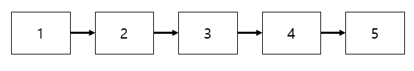
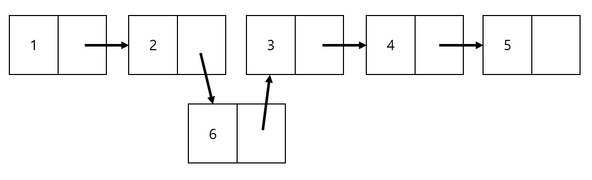
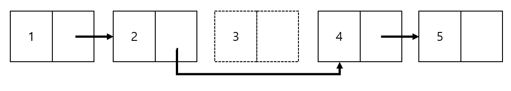
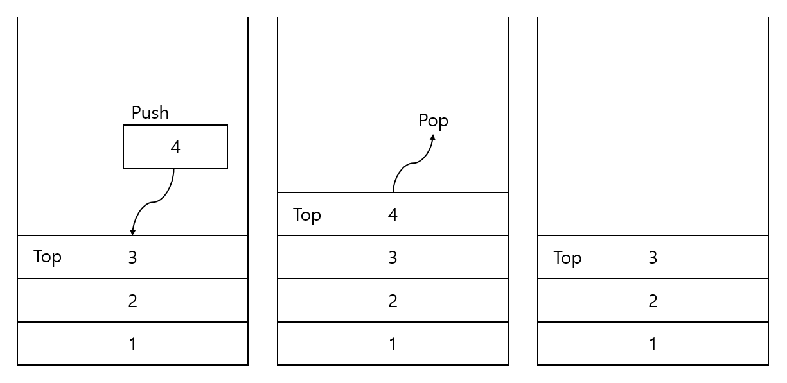
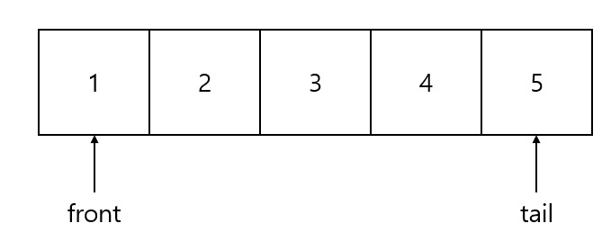
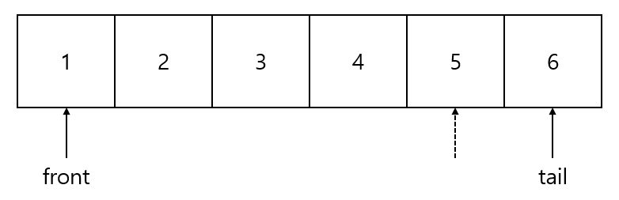
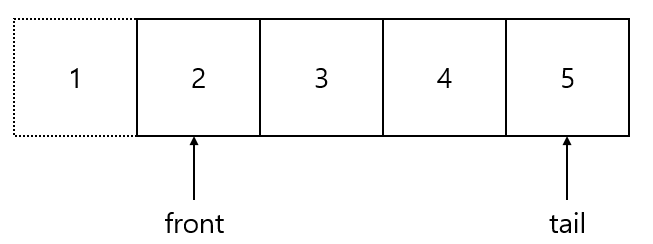

# Data Structure
쉽게 배우는 자료구조 with 자바 참고

<details>
<summary>Array & ArrayList 배열</summary>
<div markdown="1">

# Array & ArrayList 배열

- 같은 종류의 데이터를 저장하기 위한 자료구조

index로 배열의 요소 참조 가능

크기가 고정 → overflow 위험

직관적으로 간단함

추가/제거 시 shift 필요


## 삽입

```java
public void add(int index, E x) {
		if (this.numItems >= item.length || index < 0 || index > this.numItems) {
			// 에러 처리
		} else {
			for (int i = this.numItems - 1; i >= index; i--) {
				item[i + 1] = item[i]; // index에 값을 삽입하기 위해 오른쪽으로 한 칸씩 shift
			}
			item[index] = x;
			this.numItems++;
		}
	}
```

## 제거

```java
public E remove(int index) {
		if (isEmpty() || index > 0 || index > numItems - 1) {
			// 에러처리
			return null;
		} else {
			E tmp = item[index];
			for (int i = index; i < this.numItems; i++) {
				item[i] = item[i + 1]; // 한 칸씩 왼쪽으로 shift
			}
			numItems--;
			return tmp;
		}
	}
```

## get / set

```java
public E get(int index) {
		if (index >= 0 && index <= this.numItems - 1) {
			return item[index];
		} else {
			return null;
		}
	}

	public void set(int index, E x) {
		if (index >= 0 && index <= this.numItems - 1) {
			item[index] = x;
		}
	}
```

## indexOf

```java
public int indexOf(E x) {
		for (int i = 0; i < this.numItems; i++) {
			if (((Comparable) item[i]).compareTo(x) == 0)
				return i;
		}
		return -1;
	}
```

</div>
</details>

<details>
<summary>Linked List 연결 리스트 </summary>
<div markdown="1">

# Linked List 연결 리스트

삽입/제거 시 shift 필요 X

값을 찾을 때, 앞에서부터 순차적으로 탐색



- 기본 구조

```java
class Node<E> {
	public E item;
	public Node<E> next;

	public Node(E item) {
		this.item = item;
		this.next = null;
	}

	public Node(E item, Node<E> next) {

		this.item = item;
		this.next = next;
	}

}

public class MyLinkedList<E> {
	private Node<E> head;
	private int numItems;

	public MyLinkedList() {
		this.head = new Node(null);
		this.numItems = 0;
	}
}
```

## 삽입



이전의 Node가 가리키고 있던 next가 삽입 노드를 가리키게 하고, 삽입 노드의 next가 기존의 next값을 가리키게 만든다.

```java
public void add(int index, E item) {
		Node<E> curr = this.head;
		for (int i = 0; i < index; i++) {
			curr = curr.next; // 삽입 index의 바로 전 값 찾기
		}

		Node<E> newNode = new Node<E>(item, curr.next);
		curr.next = newNode;
		numItems++;

	}
```

## **삭제**



삭제할 Node의 이전 Node가 가리키고 있던 값을 삭제 Node의 next가 가리키고 있던 값으로 옮겨준다.

```java
public void remove(int index) {
		Node<E> curr = this.head;
		for (int i = 0; i < index; i++) {
			curr = curr.next; // 삭제할 값의 바로 전 값 찾기
		}
		curr.next = curr.next.next; // 삭제할 노드의 전 노드가, 삭제할 노드의 다음 노드를 가리키게 함
		numItems--;
	}
// 에러 처리 필요
```

</div>
</details>

<details>
<summary>ArrayList와 LinkedList의 비교 </summary>
<div markdown="1">


# ArrayList와 LinkedList의 비교

|  | ArrayList | LinkedList |
| --- | --- | --- |
| 크기 | 고정=정적 | 변동=동적 |
| 공간의 연속성 | O | X |
| 정렬 | 빠름 | 느림 |
| 접근(k번째 원소) | index로 즉시 접근→빠름 Θ(1) | 시작 노드부터 접근 → 느림 Θ(k) |
| 원소 하나당 필요한 공간 | 적음 | 큼 (링크를 위한 공간 필요) |
| 공간 낭비 | 충분한 크기로 선언 → 낭비O | 낭비X |
| 검색 | Θ(n) (크기 순 정렬시 Θ(log n) | Θ(n) |
| 추가/삭제 | 느림 | 빠름 |

</div>
</details>

<details>
<summary>Stack 스택 </summary>
<div markdown="1">

# Stack 스택

물건을 쌓아 올리듯 자료를 쌓아 올린 형태의 자료구조

Last in First out: 마지막에 삽입한 자료를 가장 먼저 꺼냄

선형구조(자료 간의 관계가 1대 1의 관계)

맨 위의 원소만 접근 가능(top)



응용: 문자열 뒤집기, postfix 계산

### 메소드

push: 스택에 값을 추가

pop: 스택의 마지막 값을 삭제하고 반환

peek: 스택의 마지막 값을 반환(삭제x)

isEmpty: 스택이 비어있는지 확인

## push, pop

배열 스택을 이용

```java
package myds;

public class MyArrayStack {
	private static int[] stack = new int[100];
	private static int topIndex = -1;;

	public static void main(String[] args) {

	}

	public boolean isFull() {
		return topIndex == stack.length - 1;

	}

	public boolean isEmpty() {
		return topIndex == -1;
	}

	public void push(int item) {
		if (isFull()) {
			System.out.println("가득 참");
			return;
		}
		stack[++topIndex] = item;
	}

	public int pop() {
		if (isEmpty()) {
			System.out.println("비어있음");
			return -999;
		}

		int popItem = stack[topIndex--];
		return popItem;
	}

}
```

### 활용1. 괄호 검사

### 활용2. 계산기

1. 중위 표현식 → 후위 표현식
2. 후위 표현식을 계산
3. 
</div>
</details>

<details>
<summary>Queue 큐 </summary>
<div markdown="1">

# Queue 큐

First in First out (스택과 비교)

줄 서기

### 메소드

add, remove, element: 예외 발생

offer, poll, peek: 값을 반환



front: 맨 먼저 큐에 들어온 원소, tail: 맨 나중에 큐에 들어온 원소

### 구현

원형 큐

선형 큐는 자료가 삭제될 때마다 front의 위치를 바꿔야 함 → 비효율적

원형큐는 배열을 원형의 형태로 생각하며 front와 rear의 상대적 위치로 큐의 상태를 파악

맨 처음 index에는 값을 담지 않기로 정함! (full과 empty의 차이를 구분하기 위해서)

```java
package myds;

public class MyArrayQueue<E> {
	// 원형 배열 이용
	private int size = 10;
	private E[] queue;
	private int front;
	private int tail;

	public boolean isEmpty() {
		return front == tail;
	}

	public boolean isFull() {
		return front == (tail + 1) % size;
	}
```

## 삽입




tail 뒤에 새로운 원소 삽입

```java
// 삽입은 tail에
	public void enqueue(E item) {
		if (isFull()) {
			return;
		} else {
			this.tail = (tail + 1) % this.queue.length;
			queue[tail] = item;
		}

	}
```

## 삭제



맨 앞의 원소 삭제 → 어떤 원소를 삭제할지 묻지 않아도 됨

```java
// 삭제는 front부터
	public E dequeue() {
		if (isEmpty()) {
			return null;
		}

		E queueFront = queue[front];
		front = (front + 1) % this.queue.length;

		return queueFront;
	}
```


</div>
</details>

<details>
<summary>Heap 힙 </summary>
<div markdown="1">


# Heap 힙

## 우선순위 큐

우선순위를 가진 원소를 삽입할 수 있고, 우선순위가 가장 큰 원소를 빼내줄 수 있는 자료구조

## 힙

대표적인 우선순위 큐, 완전 이진 트리(Complete Binary Tree) 구조 사용

포화 이진 트리(Full Binary Tree): 루트부터 시작해 모든 노드가 정확히 자식 노드를 2개씩 가지면서 꽉 채워진 트리, 노드의 총 수는 $2^k$-1개

완전 이진 트리(Complete Binary Tree)


## 힙의 조건

1. 완전 이진 트리
2. 힙 특성: 모든 노드는 값을 갖고, 자식 노드(들) 값보다 크거나 같다. (최대 힙)

## 힙 배열


루트 노드부터 순서대로 배열에 담아 관리

## 삽입

A[8]에 원소 8 삽입

1. 배열의 맨 끝에 8을 삽입


1. 8을 자신의 부모 3과 비교 → 8이 더 크므로 자리 교환


1. 다시 자신의 부모 7과 비교 → 8이 더 크므로 자리 교환


1. 자신의 부모 9와 비교 → 9가 더 크므로 자리 확정
- **스며오르기(percolateUp) → 힙 성질을 충족하도록 자리를 교환하는 작업**

```java
public void insert(E newItem) {
		// A[0...n-1]에 newItem을 추가
		heap[numItems] = newItem;
		percolateUp(numItems);
		numItems++;

	}

	public void percolateUp(int i) {
		int parentIdx = (i - 1) / 2;
		if (parentIdx >= 0 && ((Comparable<E>) heap[parentIdx]).compareTo(heap[i]) < 0) {
			E tmp = heap[i];
			heap[i] = heap[parentIdx];
			heap[parentIdx] = tmp;
			percolateUp(parentIdx);
		} 

	}
```

## 삭제

힙은 우선순위 큐이므로, 가장 우선순위가 큰 (최대힙에서는 값이 제일 큰) 원소 A[0]가 삭제됨

그러나 바로 A[0]을 삭제하면 힙의 모양이 깨지기 때문에, A[n-1]와 A[0]을 바꿔준 후 A[n-1]을 삭제하고, 다시 힙의 성질을 충족할 수 있도록 원소를 교환하는 과정을 반복한다.

이 과정을 **percolateDown**이라고 한다. 

percolateDown은 percolateUp과 유사하게, 자신의 자식 노드들 중 큰 값과 자신을 비교하며, 자식 노드가 더 클 경우 자리를 바꾸는 것이다. 이 과정은 리프 노드에 이를 때까지 계속된다.

1. A[n-1]과 A[0]을 교환
2. percolateDown()

---

```java
public E deleteMax() {
		E max = heap[0];
		heap[0] = heap[this.numItems - 1]; // 자리 교환
		this.numItems--; // max값은 배열에서 제외됨
		percolateDown(this.numItems);
		return max;
	}

	public void percolateDown(int i) {
		int child = 2 * i + 1;
		int rightChild = 2 * i + 2;
		if (child <= this.numItems - 1) {
			if (((Comparable<E>) heap[child]).compareTo(heap[rightChild]) < 0)
				child = rightChild; // 더 큰 값을 child로 지정
			if (((Comparable<E>) heap[i]).compareTo(heap[child]) < 0) {
				E tmp = heap[i];
				heap[i] = heap[child];
				heap[child] = tmp;
				percolateDown(child);
			}

		}
	}
```

## 힙 생성

리프노드가 아닌 노드부터 루트노드까지 힙 조건을 만족하도록 수정함(percolateDown)

최초의 리프노드가 아닌 노드: 맨 마지막 노드의 부모 노드 → 마지막 index가 k라면 (k-1)/2

```java
public void buildHeap() {
		if (this.numItems >= 2) {
			for (int i = (numItems - 2) / 2; i >= 0; i--)
				percolateDown(i);
		}
	}
```

## 힙 수행시간

`buildHeap()`: Θ(n)

`insert()`: O(log n) - 한 번의 percolateUp (트리의 높이)

`deleteMax()`: O(log n) - 한 번의 percolateDown

</div>
</details>

---

<details>
<summary>B-트리</summary>
<div markdown="1">

# B-트리

내장 색인: 메모리에 올려서 사용 (이진 검색 트리)

외장 색인: 메인 메모리 외부에 놓고 사용하는 색인 (B-트리)

색인의 규모가 클 경우 or 메인 메모리가 충분하지 않을 때 디스크에 두고 사용

디스크 접근 시간으로 인한 비효율을 최대한 줄여야 함

- **B-트리: 디스크 환경에서 사용하기 적합한 외장 다진 검색 트리**

**최대 *M*개의 자식**을 가질 수 있는 B트리=*M*차 B트리


$key_{i-1} < T_i < key_i$

## 성질

1. 루트를 제외한 모든 노드는 $\frac k 2$ ~k개의 키를 갖는다. 
    a. k: 한 블록이 수용할 수 있는 최대 키의 개수
    b. 예외: 루트 노드는 적어도 2개 이상의 자식을 가짐
2. 모든 리프 노드는 같은 깊이를 가진다.
3. 노드의 자료수가 N이면, 자식 수는 N+1이어야 함
    a. 노드의 자료수(key)가 3개라면, 그 노드의 자식 수는 4개
        
        $key_1, key_2, key_3$
        
        $node_1 < key_1$
        
        $key_1 < node_2 < key_2$
        
        $key_2 < node_3 < key_3$
        
        $node_4 > key_3$
        
4. 각 노드의 자료는 정렬된 상태여야함
5. 입력 자료는 중복 될 수 없음


## 알고리즘

### 검색

기본적으로 이진 검색 트리의 검색과 같음

1. 노드의 여러 키 중 검색 키와 일치하는 것이 있는지 확인
2. $key_{i-1}$ < x < $key_i$ 인 두 키 $key_{i-1}$ 과 $key_i$ 를 찾아 분기해야 할 자식 노드를 찾음
3. 자식으로 분기하고 나면 깊이만 하나 내려간 똑같은 검색 문제(다시 자식 노드를 찾음) → 재귀적 과정

### 삽입

ex) 각 노드가 최대 5개의 키를 가질 수 있다고 가정

루트 노드를 제외하고 2~5개의 키를 가져야 한다.

1. x를 삽입할 리프 노드 r을 찾는다.
2. 노드 r에 공간의 여유가 있으면 키를 삽입하고 끝낸다. (case 1)
3. 노드 r에 여유가 없으면 형제 노드에 공간의 여유가 있는지 살펴본다. 
    1. 형제 노드에 공간의 여유가 있으면 키를 하나 넘기고 끝낸다. (case 2)
        
        )
        
    2. 형제 노드에 여유가 없으면 노드를 2개로 분리한다. 분리 작업은 부모 노드로 키를 하나 넘기는 작업을 포함한다. (case 3)
        
        
        

### 삭제

1. x를 키로 갖고 있는 노드를 찾는다.
2. 리프노드인지 아닌지 확인
    1. 리프노드라면 바로 삭제 (case 1)
        
        
        
    2. 리프노드가 아니라면 x의 직후 원소 r과 x를 교환한 후, 리프 노드 x 제거 (case 2)
        
        
        
3. x를 제거한 후 노드에 언더플로우가 발생하면 해소한다. (case 3)


### 작업 성능

d진 검색 트리가 균형을 잘 맞추면 높이가 $log_dn$ 에 근접

B-트리에서 임의의 노드가 최대 d개의 자식을 가질 수 있다면, 최소한 $\frac {d-1} 2$+1개에서 $\frac d 2$개의 자식을 가져야 함

→ 높이는 $O(log n)$

- 작업 수행시간은 디스크 접근 횟수를 기준으로 함

**검색**

$O(log n)$ (높이)

**삽입**

실패하는 검색을 한 번 수행 $O(log n)$

오버플로우가 최대한 발생하더라도 높이에 비례하는 시간 $O(log n)$ 

→ $O(log n)$

**삭제**

삭제 원소 검색 + 직후 원소를 찾는 작업 $O(log n)$

언더플로우 최대 $O(log n)$

→ $O(log n)$

→ 두 작업 모두 이진 검색 트리에 비해 빠름

</div>
</details>