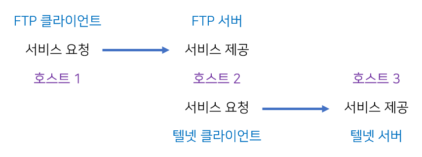
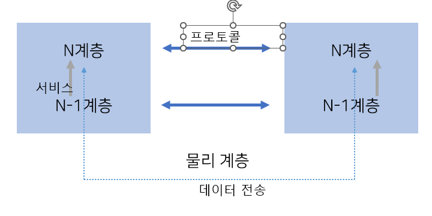
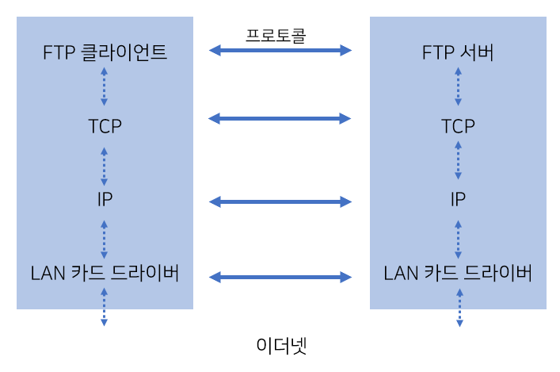
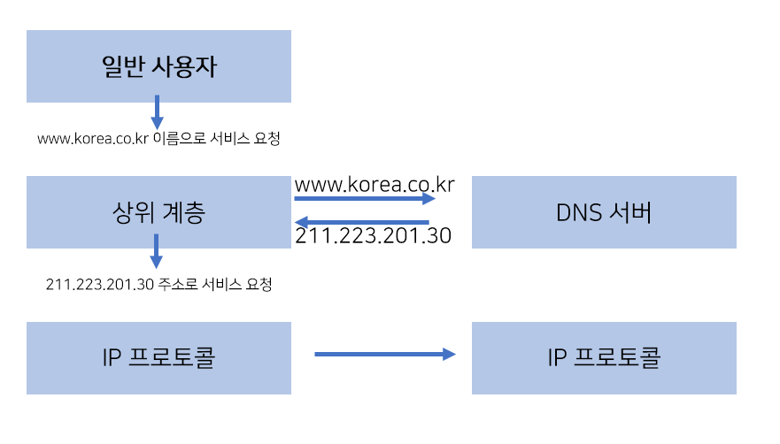

# 01 네트워크 기초

# 01 용어의 정의

## 1. 네트워크 기초 용어

- 네트워크 Network

**하드웨어적 전송 매체**(Transmission Media)를 매개로 서로 연결되어 **데이터를 교환하는 시스템**의 모음

### 네트워크 구성요소의 개념

1. **시스템**

**내부 규칙에 따라 자율적으로 동작하는 대상**

물리적 대상뿐만 아니라 소프트웨어적 대상들도 포함

ex. 자동차, 커피 자판기, 컴퓨터, 하드시스크 + 교통 제어 시스템, 운영체제, 프로세스

시스템의 동작에 필요한 욉 ㅜ입력, 내부 정보와 외부 입력의 조합에 따른 출력(시스템 실행의 결과물)

인터넷: 수많은 소규모 네트워크들이 서로 연동되는 반복적인 과정을 거쳐서 형성된 거대 연합체의 네트워크

2. **인터페이스**

**시스템과 시스템을 연결하기 위한 표준화된 접촉 지점**

시스템과 전송 매체의 연결 지점에 대한 규격

하드웨어적 관점과 소프트웨어적 관점 모두 존재

ex. 하드웨어: 컴퓨터 본체와 키보드 연결 - 키보드의 잭을 정해진 위치에 꽂기

상호간의 데이터 교환을 위한 논리적인 규격 + 잭의 크기와 모양 같은 물리적 규격

소프트웨어: 프로그래밍 언어 함수 설계자-함수 이름, 매개변수 표준화

양방향으로 데이터를 주고 받는 경우, 단방향으로 데이터를 보내는 경우

3. **전송 매체**

**시스템끼리 정해진 인터페이스를 연동해 데이터를 전달하기 위한 물리적인 전송 수단**

ex. 동축 케이블, 공기(소리 전파), 무선 신호

시스템간 물리적 연동을 위한 논리적 규격: 인터페이스 → 전송 매체를 통해 물리적으로 구현 →시스템간 데이터 전송 가능

4. **프로토콜**

**논리적으로 상호 연동되는 시스템이 전송 매체를 통해 데이터를 교환할 때 따르는** **표준화된 대화 규칙**

동등한 위치에 있는 시스템 사이의 규칙이라는 측면이 강조 (인터페이스와 구분)

cf. 인터페이스: 프로토콜과 비교될 때는 상하 개념이 적용됨

프로토콜: 주고받는 데이터의 형식, 과정에서 발생하는 일련의 절차적 순서를 강조함 

5.  **네트워크**

**통신용 전송 매체로 연결된 여러 시스템이 프로토콜을 사용하여 데이터를 주고받을 때의 단위**

컴퓨터 네트워크: 물리적인 전송 매체로 연결된 컴퓨터들이 동일한 프로토콜을 이용해 서로 데이터를 주고받음

소규모 네트워크가 모여 더 큰 네트워크 구성

네트워크끼리 라우터라는 중개 장비를 사용해서 연결

6. **인터넷**

**전 세계의 모든 네트워크가 유기적으로 연결되어 동작하는 통합 네트워크**

데이터 전달 기능: IP(Internet Protocol) 사용

7. **표준화**

**서로 다른 시스템이 상호 연동해 동작하기 위해 필요한 연동 형식의 통일**

## 2. 시스템 기초 용어

네트워크: (외형적으로) 시스템 + 전송 매체

전송매체: 전송 대역, 전송 속도, 전동 오류율 같은 물리적인 특성이 주 관심사

### 시스템의 구분

수행 기능에 따라 구분

- 노드 Node

컴퓨터 이론 분야에서 특정 시스템을 가리키는 가장 일반적인 용어

인터넷: 상호 연결된 시스템을 표현할 수 있는 가장 포괄적 의미로 사용

**데이터를 주고받을 수 있는 모든 시스템을 통칭**

라우터(인터넷 내부 구성), 호스트(인터넷 바깥쪽에 연결되어 데이터를 주고받음)

- 라우터 Router

인터넷 내부 구성, 기본으로 데이터 전송 기능 포함

주요 역할: **데이터 중개 기능**

호스트들 사이의 데이터 전송이 인터넷 내부의 최적의 경로를 통하여 이루어지도록 함

- 호스트

**인터넷 바깥쪽에 연결되어 일반 사용자들의 네트워크 접속 창구 역할**

컴퓨팅 기능을 갖춘 호스트: 네트워크 응용 프로그램 실행 가능

호스트 사이에 제공되는 서비스를 기준으로 클라이언트, 서버로 분류

- 클라이언트와 서버

클라이언트: 임의의 인터넷 서비스를 이용하는 응용 프로그램

서버: 서비스를 제공하는 응용 프로그램

임의의 호스트는 서비스의 종류에 따라 클라이언트가 될 수도, 서버가 될 수도 있음 → 상대적 개념

cf. 호스트 단위로도 클라이언트와 서버를 사용하기도 함 - 다양한 서비스를 제공하는 목적으로 특화된 호스트를 서버라고 부르기도 한다

서버

- 클라이언트보다 먼저 실행 상태가 되어 클라이언트의 요청에 대기
- 영원히 종료하지 않으면서 요청이 있을 때마다 서비스를 제공

### 클라이언트와 서버

FTP(File Transfer Protocol): 원격 호스트끼리 파일 송수신 기능을 제공하는 서비스

텔넷(Telnet): 원격 호스트에 로그인하는 서비스 제공

FTP 서비스 기준: 호스트 1=클라이언트, 호스트2=서버

텔넷 서비스 기준: 호스트 2=클라이언트, 호스트 3=서버

# 02 구조적 모델

내부 기능을 기초로 하여 다양한 구조로 세분화

계층 모델: 호스트가 제공하는 네트워크 기능을 연관된 그룹으로 묶어 설명

## 1. OSI 7계층 모델

ISO(International Standard Organization) : OSI(Open Systems Interconnection) 7계층 모델 제안 

네트워크에 연결된 시스템이 갖추어야 할 기본 구조와 기능 정의

### 계층 구조

네트워크에 연결된 호스트들은 7개 계층으로 모듈화된 전송 기능을 갖추어야 함

1. **물리 계층 Physical Layer**
2. **데이터 링크 계층 Data Link Layer**
3. **네트워크 계층 Network Layer**
4. **전송 계층 Transport Layer**
5. **세션 계층 Session Layer**
6. **표현 계층 Presentation Layer**
7. **응용 계층 Application Layer**

**일반 사용자**: 응용 계층을 통해 데이터의 송수신 요청 → 순차적으로 전달 → 물리 계층을 통해 상대 호스트에 전송

라우터: 하위 3개 계층의 기능만 수행 

**호스트(데이터 수신)**: 물리 계층으로 들어온 데이터 → 응용 계층

처리 완료된 결과를 회신할 때는 반대 과정을 순차적으로 밟아 송신 호스트로 되돌아감

데이터를 송수신하는 최종 주체: 송수신 호스트 양쪽에 위치한 응용 계층

표현 계층: 응용 계층을 지원하기 위한 고유 기능 수행

### 계층별 기능

각 계층은 독립적인 고유 기능 수행

- **물리 계층**

호스트들이 데이터를 전송하려면 반드시 물리적인 전송 매체로 연결

**호스트를 전송 매체와 연결하기 위한 인터페이스 규칙과 전송 매체의 특성을 다룸**

유선매체와 무선 매체로 구분

- **데이터 링크 계층**

물리 계층으로 데이터를 전송하는 과정에서 물리적인 오류 발생 가능 (잡음 Noise)

**물리 계층의 오류에 관한 오류 제어 기능**

오류 발생 사실 인지, 오류 복구

물리 계층-물리적 전송 오류를 감지 → 데이터 링크 계층에서 오류를 인지할 수 있게 해줌

아니면 데이터 링크 계층에서 스스로 오류 인지

물리적 오류 예시: 데이터 분실, 데이터 변형

오류 복구: 송신자가 원래의 데이터를 재전송

- **네트워크 계층**

송신 호스트가 전송한 데이터가 수신 호스트까지 안전하게 도착하려면 여러 개의 중개 시스템(라우터)를 거친다

**이 과정에서 데이터가 올바른 경로를 선택할 수 있도록 지원**

오류 제어 기능 필요: 네트워크 바깥쪽에 연결되는 송수신 호스트 사이의 데이터 중개 과정에서 발생할 수 있는 오류

ex. 네트워크 부하 증가 - 특정 지역에 혼잡 Congestion 발생

혼잡 제어 기능-데이터의 전송 경로와 관계

- **전송 계층**

**송신 프로세스와 수신 프로세스 간의 연결 기능 → 프로세스 사이의 안전한 데이터 전송 지원**

응용 네트워크 프로세스: 컴퓨터 네트워크에서 데이터를 교환하는 최종 주체 (호스트 내부에서 시행)

네트워크 계층은 송수신 호스트 사이의 전송 지원O, 응용 프로세스까지 전달X

전송 계층: 데이터가 전송되는 최종적인 경로상의 양 끝단 사이의 연결이 완성되는 계층

cf. 계층 1~4: 운영체제에서 시스템 콜 형태로 상위 계층에 제공

계층 5~7: 응용 프로그램으로 작성

- **세션 계층**

전송 계층에서 제공하는 연결의 개념과 유사한 세션 연결 지원+이보다 더 상위의 논리적 연결

**응용 환경에서 사용자 간 대화(Dialog) 개념의 연결로 사용 - 전송 계층의 연결과 구분**

ex. 인터넷의 파일 송수신 중 연결이 끊김: 전송 계층, 이후 전송 계층 연결을 다시 설정하여 이전 데이터 송수신이 멈춘 지점부터 이어서 전송: 세션 계층

- **표현 계층**

**전송되는 데이터의 의미를 잃지 않도록 올바르게 표현하는 방법** - 정보를 교환하는 호스트들이 표준화된 방법으로 데이터를 인식할 수 있게 함

데이터 표현 + 압축, 암호화

- **응용 계층**

**일반 사용자를 위한 다양한 네트워크 응용 서비스 지원**

### 프로토콜과 인터페이스

호스트끼리 통신하는 과정에서는 각 계층의 모듈이 상대 호스트의 동일 계층과 개별적으로 논리적 통신을 수행해야 함

**프로토콜: 각각의 계층이 정해진 방식과 절차에 따라 상대 계층과 통신하는 과정에서 필요한 규칙**

인터페이스: 상하위 계층 간 규칙

서비스: 인터페이스 중 하위 계층이 상위 계층에 제공하는 인터페이스

한 호스트를 기준으로 데이터 전송은 위아래, 양방향 모두 가능

**좌우 간 물리적 데이터 전송은 반드시 가장 아래의 물리 계층을 통해 이루어짐**

호스트1과 호스트2의 계층 n 프로토콜이 통신하기 위해서 계층 n-1 프로토콜의 서비슥 ㅏ필요함

= 하위의 계층 n-1을 통해 데이터 전송이 이루어짐

### 인터넷의 계층 모델

IP(Internet Protocol): 네트워크 계층의 기능 수행

TCP(Transmission Control Protocol), UDP(User Data Protocol): 전송 계층 기능 수행

- FTP 클라이언트가 FTP 서버에 데이터를 전송하는 과정
1. 하위 TCP에 데이터를 전송
2. IP 프로토콜, LAN 카드를 거쳐 이더넷으로 표현된 전송 매체를 통해 FTP 서버의 LAN 카드에 전달
3. FTP 서버에 도착한 데이터는 송신 순서의 반대인 LAN 카드 - IP - TCP 프로토콜을 거쳐 FTP 서버 프로그램에 도착

양방향 통신을 지원하기 때문에 반대방향도 가능

## 2. 인터네트워킹

인터네트워킹 Internetworking - 네트워크와 네트워크의 연결

연결되는 네트워크 수가 증가할수록 복잡도가 커짐

인터넷: IP 프로토콜을 지원하는 전 세계의 모든 네트워크가 반복 구조로 연결된 시스템

라우터라는 중개 장비를 사용하여 네트워크를 연결

### 네트워크의 연결

**독립적으로 운영되는 2개 이상의 네트워크가 연동되어 정보를 교환하려면 인터네트워킹 시스템이 필요**

네트워크 연동 = 물리적 연결 + 데이터 중개에 필요한 상위 네트워크 프로토콜이 지원

주요 기능: 전소 데이터의 경로 선택과 관계

네트워크1에 유입된 데이터를 네트워크 2, 3 의 누구에게 보낼 것인가?

7계층 모델에서 네트워크 계층에 포함 

인터네트워킹 시스템: 네트워크 계층을 포함한 하위 3개 계층의 기능을 수행

연결된 모든 네트워크에 대해 물리적이고 논리적인 인터페이스를 지원해야 함

양쪽 네트워크의 프로토콜이 일치하지 않으면 변환 작업을 수행

→ 둘 이상의 네트워크를 유기적으로 연동

### 게이트웨이

게이트웨이: 인터네트워킹 기능을 수행하는 시스템

종류-구분 기준: 지원할 수 있는 기능의 한계

- **리피터**
    - **물리 계층의 기능 지원**
    - 무선 신호/유선의 전기적 신호는 거리가 멀어질수록 신호의 크기가 약해짐
    - 한쪽에서 입력된 신호를 물리적으로 단순히 증폭하여 다른 쪽으로 중개
- **브리지**
    - 리피터는 전송 과정에서 발생하는 물리적인 오류 문제 다루지 않음
    - **리피터 기능+데이터 링크 계층의 기능: 물리 계층에서 발생한 오류 해결**
    - EX. 가정 무선 공유기
- **라우터**
    - 물리 계층, 데이터 링크 계층, 네트워크 계층의 기능 지원
    - 경로 선택 기능-임의의 네트워크에서 들어온 데이터를 어느 네트워크로 전달할지 판단
    - **자신과 연결된 네트워크와 호스트들의 정보를 유지, 관리** → 특정 경로가 이용 가능한지 여부와 다수의 경로 중 어느 경로가 빠른 데이터 전송을 지원하는지 판단
    - 네트워크와 호스트에 대한 정보=라우팅 테이블에 보관

## 3. 프로토콜

**통신 시스템이 데이터를 교환하기 위해 사용하는 통신 규칙**

OSI 7계층모델에서는 각 계층에서 수행하는 프로토콜이 독립적으로 동작

### 프로토콜의 예

|  |  | 1. 전원을 켜서 대기 상태로 만든다 |
| --- | --- | --- |
| 2. 수신자의 전화번호를 누른다 | 연결 설정 | 3. 벨 소리가 울린다 4. 통화 버튼을 누른다 |
| 5. 상대방과 대화를 한다. | 연결 상태 | 5. 상대방과 대화를 한다. |
| 6. 아무나 종료 버튼을 누른다. | 연결 해제 | 6. 아무나 종료 버튼을 누른다 |
| 발신자 |  | 수신자 |

연결 설정: 발신자의 요청, 수신자는 미리 연결 대기 상태

연결 설정: 상호 간의 합의

연결 종료: 한쪽의 일방적인 종결 선언

### 데이터 단위

**네트워크 프로토콜을 사용해 데이터를 교환-먼저 데이터를 특정 형태로 규격화**

데이터 단위: 한 단위의 규격으로 묶인 전송 데이터

계층에 상관없이이 통칭하여 PDU

| 데이터 단위 | 설명 |
| --- | --- |
| APDU(Application Protocol Data Unit) | 응용 계층에서 사용 |
| PPDU(Presentation Protocol Data Unit) | 표현 계층에서 사용 |
| SPDU(Session Protocol Data Unit) | 세션 계층에서 사용 |
| TPDU(Transport Protocol Data Unit) | 전송 계층에서 사용 인터넷에서 사용하는 전송 계층 프로토콜(TCP)에서는 세그먼트라고 부름 UDP에서는 데이터그램이라고 부름 데이터그램: 일반적 상황에서 계층 4 프로토콜의 전송 데이터를 가리킬 때도 사용 |
| NPDU(Network Protocol Data Unit) | 네트워크 계층에서 사용, 보통 패킷(Packet) 패킷=원래 네트워크 계층 IP 프로토콜에서 유래, 요즘은 네트워크 계층의 전송 데이터 |
| DPDU(Data Linke Protocol Data Unit) | 데이터 링크 계층에서 사용, 보통 프레임(Frame) |

# 03 주소의 표현

주소: 주소가 가리키는 대상의 특징을 표현

주소와 이름은 일대일 관계

이들을 연결하는 기능 필요

인터넷에서 일반 사용자:문자로 된 이름, 인터넷 내부:숫자로 된 주소 → 변환 기능 필요

**구분자의 네가지 특징**

- **유일성**

서로 다른 대상이 같은 구분자를 갖지 않음

- **확장성**

시스템은 자연스럽게 규모가 확장 - 구분자의 양이 증가

시스템의 최대 수용 규모를 예측하여 구분자의 최대 한계를 올바르게 설정

합리적인 기준 설정-확장의 정도 예측

-IP주소의 고갈 문제

- **편리성**

시스템의 내부 처리 구조를 효율적으로 운용할 수 있도록 해야 함

구분자의 체계: 숫자 위주, 일반인이 의미를 이해할 수 없음 → 문자로 된 이름 추가 부여

숫자로 된 주소와 문자로된 이름 - 매핑 기능이 필요

- **정보의 함축**

응용 환경에 적절히 대응할 수 있는 부가 정보를 포함

## 1. 주소와 이름

구분자: 주소 + 이름

주소=내부에서 처리되는 숫자 기반

이름=사용자의 이해와 편리성 도모

### IP 주소

**네트워크 계층의 기능을 수행하는 IP 프로토콜이 호스트를 구분하기 위해 사용하는 주소 체계**

임의의 호스트를 인터넷에 연결하려면 반드시 IP 주소를 할당

32비트의 이진 숫자 - 보통 8비트씩 네 부분으로 나누어 10진수로 표현

ex. 11010011 11011111 11001001 00011110

211.223.201.30 (10진수)

국제 표준화 기구가 전체 주소를 관리, 할당 - 유일성 보장

최대 주소 공간의 크기가 32비트로 제한되어 확장성에 많은 문제점 야기

→ 새로운 프로토콜 IPv6(Internet Protocol Version 6): 128비트로 확장, 32비트=IPv4

패킷의 경로를 결정하는 데 중요한 역할

### 호스트 이름

인터넷에서 특정 호스트와 연결하려면 반드시 해당 호스트의 IP주소를 알아야 함

인터넷 내부의 네트워크 계층은 호스트를 IP주소로 구분 - 일반 사용자는 문자로 된 호스트 이름 사용

DNS(Domain Name System): 이름과 주소 변환 기능을 이용해 IP 주소를 얻음

변환된 IP 주소의 호스트에 연결 설정, 전송 데이터가 포함된 패킷 전송

- DNS 서비스

호스트 이름을 `<국가 도메인> <단체 종류> <단체 이름> <호스트>`라는 네 계층 구조로 나눔

이들을 점(.)으로 구분해서 표기

www.korea.co.kr: 대한민국(kr)에 있는 일반 회사 (co) 중 korea라는 이름의 회사에 소속된 www라는 호스트

| 국가 도메인 | <호스트>가 위치한 국가의 이름을 두 글자의 약자로 표시 | kr, jp, us |
| --- | --- | --- |
| 단체 종류 | 기관의 성격에 따라 부여 | co(회사), ac(교육기관, academy), go(정부 소속 기관, government) |
| 단체 이름 | 단체를 상징하는 이름 사용 | 회사명, 학교 이름 등  |
| 호스트 | 소속 단체의 네트워크 관리자가 내부 규칙에 따라 개별 호스트에 부여한 이름 |  |

## 2. 주소 정보의 관리

도메인 이름: 일반 사용자가 호스트를 지칭할 때 사용하는 호스트 이름

### 호스트 파일

호스트 이름과 IP 주소를 변환하는 방법: 특정 파일에 호스트 이름과 IP 주소의 조합을 기록하여 관리

네트워크 관리자-모든 호스트의 이름, 주소 정보를 주기적으로 갱신, 이 정보를 네트워크에 연결된 모든 호스트가 복사하도록 함으로써 **정보의 일관성을 유지**

초기에는 호스트 파일 갱신이 자주 발생하지 않았음

현재는 DNS 서비스 사용 - 호스트 파일 방식은 보조적으로 사용

### DNS

호스트 파일: 간단하지만 대부분 수동으로 작업해야 함

**주소와 이름 정보를 자동으로 유지하고 관리하는 분산 데이터베이스 시스템**

호스트 주소와 이름 정보: 네임 서버라는 특정한 관리 호스트가 유지

주소 변환 작업이 필요한 클라이언트: 네임 서버에 요청하여 IP 주소를 얻음

여러 개의 네임 서버에 분산하여 호스트의 정보를 관리

네임 서버: 계층 구조로 연결, 자신의 영역에 위치한 호스트 정보만 관리

### 기타 주소

- MAC 주소
    - 계층 2의 MAC (Medium Access Protocol) 계층에서 사용, 일반적으로 LAN 카드에 내장
    - 물리 계층을 통해 데이터를 전송할 때 이용
    - 네트워크 계층이 하위의 데이터 링크 계층에 데이터 전송 요청: IP 주소를 MAC 주소로 변환 → MAC 계층이 상대방 MAC 계층에 데이터를 전송
- IP 주소
    - 인터넷에서 네트워크 계층의 기능을 수행하는 IP 프로토콜에 사용
    - 송신자 IP 주소와 수신자 IP 주소로 구분
    - 수신자 IP주소 = IP 패킷이 지나가는 경로를 결정하는 라우팅의 기준
- 포트 주소
    - 전송 계층에서 사용, 호스트에서 실행되는 프로세스 구분
    - 인터넷 연결의 완성: 네트워크 응용 프로세스 사이의 연결
    - 포트 주소:하나의 IP주소를 갖는 스마트폰에서 실행되는 여러 네트워크 응용 앱들을 구분하는 주소
    - TCP, UDP가 독립적으로 포트 주소 관리 - 포트 번호, 소켓 주소라고 부르기도 함
- 메일 주소
    - 응용 계층의 메일 시스템에서 사용자 구분