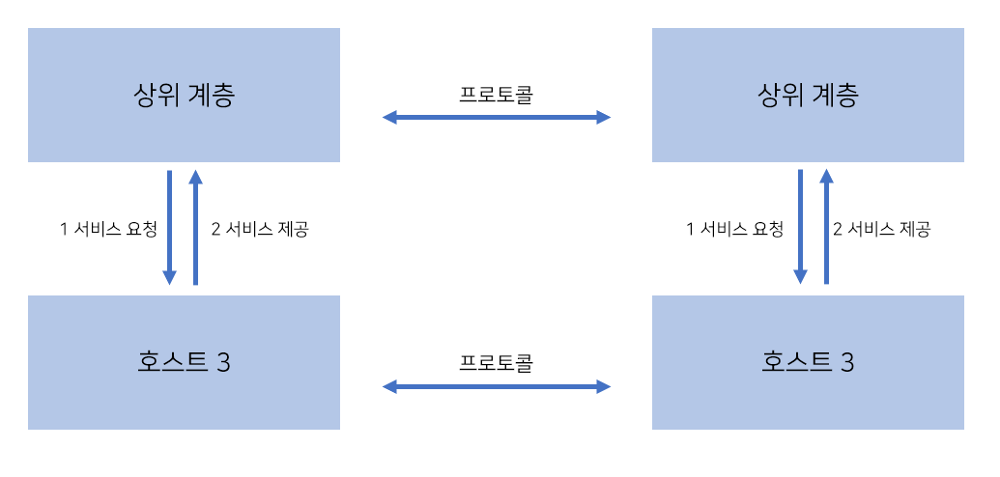
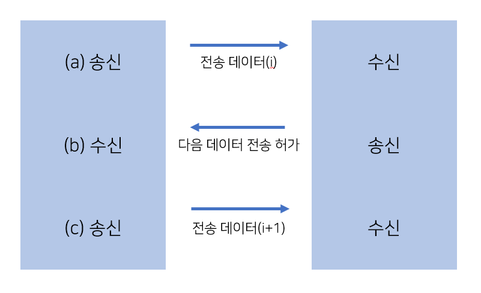
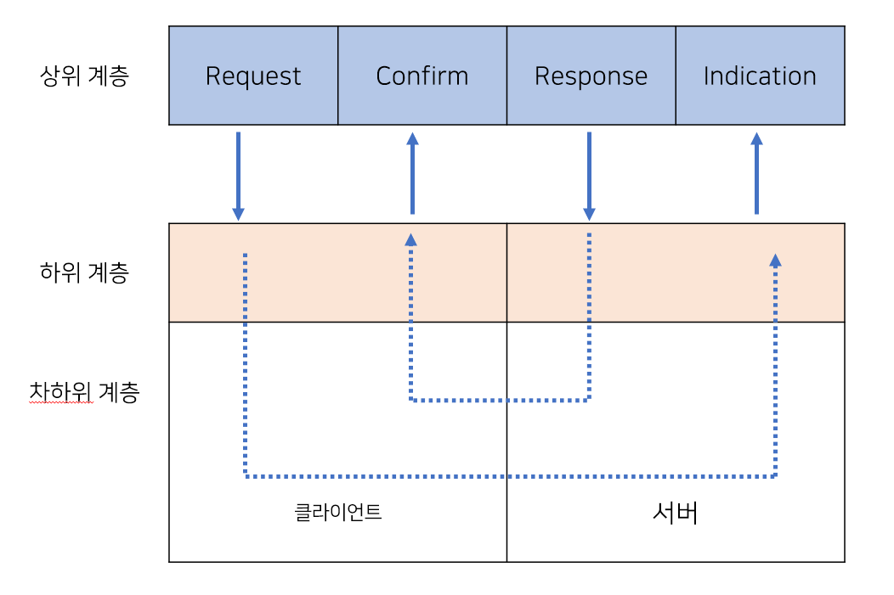
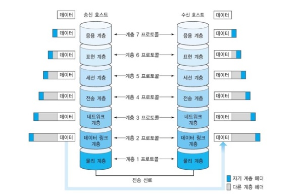
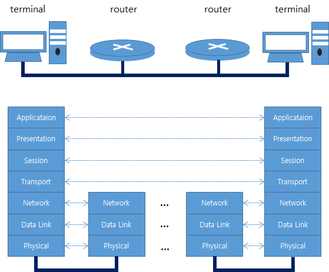
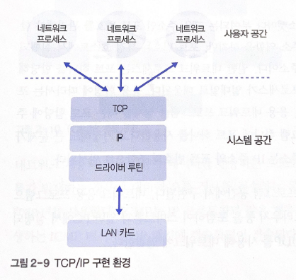
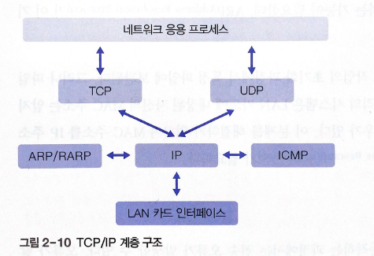

# 2. 네트워크 개념

# 01 프로토콜의 이해

프로토콜: 네트워크에 연결된 시스템이 순차적으로 데이터를 주고받을 때 필요한 규칙

모듈화: 프로토콜의 설계 과정

## 1. 계층적 모듈 구조

### 모듈화

하드웨어: CPU, 메모리, 하드디스크, LAN 카드 등 - 기능별로 모듈화

소프트웨어: 함수 → 모듈화

모듈화를 하지 않으면 한 부분만 고장 나도 전체 시스템을 교체해야 한다.

모듈화 → 모듈만 수정하면 됨

**계층 구조**

분할된 모듈들은 협력 관계를 유지하면서 유기적으로 동작

계층 구조: 특정 모듈이 다른 모듈에 서비스를 제공

1 상위 계층이 하위 계층에 특정 서비스 요청

2 하위 계층은 해당 서비스를 실행하여 그 결과를 상위 계층에 돌려줌

- 모듈화된 계층 구조 프로토콜의 장점
    - 복잡하고 큰 시스템을 기능별로 분류하여 간단하고 작은 시스템으로 재구성, 전체 시스템을 이해하기 쉬움, 시스템을 설계하고 구현하기 편리
    - 분할된 모듈이 연동할 수 있는 표준 인터페이스 제공, 모듈의 독립성→전체 시스템의 구조를 단순하게 만들어줌
    - 전송 매체 양단에 있는 호스트가 수행하는 프로토콜=좌우 대칭 구조 - 프로토콜 단순화
    - 특정 계층의 내부 변경이 다른 모듈의 동작에 영향을 미치지 않음

## 2. 프로토콜 설계 시 고려 사항

### 주소 표현

주소 체계: 시스템을 구분하여 지칭하기 위해 이름을 부여하는 것

ex. 유선 전화: 국가 코드- 지역 코드 - 번호, 주민등록번호:yymmdd-abcdefg

보통 호스트마다 주소를 하나씩 부여

그룹 주소-다수의 호스트를 묶어 하나의 그룹 주소로 표기

일대일 통신+일대다 통신(화상 회의 등)

일대다 통신: 브로드캐스팅(네트워크에 연결된 모든 호스트에 데이터 전송), 멀티캐스팅(특정 사용자를 그룹으로 묶어서 지칭, ex. 카카오톡 단체 전송, 줌 온라인 화상 회의)

### 오류 제어

데이터 송수신 과정에서 오류

전송 오류: 데이터 변형 오류(데이터가 깨짐), 데이터 분실 오류(데이터 도착x)

1. 오류의 발생 사실 인지 → 2.  재전송 기능을 이용한 오류 복구

- 데이터 변형 오류
    - 물리 계층의 전송 매체에 의한 물리적 오류
    - 전송 과정에서 데이터의 내용이 바뀌는 경우 → 데이터 링크 계층이 해결
    - 오류 발생 인지: 수신 호스트가 CRC 방식 등의 오류 검출 기법을 이용
- 데이터 분실 오류
    - 논리적인 전송 오류, 프로토콜의 수행 과정에서 데이터 분실
    - 오류 발생 인지: 송신 호스트에서 타임아웃 등의 기능으로 오류를 감지

→ 데이터 분실 오류: 송신 호스트 주도, 데이터 변형 오류: 수신 호스트 주도

전송 오류 해결: 송신 호스트가 데이터를 재전송

### 흐름 제어

물리적인 오류가 없었는데도 데이터 분실

**송수신 호스트 사이의 데이터 전송/처리 속도 차이**

수신 호스트에 데이터가 도착하면 내부 버퍼에 보관했다가 처리 

→ 내부 버퍼에 보관할 공간을 확보하지 못하면 데이터를 논리적으로 분실

수신 호스트의 버퍼 초리 속도보다 송신 호스트의 데이터 전송 속도가 빠르면 발생

→ 해결: **흐름 제어 기능**

1. a에서 i번째 데이터를 보냄
2. 수신 호스트가 이를 받음
3. 송신 호스트가 전송 허가
4. 송신 호스트가 i+1 전송 (허가 없이는 보낼 수 없음)

수신 호스트의 흐름 제어에 의해 데이터 전송이 이루어짐

### 데이터 전달 방식

- 단방향 방식(Simplex): 데이터를 오른쪽이나 왼쪽의 한 방향으로만 전송
- 전이중 방식(Full Duplex): 양쪽에서 데이터를 동시에 전송
- 반이중 방식(Hal Duplex): 데이터가 양방향으로 전송되지만, 특정 시점에는 한 방향으로만 전송

## 3. 서비스 프리미티브

프로토콜은 계층 구조로 이루어져 있고, 하위 계층이 상위 계층에 **서비스**를 제공

서비스: 프리미티브(Primitive) 형태로 구현

**종류**

- 연결형 서비스
    
    절차
    
    - 1 연결 설정: 데이터 전달 경로를 설정
    - 2 데이터 전송
    - 3 연결 해제
- 비연결형 서비스
    - 우편 시스템과 유사
    - 연결 설정, 해제 필요 없음
    - 전송할 데이터가 있으면 각 데이터를 독립적으로 목적지 호스트로 전송
    - 보낸 순서와 도착하는 순서 일치하지 않을 수 있음

연결형 서비스의 피리미티브 종류

- CONNECT: 연결 설정
- DATA: 데이터 전송
- DISCONNECT: 연결 해제

서비스 프리미티브의 기능

- Request: 클라이언트가 서버에 서비스를 요청
- Indication : 서버에 서비스 요청이 도착했음을 통지
- Response: 서버가 클라이언트에 서비스 응답을 회신
- Confirm: 클라이언트에 응답이 도착했음을 통지

1. 클라이언트의 상위 계층이 하위 계층에 **Request** 요청
2. 차하위 계층의 도움을 받아 서버의 하위 계층에 전달
3. 서버의 상위 계층에 **Indication** 형태로 전달되어 서버가 클라이언트 요청을 인지
4. 서버에서 해당 프리미티브를 올바르게 수신하였음을 클라이언트에 통보하는 **Response**를 보냄
5. 반대의 과정을 거쳐 클라이언트에 **Confirm** 형태로 도착

ex. 전화 시스템

전화 거는 사람: 클라이언트, 전화 받는 사람: 서버, 통신 회사의전화망=클라이언트와 서버 기능을 모두 수행하는 하위계층

전화 번호 누르기(Request)-수신자의 전화벨이 울림(Indication) - 통화 버튼을 누름(Response) - 발신자 전화기의 발신음이 끊김(Confirm)

- Request
    - **클라이언트가 서버에 프리미티브의 기능을 수행하도록 요청**
    - 연결 설정 요청(CONNECT.Request), 데이터 전송 요청(DATA.Request), 연결 해제 요청(DISCONNECT.Request) 등
- Indication
    - 물리 계층을 통해 Request 요청을 수신한 서버: 이 요청을 물리 계층 위에 있는 하위 프로토콜에 전달
    - **Indication을 사용해 상위 프로토콜에 프리미티브 요청이 발생했음을 알림**
    - 연결 설정(CONNECT.Indication), 데이터 전송(DATA.Indication), 연결 해제(DISCONNECT.Indication)
- Response
    - **클라이언트로부터 프리미티브를 받은 서버에서는 Response를 이용해 클라이언트에 응답**
    - Request, Indication과 반대의 순서로 진행
    - 연결 설정 요청-CONNECT.Response(연걸 허용/거부), 데이터-DATA.Response, 연결 해제-DISCONNECT.Response
- Confirm
    - **서버에서 보낸 응답이 클라이언트에 회신**
    - 연결 설정-CONNECT.Confirm, 데이터-DATA.Confirm, 연결 해제-DISCONNECT.Confirm

# 02 OSI 7계층 모델

네트워크에 연결된 컴퓨터들이 데이터를 주고받으려면 서로 연동할 수 있게 표준화된 인터페이스 지원

컴퓨터 네트워크 - 계층 구조로 모듈화된 프로토콜 스택 사용

OSI 7계층 모델: 개방화된 Open 데이터 통신 환경에 적합한 계층적 구현 모델의 표준

## 1. OSI 7계층 모델

[http://wiki.hash.kr/index.php/OSI_7_계층](http://wiki.hash.kr/index.php/OSI_7_%EA%B3%84%EC%B8%B5)

연결된 두 호스트가 각각 7개 계층으로 구성된 모듈을 수행함으로써 데이터 송수신 가능

전송 데이터: 송신 호스트의 응용 계층 → … → 물리 계층 → 수신 호스트 → … → 응용 계층

### 용어 정의

**계층 n 프로토콜**:계층 n 모듈이 상대 호스트의 계층 n 모듈과 논리적으로 통신할 때 사용하는 규칙

**동료 프로세스(Peer Process)**: 같은 프로토콜을 사용하여 통신하는 동일 계층에 위치한 통신 양단

**인터페이스**: 한 호스트에서 상하로 이웃하는 계층에 위치한 모듈 사이에 정의되는 둘 사이의 접근 방법

**서비스**: 상위 계층에서 하위 계층의 인터페이스를 통해 이용 가능

**데이터 전달**: 송신 호스트 → 하위 계층을 통해 간접적으로 서비스 요청-물리 계층까지 반복

→ 항상 **물리 계층**을 통해 데이터가 전송

### 헤더 정보

프로토콜 스택의 맨 위에 위치한 일반 사용자는 응용 계층에 전송 데이터를 보내 전송 요청

응용 계층: 데이터에 자신의 프로토콜에서 정의한 헤더 정보를 추가하여 표현 계층에 보냄

→ 물리 계층까지 반복

물리 계층: 수신 호스트에 데이터를 물리적으로 전송

수신 호스트: 송신 절차와 반대 방향으로 헤더를 제거

계층별로 해당 계층의 헤더 정보를 해석하여 처리한 후 상위 계층에 올려줌

최상위 수신자: 원래의 전송 데이터만 수신

- **헤더 정보**

프로토콜마다 다르게 정의됨

주소, 오류 제어, 흐름 제어를 위한 정보를 포함

인터넷 기본 프로토콜인 TCP, UDP, IP의 헤더는 인터넷을 이해하는 데 많은 도움을 줌

### 중개 기능

[https://ehclub.co.kr/1470](https://ehclub.co.kr/1470)

중개 기능을 추가한 그림

중개 시스템: 데이터가 목적지까지 올바르게 전달되도록 경로 배정 기능을 수행

**라우팅**(Routing): 중개 시스템에서 네트워크 계층의 프로토콜의 경로 배정 기능

라우터: 자신에게 도착한 데이터의 헤더 정보를 해석해서 적절한 경로를 선택 + 다음 라우터로 보내기 전에 헤더 정보를 수정

라우터의 주요 기능 = 헤더 정보의 값을 해석하여 변환하는 작업

## 2. 계층별 기능

특히 **전송 계층**이 중요 - 통신 양단에 있는 전송 연결의 주체(프로세스) 사이에 종단 연결 제공

전송 계층-호스트에서 실행되는 프로세스와 프로세스 사이에 연결을 설정하여 데이터를 주고받을 수 있게 해줌 (ex. 전화에서 통화자 사이에 연결 설정)

전송 계층의 하위 계층(물리, 데이터 링크, 네트워크): 전송 계층의 연결을 설정, 지원

전송 계층의 상위 계층(세션, 표현, 응용): 전송 계층의 연결을 어떻게 활용할지 다룸

### 물리 계층

**전송 매체의 물리적 인터페이스**에 관한 사항 기술

전송 매체에서는 개별 정보의 비트(Bit) 교환 문제를 다룸

물리 계층: 하드웨어 시스템으로 구현, 계층 2 이상의 프로토콜을 소프트웨어적으로 구현

물리 계층에서 다루는 전송 매체의 특성: 데이터 전송 속도, 송수신 호스트 사이의 클록 동기화 방법, 물리적 연결 형태

### 데이터 링크 계층

**물리 계층을 통해 전송되는 데이터의 물리적 전송 오류를 해결**

상위의 네트워크 계층에 신뢰성 있는 패킷 전송 보장

전송 경로를 선택할 수 없으므로 두 호스트가 일대일로 직접 연결된 환경에서만 데이터 전송을 지원

**프레임**(Frame): 데이터 링크 계층을 이용해 전송되는 데이터

프레임 헤더-LAN 카드에 내장된 송수신 호스트의 MAC 주소가 기록

송신 호스트와 수신 호스트 사이의 전송 속도 차이를 고려한 흐름 제어 기능 지원 가능

### 네트워크 계층

**송신 호스트가 전송한 데이터가 어떤 경로를 통해 수신 호스트에 전달되는지를 결정하는 라우팅 문제 처리**

전달 경로 선택: 미리 정해지는 정적(Static)인 방식, 네트워크의 현재 부하 상태에 따라 결정되는 동적 방식

패킷(Packet): 네트워크 계층에서의 전송 데이터

중개 과정에서 경로 선택의 기준이 되는 호스트 주소 필요

인터넷: IP 프로토콜(네트워크 계층) - 호스트의 IP 주소가 경로 선택에 중요한 기준 

인터넷에 연결된 호스트: 네트워크 계층의 주소, 데이터 링크 계층의 주소를 모두 가짐

패킷이 지나치게 많으면 네트워크의 전송 속도가 떨어짐

혼잡 제어 기능: 네트워크의 트래픽이 과도하게 증가하는 문제를 조절

### 전송 계층

**송신 프로세스와 수신 프로세스를 직접 연결하는 단대단(End-to-End) 통신 기능 제공**

전송 계층 하위 계층: 호스트와 호스트 사이의 데이터 전송 과정에서 발생하는 문제만 반영

전송 계층: 컴퓨터 내부에서 논리적으로 구축되는 연결 주체인 **프로세스 사이의 통신 문제를 다룸**

일반 사용자의 서비스 요구 유형에 대한 고려, 흐름 제어 기능

### 세션 계층

전송 계층과 거의 유사

사용자에게 원격 파일 전송, 원격 로그인 같은 **상위적 연결 개념인 세션 기능 제공**

전송 계층의 연결이 일시적으로 끊어졌을 때 이를 복구하여 세션 유지

상호 배타적인 동작을 제어하기 위한 토큰 제어, 동기(Synchronization) 기능(일시적인 전송 장애 해결)

### 표현 계층

**데이터의 의미(Semantic), 표현 방법(Syntax) 처리**

통신 양단에서 서로 이해할 수 있는 표준 방식으로 데이터를 코딩하는 문제

### 응용 계층

다양하게 존재하는 응용 환경에서 필요한 기능

초기 인터넷: FTP(파일 공유), 텔넷, 전자 메일 서비스

현재: 클라우드 서비스

네트워크 파일 이용-파일 공유 + 허가된 사용자가 적절한 접근 권한에 따라 사용할 수 있게 해야 함

# 03 인터넷 모델

인터넷: 데이터의 중개 기능을 담당하는 네트워크 계층, IP(Internet Protocol) 프로토콜을 사용하는 네트워크

호스트: 반드시 IP 프로토콜 지원, 전송 계층: TCP나 UDP 사용

현재 인터넷의 주 플토콜-IPv4

## 1. 구현 환경

전송 계층까지의 기능: 운영체제 내부에 구현

TCP(Transmission Control Protocol)/UDP(User Datagram Protocol), LAN 카드 드라이버 루틴(하위 계층) : 운영체제 영역

### 시스템 공간

TCP, UDP 프로토콜-커널(Kernel, 시스템 운영체제) 내부에 구현-일반 사용자가 직접 이용x

**소켓 인터페이스**(전송 계층의 프리미티브) 이용

소켓: 운영체제에서 시스템 콜 기능으로 구현 - 사용자 프로그램에서 함수 호출 방식으로 사용

TCP: 연결형 서비스, UDP: 비연결형 서비스

네트워크 계층: IP(Internet Protocol)로 구현, 전송 패킷의 올바른 경로 선택 기능 제공

라우터: 네트워크 프로세스를 실행하는 호스트 사이에 존재, IP 프로토콜을 이용하여 패킷 중개 기능 수행

인터넷-라우터들의 집합, 일반 호스트: 인터넷의 끝단에 연결되는 단말 장치

네트워크 계층 하위의 계층: LAN 카드/ LAN 카드를 구동하는 드라이버 루틴에 의해 구현

### 사용자 공간

세션 계층~응용 계층까지의 기능-사용자 응용 프로그램

소켓 시스템 콜(전송 계층의 기능)을 호출해 TCP, UDP 기능을 사용

소켓 시스템: 유닉스, 리눅스, 윈도우즈 운영체제 등 인터넷에 접속 가능한 모든 호스트에서 제공

소켓 사용시 **소켓의 고유 주소인 포트 번호 관리**

**포트 번호: 특정 호스트에서 실행되는 네트워크 프로세스 구분**(cf. IP 주소=호스트 구분)

일반 네트워크 프로세스: 포트 하나 할당 → 일대일 대응

인터넷 응용 프로세스의 고유주소: IP 주소+포트 번호의 조합

네트워크 응용 프로그램=텔넷, FTP, 웹 브라우저, 스마트폰/일반 PC의 앱 → TCP, UDP를 사용해 네트워크에 연결

## 2. 프로토콜

데이터 전송: 계층 4의 TCP와 UDP 프로토콜, 계층 3의 IP 프로토콜에 의해 이루어짐

제어용 프로토콜: ARP/RARP 프로토콜(주소 문제 해결), ICMP 프로토콜(오류 문제 해결)

### 프로토콜 계층 구조

TCP/UDP를 사용해 데이터 송수신 (cf. IP 프로토콜을 직접 사용하기도 함)

ICMP, ARP/RARP-일반적으로 네트워크 계층으로 분류

네트워크 계층의 IP = 사용자 데이터를 전송하는 프로토콜

**ICMP(Internet Control Message Protocol)**: IP 동작 과정에서 전송 오류가 발생할 경우 오류 정보 전송

- IP 프로토콜과 같은 계층으로 간주할 수 있음
- ICMP에서 발생한 ICMP 메시지-IP 패킷에 캡슐화되어 전송

### ARP와 RARP

인터넷 모델에서 사용하는 주소: 데이터 링크 게층의 MAC 주소, 네트워크 계층의 IP 주소, 전송 계층의 포트 번호

통신을 위해 송신 호스트는 자신의 세 가지 주소 + 수신 호스트의 세 가지 주소를 모두 알아야 함

- 포트 번호: 사용자 프로그램에서 환경 → 할당과 관리가 동작에 크게 영향X
- IP 주소와 MAC 주소 고려 사항
    - ex. 계층 2 프로토콜을 이용해 데이터를 전송 - 수신 호스트의 MAC 주소 필요
    - 수신 호스트의 주소 얻기
        - IP 주소: 응용 프로그램의 사용자로부터 입력된 호스트 이름 변환
        - MAC 주소: 얻을 수 없음
        - **ARP(Address Resolution Protocol)=IP주소를 이용해 MAC 주소를 구하는 기능**
    - 송신 호스트 자신의 주소 얻기
        - IP 주소: 컴퓨터 설정 작업의 초기화 과정에서 특정 파일에 보관
        - MAC 주소: LAN 카드에 내장
        - 파일 시스템이 존재하지 않는 특수 목적의 시스템-MAC 주소O, IP 주소X
        - **RARP(Reverse Address Resolution Protocol): MAC 주소를 IP 주소로 변환**

### ICMP

IP가 동작하는 과정에서 전송 오류가 발생할 수 있음

**→ ICMP(Internet Control Message Protocol): 송신자에게 회신해 복구 작업을 하게 하는 역할**

오류 메시지 전송을 위한 별도의 헤더 구조를 가짐, IP 패킷에 캡슐화 되어 전송, 그러나 IP와 같은 계층으로 취급