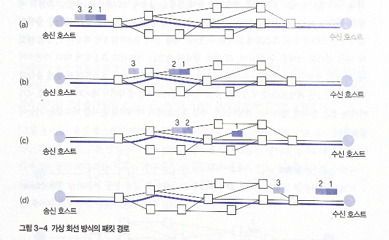
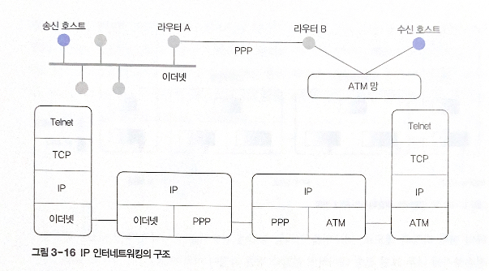

# 3. 네트워크 기술

# 라우팅 기능

라우팅 시스템: 데이터를 최종 목적지까지 올바른 경로로 중개하는 교환(Switching) 기능

라우팅 시스템의 종류

- 회선 교환 Circuit Switching
    - 연결형 서비스 제공
    - 아날로그 환경 음성 전화 서비스를 통해 발전
    - 고정 대역폭의 전송률 지원 → 다른 연결에서 이 대역을 사용할 수 없음
    - 네트워크 구조 단순
    - 하나의 연결에 대해 전송되는 모든 데이터가 동일한 경로로 라우팅됨
- 패킷 교환 시스템
    - 디지털 환경의 컴퓨터 네트워크에서 발전
    - 가변 대역의 전송률 지원
    - 네트워크 구조 복잡
    - 컴퓨터 네트워크 환경
    - 데이터를 미리 패킷 단위로 나누어 전송- 패킷을 기준으로 라우팅
- 프레임 릴레이
    - 데이터의 전송 속도 향상

## 1. 라우팅 시스템

- **전송 선로**를 이용해 데이터를 전송하는 방식
    - **전용 회선**: 송신 호스트와 수신 호스트가 전용으로 할당된 통신 선로로 데이터 전송
    - **교환 회선**: 전송 선로 하나를 다수의 호스트가 공유 (전화 서비스, 아날로그 공중 전화망), 교환 시스템의 중개가 필요

광케이블 기술 발전 → 물리적 전송 대역 용량에 비례하여 논리적인 다수의 연결 회선 지원

교환기: 특정 전송 선로에 데이터가 집중되지 않고 효율적인 경로를 선택할 수 있도록 하는 것

- **교환 회선** 이용 방식

### 회선 교환

통신하고자 하는 호스트가 데이터를 전송하기 전에 **연결 경로를 미리 설정**

모든 데이터가 같은 경로로 전달 

안정적 데이터 전송률 지원

### 메시지 교환

데이터를 전송하기 전에 경로를 설정하지 않고, 전송하는 메시지의 헤더마다 목적지 주소를 표현

교환 시스템-이전 교환 시스템에서 보낸 전체 메시지가 도착할 때까지 메시지를 일시적으로 버퍼에 저장

-모든 메시지가 도착하면 다음 교환 시스템에 전달

송신 호스트가 전송하는 전체 데이터가 하나의 단위로 교환 처리

### 패킷 교환

회선 교환과 메시지 교환의 장점을 모두 이용

전송할 데이터를 **패킷(Packet)이라는 일정 크기로 나누어 전송**

**각 패킷은 독립적은 라우팅 과정을 거쳐 수신 호스트에 도착**

회선 교환 방식과 같은 논리적인 연결 설정 개념을 도입한 가상 회선 방식 존재

장점

- 전송 대역의 효율적 이용
    - 패킷들이 동적인 방식으로 전송 대역 공유
- 호스트의 무제한 수용
    - **호스트를 무한히 수용 가능** = 네트워크 혼잡도가 높아져 패킷의 전송이 심화될 뿐, 고정 대역 할당x
- 패킷에 우선순위 부여 가능

단점

- 회선 교환 방식에 비해 더 많은 지연 발생
    - 전송 패킷을 라우터의 내부 버퍼에 보관하는 과정
    - 여러 종류의 대기 큐를 거치는 과정
- 각각의 패킷이 독립적인 경로로 전달 - 패킷마다 전송에 걸리는 시간 일정x

**지터(Jitter)**: 가변적인 전송 지연의 분포, 실시간으로 처리되는 응용 환경에서 중요

교환기에서 패킷 경로 선택 방식: 정적 경로, 동적 경로

## 2. 패킷 교환

네트워크 계층의 중요한 역할: 패킷의 전송 경로를 결정

### 가상 회선

**연결형 서비스** 지원

미리 설정된 논리적인 연결을 통해 전송되는 **모든 패킷의 경로가 동일**

송수신 호스트 사이 가상의 단일 파이프를 통해 송신 호스트가 입력단으로 패킷을 송신, 수신 호스트가 출력단에서 패킷을 수신

**모든 패킷이 동일 경로로 전송 - 패킷이 도착하는 순서=보낸 순서**

파이프: 한 프로세스의 출력을 다른 프로세스의 입력으로 사용할 수 있도록 프로세스를 연결하는 논리적 통신 매체

회선 교환 방식과 차이: 가상 회선 방식-데이터의 전송 단위가 패킷, 회선 교환 방식: 패킷 기능 지원x

### 데이터그램

**비연결형 서비스를 이용해 패킷을 독립적으로 전송**

미리 경로를 할당하지 않음

전송할 정보의 양이 적거나 상대적으로 신뢰성이 중요하지 않은 환경에서 사용

출발한 순서와 도착하는 순서가 무관 - 전송 경로의 속도는 네트워크 혼잡도에 따라 가변적

## 3. 프레임 릴레이

과거: 전송 패킷에 물리적인 전송 오류를 처리하기 위한 오버헤드 비트를 많이 추가 - 오류 처리 과정이 복잡

현대 네트워크: 물리적인 전송 오류가 발생할 확률이 매우 낮음 - 과도한 오류 제어 기능이 낭비 요소가 됨

→ **프레임 릴레이: 낭비 요소를 제거해 데이터 전송 속도를 향상**

패킷 교환 방식: 중간 라우터를 거치는 과정에서 데이터 링크 계층의 기능이 개별적으로 수행 → 긍정 응답 프레임을 반복 교환

프레임 릴레이 방식: 각 라우터의 개별 연결을 의미하는 홉 단위의 흐름 제어, 오류 제어 기능 수행x

전송 패킷의 양이 반으로 줄어든다.

한 호스트에서 수신한 프레임을 다른 호스트로 중개하는 역할만 O, 오류 복구/흐름 제어 기능 수행x

# 02 네트워크의 분류

기준: 네트워크의 크기

ex. 다중 처리 시스템 - 컴퓨터 시스템 내부 다수 프로세서 연결

컴퓨터 시스템의 내부 vs 컴퓨터 네트워크: **전송 매체의 성능**

시스템 버스: 빠른 속도, 높은 전송 대역 - CPU, 메모리, I/O 장치 등이 낮은 전송 지연으로 데이터를 전송할 수 있는 밀접한 연결 관계

네트워크: 전송 매체 속도가 상대적으로 느려 느슨한 연결 관계 지원

## 1. LAN

LAN(Local Area Network): 가까운 거리에 위치한 호스트로 구성된 네트워크(단일 건물, 학교)

MAN/WAN보다 호스트 간 간격이 가까워서 **브로드캐스팅 방식**으로 데이터 전송

호스트 사이의 물리적 거리가 가까울수록 데이터 전송 지연이 적고 전송 오류 발생 가능성 낮음

LAN: 수십 Mbps ~ 수Gps의 전송 속도 지원

- 구분: **구성 형태**(Topology)에 따라
    - 버스형
        - 공유 버스 하나에 여러 호스트를 직접 연결
        - **물리적으로 전송 매체를 공유** - 임의의 호스트가 전송한 데이터를 네트워크에 연결된 모든 호스트에 전송 (**브로드캐스팅** 방식)
        - **라우팅 기능이 필요 없음**: 헤더 정보에 포함된 수신 호스트 정보를 이용하여 수신 호스트만 데이터를 내부 버퍼에 보관, 나머지 호스트는 데이터를 버림으로써 특정 호스트만 데이터 수신
        - 각 호스트를 구분하는 호스트 주소 필요, 전송 데이터의 헤더에는 송수신 호스트의 주소를 포함하여 오류 제어, 흐름 제어에 필요한 정보 표기
        - 데이터 충돌 발생 가능(둘 이상의 호스트에서 데이터를 동시에 전송) - 사전 방지 방식, 사후 해결 방식
        - ex. 이더넷-사후 해결 방식
    - 링형
        - 전송 호스트의 연결이 **순환 구조**
        - 시계/반시계 방향으로 데이터 전송 - 미리 정해진 한쪽 방향으로만 전송
        - 특정 호스트에서 전송한 데이터는 링을 한 바퀴 돌아 송신 호스트로 되돌아옴 - 모든 호스트가 전송 데이터 수신(**브로드 캐스팅**)
        - 충돌 방지-**토큰**: 제어 프레임, 충돌 가능성 사전 차단
        - 네트워크에는 토큰이 하나만 존재 - 특정 시간에 데이터를 전송할 수 있는 호스트는 하나뿐: 충돌 가능성 차단

## 2. MAN

MAN(Metropolitan Area Network): LAN보다 큰 지역 지원

하드웨어, 소프트웨어는 LAN과 비슷하지만 연결 규모가 더 큼

근처에 위치한 여러 건물 / 한 도시에서의 네트워크 연결로 구성

- **DQDB**(Distributed Queue Dual Bus) - MAN을 위한 국제 표준안

전송 방향이 다른 두 버스로 모든 호스트를 연결하는 구조 지원

1. 분산 데이터 큐 유지
2. FIFO 기반의 공유 슬롯 방식 사용 (충돌 문제 해결, 슬롯 링 개념 변형)
3. ATM(Asynchronous Transfer Mode)과 호환이 가능하도록 53 바이트의 프레임 지원

## WAN

WAN: Wide Area Network

국가 이상의 넓은 지역 지원

브로드캐스팅 방식을 지원하기 어려움, 전송 매체의 길이가 길어지는 환경 고려

**라우팅 기능이 반드시 필요**

전송 매체를 이용해 호스트를 **일대일로 연결** 

라우팅 기능: 호스트 a ~ 호스트 e로 전송: 중간 호스트 c에서 라우팅 과정을 거침

연결의 수가 증가할수록 전송 매체를 많이 사용 - 비용이 많이 든다.

→ 총 연결 거리를 줄이면서 전체 호스트를 효율적으로 연결하도록 설계

스타형, 트리형, 완전형, 불규칙형 등 다양한 구조로 호스트 연결

# 03 인터네트워킹

라우팅 장비는 내트워크 내부에서 경로 선택 기능 수행

**인터네트워킹: 둘 이상의 서로 다른 네트워크를 연결하는 기능** 

조건: 연결되는 네트워크 차이를 분석, 전송 데이터를 적절히 중개, 프로토콜이 상이하거나 물리 계층에서 전송 매체의 특성이 다르면 이를 변환하는 기능 필요

2개의 네트워크 연결 장비-일반적으로 물리, 데이터 링크, 네트워크 계층의 기능 수행 (네트워크 계층까지의 기능을 수행하는 장비: 라우터)

- 분류: **수행 기능**에 따라
    - **리피터**
        - **물리 계층**의 기능 지원
        - 양쪽 단의 물리적인 특성이 같으면 한쪽 단에서 들어온 비트 신호를 증폭하여 다른 단으로 단순히 전달
        - 필요한 경우에 신호 변환 작업
    - **브리지**
        - **물리 계층**을 포함하여 **데이터 링크 계층**의 기능 지원
        - 한쪽 단에서 들어온 프레임의 MAC 계층 헤더를 다른 단의 MAC 계층 헤더로 변형해 전송 → **종류가 다른 LAN 연결 가능**
        - 송수신 호스트의 위치가 서로 다른 LAN에 속하면 **중개 기**능 수행
        - 리피터보다 LAN과 LAN 사이의 **불필요한 트래픽 발생 억제**(서로 다른 LAN에 속할 때만 중개 기능 수행)
    - **라우터**
        - 물리, 데이터 링크, 네트워크 계층 지원
        - **라우팅 기능** 수행: 여러 포트를 사용해 다수의 LAN 연결
        - 수신한 패킷을 해석해 적절한 경로로 전송하도록 경로 배정
        - **네트워크 전체 구조를 고려한 일반적인 라우팅 기능**

## 1. 브리지

데이터 링크 계층의 기능을 수행하는 일반 브리지 역할

물리 계층, MAC 계층의 기능 수행 + 이를 관리하는 자체 관리 소프트웨어

양쪽 LAN의 종류가 달라 한쪽 LAN의 헤더를 제거하고 다른쪽 LAN 헤더를 붙여줌

→ **MAC 헤더를 해석해 변환하는 기능 필요**

연결된 LAN의 종류마늠 MAC 계층과 물리 계층을 해석할 수 있어야 함

종류 구분 - 동작 방식

### 트랜스페런트 브리지

Transparent Bridge - **라우팅 기능이 투명**하게 보임, **사용자의 부담 없이** 이루어진다

사용자는 전송하는 프레임 헤더에 라우팅 정보 추가x, 필요한 **라우팅 과정은 브리지가 자동으로 수행**

설치 과정에서 하드웨어 조정, 소프트웨어의 변경, 주소, 라우팅 테이블 관련 사항 고려x

브리지의 수행 동작은 2중 1

1. 해당 프레임의 수신 호스트가 송신 호스트와 동일한 방향에 위치 - 중개 필요x 무시
2. 다른 방향에 위치 - 수신 호스트가 있는 방향으로 프레임 중개

(송수신 호스트가 동일한 방향에 있는지, 수신 호스트가 브리지의 어느 방향에 위치하는지 정보 필요)

- a→b : 같은 LAN에 위치, 중개 기능 필요x
- a→c: B1의 중개 필요
- a→e: B1의 중개 필요
- a→f: B1, B2의 중개 필요
- B2에서 송신 호스트: 2번 포트, 수신 호스트: 1번 포트 (ex. e) - 포트 1을 통해 LAN3으로 중개

라우팅 테이블과 같은 라우팅 정보가 필요함

**라우팅 테이블**

**트랜스페런트 브리지가 제대로 동작하기 위한 조건**

LAN이 동작하면서 자동으로 생성

1. 브리지에 전원: 라우팅 테이블의 내용이 비어 있음 - **플러딩(Flooding) 알고리즘**을 사용해 입력된 프레임을 브리지의 모든 포트 방향으로 전달 (프레임이 들어온 방향 제외)
2. 플러딩 알고리즘의 동작 과정에서 브리지에 입력된 프레임의 송신 호스트 주소를 근거로 송신 호스트가 몇 번 포트에 연결되었는지 알 수 있음 (송신 호스트 주소와 포트 번호를 비교함)
3. 프레임의 송신 호스트 주소와 포트 번호의 정보를 라우팅 테이블에 반영: **역방향 학습(Backward Learning) 알고리즘**
4. 호스트의 위치가 바뀌면 라우팅 테이블 내용 새로 수정

**스패닝 트리**

네트워크에 **이중 경로**가 존재하면 잘못된 라우팅 정보를 얻게 됨

→ 이중 경로가 존재하지 않도록 네트워크를 설계

순환 구조가 존재하면 **네트워크의 논리적 연결 상태를 비순환 형태로 간주 -**  역방향 학습 알고리즘이 올바르게 동작하도록 해야 함

**스패닝 트리(Spanning Tree): 네트워크의 비순환 구조**

임의의 브리지를 트리 구조의 루트로 지정 → 브리지가 고유 번호가 가장 낮은 브리지를 루트로 선정 → 최단 경로 트리를 구성하는 방식으로 LAN 구축

### 소스 라우팅 브리지

트랜스페런트 브리지: 공유 버스의 CSMA/CD(Carrier Sense Multiple Access / Collision Detection_ 방식, 토큰 버스 방식에 사용

단점: 효율적이지 못함

소스 라우팅 브리지(Source Routing Bridge) : 링 구조의 네트워크에서 사용

프레임이 수신 호스트까지 도달하기 위한 라우팅 정보를 송신 호스트가 제공

= 송신 프레임 내부에 **수신 호스트까지 도달하기 위한 모든 경로를 기술** - **라우팅 정보가 프레임 자체에 포함**

## 2. IP 인터네트워킹

인터넷 환경 IP 프로토콜- iP 인터네트워킹 지원 - 송수신 호스트 간의 여러 네트워크 인터페이스를 거쳐 패킷을 전달

라우터 A, 라우터 B를 이용해 이더넷과 ATM(상이한 인터넷 인터페이스) 간의 연결 구조 가능

하위의 데이터 링크 계층이 다름 → 라우터: 경로 선택 + 프로토콜의 프레임 구조 변환 기능 수행

라우터: **IP 프로토콜 기능 지원**, 양쪽 **MAC 계층의 프레임 구조**가 다를 때 **변환**하는 기능

송수신 호스트: TCP/IP 응용 프로그램을 이용해 통신

전송되는 데이터가 특정 MAC 계층에서 너무 크면 **전송 데이터의 분할과 병합** 과정

## 3. 인터넷 라우팅

라우터: 수신된 IP 패킷을 최적의 경로로 전달 → 인터넷의 전체 구성과 현재 상태에 대한 정보를 활용해 경로 선택

라우팅 방식: 고정 경로 배정, 적응 경로 배정

### 고정 경로 배정

**송수신 호스트 사이에 고정불변의 경로 배정**

단점: 트래픽 변화에 따른 동적 경로 배정 불가능

트래픽을 미리 측정하여 적절히 배정 → 간단, 효율적 라우팅

경로 배정: 네트워크를 연결하는 선로의 전송 용량이나 네트워크 간의 데이터 전송량을 측정

라우팅 테이블: 목적지 네트워크의 주소와 해당 목적지를 향하는 경로에 있는 라우터의 주소

### 적응 경로 배정

**네트워크 연결 상태가 변하면 패킷의 전달 경로에 반영**

요소: ① 특정 네트워크/라우터가 정상적으로 동작x, ② 혼잡 발생

단점: 경로 결정 과정 복잡 → 라우터 부담 증가 → **트래픽 증가**

### 자율 시스템

다수의 라우터로 구성, 서로 공통의 라우팅 프로토콜을 사용해 정보 교환

내부 라우팅 프로토콜: 자율 시스템 내부에서 사용, 라우터들끼리 라우터 정보 교환 ex. RIP, OSPF

외부 라우팅 프로토콜: 자율 시스템들 간에 사용하는 라우팅 프로토콜 (서로 다른 자율 시스템끼리 사용하는 알고리즘과 라우팅 테이블 정보의 구조가 다를 수 있음), ex. BGP

# 04 서비스 품질

서비스 품질: 데이터를 어느 정도로 신뢰성 있게 전송하는지 의미

기준: 전송 과정에서의 데이터 변형, 데이터 분실, 전송 지연, 지연 값의 일관성(지터) 등

## 1. QoS 개요

QoS(Quality of Service)

QoS 매개변수

- **연결 설정 지연**
    - Connection Establishment Delay
    - 연결 설정을 위한 request 프리미티브 발생과 confirm 프리미티브 도착 사이의 경과 시간
    - 네트워크 혼잡도 등의 영향
- **연결 설정 실패 확률**
    - Connection Establishment Failure Probability
    - 임의의 최대 연결 설정 지연 시간을 기준으로 연결 설정이 이루어지지 않을 확률
- **전송률**
    - Throughput
    - 임의의 시간 구간에서 초당 전송할 수 있는 바이트 수
    - 양방향 값이 다를 수 있으므로 별개로 다루어져야 함
    - 연결 설정 구간의 네트워크 트래픽에 영향 받음
- **전송 지연**
    - Transit Delay
    - 송신 호스트가 전송한 데이터가 수신 호스트에 도착할 때까지 경과한 시간
    - 양방향이 따로 다루어짐, 개별 패킷별로 전송 지연 값이 다를 수 있다
- **전송 오류율**
    - Residual Error Rate
    - 임의의 시간 구간에서 전송된 총 데이터 수와 오류 발생 데이터 수의 비율
- **우선순위**
    - Priority
    - 다른 데이터 전송보다 먼저 처리함
    - 우선순위가 높을 수록 좋은 서비스

## 2. 인터넷에서의 QoS

**IP 프로토콜**: 원칙적으로 모든 패킷에 대해 동일한 기준을 적용해 데이터를 라우팅

데이터의 도착 순서, 100% 수신 보장x → 버퍼를 사용해 문제 해결 후 응용 계층에 데이터 전달

전송 데이터 분류

- 영상 데이터: 대용량의 실시간 전송 필요, 전송 오류 문제에 대해 관대
- 일반 컴퓨터 데이터: 실시간 기능x, 전송 오류에 민감

단점: 우선순위 조절 기능x

IP 프로토콜에서 QoS 지원 조건

- 각 패킷을 서로 다른 QoS 기준으로 구분
- 라우터에서 이를 처리
- 사용하는 대역의 요구 조건에 따라 패킷 구분
- 네트워크 자원의 할당도 그에 부합