# 4. 데이터 전송

# 01 전송 방식

컴퓨터 네트워크: 독립적으로 실행되는 호스트들을 연결해 하나의 통신망을 구성한 것

효과

- 정보 공유
    - 컴퓨터 하드웨어 + 각 호스트에서 제공하는 논리적인 정보 공유
- 병렬 처리에 의한 성능 향상
    - 병렬 처리 예: 하나의 공유 시스템 버스에 다수의 메인 프로세서 장착, I/O 장치의 처리 속도를 향상시키기 위해 I/O 전용 프로세서 설치
    - 시스템이 수행할 작업을 분할해 동시에 처리함으로써 처리 시간을 단축
- 중복 저장에 따른 신뢰성 향상
    - 클라우드 서비스

## 1. 전송과 라우팅

송신 호스트가 수신 호스트에 데이터 전달: 전송과 교환 과정 필요

- **교환**: 전달 경로가 둘 이상일 때 라우터에서 데이터를 어느 방향으로 전달할지를 선택하는 기능, 컴퓨터 네트워크-라우팅
- **전송**: 특정한 물리 매체에 의하여 일대일로 직접 연결된 두 시스템 간의 신뢰성 있는 데이터 전송 보장 (**라우팅 개념 포함X**)

### 라우팅 개요

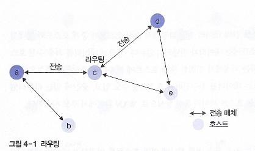

호스트 a에서 d로 데이터 전송

1. a-c 간의 직접 연결에 의한 **전송**
2. c에서의 올바른 경로 선택= **라우팅**
3. c-d 간의 직접 연결에 의한 **전송**

**라우터**: 올바른 경로를 선택하기 위해 라우팅 기능을 수행하는 호스트

### 전송 방식의 종류

기준: 네트워크에 연결된 호스트의 지리적 분포에 따라 구분, 데이터 전송·라우팅 기술로 분류

지리적 분류: LAN, MAN, WAN

데이터 전송·라우팅 기술: 점대점 방식, 브로드캐스팅 방식

- **점대점 방식**
    - 호스트 간의 데이터 전달 과정에서 송신 호스트가 중개 호스트와 일대일 연결
    - 인접한 중개 호스트에 데이터를 전송하는 과정을 단계적으로 반복
    - WAN 환경에서 주로 사용
- **브로드캐스팅 방식**
    - 공유 전송 매체 하나에 여러 호스트를 연결 - 네트워크에 연결된 모든 호스트에 데이터 전송
    - 라우팅 기능 필요 X
    - LAN처럼 지리적으로 가까운 호스트 사이의 통신에 사용

## 2. 점대점 방식

**라우팅 호스트가 송수신 호스트의 중간에 위치**

스타형, 링형, 완전형, 불규칙형

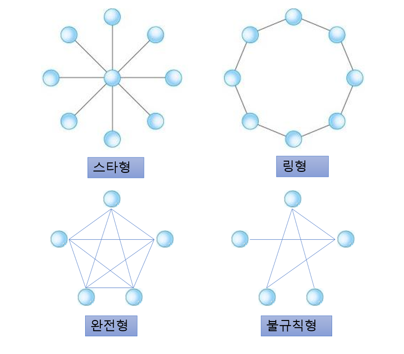

[https://copycode.tistory.com/53](https://copycode.tistory.com/53)

통신하고자 하는 두 호스트가 직접 연결 - 라우팅 필요X

그렇지 않은 경우 중간 호스트들의 라우팅 기능으로 최적의 경로 선택

**특징**

- 전체 연결 수가 많아지면 성능 면에서 유리
- 전송 매체의 길이가 증가해 비용이 많이 든다
- 연결 개수가 적어지면 전송 매체를 더 많이 공유해 특정 구간에서 네트워크 혼잡도 증가

### 스타형

중앙에 있는 하나의 중개 호스트 주위로 여러 호스트를 일대일로 연결

데이터 송수신을 위해 반드시 **중앙의 중개 호스트를 거쳐야 하는 구조**

중앙 호스트의 신뢰성과 성능이 중요

**중앙 호스트가 중개 기능 독점**

- **트리형 구조**: 스타형 구조가 다단계로 확장, 네트워크를 무한대로 펼칠 수 있음
    - 장점: 모든 데이터가 중앙 호스트를 중심으로 라우팅 - 중개 과정이 간단
    - 단점: 중앙 호스트에 문제가 바생하면 전체 네트워크 동작에 영향을 줌

### 링형

호스트의 연결이 **순환 고리 구조**

모든 전송 데이터는 반드시 링을 한 바퀴 순환 → **브로드캐스팅** 방식 지원

호스트가 일대일로 직접 연결되기 때문에 점대점 방식에도 포함

송수신 호스트 간의 거리가 멀수록 중개 호스트의 개수가 증가

**모든 호스트가 데이터 전송과 라우팅 기능을 동시에 수행**

실제 환경-데이터를 한 방향으로만 전달: 처리 과정이 단순해져 호스트의 개수를 줄이는 것보다 유리함

- 토큰: 데이터 충돌 발생 방지
    - 호스트가 데이터를 전송하기 위해 토큰을 꼭 확보
    - 하나의 네트워크의 하나의 토큰이 순환
    - 데이터 전송 기회가 모든 호스트에 동등하게 부여

단점: 한 호스트가 고장나면 전체 네트워크가 동작하지 않을 수 있음

→ 특정 호스트를 관리 호스트로 지정하여 네트워크 점검

### 완전형

네트워크의 모든 호스트가 다른 모든 호스트와 일대일로 직접 연결

호스트끼리 서로 공유하지 않는 전용 전송 매체로 직접 연결 - 라우팅 기능 필요 X

단점: 전송 매체의 개수가 증가하면 비용 측면에서 비효율적

### 불규칙형

전송 매체에 의한 연결 구조를 특정 패턴으로 분류X

여러 환경 요인에 의해 연결 구조가 결정

- 두 호스트 사이에 통신 트래픽이 많으면 직접 연결, 적으면 중개 과정을 거쳐서

## 3. 브로드캐스팅 방식

특정 호스트가 전송한 데이터가 **네트워크에 연결된 모든 호스트에 전달**

-링형 같은 점대점 방식도 포함

데이터를 수신 호스트까지 얼마나 효율적으로 전달하는지가 중요

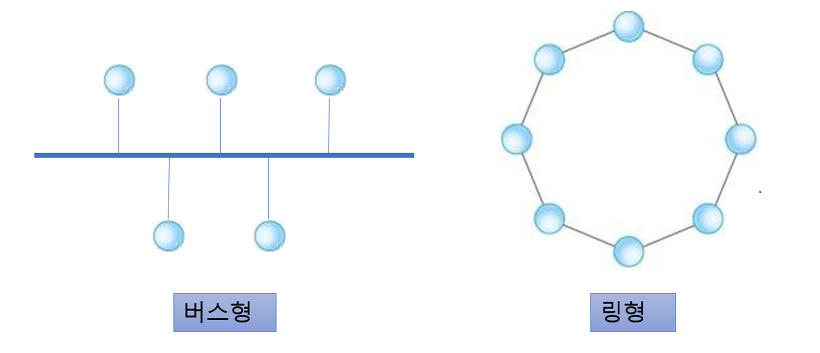

### 버스형

[https://copycode.tistory.com/53](https://copycode.tistory.com/53)

모든 호스트가 하나의 전송 매체 공유 - 전송 데이터를 모든 호스트에서 수신

**전송되는 데이터 내에 송수신 호스트의 주소를 표시하는 기능 필요**

데이터 충돌 문제 해결

- 호스트의 전송 권한 제한 (사전 예방): 시간대를 다르게 지정 or 토큰 방식
- 충돌 사후 해결: 오류를 감지하고 이를 재전송하는 오류 복구 과정 (ex. 이더넷)

### 링형

전송 데이터가 링 주위를 특정 방향으로 순환하면서 전달

수신 호스트가 아닌 호스트는 데이터를 수신하지 않고 통과

수신 호스트: 전송 데이터를 자신의 내부 버퍼에 보관, 데이터는 계속 순환

전송 데이터 내부에 송수신 호스트의 주소 정보 필요

데이터 송신-전송 토큰이 필요

과정: 토큰을 확보한 송신 호스트가 데이터 전송 - 링을 한 바퀴 순환한 데이터가 원래의 송신 호스트로 되돌아옴 - 데이터를 링에서 회수함으로써 과정 종료, 토큰을 링에 돌려줌

## 4. 멀티포인트 통신

기본 형식: 유니캐스팅 Unicasting (두 호스트 사이의 데이터 전송) - 텔넷, FTP, 웹 검색

멀티포인트 서비스: 일대다/다대다 형식 - 화상 회의, 원격 교육, 인터넷 채팅, 메타버스

**유니포인트**: 하나의 송신 호스트가 수신 호스트 하나와 연결

**멀티포인트**: 하나의 송신 호스트가 다수의 수신 호스트와 연결

**유니캐스팅**: 송신 호스트가 한 번의 전송으로 수신 호스트 하나에 데이터 전송

**멀티캐스팅**: 송신 호스트가 한 번의 전송으로 다수의 수신 호스트에 전송

### 멀티포인트 유니캐스팅

유니캐스팅: 두 호스트 사이의 일대일 통신만 지원

일대다 통신을 위해 멀티포인트 유니캐스팅 방식 사용

장점: 송수신 호스트 사이의 흐름 제어와 수신 호스트의 응답 기능 및 재전송 기능을 구현하기 좋음

단점: (멀티포인트 유니캐스팅) 수신 호스트의 수가 많아지면 성능 문제

### 브로드캐스팅

송신 호스트가 전송한 데이터가 네트워크에 연결된 모든 호스트에 전송

수신 데이터를 받아들일지 폐기할지는 수신 호스트가 목적지 주소를 근거로 결정

단점: 호스트 수가 많을수록 네트워크 트래픽이 급격히 증가 - 특정 서브넷 내에서 이용

전송 방식: 특정한 브로드캐스팅 주소로 데이터를 전송 - 네트워크 장비에서는 브로드캐스트 주소로 전달된 패킷을 복사하여 네트워크 전체로 전송

### 멀티캐스팅

프로토콜 자체에서 일대다 전송 기능을 구현 - **연결 설정 요구 한 번으로 지원** (멀티포인트 유니캐스팅-연결 설정 요구가 n번 필요)

송신 호스트의 전송 요구 한 번으로 모든 수신 호스트에 데이터 전달

예시: 비디오 오디오 서비스, 화상 회의, 다수 고객을대상으로 하는 모든 형태의 서비스(인터넷 뉴스/주식 등)

멀티캐스트 그룹을 생성하고 관리하는 기능이 필요

라우터에서 멀티캐스트 그룹 주소를 인식, 다수의 수신 호스트에 중개 - 멀티캐스트 트래픽 처리 기능

# 02 오류 제어

## 1. 전송 오류의 유형

전송 서비스에서 오류 복구 기능을 제공하기 위해 이용하는 기본 기능

- **수신 호스트의 응답 프레임**
    - 전송된 데이터 프레임의 일부가 깨지는 **프레임 변형 오류 확인 →** 수신 호스트가 송신 호스트에 응답 프레임 전송 → 데이터 프레임 재전송 요구
    - 응답 프레임 종류: 긍정 응답 프레임, 부정 응답 프레임
- **송신 호스트의 타이머 기능**
    - **프레임 분실 오류** → 송신 호스트 주도로 오류 복구
    - 일정 시간 내에 수신 호스트로부터 긍정 응답 프레임이 없으면 타임아웃 기능을 동작시켜 데이터 프레임 재전송
- **순서 번호 기능**
    - 수신 호스트가 보낸 **긍정 응답 프레임 분실** - 송신 호스트가 이를 인지할 수 없음
    - 타임아웃 기능에 의해 재전송하면 수신 호스트가 데이터 프레임을 중복 수신
    - 수신 호스트가 중복 데이터 프레임을 가려내기 위해 프레임 내부에 **순서 번호** 기록
- **오류 검출 코드**
    - 데이터 프레임은 오류 제어를 위한 코드 정보 제공
    - 오류 제어 정보: 오류 감지 기능만 하는 코드 + 오류가 발생한 프레임을 복구하는 코드

### 정상적인 전송

오류 없이 데이터 전송 → 긍정 응답 프레임 회신

### 프레임 변형 오류

데이터 프레임이 수신 호스트에 도착했으나, 전송 과정에서 프레임의 내용이 변형되는 오류

수신 호스트가 송신 호스트에 부정 응답 프레임 전송

송신 호스트가 원래의 데이터 프레임 재전송

cf. 부정 응답 프레임을 사용하지 않는 프로토콜: 송신 호스트의 타임 아웃 기능에 따라 복구 기능

### 프레임 분실 오류

송신 호스트가 전송한 데이터 프레임이 전송 과정에서 사라짐

수신 호스트는 회신x

송신 호스트도 응답 프레임을 회신받을 수 없어 응답 프레임을 무한정 기다림

→ 송신 호스트 주도로 타임아웃 기능에 따라 재전송

## 2. 순서 번호

데이터 링크 계층의 오류 복구 기능이 수행되는 과정에서 동일한 데이터 프레임이 수신 호스트에 중복해 도착

순서 번호: 오류 없이 수신된 중복 데이터 프레임을 가려냄

일반적으로 0부터 순차적으로 증가하는 일련번호

프레임 단위/전송 데이터의 바이트 단위로 번호 부여

### 필요성

수신 호스트가 동일한 데이터 프레임을 두 번 전송했느지, 서로 다른 2개의 데이터 프레임을 연속 전송했는지 구분하기 위해서 

### 순서 번호 기능

데이터마다 순서 번호룰 부여하면 수신 호스트는 순서 번호에 근거하여 판단 가능

긍정 응답/부정 응답 프레임에도 순서 번호 기능 O

## 흐름 제어

데이터 링크 계층 - 데이터 프레임의 전송량을 조절 

흐름 제어: 송신 호스트는 수신 호스트가 감당하 수 있을 정도의 전송 속도를 유지하며 데이터 프레임 전송

송신 호스트가 수신 호스트보다 아주 빨리 데이터를 전송하는 경우에 필요함

흐름 제어 기능이 없다면, 전송 매체를 통해 올바르게 도착한 프레임이 분실될 수 있음

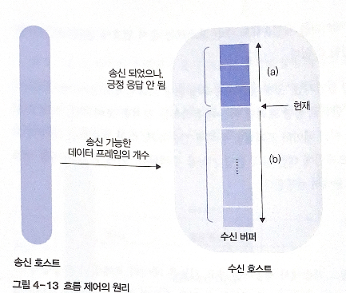

(a): 수신된 데이터 프레임이 보관된 영역

(b): 비어 있는 영역

(a) 프레임에 대한 긍정 응답 완료 → ‘현재’ 기준점이 상승

송신 호스트로부터 데이터 프레임 도착 → ‘현재’ 기준점 하강

# 03 프레임 구조

데이터 링크 계층: 전송 데이터를 프레임 단위로 나누어 처리

## 1. 문자 프레임

프레임 내용이 문자로 구성, 문자 데이터를 전송할 때 사용

8비트 단위(또는 ASCII 문자 코드)로 동작

그림, 영상 같은 멀티미디어 데이터는 전송 불가

### 프레임 구조

프레임 단위 구분을 위해 프레임의 앞뒤에 ASII 코드의 특수문자 이용

프레임의 시작 위치에 DLE · STX 문자 추가

끝나는 위치에 DLE · ETX 문자 추가 → 프레임의 한 단위를 구분

FRAME DATA에는 프로토코렝서 정의한 제어 정보와 전송 데이터 포함

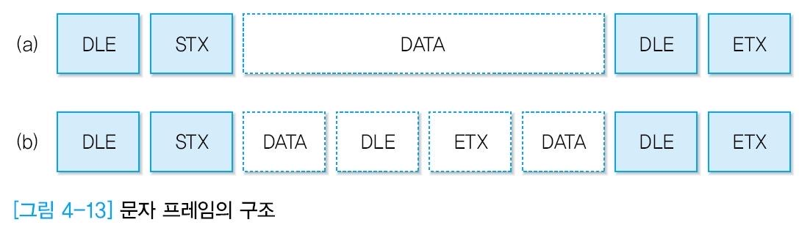

문제점: 사진의 (b)처럼 FRAME DATA에도  DLE · STX / DLE · ETX 문자 포함 가능 → 프레임의 시작과 끝 위치를 정할 때 혼선

[https://naon.me/posts/til81](https://naon.me/posts/til81)

### 문자 스터핑

Character Stuffing: 문자 프레임 내부의 전송 데이터에 DLE 문자가 포함되면서 발생하는 혼란을 예방

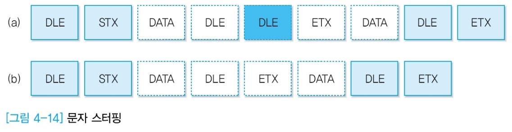

(a)처럼 송신 호스트가 전송하는 데이터를 미리 조작 → FRAME DATA 내부에 DLE문자가 있으면 DLE 문자 다음에 DLE 문자 하나를 강제로 추가함

DLE 문자가 연속해서 두 번 나타나면 두 번째 DLE는 강제로 추가된 문자라고 판단 

→ 네트워크 계층에 데이터를 전송하기 전에 (b) 처럼 DLE 하나를 제거함

**제어 코드에는 어떤 경우에도 DLE문자가 연속해서 두 번 발생하지 않음**

## 2. 비트 프레임

문자 단위의 가정을 없애고 임의의 비트 패턴 데이터를 전송

플래그(Flag): 특수하게 정의된 비트 패턴(01111110), 플래그를 사용해 프레임 단위 구분

비트 프레임 방식에도 플래그와 동일한 비트 패턴이 포함될 수 있음 

### 프레임의 구조

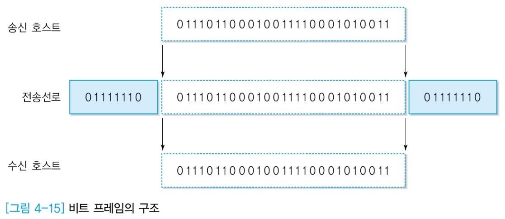

데이터를 전송하기 전에 프레임의 좌우에 플래그를 추가 → 수신 호스트는 이 플래그를 제거한 후 전송 데이터를 상위 계층에 전달

### 비트 스터핑

데이터 내용에 값이 1인 패턴이 연속해서 5번 발생하면 강제로 0을 추가해 전송 (**플래그는 1이 연속해서 6개 나오기 때문에 플래그 패턴이 발생하는 것을 사전 차단**)

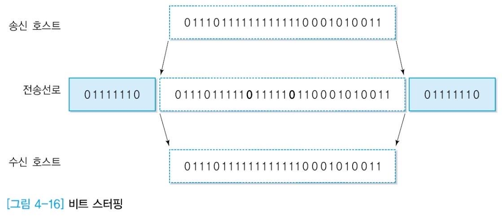
# 04 오류 검출 기법

오류 극복 방식: 오류 검출 코드(수신 호스트가 검출), 오류 복구 코드(수신 호스트가 검출+복구)

## 1. 오류 검출

일반적으로 오류 복구 코드 사용x, 재전송 방식을 이용해 오류 복구

= 역방향 오류 복구(BEC, Backward Error Correction / ARQ, Automatic Repeat reQuest)

수신한 프레임에 오류가 있는지 판단하는 방식: 오류 검출 코드

### 패리티 비트

Parity Bit = 1바이트 구조에서 7비트의 ASII 코드를 제외한 나머지 1비트

전송 과정에서 1비트 오류를 검출하기 위한 것, 패리티 비트를 포함해 1의 개수가 짝수나 홀수 개가 되도록 함

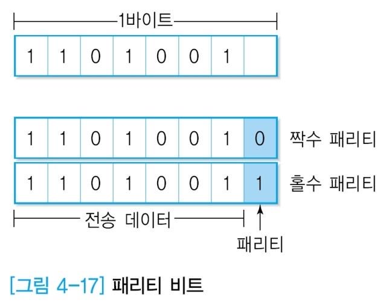

[https://naon.me/posts/til82](https://naon.me/posts/til82)

- 짝수 패리티 방식(Even Parity): 데이터 끝에 패리티 비트를 추가해 전체 1의 개수를 짝수로 만들어줌 → 수신 호스트는 1의 개수가 홀수이면 전송 오류로 판단
- 홀수 패리티 방식(Odd Parity): 1의 개수를 홀수로 만듦 - 수신 호스트도 1이 홀수 개인지 판단

### 블록 검사

패리티 방식-짝수 개의 비트에서 오류가 발생하면 오류가 검출되지 않음

다수의 비트에서 오류 검출 방법

Block Sum Check

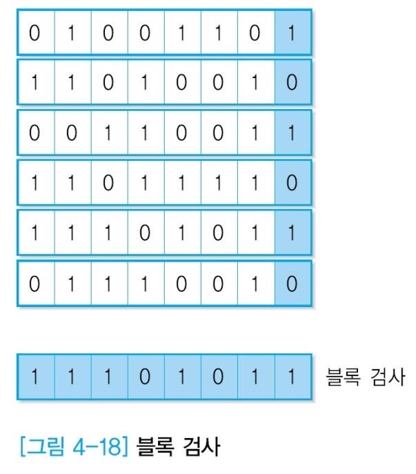

[https://naon.me/posts/til82](https://naon.me/posts/til82)

여러 개의 바이트를 하나의 블록으로 구성한 후 교차 검사 → 블록 데이터의 수평과 수직 방향에 모두 패리티 비트를 둠으로써 짝수 개의 오류 검출 가능

문제점

- 오류 검출을 위한 오버헤드가 크다
- 수평과 수직 방향에서 모두 사각형 형태로 짝수 개의 데이터 오류가 발생하면 검출 X

## 2. 다항 코드

CRC(Cyclic Redundancy Code), 다항 코드(Polynomial Code): 네트워크 프로토콜에서 가장 많이 사용

버스트 에러(Burst Error): 특정 위치에서 집중적으로 발생 - 다항 코드는 버스트 에러 검출 확률이 높음

### 생성 다항식

계수가 0과 1인 다항식 형태 기반

100101 = $1 \times x^5 + 0 \times x^4 + 0 \times x^3 + 1 \times x^2 + 0 \times x^1 + 1 \times x^0 = x^5 + x^2 + 1$ 

데이터가 m비트의 M(x)라면 데이터 전송 과정에서 n+1비트의 생성 다항식 G(x)를 사용해 오류 검출 코드인 n비트의 체크섬을 생성하여 오류 제어 기능 수행

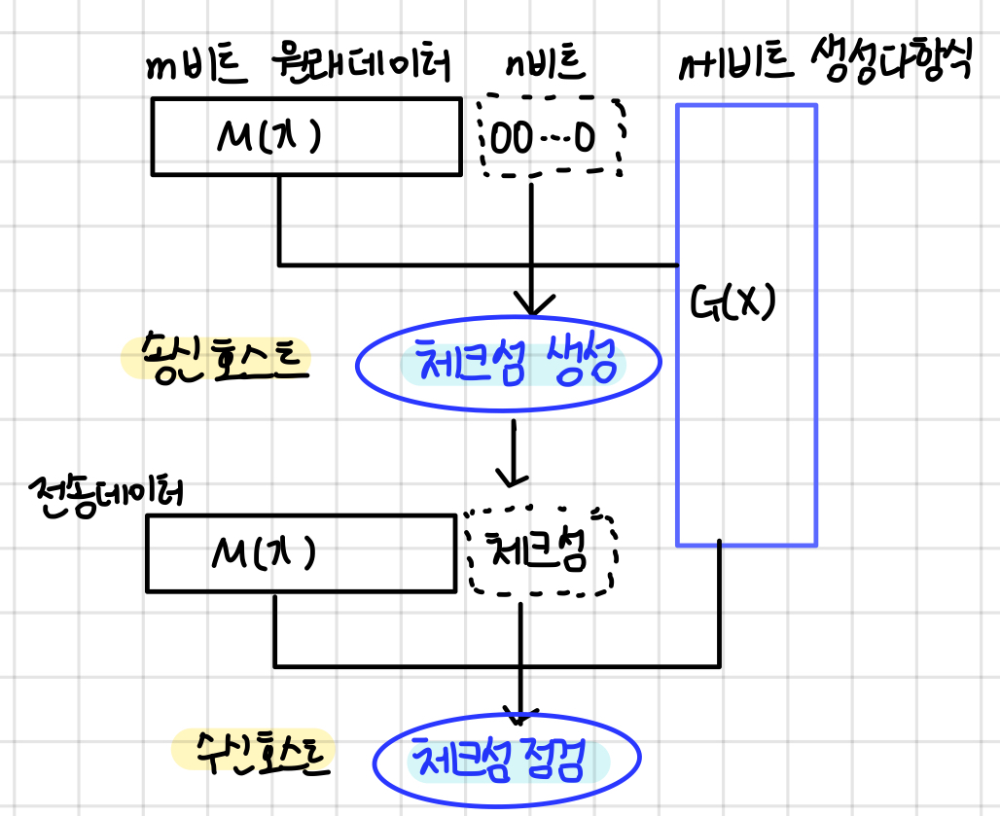

수신 호스트는 체크섬 점검

m+n비트의 데이터를 생성 다항식 G(x)로 나누는 연산 수행

나머지가 0이면 전송 오류가 없음, 0이 아니면 체크섬

- 국제 표준 생성 다항식
    - CRC-12 : $x^{12} + x^{11} + x^5 + x^2 + x^1 +1$
    - CRC-16 : $x^{16} + x^{15} + x^2 +1$
    - CRC-CCITT : $x^{16} + x^{12} + x^5 +1$

### 체크섬

다항 코드 방식을 이용한 체크섬의 계산 방식

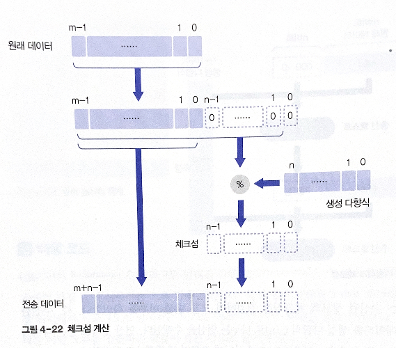

1. 송신 호스트는 M(x)를 G(x)로 나누어 체크섬 정보를 얻음
    - 나누기 연산 과정: 원ㄹ ㅐ데이터 뒤에 나머지를 보관할 n비트의 공간을 미리 확보하고 연산 수행
    - 연산에서 얻은 나머지=체크섬
2. 체크섬을 원래 데이터의 뒤에 추가해 수신 호스트에 전송

다항 연산: 모듈로-2 방식 (덧셈의 자리 올림이나 뺄셈의 자리 빌림 과정x, 덧셈과 뺄셈은 배타적 논리합(Exclusive OR) 연산과 동일 (두 값이 다르면 1, 같으면 0)

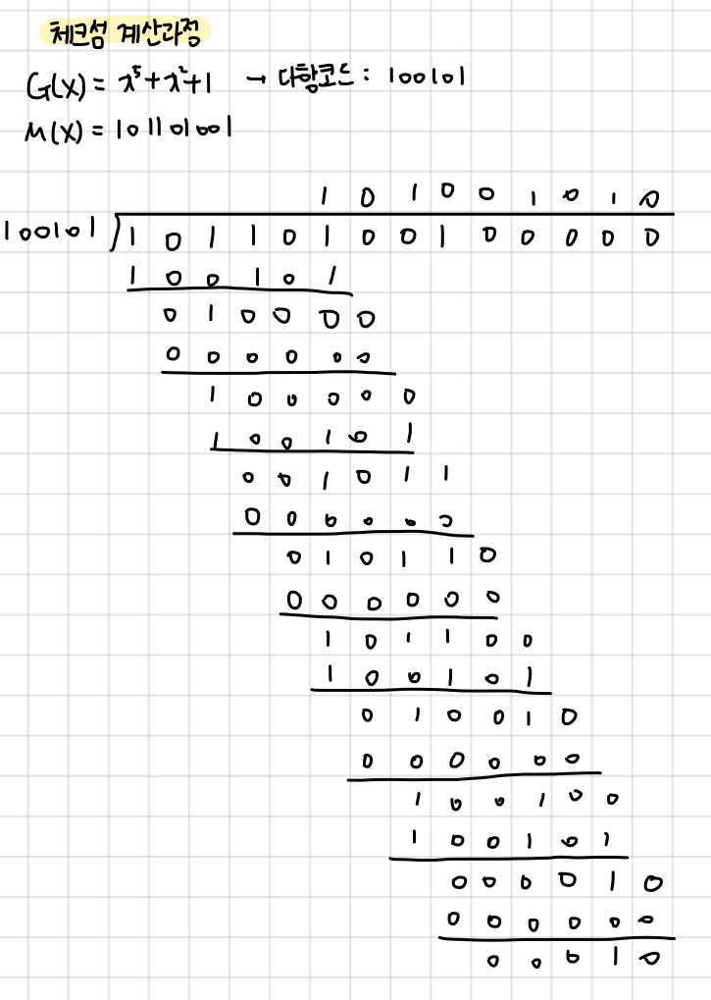

나머지: 00010

→ 전송 데이터: 기존 데이터 + 나머지 = 101101001**00010**

수신 호스트: 수신된 데이터 101101001**00010** 를 생성 다항식 100101로 모듈로-2 나누기 연산 수행

→ 나머지가 0이면 전송 오류가 없음, 0이 아니면 오류가 발생