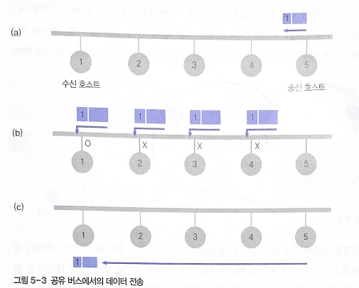
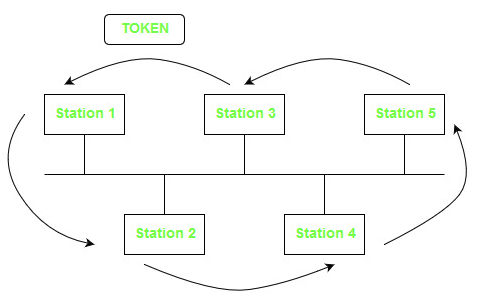
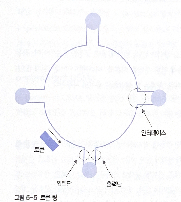
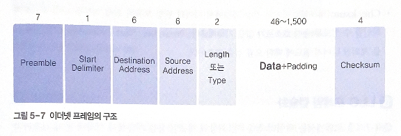
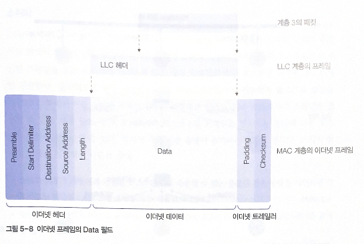
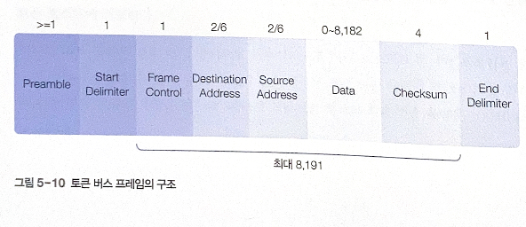
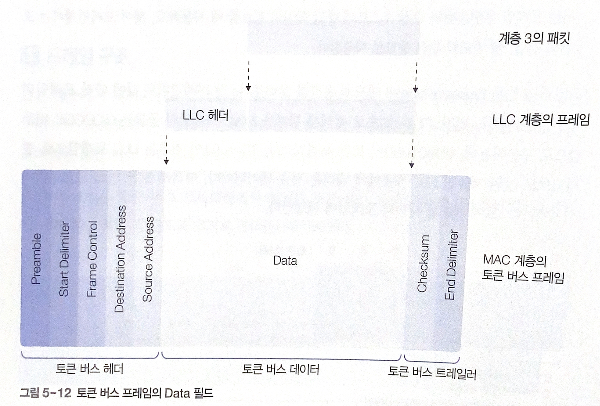

# 5. MAC 계층

# 01 IEEE 802 시리즈

## 1. MAC과 LLC 계층

LAN 환경 - 데이터 링크 계층의 기능을 LLC 계층과 MAC 계층으로 나누어 처리

LLC: 데이터 링크 계층의 기본 기능

MAC: 물리적인 전송 선로의 특징과 매체 간의 연결 방식에 따른 제어 부분

### MAC 계층

MAC(Medium Access Control) 계층: 전송 선로의 물리적 특성 반영

LAN의 종류에 따라 특성 구분: 전송 방식, 호스트 연결 구조, 유무선 환경

종류: CSMA/CD 방식, 토큰 링 방식

**이더넷 :** CSMA/CD 방식 지원 (공유 버스를 이용해 호스트 연결)

### LLC 계층

Logical Link Control 계층: WAN 환경의 데이터 링크 계층과 기능 유사

WAN 환경의 데이터 링크 계층과 기능이 유사

송수신 호스트 사이의 프레임 전송 과정에서 물리적인 오류가 발생하면 이를 복구

## 2. LAN 표준안

국제 표준화 단체 IEEE: 데이터 링크 계층과 관련된 LAN 표준안 연구 결과를 IEEE 802 시리즈로 발표

IEEE 802.1: 관련 표준안 전체 소개, 인터페이스 프리미티브에 대한 정의

IEEE 802.2: LLC 프로토콜의 정의

IEEE 802.3~: 물리 계층과 MAC 계층에 대한 내용

IEEE 802.3: CSMA/CD 방식 (이더넷)

IEEE 802.4: 토큰 버스 방식

IEEE 802.5: 토큰 링 방식

### CSMA/CD

다중 접근 채널 방식을 이용하여 공유 매체에 프레임을 전송하는 방식은 데이터 충돌 가능성이 항상 존재

CSMA/CD: **충돌을 허용하는 방식**, 충돌이 발생한 후에 문제 해결

Carrier Sense Multiple Access / Collision Detection 

충돌로 깨진 프레임을 복구해야 하므로 프레임을 송신한 호스트에서 **충돌을 감지하는 기능이 반드시 필요**

충돌 자주 발생 > 재전송 많이 이루어짐 > 네트워크의 전체 성능이 떨어짐

공유 매체의 길이가 길수록 프레임의 전송 지연 증가 > 충돌 발생 가능성 높아짐

(a)에서 호스트 5가 프레임을 전송: 전송하기 전에 다른 호스트가 공유 버스를 사용하고 있는지 확인

버스가 사용x > 전송 프레임을 공유 버스에 보냄 > (b)처럼 브로드캐스팅 방식으로 프레임 전송

이 과정에서 다른 호스트가 동시에 프레임 전송을 시도하면 충돌 발생 → 이 부분 처리 필요

전송 과정 중 충돌이 발생 → 공유 버스의 물리적인 기능으로 이를 인지, 각 호스트에 충돌을 통지하는 기능 필요

### 토큰 버스

물리적으로 보면 공유 버스 구조로 연결되지만, 논리적인 프레임 전달은 링 구조

데이터 프레임 전송이 호스트 사이에 순차적으로 이루어지도록 **토큰이라는 제어 프레임 사용**

데이터 프레임을 전송하기 위해 토큰을 확보해야 함

토큰을 획득 > 데이터 전송 > 데이터 전송 완료, 이웃 호스트에 토큰을 넘겨줌

*호스트의 이웃 순서: 각 호스트의 고유 번호와 관련

충돌 발생은 원천적으로 차단

공유 버스는 토큰 프레임과 데이터 프레임을 물리적으로 전송하는 수단만 제공

### 토큰 링

대기 모드: 입력단으로 들어온 비트를 출력단으로 즉시 보냄 - 네트워크의 동작에 영향x

전송 모드: 호스트가 토큰을 획득해 데이터 프레임을 전송할 수 있는 권한을 보유한 상태

네트워크가 송신 호스트의 중개를 거쳐서 연결

송신 호스트는 데이터 프레임을 출력단을 통해 링으로 내보낼 수 있음 → 링을 한 바퀴 순환 (브로드캐스팅)

송신 호스트가 전송한 프레임이 링을 한 바퀴 돈 후 송신 호스트에 되돌아오도록 설계

데이터 프레임의 수신 호스트: 해당 프레임을 수신, 프레임 내부의 특정 위치에 올바로 수신했다고 표시

송신 호스트는 프레임이 올바로 전송되었음을 확인, 데이터 프레임 호수, 토큰 프레임을 링에 반환

# 02 CSMA/CD

IEEE 802.3: 1-persistent CSMA/CD 방식의 LAN 환경에 관해 규정한 표준안

## 1. 신호 감지 기능

프레임 충돌 방지를 위해 다른 호스트가 공유 버스를 사용하고 있는지 확인

**신호 감지 프로토콜(Carrier Sense)**: 전송 매체의 신호를 감지해 프레임의 전송 여부를 결정

선로의 전달 지연이 성능에 영향을 많이 줌

### 1-persistent CSMA

가장 간단한 형태

일반 신호 감지 프로토콜처럼 프레임을 전송하기 전에 전송 채널이 사용 중인지 확인

과정: 다른 호스트에서 채널을 사용 중이라고 판단 → 유휴 상태가 될 때까지 대기 → **임의의 순간에 채널이 유휴 상태로 변경되면 확률 1의 조건으로 프레임을 무조건 전송**

둘 이상의 호스트에서 **동시에** 전송 채널을 유휴 상태로 판단하면 프레임 전송 과정에서 충돌 발생 가능 → 임의의 시간 동안 대기한 후 전송 채널 감지 과정을 반복

### Non-persistent CSMA

전송 채널의 신호를 감지해 **채널이 사용 중이라고 판단하면 더는 채널의 유휴 상태를 확인하지 않음**

임의의 시간 동안 기다린 후 다시 채널 감지 시작 → **1-persistent 보다 충돌이 발생할 확률을 줄일 수 있음**

### p-persistent CSMA

슬롯 채널 방식에서 많이 사용

채널이 유휴 상태이면 p의 확률로 프레임을 전송, 채널이 사용 중이면 다음 슬롯을 기다린 후 과정 반복

### 충돌 감지

여러 호스트가 동시에 채널을 사용할 수 있다고 판단하면(동시에 채널의 유휴 상태를 판단) 충돌 가능

충돌 감지 기능: 전송 과정에서 충돌 여부를 확인 → 충돌을 감지하면 프레임의 전송 중지

트랜시버(Transceiver): 호스트를 전송 케이블에 연결하기 위한 송수신 장치, 전송 선로의 신호 감지+충돌 현상 감지: 충돌이 발생했음을 알려줌으로써 **무의미한 프레임 전송 억제**

IEEE 802.3: 전송 케이블의 최대 길이를 일정 범위 이내로 제한 

케이블에 연결되는 호스트 간 간격을 일정 간격 이상으로 규정 → 리피터: 거리 제한 문제 해결, 많은 수의 호스트 수용

## 2. 프레임 구조

상위 계층인 LLC에서 내려온 프레임을 상대 호스트에 전송하기 위해 MAC 계층에서 정의된 프레임 구조에 맞게 포장해야 함

MAC 프레임: MAC 계층 프로토콜에서 정의된 MAC 헤더와 트레일러 정보를 추가한 것

- **Preamble**: 7바이트, 수신 호스트가 송신 호스트의 클록과 동기를 맞출 수 있도록 시간 여유를 제공하는 것, 각 바이트는 10101010비트 패턴을 포함
- **Start Delimiter(시작 구분자)**: 프레임이 시작된다는 의미, Preamble과 구분하기 위해 10101011 값을 가짐
- **Source Address/Destination Address(송신 호스트 주소/수신 호스트 주소)**: MAC 주소는 LAN 카드에 내장, 전송되는 프레임의 송신/수신 호스트 주소 의미
    - 수신 호스트 주소: 최상위 비트가 1이면 그룹 주소, 0이면 일반 주소
    - 그룹 주소: 멀티캐스팅, 브로드캐스팅
- **Length/Type:** 필드 값이 1500 이하면 Data 필드의 데이터 크기(Length)로 파악, 그렇지 않으면 Type
- **Length**: Data 필드에 포함된 가변 길이의 전송 데이터 크기, 최댓값=1500, IP 패킷의 크기가 length 값을 초과하면 분할→여러 MAC 프레임으로 나누어져 젼송
    - Data+Padding 데이터 최소 크기: 46 바이트
- **Type:** 이더넷 프레임에 캡슐화된 상위 프로토콜의 패키 종류 구분
- **Checksum**: 데이터 전송 과정에서 데이터 변형 오류의 발생 여부를 수신 호스트가 확인할 수 있도록 송신 호스트가 값을 기록

## 3. LLC 프레임 캡슐화

네트워크 계층에서 전송을 요구한 패킷이 LLC 계층으로 내려오면서 LLC 헤더를 추가하여 LLC 프레임이 됨

LLC 프레임이 MAC 계층으로 내려오면서 MAC 헤더와 트레일러 정보를 추가

**LLC 헤더와 LLC 데이터**는 **MAC 프레임의 Data 필드에 기록**

## 4. 허브와 스위치

트랜시버를 이용해 연결하는 방식은 사용x

허브: 박스 형태의 장비, 잭을 사용해 호스트 연결

### 허브

박스 형태의 장비에 호스트를 연결하는 다수의 포트 지원, 외형상 허브에 스타형 구조로 연결, 내부는 버스형 구조 지원

여러 호스트가 동시에 프레임 전송시 충돌 발생 O

전체 전송 용량이 각 호스트를 연결하는 전송 선로 용량의 제한을 받음

### 스위치

허브에 스위치 기능 O: 해당 프레임의 수신 호스트로 지정한 호스트에만 전송 → 브로드캐스팅x

**전체 전송 용량 증가**

- 스위치 허브가 충분한 전송 용량을 지원하면 각 호스트는 할당된 LAN 전송 용량을 모두 사용할 수 있음
- 일반 허브를 스위치 허브로 교체하는 과정에서 연결된 호스트는 하드웨어나 소프트웨어를 교체할 필요 X

# 03 토큰 버스

IEEE 802.3의 문제점

- 네트워크 트래픽이 심할 때 특정 호스트가 오랫동안 프레임을 전송하지 못할 염려
- 프레임의 우선순위 규정X

## 1. 프레임 구조

LLC 프레임을 물리 계층을 통해 수신 호스트에 전달하기 위해 토큰 버스 프레임을 만들어야 함

LLC 프레임은 토큰 버스 프레임의 전송 데이터로 취급

CSMA/CD 프레임 구조와 거의 비슷, 중요 차이점: **Frame Control 필드**

- **Start Delimiter / End Delimiter**: 시작, 끝 구분자, Length 필드X, Start/End 구분자를 통해 프레임 크기 결정
- **Frame Control(프레임 제어):** 데이터 프레임과 제어 프레임 구분
    - 데이터 프레임: 프레임 우선순위와 수신 호스트의 응답 확인이 필요할 때
    - 제어 프레임: 토큰 전달, 링 관리
    - 첫 번째 2비트 값에 따라 프레임의 역할이 구분
        
        
        | T | T |  |
        | --- | --- | --- |
        | 0 | 0 | 제어용 MAC 프레임, 토큰 프레임=00001000 |
        | 0 | 1 | LLC 프레임 |
        | 1 | 0 | 네트워크 관리용 데이터 프레임 |
        | 1 | 1 | 예약 |

## 2. LLC 프레임 캡슐화

# 04 토큰 링

IEEE 802.5 토큰 링: 점대점 연결 호스트가 순환 구조 형태로 LAN 구성

## 1. 프레임 구조

토큰 링 프레임: 데이터 프레임 + 토큰 프레임

| SD | AC | FC | Dest Address | Source Address | Data | CheckSum | ED | FS |
| --- | --- | --- | --- | --- | --- | --- | --- | --- |

**모니터 호스트:** 네트워크의 정상 동작을 방해하는 예기치 못한 오류 복구 

## 2. LLC 프레임 캡슐화

토큰 버스 프로토콜과 유사함

### 3. 프레임 필드의 의미

### Start Delimiter/End Delimiter

프레임의 시작과 끝 구분

End Delimiter: I와 E라는 두 비트가 정의

- **I 비트**: 데이터 프레임을 여러 개로 나누어 전송하는 경우에 사용, 처음과 중간 프레임은 1, 마지막 프레임은 0으로 지정
- **E 비트**: 오류 검출용

### Access Control

여러가지 제어 기능

- **P 우선순위**:토큰의 우선순위보다 높은 프레임을 전송, 000이 가장 낮고 111이 가장 높음
- **T 토큰**: 토큰 프레임과 일반 프레임 구분, 토큰=0
- **M 모니터**: 네트워크 오류 방지(무한정 순회), 데이터 프레임이 자신을 지나갈 때 M 비트를 1로 지정
- **R 예약**

### Frame Control

LLC 계층에서 목적지 호스트로 전송해줄 것을 요청한 LLC 프레임과 토큰 링 프로토콜에서 사용하는 제어용 프레임 구분

| T | T |  |
| --- | --- | --- |
| 0 | 0 | 제어용 MAC 프레임 |
| 0 | 1 | LLC 프레임 |
| 1 | x | 예약 |
- 00: 제어 기능을 수행하기 위한 프레임
- 상위 계층인 LLC 계층에서 전송을 요구한 LLC 프레임

### Frame Status

토큰 링 프레임의 맨 마지막에 위치

데이터 프레임의 수신 호스트가 송신 호스트에 응답하도록

A, C 필드로 정의, **두 필드의 값이 쌍으로 존재 → 한 쌍의 값이 동일한 경우에만 유효한 응답**, 다르면 0으로 처리

- A 비트: 목적지로 지정한 수신 호스트에서 데이터 프레임이 자신에게 전달되면 해당 프레임에 접근 했다는 표시로 A 비트=1 → **수신 호스트가 링 네트워크에서 제대로 동작하는지 확인**
- C 비트: 입력된 데이터 프레임의 수신 호스트가 자신의 주소와 동일한 프레임이 지나가면 프레임을 버퍼 내부에 보관, C 비트=1 → 송신 호스트는 A비트와 C비트를 비교해 수시 ㄴ호스트가 제대로 수신했는지 확인