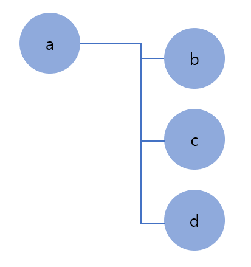
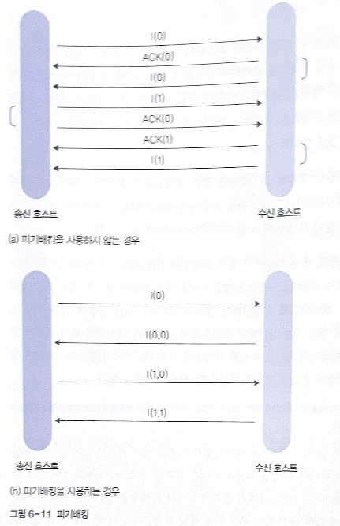
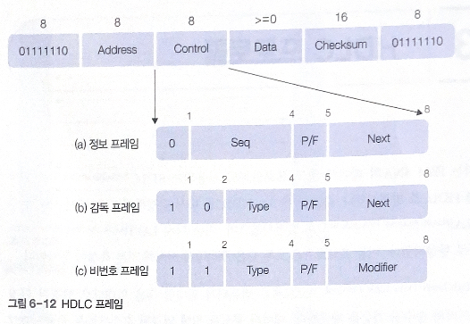

# 6. 데이터 링크 계층

# 01 프로토콜의 기초

데이터 링크 계층 프로토콜: 기본적으로 점대점 방식 연결 구조에서 둘 사이의 전송 오류를 감지, 이를 복구하는 기능 지원

**멀티 드롭(Multi-Drop)** 방식: 하나의 호스트가 다수의 호스트와 연결된 비대칭 형태

임의의 호스트에서 전송된 프레임은 물리적으로 다른 모든 호스트에 전달

→ 여러 수신 호스트 중에서 **프레임의 목적지 호스트를 지칭하기 위한 주소 개념**이 필요

## 1. 프레임의 종류

- **정보 프레임**

상위 계층이 전송을 요구한 데이터를 수신 호스트에 전송

약칭하여 I 프레임(Information Frame)

내용: 상위 계층에서 보낸 데이터, 프레임의 순서 번호, 송수신 호스트의 주소 정보, 오류 검출 코드

- **긍정 응답 프레임**

ACK 프레임(Positive Acknowledgement)

수신 호스트가 프레임 변형 오류가 발생하지 않았음을 송신 호스트에 회신하는 것

- **부정 응답 프레임**

NAK 프레임(Negative AcknowledgeMent)

수신 호스트가 프레임 변형 오류가 발생하면 송신 호스트에 회신

송신 호스트가 오류 발생을 인지하고 원래의 정보 프레임을 재전송하도록 요청

cf. 긍정, 부정 응답 프레임에도 순서 번호가 포함 → 송신 호스트가 판단

## 2. 오류 / 흐름 제어가 없는 프로토콜

전송 프로토콜의 구조를 가장 단순화

- **단방향 통신**: 데이터는 송신 호스트에서 수신 호스트로만 전달
- **전송 오류가 없는 물리 매체**: 통신 채널에서는 어떤 형태의 전송 오류도 발생하지 않음
- **무한개의 수신 버퍼**: 수신 호스트의 버퍼 수는 무한

프레임이 항상 안전하게 도착하므로 송신 호스트는 원하는 만큼 프레임 전송 가능

### 오류 제어

어떤 형태의 오류 발생x

송신 호스트는 전송 프레임에 대한 응답을 받을 필요x

전송만으로 송신 호스트의 역할 완료

### 흐름 제어

수신 호스트의 버퍼 크기 무한 → 버퍼 용량 부족에 따른 프레임 분실 오류 x

## 3. 오류 제어가 없는 프로토콜

- 단방향 통신
- 전송 오류가 없는 물리 매체
- **수신 호스트의 버퍼가 유한개**: 버퍼 부족으로 프레임 분실 오류 발생 가능 → **흐름 제어 기능 필요**

### 흐름 제어

수신 호스트가 ACK 프레임 전송 (긍정 응답 기능 + 다음 프레임 전송 지시)

→ **정지-대기 방식(Stop-and-Wait)**: 송신 호스트는 ACK 프레임이 도착한 후에 다음 정보 프레임을 전송할 수 있는 프로토콜, 효율이 떨어짐

## 4. 단방향 프로토콜

- **오류 제어: 프레임 분실 오류, 프레임 변형 오류**
- 흐름 제어
- 단방향 통신

프레임 분실 오류 → 송신 호스트의 **타임아웃** 기능

### NAK가 없는 경우

**(a) 송신 호스트가 전송한 정보 프레임 분실/변형**

송신 호스트가 정보 프레임을 전송한 후 전송 시간을 고려한 제한 시간을 설정하여 타이머 작동

→ ACK 프레임이 도착하지 않으면 시간 초과에 따른 타이머 동작으로 정보 프레임 재전송

변형된 경우에도 NAK 프레임이 없기 때문에 분실과 동일

**(b) 수신 호스트의 ACK 프레임 분실**

송신 호스트의 입장에서는 (a)와 동일 → 재전송

### NAK가 있는 경우

**(a) 프레임 변형 오류**

1. 변형된 프레임 무시 → 프레임 분실 오류와 동일
2. NAK 프레임을 이용해 송신 호스트에 재전송 요구

**(b) 프레임 분실 오류**

# 02 슬라이딩 윈도우 프로토콜

실제 통신 환경: 대부분 프레임 전송이 양방향으로

슬라이딩 윈도우 프로토콜: 두 호스트 간의 프레임 전송을 위한 일반적인 통신 프로토콜, 오류 제어와 흐름 제어 함께 지원

### 기본 절차

1. 송신 호스트는 데이터, 프레임의 순서 번호, 오류 검출 코드를 프레임에 표기하여 순서 번호에 따라 순차적으로 송신
2. 수신 호스트는 순서 번호에 근거하여 응답 프레임 회신 (일반적으로 다음에 수신하기를 기대하는 프레임의 번호 표기)
3. 송신 호스트는 송신 정보 프레임을 내부 버퍼에 유지(=**송신 윈도우**): 전송 완료, 아직 긍정 응답을 받지 못한 프레임
4. 수신 호스트는 수신 정보프레임을 보관하기 위해 내부 버퍼인 수신 윈도우 유지

## 1. 흐름 제어

슬라이딩 윈도우=’윈도우의 이동’, 흐름 제어 기능

**수신 호스트가 연속으로 수신할 수 있는 정보 프레임의 개수를 윈도우의 크기로 지정**

### 순서 번호

0부터 임의의 최댓값까지 정의

순서 번호의 최댓값은 송신 윈도우의 크기 보다는 커야 함(중복 방지)

정보 프레임에 순서 번호를 위해 할당된 공간의 크기가 n비트→ 순서 번호의 범위: 0~2^n-1

ex. 정지-대기 프로토콜: n값이 1인 경우 

### 윈도우 크기

송신 호스트가 수신 호스트로부터 긍정 응답 프레임을 받지 않고도 전송할 수 있는 프레임의 최대 개수

순서 번호의 묶음이 윈도우가 됨

낮은 순서 번호부터 차례로 처리 

## 2. 연속형 전송

정지-대기 방식: 송신 윈도우 크기가 1인 경우

윈도우 크기를 늘려 ACK 프레임을 받지 않고도 여러 정보 프레임을 연속으로 전송

전송 오류 발생 가능성이 적은 환경에서는 효율적

오류가 발생하면 이를 해결하는 방식에 따라 전송 효율이 영향을 받음

오류 해결 방법: 고백 N 방식, 선택적 재전송 방식

### 고백 N 방식

Go-Back-N

오류 복구 과정에서 오류가 발생한 프레임을 포함해 전송된 모든 정보 프레임을 재전송하는 방식

수신 호스트가 임의의 앞선 순서 번호를 갖는 정보 프레임이 처리될 때까지 다음 정보 프레임을 모두 버림 → **수신 윈도우 크기=1** (현재 처리 중인 프레임)

문제점: 정상적으로 수신한 프레임까지 재전송

### 선택적 재전송 방식

Selective Retransmission

오류가 발생한 프레임만 선택적으로 복구

ex. 12번 프레임에 오류 발생 → NAK(12) 프레임 전송, I(12) 프레임 처리를 완료할 때까지 다음 정보 프레임에 대한 긍정 응답 프레임을 전송하지 않아야 함

앞선 정보 프레임에 대한 처리가 이루어지지 않아도 오류 없이 수신된 모든 정보 프레임을 수신 윈도우에 보관 → **수신 윈도우의 크기 = 송신 윈도우의 크기**

→ 프레임의 도착 순서가 송신 순서와 일치하지 않을 수 있음

## 3. 피기배킹

송신 호스트와 수신 호스트 구분 없이 양방향으로 동시에 정보 프레임과 응답 프레임을 교차하여 전송 가능

**피기배킹(Piggybacking)**: 정보 프레임을 전송하면서 응답 기능까지 수행 → 응답 프레임의 전송 횟수를 줄이는 방식

정보 프레임의 구조를 확장 - **전송할 데이터에 대한 순서 번호 + 다음에 수신할 정보 프레임의 순서 번호**(현재까지 제대로 수신한 프레임의 순서 번호) 모두 표기

**정보 프레임의 전송과 응답 프레임의 회신을 한 번에 처리**

# 03 HDLC 프로토콜

HDLC(High-level Data Link Control) 프로토콜: 컴퓨터가 일대일 혹은 일대다로 연결된 환경에서 데이터의 송수신 기능 제공

데이터 통신을 연결된 호스트: 주국(Primary Station), 종국(SecondaryStation), 혼합국(Combined Station)

명령(Command): 주국에서 전송되는 메시지

응답(Response): 이에 대한 종국의 회신

## 1. 프레임 구조

프레임 좌우의 01111110 플래그: 프레임의 시작과 끝 구분

- Address(주소)
    - 일대다로 연결된 환경에서 특정 호스트를 구분
    - 주국에서 정보 프레임 전송: 수신 호스트(종국) 주소 표시
    - 종국에서 전송: 송신 호스트인 자신의 주소가 기록
- Control(제어)
    - 프레임의 종류 구분
    - 송신용 순서 번호, 회신용 순서번호, 기타 제어 코드 포함
- Data(데이터)
    - 가변 크기의 전송 데이터
    - 상위 계층인 네트워크 계층에서 보내진 패킷이 캡슐화
- Checksum(체크섬)
    - CRC-CCITT를 생성 다항식으로 하는 오류 검출 코드로 사용

## 2. 프레임 종류

Control 필드에 따라 프레임의 용도 구분

### 정보 프레임

네트워크 계층의 데이터 전송을 위해 정의

3비트의 순서 번호를 이용한 슬라이딩 윈도우 프로토콜

순서 번호: 비트 수 3개, 0~7까지의 순서 번호 사용

- Seq: 정보 프레임의 송신용 순서 번호
- Next: 피기배킹을 이용한 응답, **다음에 수신을 기대하는 프레임 번호**, 이 번호 이전까지의 프레임은 모두 오류 없이 수신
- P/F: 값이 1로 지정되었을 경우에만 Poll 혹은 Final
    - Poll: 주국의 명령 프레임에서 사용, 주국에서 데이터를 보내고자 하는 종국이 있는지 확인
    - Final: 종국의 응답 프레임에서 사용, 종국에서 주국으로 데이터 전송
    - 하나의 주국 컴퓨터가 다수의 종국 컴퓨터 제어, 주국에서 종국에 데이터 전송을 허가

### 감독 프레임

정보 프레임에 대한 응답 기능

긍정 응답, 부정 응답 프레임으로 구분

| | | |
| --- | --- | --- |
| Type 0 | RR(Receive Ready) | 긍정 응답 프레임, 다음에 수신을 기대하는 프레임 번호를 Next에 표시 |
| Type 1 | REJ(Reject) | 재전송되어야 하는 프레임의 번호를 Next에 표시 |
| Type 2 | RNR(Receive Not Ready) | 흐름 제어 기능까지 제공, Next필드에 표시한 순서 번호 바로 앞 번호까지 제대로 수신(긍정 응답) + 송신 호스트에 송신을 중지하도록 요구 |
| Type 3 | SREJ(Selective Reject) | 선택적 재전송 방식에서 부정 응답 기능, Next 필드의 순서 번호에 대해 재전송 요구 |

### 비번호 프레임

순서 번호가 없는 프레임, 주로 연결제어의 목적 + 비연결형 데이터 전송

Type과 Modifier 필드를 합해 총 5비트

- **SABM**(Set ABM): 비동기 균형 모드의 연결 설정 요구
- **SNRM**(Set NRM): 정규 응답 모드의 연결 설정 요구
- **SARM**(Set ARM): 비동기 응답 모드의 연결 설정 요구
- **DISC**(DISConnect): 연결 설정 해제 요구
- **RSET**(ReSET): 비정상적인 프로토콜의 동작에 따른 리셋 기능 (종국에 하드웨어 제어 기능을 리셋하도록 통보)
- **FRMR**(FRaMe Reject): 비정상적 프레임 수신 거부 프레임에 오류는 없지만 연결 상태의 논리적 의미 상실)
- **UA**(Unnumbered ACK): 비번호 프레임에 대한 응답 기능

*세 가지 연결 모드

- **정규 응답**(Normal Response)
    - 불균형 모드, 주국과 종국 존재
    - SNRM을 이용해 연결 설정 요구, 종국에서 데이터 전송을 위해 반드시 주국의 허락 필요
- **비동기 균형**(Asynchronous Balanced)
    - 2개의 호스트가 동일한 능력을 갖는 혼합국으로 동작
    - 양쪽에서 명령과 응답 모두 전송
    - 둘 중 임의의 호스트에서 SABM을 이용한 연결 설정 요구 가능
- **비동기 응답**(Asynchronous Response)
    - 불균형 모드지만, 종국이 주국의 허락 없이 데이터 전송 가능
    - 주국 허가 없이 종국에서 먼저 SARM 응답을 보낼 수 있음

## 3. LAP 프로토콜

LAP(Link Access Protocol): 비동기 응답 모드인 ARM으로 동작하는 프로토콜

(a) 주국에서 SARM 명령 전송 → 종국에서 UA 응답

(b) 종국에서 SARM 응답 전송 → 주국에서 SARM 명령 전송 → 종국에서 UA 응답 전송

## 4. LAPB 프로토콜

LAPB(Link Access Protocol-Balanced): 양쪽 호스트가 혼합국으로 동작 - 누구나 먼저 명령 전송

<!-- .. 무슨 뜻일까 좀 더 찾아보기 -->