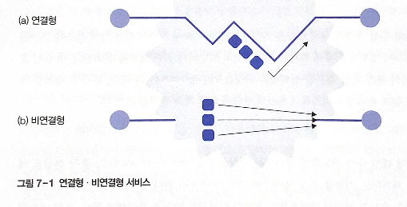

# 7. IP 프로토콜

# 01 네트워크 계층의 기능

**기본 기능**: 송수신 호스트 사이의 패킷 전달 경로를 선택하는 **라우팅**

**주요 기능**

- 라우팅: 송수신 호스트 사이의 패킷 전달 경로 선택
- 혼잡 제어: 혼잡(네트워크에 패킷 수가 과도하게 증가) 현상을 예방하거나 제거
- 패킷의 분할과 병합
    - 패킷 분할: 큰 데이터를 여러 패킷으로 나누는 과정
    - 패킷 병합: 목적지에서 분할된 패킷을 다시 모으는 과정

## 1. 연결형 서비스와 비연결형 서비스



### 비연결형 서비스

**패킷들이 독자적인 경로로 수신 호스트까지 전송**

패킷의 전달 순서, 패킷 분실 여부 등에서 연결형 서비스보다 신뢰성이 떨어짐

자체적으로 오류 제어와 흐름 제어 기능을 더 많이 수행해야 함

패킷이 도착하는 순서가 일정x → 전송 계층은 수신한 패킷의 순서를 재조정

ex. IP 프로토콜

### 연결형 서비스

패킷들이 설정된 연결을 따라 동일한 경로로 전송

목적지에 도착하는 패킷의 순서가 송신된 순서와 동일

## 2. 라우팅

입력된 패킷을 어느 출력 경로를 통해 다음 라우터로 전달해야 가장 효과적인지 결정

**연결형 서비스**

- 가상 회선 방식:연결이 설정되는 시점에 한 번만 결정
- 비연결형 방식: 데이터 그램, 연결 설정x, 고정 경로x, 전송 패킷마다 독립적인 전달 경로 선택

**고려 사항**

- 모든 전송 패킷에 대해 라우팅 과정이 공평해야 함
- 효율성 문제: 패킷의 평균 지연 시간, 전체 네트워크의 성능에 대한 영향, 중개 과정에서 거치는 라우터 수의 최소화

### 정적 / 동적 라우팅

- **정적 라우팅**
    - 송수신 호스트 사이에 패킷 전송이 이루어지기 전에 **경로 정보를 라우터에 미리 저장하여 중개**
    - 라우터에 보관된 **경로 정보가 고정**되어 변화된 정보를 갱신하기 어려움
    - 실시간으로 네트워크 내부의 혼잡도를 반영할 수 없음
- **동적 라우팅**
    - 라우터에서 사용하는 경로 정보를 **네트워크 상황에 따라 적절하게 변경**
    - 경로 정보의 변경 주기에 따라 보완 가능
    - 현재의 네트워크 상황을 고려해 최적의 경로 정보 선택
    - 경로 정보를 수집하고 관리하는 등의 복잡한 작업 필요 → 네트워크에 부하, 성능에 부정적 영향
    - 이웃 라우터의 존재 유무, 전송 지연 시간 확인, 네트워크의 최신 경로 정보를 신속하게 공유, 갱신

### HELLO/ECHO 패킷

라우터 초기화-이웃 라우터의 경로 정보 파악

**HELLO 패킷**: 해당 라우터 간 경로가 이용 가능한지 파악 

이웃에 연결된 라우터에 HELLO 패킷을 전송해 경로 정보를 얻음

**ECHO 패킷**: 라우터 사이의 전송 지연 시간 측정

ECHO 패킷을 수신한 호스트는 송신 호스트에 즉각 회신 → 측정값의 평균을 구해 전송 지연 시간을 유추

라우터가 획득한 정보를 다른 라우터에 통보하여 경로 정보 공유 

→ 그러나 경로 정보들이 개별 라우터마다 다를 수 있음, **여러 라우터에서 정보가 생성되는 경우 네트워크 내부의 경로 정보를 일관성 있게 유지하기 어려움**

### 라우팅 테이블

패킷 전송 과정에서 라우터들이 적절한 경로를 쉽게 찾을 수 있게 만듦

필수 정보: (목적지 호스트, 다음 홉)

- 목적지 호스트: 패킷의 최종 목적지가 되는 호스트의 주소 값
- 다음 홉: 목적지 호스트까지 패킷을 전달하기 위한 이웃 라우터 ( 여러 경로 중 효괒거인 라우팅을 지원하는 경로)

라우팅 테이블 정보는 모든 라우터에 존재, 라우터마다 내용이 다름

### 라우팅 정보의 처리

- ****************************소스 라우팅:**************************** 패킷을 전송하는 호스트가 목적지 호스트까지 전달 경로를 스스로 결정
    - 송신 호스트의 라우팅 테이블: 패킷을 수신 호스트까지 전달하기 위한 경로 정보 관리, 경로 정보를 전송 패킷에 기록
    - 모든 라우팅 정보를 송신 호스트가 관리 - 중간 라우터들은 따로 라우팅 테이블 관리x
    - 데이터그램, 가상 회선에서 모두 이용
- ****************************분산 라우팅:**************************** 라우팅 정보가 분산, 패킷의 전송 경로에 위치한 각 라우터가 효율적인 경로 선택에 참여
    - 데이터 그램 방식에서 많이 사용
    - 장점: 호스트의 수가 많아질수록 다른 방식보다 효과적
- ****************************중앙 라우팅****************************: RCC(Routing Control Center) 특별한 호스트 사용- 전송 경로에 관한 모든 정보 관리
    - 송신 호스트는 반드시 RCC로부터 목적 호스트까지 도착하기 위한 경로 정보를 미리 얻어야 함
    - 소스 라우팅과 동일한 원리로 패킷 전송
    - 장점: 다른 일반 호스트가 경로 정보를 관리하는 부담을 줄임
    - 단점: 네트워크 규모가 커짐에 따라 RCC에 과중한 트래픽 → 전체 효율 떨어짐
- **계층 라우팅**: 분산 라우팅 기능과 중앙 라우팅 기능을 적절히 조합
    - 전체 네트워크의 구성을 계층 구조 형태로 관리
    - 네트워크 규모가 계속 커지는 환경에 효과적

## 3. 혼잡 제어

혼잡: 성능 감소 현상이 급격하게 악화되는 현상

혼잡 제어: 혼잡 문제를 해결하기 위한 방안

cf. 흐름 제어: 송신 호스트와 수신 호스트 사이의 논리적인 점대점 전송 속도를 다룸

혼잡 제어: 호스트와 라우터를 포함한 서브넷에서 네트워크의 전송 능력 문제

### 혼잡의 원인

**네트워크 용량에 비해 전송 패킷이 많기 때문**

기술적 요인 제외 주 요인

- 전송 시간 초과에 의한 타임아웃 기능을 통해 패킷들이 재전송 → 타임아웃 시간을 잘 조절해야 함
- 패킷이 제대로 수신되었는지 응답하는 알고리즘: 여러 개를 모아 하나의 응답으로 처리, 피기배킹(혼잡도 저하 가능)
    - cf. 피기배킹: 재전송 유발로 혼잡 가중 우려 O
- 라우팅 알고리즘
- 패킷의 생존 시간

### 트래픽 성형

버스트 현상: 트래픽이 특정 시간에 집중 → 혼잡 발생 ↑

**트래픽 성형: 송신 호스트가 전송하는 패킷의 발생 빈도가 네트워크에서 예측할 수 있는 전송률로 이루어지게 하는 기능**

- **리키 버킷**


송신 호스트와 네트워크 사이에 송신 호스트가 제시한 전송 특성을 반영하는 깔때기가 위치

깔때기의 출구 크기 : 협상 결과, 크기가 고정

깔때기 크기 이상의 패킷이 네트워크에 유입될 수 없음 - 과도하게 입력된 패킷은 깔때기의 부피 범위 내에서 내부 버퍼에 임시 저장

깔때기에 저장할 수 있는 패킷의 한계치를 초과하면 패킷 분실 오류 발생

**패킷이 시간대별로 일정하지 않아도 깔때기를 통과하며 일정한 전송률로 변경**

### 혼잡 제거

- 가상 회선 방식-혼잡이 사라질 때까지 연결 설정을 허락하지 않는 것

실제 네트워크: 일부 지점에서 혼잡이 자주 발생 → 패킷의 전송 경로를 적절히 조정

- 호스트와 서브넷이 가상 회선 연결 과정에서 협상하는 것
    - 자원 예약 방식: 전송 과정에서 사용하는 대역을 미리 할당 받음
    - 문제점: 통신 자원 낭비
- ECN(Explicit Congestion Notification) 패킷


라우터는 자신의 출력 선로 방향으로 전송되는 트래픽의 양을 모니터 가능 → 훌력 선로의 사용 정도가 한계치를 초과하면 주의 표시, 혼잡 우려 지역 특별 관리

1. 혼잡 지역에 위치한 라우터: 주의 표시된 출력 선로로 라우팅되는 경우에 **송신 호스트에 ECN 패킷 전송**
2. 송신 호스트는 혼잡 발생 가능성 인지
3. 전송 패킷의 양을 줄임

ECN 패킷이 여러 라우터에서 동시에 발생할 가능성 높음 → ECN-Echo와 같은 임의의 표시를 해서 다른 라우터가 ECN 패킷을 생성하지 않도록 해야 한다

# 02 라우팅 프로토콜

## 1. 간단한 라우팅 프로토콜

홉의 수로 판단

### 최단 경로 라우팅

**패킷이 목적지에 도달할 때까지 거치는 라우터 수를 최소화하는 경로 선택**

장점: 간단한 형식

홉 수 외에 거리 기준이 될 수 있는 요소: 패킷의 전송 지연 시간, 전송 대역폭, 통신 비용 등

### 플러딩

**라우터가 자신에게 입력된 패킷을 출력 가능한 모든 경로로 중개**

원본 패킷과 동일한 패킷이 무수히 생성, 모든 경로를 통해 반복하여 전송 → 패킷이 무한개 만들어질 수 있음

→ 각 패킷의 홉 수를 일정 범위로 제한해 라우터에서 이를 확인해 제거

## 2. 거리 벡터 라우팅 프로토콜

라우터가 자신과 직접 연결된 이웃 라우터와 라우팅 정보를 교환

교환 정보: 각각의 라우터에서 전체 네트워크에 소속되는 개별 네트워크까지 패킷을 전송하는 데 걸리는 거리 정보

- 링크 벡터: 이웃 네트워크에 대한 연결 정보
- 거리 벡터: 개별 네트워크까지의 거리 정보
- 다음 홉 벡터: 개별 네트워크로 가기 위한 다음 홉 정보

### 링크 벡터

L(x): 라우터 x와 직접 연결된 이웃 네트워크에 대한 연결 정보 보관

자신과 직접 연결된 이웃 라우터가 누궁니지 판단, 거리 벡터 정보를 제공하는 데 사용

```java
링크 벡터 L(x) = [포트(1), 포트(2), .... 포트(M)]
```

ex. 라우터1에 Net.1(포트 번호:1), Net.2(포트 번호:3) 직접 연결

```java
L(R1) = [포트(Net.1) = 1, 포트(Net.2) = 3]
```

### 거리 벡터

D(x): 전체 네트워크에 소속된 개별 네트워크까지의 거리 정보를 관리

각 라우터에서 다른 네트워크까지의 거리

```java
거리 벡터 D(x) = [거리(1), 거리(2), ... , 거리(N)]
```

### 다음 홉 벡터

H(x): 개별 네트워크까지 패킷을 전송하는 경로에 있는 다음 홉 정보를 관리

보관하는 정보의 수: 전체 네트워크에 속한 네트워크의 수

### RIP 프로토콜

Routing Information Protocol: 거리 벡터 방식을 사용하는 내부 라우팅 프로토콜 중에서 가장 간단하게 구현된 것

소규모 네트워크 환경에 적합

RIP 패킷은 UDP 프로토콜 사용 → 비신뢰성 전송으로 패킷이 전송 과정에서 사라질 수 있음

→ 제한

- 입력되는 거리 벡터 정보가 새로우 네트워크의 목적지 주소면 라우팅 테이블에 적용
- 입력되는 거리 벡터 정보가 기존 정보와 비교하여 목적지까지 도착하는 지연이 더 적으면 대체=이전 정보와 홉 수가 같아도 추가 지연 측정을 통해 지연 시간이 더 적으면 새로운 경로를 선택
- 임의의 라우터로부터 거리 벡터 정보가 들어왔을 때 라우팅 테이블에 해당 라우터를 다음 홉으로 하는 등록 정보가 있으면 새로운 정보로 수정

ex. R1의 라우팅 테이블

| 목적지 네트워크 | 다음 홉 | 거리 |
| --- | --- | --- |
| 1 | - | 1 |
| 2 | - | 1 |
| 3 | R4 | 2 |
| 4 | R4 | 3 |
| 5 | R6 | 2 |

주변 라우터로부터의 라우팅 정보

각 값은 네트워크 1~5

R2 = [1, 2, 2, **1**, 2]

R3 = [2, 1, 2, **1**, 2]

R4 = [2, 1, 1, 2, 2]

R6 = [2, 1, 2, 2, 1]

→ R2나 R3을 거치면 Net.4까지 거리가 1, R1에서 R2, R3까지 가는 거리:1 → 총 거리는 2로 업데이트

| 목적지 네트워크 | 다음 홉 | 거리 |
| --- | --- | --- |
| 1 | - | 1 |
| 2 | - | 1 |
| 3 | R4 | 2 |
| 4 | R2 (R3도 가능) | 2 |
| 5 | R6 | 2 |

RIP 패킷의 구조


- **Command(명령)**: **값이 1이면 RIP 요청, 2면 RIP 응답**, RIP 요청이 브로드캐스팅되면 이 패킷을 받은 라우터들은 즉각 응답
- **Version(버전)**: RIP 프로토콜의 버전 번호
- **Address Family Identifier(주소 패밀리 구분자)**: IP 프로토콜의 주소는 2로 설정됨
- **IP Address(IP 주소):** 특정한 네트워크를 지칭하는 데 사용, IP 주소의 네트워크 부분의 값만 사용
- **Metric(거리)**: 해당 라우터에서 목적지 네트워크까지의 거리

## 3. 링크 상태 라우팅 프로토콜

거리 벡터 방식과 반대의 교환 원리

개별 라우터가 이웃 라우터까지의 거리 정보를 구한 후, 이를 네트워크에 연결된 모든 라우터에 통보

거리 벡터 라우팅 프로토콜: 각 라우터가 상당한 양의 정보 전송을 요구받고, 링크 상태가 많이 변하면 시간 많이 소요

→ 개선

**플러딩** 기법 사용: 임의의 라우터가 이웃한 모든 라우터에 정보 전달, 다시 이 라우터가 주변의 모든 라우터에 정보 전달

ex. TCP/IP 기반의 인터넷에서 사용하는 OSPF(Open Shortest Path First)

전제: 각 라우터는 이웃 라우터의 주소 정보, 각 라우터에 패킷을 전송하는 데 필요한 정보를 알고 있음

## 4. 외부 라우팅 프로토콜

경로 벡터 프로토콜 사용 - 경로에 관한 거리 정보 값이 필요 없음

해당 라우터에서 어느 네트워크가 연결 가능한지에 대한 정보만 제공

→ 외부 라우팅 프로토콜=**원거리의 경로 정보 관리 → 경로의 존재 유무에 초점**

거리 벡터 방식과 차이

- 거리에 대한 처리 과정 X
- 라우팅 정보에 목적지 네트워크에 도착하기 위한 자율 시스템에 관한 내용만 포함

ex. **BGP(Border Gateway Protocol)**

서로 다른 종류의 자율 시스템에서 동작하는 라우터가 라우팅 정보를 교환할 수 있도록 함

→ **게이트웨이(Gateway)**: 종류가 다른 환경에서 동작하는 라우터

TCP 프로토콜을 이용해 메시지 교환

- Open: 다른 라우터와 연관(Relationship) 설정
- Update: 라우팅 관련 정보 전달
- KeepAlive: Open 메시지에 대한 응답 기능과 주변 라우터와의 연관을 주기적으로 확이니
- Notification: 오류 상태 통보

# 03 IP 프로토콜

IP: 호스트 주소 표기, 패킷 분할에 관한 기능 지원 O / 단대단 형식의 오류 제어 / 흐름 제어 기능은 제공 X

**Best Effort 원칙**

: 전송 패킷이 수신 호스트에 100% 도착하는 것을 보장하지 않음

전송 오류 문제를 상위 계층에서 고려 

**IP 프로토콜 특징**

- 비연결형 서비스 제공
- 패킷을 분할/병합하는 기능을 수행하기도
- 데이터 체크섬x, 헤더 체크섬o
- Best Effort 원칙에 따른 전송 기능

## 1. IP 헤더 구조


### DS/ECN

DS(Differentiated Services), ECN(Explicit Congestion Notification) 필드

도입 이전에는 8비트의 Servic Type(DS+ECN) 필드로 정의되어 우선순위, 지연, 전송률, 신뢰성 등의 값을 지정

- 0~2: 우선순위(111 가장 높음)
- 3: 0-보통의 지연, 1-낮은 지연
- 4: 0-보통의 전송률, 1-높은 전송률
- 5: 0-보통의 신뢰성, 1-높은 신뢰성
- 6~7: 예약

차등 서비스 개념 도입 → 6비트의 DS 필드 + 2비트의 ECN 필드

**DS** - 사전에 서비스 제공자와 이용자 사이에 서비스 등급에 대한 합의 → 동일한 DS를 갖는 트래픽은 동일한 서비스 등급

**ECN** - 혼잡 제어

- 필드 값 : 의미
- 00: IP 패킷이 ECN 기능을 사용하지 않음
- 01(ECT 1): TCP 프로토콜도 ECN 기능을 지원
- 10(ECT 0): TCP 프로토콜도 ECN 기능 지원
- 11(CE: Congestion Experienced): 라우터가 송신 호스트에 혼잡을 통지

### 패킷 분할

- Identification(식별자/구분자)
    - IP 헤더의 두 번째 워드-패킷 분할 관련 정보 포함
    - Identification: 송신 호스트가 지정하는 패킷 구분자 기능 수행
    - 분할한 패킷들에 동일한 고유 번호 부여 → 수신 호스트가 다시 병합할 수 있도록
- DF(Don’t Fragment)
    - 패킷이 분할되지 않도록 함
    - 값이 1이면 패킷 분할을 막음
    - 수신 호스트가 패킷을 병합하는 기능이 없을 때 사용
- MF(More Fragment): 여러 개의 분할 패킷이 연속해서 전송 → MF를 1로 지정하여 분할 패킷이 뒤에 계속됨을 표시
- Fragment Offset(분할 옵셋)
    - 패킷 분할이 이루어지면 12비트의 Fragment Offset 필드 사용
    - 저장되는 값: 분할된 패킷의 내용이 원래의 분할 전 데이터에서 위치하는 상대 주소 값
    - 값은 8바이트의 배수 (ex. 값이 64라면 원래 데이터에서 512(64*8)번째에 위치

### 주소 관련 필드

Source Address: 송신 호스트의 IP 주소

Destination Address: 수신 호스트의 IP 주소

IP 주소 체계


클래스 A, B, C = 유니 캐스팅 / 클래스 D = 멀티캐스팅 / 클래스 E = 향후 새로운 환경

클래스 A, B, C= 주소를 network와 host 필드로 구분

- network: 네트워크 주소, 전 세계적으로 유일한 번호가 모든 컴퓨터 네트워크에 할당, NIC에서 할당을 담당
- host: 개별 네트워크 관리자가 host 비트 값 할당, 클래스 A: 규모가 큰 네트워크, C: 작은 네트워크

IP 주소 값에 따른 주소 체계

클래스 A: 0.0.0.0 ~ 127.255.255.255

클래스 B: 128.0.0.0 ~ 192.255.255.255

클래스 C: 192.0.0.0 ~ 223.255.255.255

클래스 D: 224.0.0.0 ~ 239.255.255.255

클래스 E: 240.0.0.0 ~ 255.255.255.255

### 기타 필드

- Version Numer(버전 번호): IP 프로토콜의 버전 번호
- Header Length(헤더 길이): IP 프로토콜의 헤더 길이를 32비트 워드 단위로 표시
    - 필드의 크기: 16비트
    - IP 패킷의 크기는 일반적으로 8192 바이트를 넘지 않음
- Time To Live(생존 시간): 패킷이 올바른 목적지를 찾지 못하면 네트워크 내부에서 떠도는 현상 방지, Time To Live 값이 0으로 감소하면 패킷은 자동으로 버려짐, 패킷 송신 호스트에 ICMP 오류 메시지 전송
- Transport(전송 프로토콜): IP 프로토콜에 데이터 전송을 요구한 전송 계층의 프로토콜
    - 전송 계층의 TCP 세그먼트, UDP 데이터그램, 네트워크 계층의 ICMP 패킷은 모두 IP 패킷의 페이로드 부분에 캡슐화되어 전송
    - TCP 세그먼트: 6, UDP 데이터그램: 17, ICMP 패킷: 1
- Header Checksum(헤더 체크섬): 전송 과정에서 발생할 수 있는 헤더 오류를 검출, 데이터의 오류는 검출 X
    - cf. (계층 4) TCP, UP 프로토콜의 헤더: 데이터와 헤더 모두에 대한 체크섬 정보 제공, IP와 상호 보완적인 오류 검출 기능 수행
- Options(옵션): 네트워크 관리나 보안처럼 특수 용도로 이용
- Padding(패딩): IP 헤더의 크기는 32비트 워드의 크기가 배수가 되도록 설계, 필드의 전체 크기가 이 조건에 맞지 않으면 패딩을 사용해 조정

## 패킷 분할

IP 프로토콜이 패킷을 각 네트워크에서 처리하기 편한 크기로 분할

### 분할의 필요성

TCP에서 설정되는 가상 연결은 여러 종류의 네트워크를 거쳐 설정됨

TCP 프로토콜에서는 패킷 크기를 조절하기 쉽지 않아 IP 프로토콜에서 수행


데이터 링크 계층(계층 2) 프로토콜의 프레임은 크기가 모두 다름 → IP 프로토콜에서 분할

**전송 경로에 위치한 라우터가 분할 기능 수행**

라우터의 좌우에 연결된 LAN이 다를 수 있기 때문에 프레임 크기가 프로토콜마다 달라짐

### 분할의 예


IP 헤더를 제외한 전송 데이터의 크기 = 380바이트, 패킷은 최대 크기가 128바이트

1. 8의 배수로 정의된 Fragment Offset 필드 계산, 이 값에 8을 곱한 크기가 분할 전의 데이터 위치
2. 헤더 크기=20, 패킷 전체 최대의 크기 128-20 / 8 * 8 = 104, 한 패킷에 최대 104바이트의 데이터를 담을 수 있음 → 380 / 104 의 몫+1: 4, 즉 분할된 패킷의 개수는 4
3. 패킷의 전체 크기 = 104+20(헤더) = 124, 마지막 패킷은 68+20 = 88바이트
4. Identification 필드에는 모두 동일한 번호 부여
5. MF 필드는 마지막 패킷을 제외하고 1을 지정

## DHCP 프로토콜

네트워크 관리자는 개별 호스트들에 수동으로 고정 IP 주소를 할당할 수 있음

**DHCP(Dynamic Host configuration Protocol)**: IP 주소 부족 등의 사유로 자동 할당

할당 가능한 IP 주소는 DHCP 서버가 관리하는 풀에 저장되어 관리

클라이언트로부터 IP 주소 요청이 오면 풀에서 하나의 IP 주소를 할당, 사용이 끝나면 풀로 반환

### DHCP 메시지


클라이언트는 DHCP 서버에 **요청 메시지** 전송 → 서버가 **응답 메시지** 회신

- **OPcode**: 요청 메시지=1, 응답 메시지=2
- **HardwareType:** 이더넷 등과 같은 하위 계층의 하드웨어 유형 지정
- **HardwareLength**
- **HOPCount**: 패킷이 전달되는 최대 홉의  지정
- **Transaction Identifier**: 클라이언트의 요청이 있을 때 지정하는 임의의 숫자, 서버는 지정된 번호로 응답
- **Time Elapsed**: 클라이언트가 부팅된 이후의 경과 시간지정
- **Flag**: 첫 번째 비트만 사용, 유니캐스트/멀티캐스트 구분
- **Client IP Address:** 클라이언트가 자신의 IP 주소 지정, 모르면 0
- **Your IP Address**: 서버가 응답 메시지로 권고해주는 클라이언트의 IP 주소
- **Server IP Address**: 서버의 IP 주소 지정, 모르면 0
- **Gateway IP Address**: 클라이언트의 디폴트 라우터 IP 주소
- **Client Hardward Address**: 클라이언트의 하드웨어 주소 지정
- **Servaer Name**: 서버의 도메인 네임 지정, 크기=64바이트
- **Boot File Name**: 추가 정보르 보관하고 있는 파일 경로명 지정, 크기=128바이트
- **Options**: 필요한 추가 정보 지정, 크기=64바이트

---

동작 과정에서 필요한 주요 메시지의 종류, Options 필드에 의해 구분

클라이언트의 포트 번호=68, DHCP 서버의 포트 번호=67


- **DHCP_DISCOVER**
    - 클라이언트가 DHCP 서버를 찾기 위해 전송하는 브로드캐스트 메시지
    - Transaction Identifier에 특정한 값을 지정
    - 클라이언트는 IP 주소가 없음 - 송신자의 IP 주소는 0.0.0.0
    - DHCP 서버의 IP 주소를 모름 - 수신자의 IP 주소는 255.255.255.255 (브로드캐스팅)
- ********************DHCP_OFFER********************
    - DHCP 서버가 응답하는 메시지
    - **Your IP Address** 필드에 권고하는 IP 주소 지정
    - **Server IP Address** 필드에 서버의 IP 주소를 저장
    - 아직 클라이언트의 IP 주소 결정x → IP 패킷은 브로드캐스팅 형식으로 전송
- ************************DHCP_REQUEST************************
    - 클라이언트는 다수의 DHCP_OFFER를 받을 수 있음 → 적당한 IP 주소 전택
    - 이 주소를 권고한 DHCP 서버에 DHCP_REQUEST 전송
- **************DHCP_ACK**************
    - ************************DHCP_REQUEST************************ 메시지를 받은 DHCP 서버는 IP 주소가 최종적으로 사용 가능한지 판단
    - 사용 가능하면 DHCP_ACK 메시지 전송
- **********DHCP_NACK**********
    - 이미 다른 클라이언트가 IP 주소 선점 → DHCP_NACK 메시지 전송

