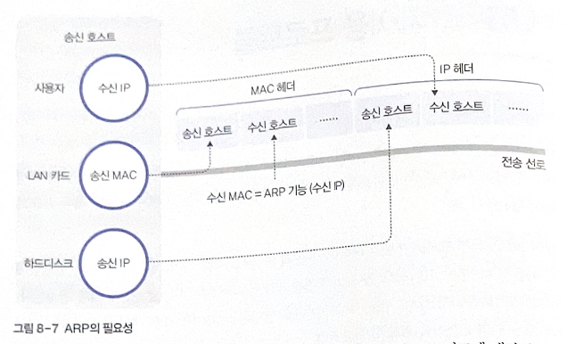

# 8. 네트워크 계층

# 01 IPv6 프로토콜

현재의 IP 프로토콜은 32비트의 주소 공간 지원 → 이론 상으로 최대 $2^{32}$개의 호스트를 수용

IPv6: 호스트의 주소 공간 대폭 확장

**주요 변경 사항**

- **주소 공간 확장**
    - 주소 표시 공간: 32비트 → **128비트**
    - 이론적으로 $2^{128}$개까지 지원
    - 유비쿼터스 장비(개인이 무선으로 연결)가 보급되는 환경에도 쉽게 대처
- **헤더 구조 단순화**
    - 불필요한 필드 제외, 확장 헤더 형식
    - 과도한 오류 제어와 같은 오버헤드를 줄여 프로토콜의 전송 효율을 높임
- **흐름 제어 기능 지원**
    - 흐름 제어 기능 지원 필드(Flow Label) 도입 → 일정 범위 내에서 예측 가능한 데이터 흐름 지원
    - 하나의 연속 스트림으로 전송해야 하는 연관 패킷의 전송 기능 지원
    - 멀티미디어 응용 환경 (실시간 기능이 필요) 수용 가능

## 1. IPv6 헤더 구조

IPv4보다 매우 단순, 9개의 기본 필드 지원

기본 헤더와 확장 헤더로 나뉨

확장 헤더의 종류

- **Hop-by-Hop Options Header**
    - Jumbo 페이로드 옵션과 라우터 긴급 옵션 등의 홉바이홉 옵션 처리
    - Jumbo 페이로드 옵션: 패킷 데이터의 크기가 65,535 바이트보다 클 때 사용, 라우터에서 이 패킷을 처리할 수 없으면 ICMP 프로토콜의 오류 메시지 발생
    - 라우터 긴급 옵션: 라우터에 전송 대역의 예약 같은 특정 정보 제공
- **Routing Header**
    - IPv4의 소스 라우팅과 유사한 기능 제공
    - 패킷이 라우팅 헤더에 지정된 특정 노드를 경유하여 전송되도록 함
- **Fragment Header**
    - IPv4 프로토콜에서 Fragment Offset, Identification, MF 필드처럼 패킷 분할과 관련된 정보 포함
- **Destination Options Header**
    - 수신 호스트가 확인할 수 있는 옵션 정보 제공
- **Authentication Header**
    - 패킷 인증 관련 기능
- **Encapsulating Security Payload Header**
    - 프라이버스 기능을 제공하기 위해 페이로드 암호화
    - 인증된 목적지 호스트에서 암호화 데이터를 해독할 수 있는 정보도 함께 제공

### DS/ECN 필드

6비트의 DS 필드, 2비트의 ECN 필드

원래 4비트의 Priority 필드와 Flow Label 필드의 앞부분 4비트의 공간으로 사용되던 곳

### Flow Label 필드

IPv4에서는 라우터가 중개할 때 동일한 기준을 적용하여 처리

IPv6: **특정 송수신 호스트 사이에 전송되는 데이터를 하나의 흐름으로 정의**, 중간 라우터가 이 패킷을 특별한 기준으로 처리할 수 있도록 지원

기본 원칙

- Flow Label 필드를 지원하지 않으면 반드시 0으로 지정, 중개 과정에서는 현재 값 유지, 패킷을 수신하는 측에서는 필드 값 무시
- 0 이외의 **동일한 번호로 부여받은 패킷**은 Destination Address, Source Address, Priority, Hop-by-Hop Options Header, Routing Header 등을 **모두 동일하게 지정**
- 필드 값은 최대 범위 내에서 랜덤하게 선택, 현재의 전송 흐름에서는 동일 번호가 부여되지 않도록

### 기타 필드

- **Version Number**
- **Payload Length(페이로드 길이)**: 헤더를 제외한 패킷의 크기, 단위는 바이트
- **Next Header(다음 헤더)**: 기본 헤더 다음에 이어지는 헤더의 유형
    - IPv6의 확장 헤더일 수도 있고, 상위 계층인 TCP와 UDP의 헤더일 수도 있음
    - TCP/UDP가 나오면 확장 헤더를 사용하지 않은 것
- **Hop Limit(홉 제한)**
    - IPv4의 Time To Live 필드와 동일한 역할 수행
    - 패킷이 라우터에 의해 중개될 때마다 감소, 0이 되면 사라짐
- **Source Address/Destination Address(송신 호스트/수신 호스트 주소)**

## 2. IPv6 주소

### 주소 표현

16비트의 숫자 8개를 콜론으로 구분

ex. D1D1:1111:3F3F:1700:4545:1212:1111:1231 등

### 주소 공간

주소대별로 용도가 다르다

| 상위 비트 | 용도 |
| --- | --- |
| 0000 0000 | 예약(IPv4 공간 지원 포함)  |
| 0000 0001 | 비할당 |
| 0000 001 | OSI NSAP 주소 공간 |
| 0000 010 | Novell Netware iPX 주소 공간 |
| 001 | 유니캐스트 주소 공간 |
| 1111 1110 10 | Link 지역 주소 공간 |
| 1111 1110 11 | Site 지역 주소 공간 |
| 1111 1111 | 멀티캐스트 죽소 공간 |

Link/Site 지역 주소: 지역적으로 사용, 외부와 충돌x

멀티캐스트 주소: 상위 8비트의 1111 1111과 4비트 플래그, 4비트 스코우프 플래그, 12비트 그룹 구분자로 구성

- 애니 캐스트: 멀티캐스팅과 유사한 기능 제공, 그룹 내의 특정 호스트에만 패킷 전송

# 02 이동 IP 프로토콜

호스트가 이동하는 환경에서 서비스 중단 없이 인터넷에 접속할 수 있는 이동 환경을 지원하는 원리

## 1. 터널링 원리

이동 호스트가 자신의 고유 주소를 유지하면서 인터넷 서비스를 받기 위해 계속 이동하는 송수신 호스트 간의 데이터 라우팅 처리가 가장 중요함

### 상이한 전송 수단

ex. 육지와 바다는 이동 수단이 다르기 때문에 중간에서 전송 프로토콜로 표현된 운송 수단을 변경해야 함

버스, 배와 같은 운송수단 = IP 프로토콜, 운송 수단에 타 있는 개체: IP 프로토콜의 전송 데이터

→ 육지와 바다에서 사용하는 IP 프로토콜이 다르다

### 터널링 방식

IP 프로토콜을 그때그떄 교체하는 방식보다 간단한 것은 터널링 기능

개체는 계속 버스만 타고, 배를 타야할 때는 배에 버스를 태움 → 프로토콜 교체 필요x

개체는 배라는 다른 프로토콜에 대한 이해 필요x

→ **사용자가 직접 프로토콜을 변경하는 것이 아니라 제3자가 터널링의 추가 작업을 처리**

## 2. IP 터널링

유선 고정망 환경에서 발전한 기존 인터넷 주소 체계 → 이동 환경에 적용

- 이동한 위치에서 새로운 IP 주소 할당
- 호스트 고유의 IP 주소 유지

기존 인터넷 환경에서 iP 주소는 라우팅 정보를 제공 → IP 주소가 호스트의 위치에 따라 변경되는 것이 현재 인터넷 환경에 적합

But, IP 주소를 변경하는 과정에서 서비스가 계속 이어져야 한다

IETF(국제 표준화 단체): 이동 호스트 지원을 위한 방안 중의 하나로 이동 IP에 대한 표준안 제정

: 경로 선택 시 IP 주소의 역할과 호스트의 이동에 따른 라우터의 고려 사항

**이동 IP 프로토콜의 기본 동작 원리**

**FAnew(Foreign Agent) 포린 에이전트**: 이동 호스트의 위치가 바뀌면 COA를 제공(Care of Address)

이 주소는 이동 호스트의 **홈 에이전트(HA)**에 등록 → FAnew와 HA 사이에 터널 형성

HA로 라우팅된 패킷을 이동 호스트에 전달하기 위해 **터널**을 통해 FAnew로 전달

**홈 주소(HA, Home Address):** 이동 호스트 고유 IP 주소, 호스트 위치가 바뀌어도 변경x

홈 에이전트와 밀접한 관련, 상대 호스트는 HA와 고정된 연결 사용

상대 호스트는 HA의 주소로 데이터를 송수신함

이동 호스트는 다른 호스트와 통신할 때 홈 주소 사용

IP 헤더의 Source Address 필드에 표기된 주소 = 자신의 홈 주소, 패킷을 전송

패킷을 수신할 때에는 Destination Address에 자신의 홈 주소가 표기

COA=이동 호스트가 위치를 변경할 때마다 새로 이동한 지역에서 할당받은 IP 주소

→ 이동할 때마다 새로운 COA 할당

**상대 호스트에서 이동 호스트까지 패킷이 전달되는 과정**

1. 상대 호스트가 이동 호스트의 홈 주소를 목적지 주소로 표기하여 패킷 전송
2. 홈 에이전트로 패킷 전송
3. 홈 에이전트는 포린 에이전트와 설정된 터널을 이용해 기존 패킷을 캡슐 패킷의 형태로 중개
4. 포린 에이전트가 패킷을 다시 이동 호스트에 전달

**터널: 원래 IP 패킷을 목적지까지 전송하기 위한 중간 단계의 새로운 경로**

터널 구간을 지나는 과정에서 라우팅 처리 필요 = IP 프로토콜 사용(송수신 호스트 사이에 작동하는 IP 프로토콜과는 별도로 추가적인 IP 프로토콜)

**→ 원래의 IP 패킷을 데이터로 취급하는 새로운 IP 캡슐 패킷이 구성**

캡슐 패킷의 새로운 IP 헤더의 Destination Address: COA

# 03 제어용 프로토콜

데이터 전송 과정이 올바르게 이루어지게 하기 위해 다양한 제어프로토콜 필요

## 1. ARP 프로토콜

네트워크 환경에서 호스트가 다른 호스트에 데이터를 전송하기 위해 수신 호스트의 IP 주소+ **MAC 주소도 알아야 함**

수신 호스트의 IP 주소는 응용 프로그램 사용자가 직접 입력, **IP 주소로부터 수신 호스트의 MAC 주소를 얻는 작업이 필요**

### MAC 주소

데이터 전송 과정에서 필요한 주소

- 송신 호스트 IP 주소: 자신의 파일 시스템에 보관
- 수신 호스트 IP 주소: 일반 사용자가 접속하고자 하는 호스트의 IP 주소 지정
    - 사용자는 일반적으로 도메인 이름 입력, DNS 서비스를 통해 IP 주소로 변환
- 송신 호스트 MAC 주소: 자신의 LAN 카드에 내장
- **수신 호스트 MAC 주소: 송신 호스트의 내부 정보로 얻을 수 없음**

→ ARP(Address Resolution Protocol) 기능을 통해 수신 호스트의 IP 주소에서 MAC 주소를 얻어야 함

**ARP request(특수 패킷) 브로드 캐스팅**

네트워크의 모든 호스트가 수신, 관계 없는 호스트들은 패킷을 무시하고 자신의 IP 주소와 동일한 호스트만 동일함을 인지

해당 호스트는 ARP reply 패킷을 사용해 자신의 MAC 주소를 호스트 A에 회신

데이터를 전송할 때마다 ARP를 사용하여 패킷을 브로드캐스팅하면 네트워크 트래픽 증가

→ **가장 최근에 얻은 IP 주소와 MAC 주소 매핑 값을 보관하는 캐시 정보 이용**

송신 호스트가 ARP request/reply 패킷을 처리하는 과정에서 모든 호스트는 수신 호스트의 IP 주소와 MAC 주소 매핑 값을 자동으로 얻을 수 있음

→ 네트워크 부하 최소화

### RARP 프로토콜의 필요성

RARP(Reverse Address Resolution Protocol): MAC 주소를 이용해 IP 주소를 제공

: **송신 호스트와 관련해서 IP 주소를 얻는 기능**

디스크가 존재하지 않는 시스템, X 윈도우 터미널에서는 LAN 카드를 통해 MAC 주소를 알 수 있음

파일 시스템이 없어서 IP 주소 보관X

→ 서버 호스트로부터 IP 주소를 얻어옴

IP 주소를 얻고자 하는 호스트는 MAC 주소를 매개변수로 하여 패킷을 브로드캐스팅

네트워크에 RARP의 기능을 전담으로 수행하는 서버가 하나 이상 존재 → 해당 정보를 보관하고 있는 RARP 서버만 응답

RARP를 통해 자신의 IP 주소를 얻은 다음, 정해진 호스트로부터 자신의 부트 이미지(예: 운영체제) 다운로드

## 2. ICMP 프로토콜

ICMP(Internet Control Message Protocol): 인터넷 환경에서 오류에 관한 처리 지원

IP 프로토콜은 데이터 전송 과정에서 오류가 발생해도 이를 보고하는 기능이 없음

→ 네트워크 계층 프로토콜인 ICMP는 IP 패킷에 대해 원인을 송신 호스트에 전달

### ICMP 메시지

- **오류 보고 메시지**: 단순 오류 통보, 해결 x
    - DESTINATION UNREACHABLE
        - 수신 호스트가 존재하지 않거나 존재해도 필요한 프로토콜이나 포트 번호 등이 없어 수신 호스트에 접근이 불가능한 경우
        - IP 헤더의 DF 필드(Don’t Fragment)가 설정된 패킷을 라우터가 분할해야 하는 경우에도 해당 패킷을 버리고 이 메시지 회신
    - SOURCE QUENCH
        - 네트워크에 필요한 자원이 부족하여 패킷이 버려지는 경우
        - 송신 호스트에 혼잡 가능성 경고
    - TIME EXCEEDED
        - 패킷의 TTL 필드 값이 0이 되어 패킷이 버려진 경우에 주로 발생
        - 기타 시간 초과 현상에 의해 패킷이 버려진 경우
- **질의 메시지**: 라우터 혹은 다른 호스트들의 정보 획득
    - ECHO REQUEST, ECHO REPLY
        - 유닉스의 ping 프로그램에서 네트워크의 신뢰성을 검증하기 위해 ECHO REQUEST 전송, 수신 호스트는 ECHO REPLY 응답
        - 특정 호스트가 인터넷에서 활성화되어 동작하는지 확인
    - TIMESTAMP REQUEST, TIMESTAMP REPLY
        - 두 호스트 간의 네트워크 지연 계산

### ICMP 헤더 형식

**ICMP 오류 보고 메시지의 구조**

오류 발생한 패킷의 ip 헤더 + 추가적인 8바이트 정보가 메시지로 전달

- Type(유형): 1바이트 크기로 메시지의 종류 구분
- Code(코드): 메시지 내용에 대한 자세한 정보 제공
- Checksum(체크섬): ICMP 전체 메시지에 대한 체크섬 기능 지원

오류가 발생한 패킷에 대한 정보

IP 패킷의 헤더 _ 이어지는 8바이트의 ICMP 메시지를 기초로 IP 패킷을 송신

→ ICMP 오류를 파악하고 정정

**질의 메시지의 구조**

ICMP 메시지가 아니기 때문에 **오류 발생 IP 패킷**에 대한 정보가 없음

Identifier, Sequence Number 필드를 사용하여 메시지 구분

### ICMP 메시지 전송

기능적으로 네트워크 계층의 역할 수행

ICMP 메시지는 데이터 링크 계층에 바로 전달되지 않고, IP 패킷에 캡슐화된 후 전달

= IP 프로토콜의 데이터로 처리: IP 헤더에 캡슐화되어 계층 2 프로토콜로 전달

## 3. IGMP 프로토콜

**멀티캐스팅**(특정 그룹에 속하는 모든 호스트에 메시지 전송) 방식에 필요한 라우팅 알고리즘: 

**멀티캐스트 라우팅(Multicast Routing)**

### 그룹 관리

다수의 호스트를 논리적인 하나의 단위로 관리하기 위한 그룹 관리 기능: 그룹 생성/제거, 전송 호스트의 그룹 참가/탈퇴 

라우터는 입력 패킷을 그룹에 소속된 호스트의 수만큼 복사해 전달

**기능**

- 다중 수신 호스트를 표시하는 멀티 캐스트 그룹 주소 표기 방법 통일 (네트워크 계층을 지원하는 IP 프로토콜이 주소 형식 제공)
- 라우터에서 **IP 멀티캐스트 주소와 이 그룹에 속하는 멤버 호스트의 네트워크 주소 사이에 연관성 처리**
    - 멤버가 동적으로 추가/삭제 되는 환경에 대응하는 기능 필요
- 그룹에 속한 모든 멤버에게 도달하는 가장 짧은 경로 선택

### IGMP 헤더 구조

**IGMP(Internet Group Management Protocol)**: 임의의 호스트가 멀티캐스트 주소로 정의된 멀티 캐스트 그룹에 가입하거나 탈퇴할 때 사용하는 프로토콜

멀티캐스트 그룹에 가입한 호스트와 라우터 사이에 멤버 정보 교환

IGMP 버전 2에서 사용하는 메시지 구조

IGMP 메시지는 IP 패킷에 캡슐화되어 전달

질의 메시지, 보고 메시지로 구분

- 질의 메시지: 멀티캐스트 라우터가 그룹에 대한 정보를 얻기 위해 호스트에 전달
- 보고 메시지: 질의 메시지에 대한 응답으로 호스트가 보고 메시지 회신

그림의 IPv4 D 클래스 = 멀티캐스트 주소

- **Type(유형)**: 크게 세 가지 값
    - 0x11 : 멀티캐스트 라우터가 전송한 질의 메시지
    - 0x16 : 호스트가 전송하는 보고 메시지
    - 0x17 : 그룹 탈퇴에 관한 메시지 (특정 그룹에 소속된 마지막 멤버의 탈퇴와 관련)
    - 0x12: 보고 메시지로 사용될 수 있음(이전 버전과의 호환성)
- **Max Response Time(최대 응답 시간)**
    - 질의 메시지에서만 사용
    - **질의에 대한 보고 메시지가 전송되어야 하는 최대 응답 시간**
    - 라우터는 이 값을 변화시킴으로써 탈퇴 지연 시간을 조율
        - 탈퇴 지연 시간=특정 그룹에서마지막 호스트가 탈퇴한 시간과 라우팅 프로토콜이 이 사실을 인지한 시간의 차이
- **Checksum(체크섬)**
    - IP 프로토콜에서 사용하는 알고리즘과 동일, 오류 검출
- **Group Address(그룹 주소)**
    - 질의 메시지는 0
    - 보고 메시지는 호스트가 가입을 원하는 그룹 주소표기
    - 특정 그룹 관련 질의 메시지-해당 그룹의 주소

### IGMP 동작 과정

자신이 IGMP 메시지에 표시된 멀티캐스트 주소의 멤버임을 다른 호스트와 라우터에 알리기 위해 IGMP 사용

**(a) 그룹에 가입**하기 위해 해당 멀티캐스트 주소를 표기한 IGMP 보고 메시지 전송 

→ IGMP 헤더의 Group Address 필드에 가입을 원하는 멀티캐스트 주소를 기록

**(b) 멤버 목록 주기적 확인** : IGMP 보고 메시지를 사용해 IGMP 질의에 응답

**(c) 그룹 탈퇴**: 호스트의 보고 메시지 응답이 이루어지지 않으면 그룹 탈퇴로 간주

### IGMP 메시지의 전송

ICMP와 유사, IP 패킷에 캡슐화되어 IP 프로토콜의 데이터로 처리됨