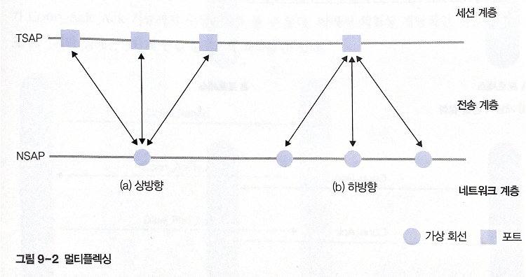
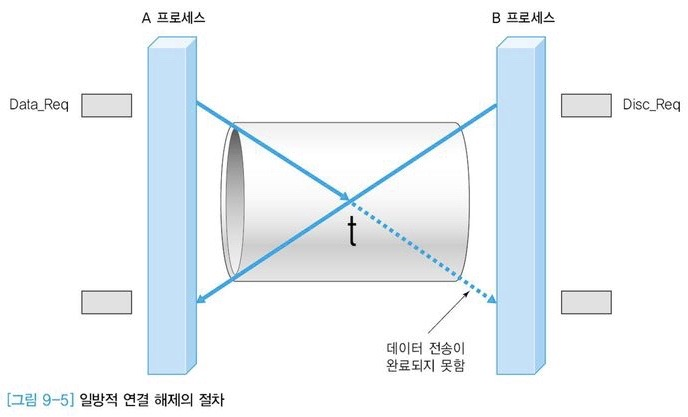
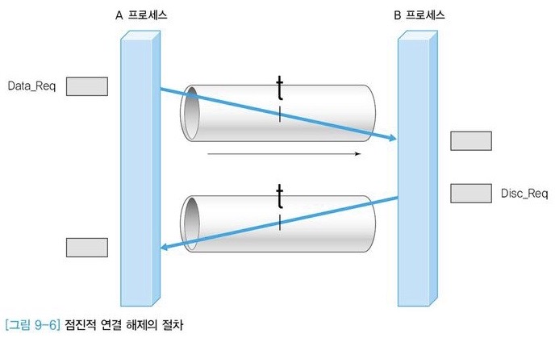
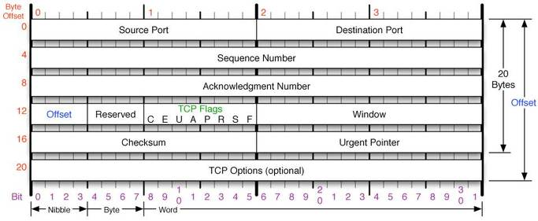
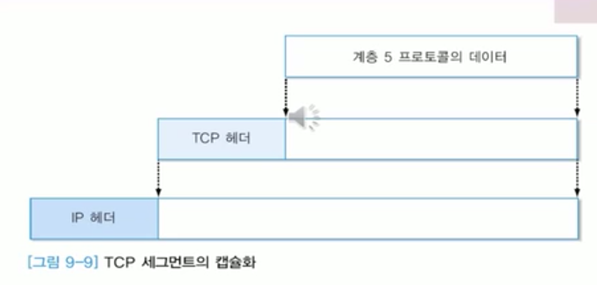
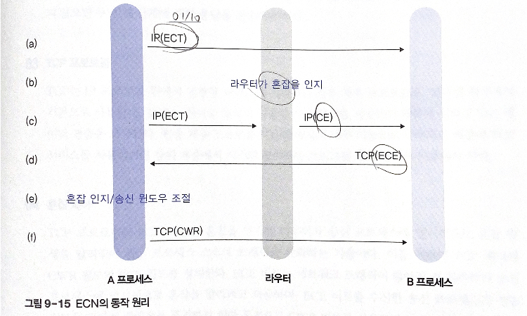

# 9. TCP 프로토콜

# 01 전송 계층의 기능

전송 계층: 데이터 링크 계층과 특징 유사

- 데이터 링크 계층: **물리적인 전송 선로**로 직접 연결된 두 물리적 호스트(컴퓨터나 라우터) 사이의 데이터 전송 담당
- 전송 계층: 네트워크 끝단에 위치하는 통신 주체가 **중간의 논리적인 선로**(라우터로 연결된 컴퓨터 네트워크)를 통해 데이터를 주고받음

** 네트워크에서는 시간 지연 현상의 처리가 중요

네트워크를 통해 데이터를 전송할 때 송수신 호스트 사이에 전송 지연 발생 → 중간 네트워크가 전송 과정에서 데이터를 보관하는 효과 발생

네트워크는 입출력 사이에 시간 지연을 주니까 논리적으로 기억 장치의 기능을 함 

**→ 네트워크 = 잠재적 기억장치**

## 1. 전송 계층의 주요 기능

### 흐름 제어

양 끝단의 송수신 호스트에서 실행되는 네트워크 프로세스가 데이터를 주고받음 → 이 과정에서 필요한 기능

cf. 데이터 링크 계층에서도 흐름 제어 기능 수행 - 라우터를 연결하는 **물리적인 선로의 수**는 전송 계층이 관여하는 송수신 호스트 사이의 논리적 연결의 수보다 적다

→ 서로 다른 버퍼 관리 방법 필요

수신 프로세스가 송신 프로세스의 전송 속도보다 느리게 데이터를 수신하면 버퍼 용량이 초과하여 데이터를 분실할 수 있음

송신 프로세스가 타임아웃 기능을 통해 재전송 → 네트워크의 전송 효율이 떨어짐 

흐름 제어 기능: 수신 호스트가 슬라이딩 윈도우 프로토콜의 윈도우 하단 값 조정 = 송신 프로세스가 보낼 수 있는 패킷의 한계 지정 

### 오류 제어

데이터 변형, 데이터 분실 

전송 계층에서의 오류: 논리적으로 구축된 각 계층의 소프트웨어가 동작하는 과정에서 데이터 분실 

### 분할과 병합

상위 계층에서 전송을 요구한 데이터의 크기가 전송 계층에서 처리한 데이터 크기보다 클 경우 **분할**

수신 프로세스가 수신한 데이터를 원래 크기로 다시 모으는 과정: **병합**

반드시 병합 과정을 거쳐야 계층 구조 유지

### 서비스 프리미티브

전송 계층 사용자가 전송 계층 서비스를 사용하기 위한 인터페이스

cf. 네트워크 계층: 일반적으로 비연결형 서비스 프리미티브

전송 계층: 비연결형 서비스 + 신뢰성이 향상된 연결형 서비스 제공

## 2. 설계 시 고려 사항

### 주소 표현

주소: 호스트와 라우터, 네트워크 프로세스를 구분할 수 있음

전송 계층의 주소 = TSAP(Transport Service Access Point)

- 구조적 표현
    - 하나의 주소를 여러개의 계층적 필드로 구분
    - 필드는 전체 주소 공간의 상하 계층 관계를 나타냄
    - ex.대한민국:서울:~~대학교:…:홍길동:50
- 비구조적 표현
    - 주소 값만 해석해서는 컴퓨터의 논리적인 위치를 파악하기 어려움
    - ex. 학교 반 번호 1, 2, 3번 등

IP 주소: 네트워크와 호스트의 계층적 특성 O, 위치 정보-비구조적

도메인 주소: 구조적인 위치 정보 제공

### 멀티플렉싱

개별적으로 설정된 전송 계층 연결에서 TDPU의 목적지가 동일한 호스트라면 이들 데이터를 하나의 가상 회선에 실어 전송하는 것이 유리

(a) 상방향

- 다수의 전송 계층 연결에 대해 하부의 네트워크 계층에서 연결이 하나 형성
- 여러전송 계층의 연결에서 발생한 데이터가 동일한 경로로 전송되면 하나의 네트워크 연결에 묶어 전송
- 일반적 연결 구조보다 네트워크 계층에서 만들어지는 가상 회선 연결의 개수를줄일 수 있음

(b) 하방향

- 하나의 전송 연결 설정을 의미하는 포트에 다수의 가상 회선 할당
- 전송 속도뿐 아니라, 전송 계층에서 발생하는 데이터의 특성에 따라 개별 가상 회선을 할당하여 효과적인 통신 가능
- ex. 영화 파일 → 영상 음성 모국어 외국어 자막 등으로 구분하여 개별 설정
- 데이터의 트래픽 특서에 따라 성격에 맞는 가상 회선 할당

### 연결 설정

Conn_Req: 연결 설정 요구

Conn_Ack: 연결 수락

(a) 개념적 연결 설정

- Conn_Req → Conn_Ack
- 연결 설정은 양자의 합의에 의해서만 가능

(b) 3단계 연결 설정

- Conn_Req → Conn_Ack → Conn_Ack_Ack
- 오류가 발생하지 않은 정상 상태에서의 3단계 설정
- Conn_Req의 오류 가능성 + Conn_Ack의 오류 가능성
- 이론적으로는 긍정 응답 기능이 무한 반복되어야 함
- 전송할 데이터가 있따면 Conn_Ack_Ack 대신 데이터 전송 가능

(c) 3단계 설정 절차 - 송신 순서 번호

- Conn_Req(x) → Conn_Ack(y, x) → Data_Req(x, y)
- x = A 프로세스의 송신 순서 번호
- y = 수신 프로세스(B)의 초기 송신 번호

### 연결 해제

[https://naon.me/posts/til88](https://naon.me/posts/til88)

- 일방적 연결 해제 절차

한쪽 프로세스가 일방적으로 Disc_Req(연결 해제 요청) 전송

상대 프로세스의 동의가 없어도 연결이 끊김

문제점: 전송할 데이터가 남거나, 전송 중인 경우에 데이터 전송을 완료할 수 없음

- 점진적 연결 해제 절차

하나의 연결에 2개의 단방향 연결을 지원하는 원통이 존재하는 것과 같음

한쪽 프로세스의 연결 해제 요구가 발생해도, 다른쪽에서 전송중인 데이터는 완료할 수 있음

연결 해제를 위해 두 프로세스 모두 Disc_Req를 전송해야 함

# 02 TCP의 헤더 구조

TCP: Transmission Control Protocol

IP 프로토콜 위에서 연결형 서비스를 지원하는 전송 계층 프로토콜

인터넷 환경에서 기본으로 사용

**주요 기능**

- 연결형 서비스 제공
- 전이중(Full Duplex) 방식의 양방향 가상 회선 제공
- 신뢰성 있는 데이터 전송 보장

인터넷 환경

IP 프로토콜(네트워크 계층) - TCP/UDP(전송 계층)

TCP: 연결형 서비스 지원, UDP: 비연결형 서비스 지원

TCP는 데이터를 세그먼트(Segment)라는 블록 단위로 분할해 전송

블록: 네트워크 부하 정도, 윈도우 크기에 영향을 받음, 가변 크기 지원

TCP→세그먼트를 하나의 단위로 간주, 순서 번호 관리 X, 세그먼트에 실려 전송되는 데이터의 바이트 개수를 순서 번호에 반영

## 1. TCP 헤더 구조

[https://mindnet.tistory.com/entry/네트워크-쉽게-이해하기-19편-TCP-Header-4계층-TCP-헤더-구조](https://mindnet.tistory.com/entry/%EB%84%A4%ED%8A%B8%EC%9B%8C%ED%81%AC-%EC%89%BD%EA%B2%8C-%EC%9D%B4%ED%95%B4%ED%95%98%EA%B8%B0-19%ED%8E%B8-TCP-Header-4%EA%B3%84%EC%B8%B5-TCP-%ED%97%A4%EB%8D%94-%EA%B5%AC%EC%A1%B0)

### TCP 헤더의 필드

데이터 전송 과정이 UDP 프로토콜보다 복잡

- **SourcePort/Destination Port(송신 포트/수신 포트)**
    - TCP로 연결되는 가상 회선 양단의 송수신 프로세스에 할당된 네트워크 포트 주소
    - 포트 번호: 호스트 내부에서 다른 프로세스와 구분할 수 있는 프로세스의 고유 주소
- **Sequence Number(순서 번호)**
    - 송신 프로세스가 지정하는 순서 번호
    - 세그먼트 전송 과정에서 전송되는 바이트의 수르 기준으로 증가 - 전송 데이터의 각 바이터마다 순서 번호가 존재
    - 32비트 필드
- **Acknowledgement Number(응답 번호)**
    - 수신 프로세스가 제대로 수신한 바이트의 수를 응답하기 위해 사용
    - ACK 플래그 비트가 지정된 경우에만 유효
    - 다음에 수신을 기대하는 데이터의 순서 번호 표시
- **Data Offset(데이터 옵셋)**
    - TCP 세그먼트가 시작되는 위치를 기준으로 데이터의 시작 위치를 나타냄
    - TCP 헤더의 크기
    - 32비트 워드 단위로 표시
- **Reserved(예약)**
- **Window(윈도우)**
    - 슬라이딩 윈도우 프로토콜에서 수신 윈도우 버퍼 크기를 지정하려고 사용
    - 수신 프로세스가 수신할 수 있는 바이트의 수
    - 버퍼 용량 초과 등으로 더이상 수신할 수 없으면 필드 값을 0으로 지정
- **Checksum(체크섬)**
    - TCP 세그먼트에 포함되는 프로토콜 헤더와 데이터 모두에 대한 변형 오류를 검출
- **Urgent Pointer(긴급 포인터)**
    - 긴급 데이터를 처리하기 위한 것
    - URG 플래그 비트가 지정된 경우에 유효함
    - 송신 프로세스가 긴급히 처리하려는 데이터를 전송

### TCP 헤더의 플래그 비트

처음 2개는 혼잡 제어 용도, 나머지 6개 필드는 값이 1이면 다음과 같은 의미를 가짐

- **URG**
    - Urgent Pointer 필드가 유효한지
    - 수신 프로세스의 응용 계층에 긴급 데이터가 도착했음을 알림
- **ACK**
    - Acknowledgement Number 필드가 유효한지
- **PSH**
    - 현재 세그먼트에 포함된 데이터를 상위 계층에 즉시 전달하도록 지시
    - PSH 세그먼트에 대한 응답 프레임이 도착하면 Acknowledgement Number 필드에 표시한 숫자까지 모든 데이터가 상대 프로세스의 상위 계층에 전달되었음
    - 수신 프로세스의 TCP 계층에 버퍼링된 데이터를 즉시 상위 계층에 전송 - 전송 지연 감소
- **RST**
    - 연결의 리셋이나 유효하지 않은 세그먼트에 대한 응답용
- **SYN**
    - 연결 설정 요구를 의미하는 플래그 비트
- **FIN**
    - 한쪽 프로세스에서 연결을 종료하고 싶다는 의사 표시를 상대방에게 알림
    - 양쪽 모두가 FIN 플래그를 전송하면 연결 해제

### 혼잡 제어

ECN(Explicit Congestion Notification) 기능: 라우터가 송신 프로세스에 명시적으로 혼잡 발생을 알려주어 송신 프로세스 스스로 트래픽을 완화하는 기술

- **CWR(Congestion Window Reduced)**
    - ECE 비트를 수신한 송신 프로세스가 송신 윈도우 크기를 줄였음을 통지
    - 더 이상의 ECE를 전송하지 말라는 의미
- **ECE(Explicit Congestion Notification Echo)**
    - ECN-Echo
    - 네트워크 트래픽이 많아질 때 라우터가 송신 프로세스에 명시적으로 혼잡을 알리려고 사용
    - 송신 프로세스에 직접 전달X
    - IP 헤더의 ECN 필드에 CE 값을 지정하여 간접적으로 수신 프로세스에 알려줌 → 수신 프로세스의 중개Echo를 거쳐 송신 프로세스에 통지
    - 간접적으로 통지하는 이유 = 라우터가 TCP 프로토콜 지원x, → IP 프로토콜을 통해 통지

### 캡슐화

[https://velog.io/@kpl5672/TCP의-이해](https://velog.io/@kpl5672/TCP%EC%9D%98-%EC%9D%B4%ED%95%B4)

## 2. 포트 번호

TCP와 UDP가 상위 계층에 제공하는 주소 표현 방식

유닉스 환경에서 소켓으로 포트를 구현 → 소켓 시스템 콜의 인터페이스를 알아야 함

소켓 시스템 콜 → TCP 연결 설정 → 통신 양단의 프로세스가 사용하는 고유 주소: 해당 호스트의 IP 주소와 호스트 내부의 포트 번호가 조합된 형태

- Well-known 포트 : 인터넷 환경에서 많이 사용하는 네트워크 응용 서비스의 서버 프로세스에 할당된 포트 번호
    - FTP(데이터 채널): 20
    - FT(제어 채널): 21
    - Telnet(텔넷): 23
    - SMTP: 25
    - DNS: 53
    - TFTP: 69
    - HTTP: 80
    - rlogin: 513
    - rsh: 514
    - portmap: 111

# 03 TCP의 동작 원리

전이중 방식의 양방향 통신 지원 → 두 프로세스가 동시에 데이터 전송 가능, 피기배킹 기능 사용

## 1. 연결 설정

3단계 설정 방식

- A 프로세스: 연결 설정 요구 (Seq=10, SYN)
- B 프로세스: 수락 (Seq=50, Ack=11, SYN, ACK) (Ack 필드: 순서 번호가 1 증가)
- A 프로세스: (Seq=11, Ack=51, ACK) (B 프로세스의 연결 수락 세그먼트가 제대로 도착했음)

## 2. 데이터 전송

슬라이딩 윈도우 프로토콜 사용

응답 세그먼트 헤더의 Window 필드를 이용해 윈도우 크기를 늘리거나 줄여 송신 프로세스의 전송 속도 조절

### 정상적인 데이터 전송

- A 프로세스: (Seq=10, SYN)
- B 프로세스: (Seq=50, Ack=11, SYN, ACK)
- A 프로세스: (Seq=11, Ack=51, ACK, Data=5) (A가 바로 데이터 전송 시작), 11번부터 5바이트 데이터 전송
- B 프로세스: (Seq=51, Ack=16, ACK, Data=10) (51번부터 10바이트 전송)
- A 프로세스: (Seq=16, Ack=61, ACK)

### 데이터 전송 오류

TCP 데이터=세그먼트, 순서 번호와 함께 전송

순서 번호: 상위 계층에서 보낸 데이터 바이트 수에 기초하여 부여됨, 수신 프로세스가 이 번호를 통해 데이터 순서 정렬

NAK(부정 응답 기능) 사용x

수신 프로세스에 도착한 데이터 세그먼트의 내용이 변형되어도 데이터 분실과 동일하ㅔ 처리 → 타임아웃 기능에 의해 복구

- A 프로세스: (Seq=11, Data=10)

수신 프로세스에 도착한 데이터 세그먼트의 내용이 변형되어도 데이터 분실과 동일하ㅔ 처리 → 타임아웃 기능에 의해 복구

- A 프로세스: (Seq=11, Data=10)
- A 프로세스: (Seq=21, Data=10)
- A 프로세스: (Seq=31, Data=10) (변형/분실)
- B 프로세스: (Ack=31, ACK)

Ack=31 → 다음에 수신할 데이터의 번호를 보냄 → 타임아웃기능을 이용하여 31~40번 재전송

## 3. 연결 해제

연결을 해제하고자 하는 쪽에서 FIN 플래그를 지정해 요구

양쪽 프로세스의 동의하에 진행 → 둘 다 FIN 플래그로 요구/응답해야 종료

## 4. 혼잡 제어

ECN 기능

먼저 TCP 연결 설정 단계에서 ECN 기능을 사용할지 협상

- CWR, ECE 플래그 지정 → 연결 설정 요청
    - SYN, ACK, ECE 플래그: 기능 사용 O
    - SYN, ACK : 기능 사용 X

라우터: 데이터 전송 단계에서 혼잡을 인지 → 수신 프로세스에 통지

수신 프로세스: 송신 프로세스에 혼잡 통지

