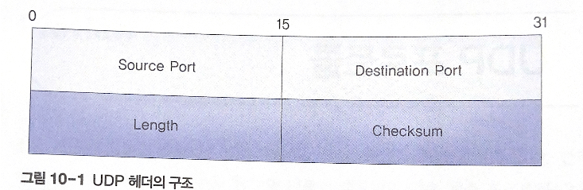
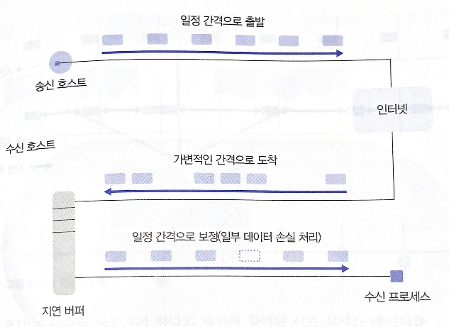
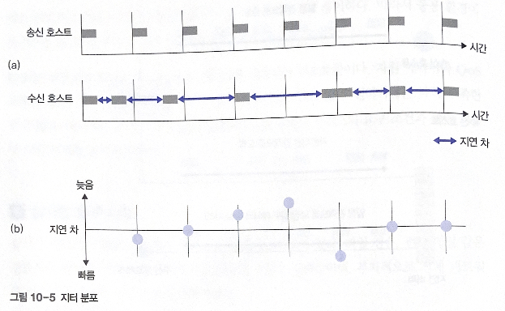
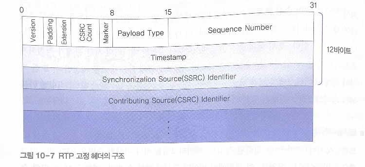

# 10. 전송 계층

# UDP 프로토콜

UDP: User Datagram Protocol, 인터넷에서 사용하는 프로토콜 중 구조가 가장 간단

IP 프로토콜을 이용해 비연결형 서비스 지원

**특징**

- 비연결형 서비스 제공
- 헤더와 전송 데이터에 대한 체크섬 기능 제공
- Best Effort 전달 방식 지원

cf. 체크섬 기능: IP 프로토콜은 데이터에 대한 변형 오류의 검출 기능x, 데이터 공간에 UDP 프로토콜의 헤더와 데이터가 캡슐화

cf. Best Effort: UDP는 IP 프로토콜에 전송한 데이터그램이 목적지까지 제대로 도착했는지 확인하지 않음

→ TCP보다 신뢰성이 떨어진다

TCP보다 데이터 처리는 빠름 → 데이터 전송 시간에 민감한 응용 환경에서 유리

## 1. UDP 헤더 구조

- **Source Port/Destination Port(송신/수신 포트)**
    - 송수신 프로세스에 할당된 네트워크 포트 번호
    - 고유 구분자: IP 주소 + 프로세스 포트 번호의 조합
    - TCP 포트 번호와 독립적으로 관리 할당
- **Length(길이)**
    - 프로토콜 헤더를 포함한 UDP 데이터그램의 전체 크기
    - 단위: 바이트, 최솟값은 8(헤더 크기)
- **Checksum(체크섬)**
    - 수신 프로세스가 데이터그램 변형 오류 감지
    - 헤더 + 데이터까지 계산
    - 체크섬 기능은 옵션, 필드 값이 0이면 체크섬 계산 x

Length 필드: 16비트, 이론적으로 (0~2^16-1)바이트, 일반적으로 8192 바이트를 넘지 않게 사용

구조가 단순해 전송 효율이 좋음, 고속 전송이 필요한 환경에 유용

## 2. UDP의 데이터그램 전송

비연결형 서비스, 데이터그램 전송

데이터그램은 전송 과정에서 독립적으로 중개

반드시 목적지에 도착하는 것을 보장하지 않음

흐름 제어 기능x → 버퍼 오버플로에 의한 데이터 분실 오류 발생 가능

### 데이터그램 분실

분실 오류 복구 기능x, 상위 계층 스스로 데이터 분실을 확인해 복구

순서 번호 기능 x → 순서 번호와 유사한 기능을 응용 프로그램 자체적으로 구현

### 도착 순서 변경

전송 순서가 뒤바뀌어 수신 프로세스에 도착

각 경로에서 데이터를 얼마나 빠르게 전송할 수 있는지 예측x

순서 번호 기능이 없어서 오류 해결x

# 02 RTP 프로토콜

음성 영상 정보의 실시간 서비스 → 데이터그램 변형/분실 오류보다 데이터그램의 도착 순서, 수신한 패킷의 지연 간격(지터) 분포의 균일성, 데이터 압축에 의한 전송 정보량의 최소화가 중요해짐

기존의 TCP, UDP: 실시간 서비스에 적절x

- TCP: 패킷의 순서와 신뢰성이 지나치게 강조, 재전송 기능과 복잡한 흐름 제어 기능
- UDP: 기능이 단순 but 데이터그램의 순서 보장x

→ RTP(Real Time Protocol): UDP에 데이터그램의 순서 번호 기능 추가

유니캐스팅 + 멀티캐스팅 지원

**RTP 특징**

- 타임스탬프 방식: 데이터 순서 정렬
- ALF(Application Level Framing) 방식: 응용 프로그램의 라이브러리 형태로 구현, 프로토콜 내부 버퍼의 크기를 각 응용 프로그램마다 별도로 관리
- 제한적인 형태로 실시간 응용 서비스 제공

## 1. 실시간 요구 사항

전통적인 인터넷 서비스 환경: 신뢰성이 가장 중요

실시간 서비스: 전송 시간이 중요

### 버퍼의 역할

데이터가 수신 호스트에 전달되는 과정에서 간격이 불규칙하게 변함

수신 호스트=**지연 버퍼를 이용해 시간 간격 보정 후 수신 프로세스에 전달**

버퍼링 작업→실시간 재생에서 요구하는 일정 범위보다 너무 늦게 도착한 데이터는 재생할 수 없으므로 버려짐

**지연**: 송신 호스트가 전송한 데이터의 출발 시간과 수신 호스트에 도착한 시간의 차이 

→ 송수신 프로세스 사이의 지연 시간에 관한 문제

### 지터

지터 분포: 데이터그램의 도착 시간을 측정하였을 때 각 데이터그램의 도착 시간이 일정하지 않고 불규칙적으로 도착하는 정도

간격이 너무 벌어지면 사용하지 못하고 버려짐

## 2. RTP의 데이터 전송

RTP: UDP 위에서 구현됨

UDP의 데이터그램 분실/도착 순서 변경 오류는 RTP 자체에서 해결

응용 서비스의 종류에 따라 기능들이 추가되는 형식으로 개별적 구현 → RTP 모듈

다수의 사용자가 하나의 세션에 참여해 서로 실시간 데이터를 전송하도록 지원

세션: RTP 참가자 사이의 연관성으로 그룹을 형성하여 멀티캐스트 전송을 지원하기 위한 것

RTP 릴레이: 믹서, 트랜슬레이터 

- **릴레이**: 송수신 프로세스가 직접 데이터를 전송할 수 없을 때 데이터를 중개
- **믹서**
    - 여러 송신 프로세스로부터 RTP 데이터그램 스트림을 받아 이들을 적절히 조합하여 새로운 데이터그램 스트림 생성
    - 조합된 데이터그램 스트림에 시간 정보 제공 (여러 데이터 간의 시간관계)
    - 데이터그램 스트림의 믹싱
- **트랜슬레이터**
    - 입력된 각 데이터그램을 하나 이상의 출력용 RTP 데이터그램으로 만들어주는 장치
    - 데이터 형식이 변할 수 있음
    - 스트림에 관심x

## 3. RTP 헤더 구조

응용 환경과 관련된 가변 크기의 헤더 추가 가능

처음 12비트의 정보: 모든 RTP 패킷에 존재

음성과 영상 데이터의 동기에 필요한 시간 정보와 데이터그램의 분실이나 도착순서 변경 등의 오류를 검출하는 기능 제공

- **Source Identifier**: 멀티캐스트 전송도 가능 - 누가 데이터를 전송했는지 확인하는 송신 구분자 필드
- **Timestamp**: RTP 페이로드에 포함된 데이터의 생성 시기, 수신 프로세스에서 지연 버퍼를 사용해 타이밍 관계 조절
- **Version**(버전): RTP의 버전 번호, 현재 2로 지정
- **Padding**(패딩): RTP 페이로드의 마지막에 패딩 데이터가 존재하는지 여부를 나타냄, 응용 환경에서 페이로드의 크기가 특정 크기의 배수가 되어야 할 때 사용
- **CSRC Count:** 기본 헤더 바로 뒤에 나타나는 CSRC(Countributing SouRCe) ID의 갯수
- **Marker(표식**): 페이로드 유형에 따라 값의 의미가 결정, 보통 데이터 스트림의 경계점 표시
- **Payload Type(페이로드 유형)**: 헤더 다음에 이어지는 RTP 페이로드의 유형
- **Sequence Number(순서 번호)**: Timestamp 필드 값이 동일한 페이로드에 대해 패킷 손실이나 순서 변경과 같은 오류를 검출
- **SSRC Identifier(SSRC 구분자)**: 임의의 세션 내에서 RTP 페이로드의 발신지가 어디인지 구분하는 고유 번호

## 4. RTP 제어 프로토콜

RTCP, RTP Control Protocol

제어와 관련된 기능 수행

UDP를 하부 전송 계층으로 사용

주요 기능

- **QoS(Quality of Service)와 혼잡 제어**
    - 세션에서의 데이터 분배 과정에서 발생하는 서비스 품질에 관한 피드백 기능 지원
    - 멀티캐스팅 과정에서 세션 멤버의 데이터 송수신 과정이 어떻게 이루어졌는지 판단
    - 송신 프로세스: 전송률 등 정보, 수신 프로세스: 수신 과정에서 발생하는 패킷 분실이나 지터 등 정보
- **Identification(구분자)**
    - RTCP 패킷에는 RTCP 송신 프로세스에 관한 구분자 정보 포함
    - 서로 다른 세션에서 발신된 스트림 정보들을 서로 연관시킴
- **세션 크기**
    - 세션 참가자의 수가 증가하면 RTCP 패킷의 전송률 감소
    - RTCP 패킷의 트래픽이 많아지면 세션 전체의 트래픽 증가 → 제한
    - 일반적으로 전체 세션 트래픽의 5% 이내로 유지되도록 알고리즘 동작

**RCTP 패킷의 종류와 역할**

- Sender Report(SR), Receiver Report(RR): 데이터 전송 품질 피드백
- Source Description(SDES): 송신 프로세스가 자신에 대한 정보를 더 많이 제공
- Goodbye(BYE): 송신 프로세스가 더 이상 존재하지 않음을 의미
- Applicationdefined Packet: 응용 환경에 따른 기능 점검

# 03 OSI TP 프로토콜

OSI에서 정의한 TP(Transport Protocol)

5개의 클래스로 서비스 분류

- 클래스 0: 기본 기능
- 클래스 1: 기본 오류 복구 기능
- 클래스 2: 멀티플렉싱 기능
- 클래스 3: ㅇ
- 클래스 4: 오류 검출, 오류 복구, 멀티플렉싱 기능

## 1. 서비스 프리미티브

TP가 제공하는 전송 서비스: 연결형, 비연결형

연결 설정: T-CONNECT, 연결 해제: T-DISCONNECT

일반 데이터: T-DATA, 긴급 데이터: T-EXPEDITED-DATA

비연결형 서비스: T-UNITDATA 프리미티브만 존재

## 2. 데이터 전송

- T-CONNECT 요구 전송
- T-CONNECT.indication 인지 → T-CONNECT.response
- T-CONNECT.confirm
- T-DISCONNECT.request: 한쪽의 요구에 의해 연결 해제