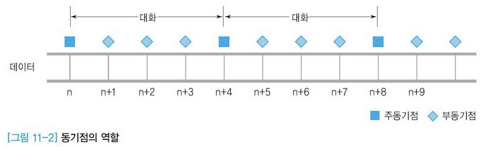

# 11. 상위 계층

# 01 상위 계층의 이해

상위 세 계층=세션, 표현, 응용 계층은 일반적으로 하나의 프로그램으로 묶여 구현

응용 환경의 요구 조건에 따라 복잡도가 달라짐

# 02 세션 계층

응용 환경에서 전송 계층이 제공하는 서비스를 손쉽게 이용하기 위해 사용자의 논리적 관점을 고려하여 단순한 사용자 인터페이스를 제공

## 1. 세션 계층의 기능

세션 계층 프로토콜 기능: 세션 연결의 설정과 해제, 세션 메시지 전송 등

세션 연결: 응용 환경에서 두 응용 프로세스 간의 세션을 설정하기 위해 만듦

- 세션 연결과 계층 4 연결의 차이
    
    
    
    - 세션 연결: 계층 4 연결이 끊겼을 때 이를 복구하여 이전에 다운로드한 내용 이후부터 연속해서 전송 받을 수 있는 기능 제공
    - 동기(Synchroniation) 문제 처리 - 통신 양단에서 동기점을 지정하기 위해 → 메시지 전송 과정에서 발생하는 오류 복구

대화 단계(세션 연결을 사용한 메시지 전송 과정)에서 오류 발생 → 이전에 설정한 동기점까지 복구 가능

## 2. 토큰

토큰: 두 응용 프로세스의 대화를 관리

토큰 보유=해당 토큰에 부여된 특정한 권리를 배타적으로 소유

### 토큰 종류

- 데이터 토큰
    - 데이터를 전송할 수 있는 권리 제공
    - 데이터를 전송하기 위해서는 데이터 토큰을 먼저 획득해야 함
- 해제 토큰
    - 통신 양단 간의 연결 해제 과정을 제어
- 동기 토큰
    - 세션 연결을 사용하는 과정에서 동기 처리가 필요한 지점에 사용

### 토큰과 동기점

대용량 파일 전송에서 작은 단위로 나누어 전송 → 전송 오류에 쉽게 대처

동기점 부여=논리적으로 큰 파일을 작은 단위로 나누는 과정, 중간중간 동기점을 설정하여 연결이 끊겨도 동기점 이후의 데이터만 복구

동기 토큰 종류

- 주동기 토큰/액티비티 토큰(특정 대화 단위 구분)
- 부동기 토큰(대화 단위 내에서 다시 작은 부분으로 나누어 처리

## 3. 동기

### 재동기 기능

동기점: 데이터를 전송할 때 특정 지점에서 복구할 수 있도록 통신 양단 간의 합의로 지정

재동기 기능 = 동기점을 이용한 일련의 복구 과정



[https://naon.me/posts/til90](https://naon.me/posts/til90)

주동기점: 두 세션 프로세스 사이에 교환되는 대화의 한 단위가 완료되는 지점에 설정

- 부동기점: 대화 단위 내의 작은 부분에서 설정
- 주동기점과 부동기점으로 구분하는 이유
    - 부동기점: 백업 정보의 처리량을 적게 하여 복구에 소요되는 부담 최소화
    - 부동기점에 저장된 백업 정보로는 오류 정보가 완벽하게 이루어지지 않을 수 있음 - 바로 앞의 부동기점으로 이동하는 과정이 반복되면서 복구 과정 진행
    - 그러나 주동기점의 경계를 넘어 되돌아가지 않음 → **주동기점이 부여됨 = 해당 지점까지 데이터 전송이 완벽하게 이루어짐**

### 액티비티 기능

액티비티: 세션 프로세스 사이에 논리적으로 설정되는 단위, 내용이 상호 독립적

그러면 액티비티는 주동기점보다 상위의 개념인건가??

## 4. 세션 연결

상위 계층의 응용 프로세스가 다른 응용 프로세스에 세션을 설정하기 위해 사용

초기 연결 과정에서 CONNECT 요구 발생 → 전송 계층 프리미티브인 CONNECT 요구로 변환하여 전송 계층을 통해 상대편 세션 사용자에게 전달

### 다중 세션 연결을 지원하는 서버

[https://ddingz.tistory.com/170](https://ddingz.tistory.com/170)


다수의 클라이언트 프로세스에 동시에 여러 세션 연결 설정 가능

개별 세션들은 논리적으로 서로 연관이 없는 독립적인 연결

서버가 제공하는 서비스 시간이 짧은 응용 환경에서 유용함

### 단일 세션 연결을 지원하는 서버


여러 클라이언트를 동시에 지원하기 위해 복사된 하위 서버 프로세스를 여러 개 만ㄷ르어야 함

클라이언트 프로세스는 최초 연결 설정은 대표 서버에 시도 → 대표 서버가 하위 서버 프로세스를 새로 실행시켜 클라이언트와 연결

단점: 클라이언트의 개별 요구마다 하위 프로세스를 생성 → 초기 서비스 환경 구축에 따른 오버헤드 증가

텔넷, FTP 등 대부분의 TCP/IP 서비스는 단일 세션 연결 방식 사용

대표 서버의 주소는 Well-known 포트로 설정

# 03 표현 계층

응용 프로세스 사이에 전송되는 메시지의 표현 방법

표현 계층 프로토콜의 전송 메시지에 표현된 문법 내용을 통신 양단의 프로세스가 해석하는 기능 제공

송신 프로세스가 전달하는 의미를 수신 프로세스에서 정확히 이해할 수 있게 함

## 1. 데이터 표현

서로 다른 코드를 사용하는 컴퓨터끼리 통신하려면 문자 코드 변환이 필요

### 추상 문법

컴퓨터에서 사용하는 데이터 표현 규칙

추상 문법으로 표현된 의미를 올바르게 송수신하려면 메시지 전송 전에 변환이 필요

→ **전송 문법**: 특정 호스트에 독립적이면서 네트워크 전체에서 일관성 있는 새로운 표현 규칙

네트워크에서 데이털르 수신할 때는 전송 문법의 데이터를 추상 무법으로 변환

### ASN.1

ISO: 분산 환경에서 표현되는 데이터를 정의하기 위한 일반적인 추상 문법

ASN.1(Abstract Syntax Notation Number 1)

응용 환경에서 폭넓게 사용

응용 계층의 문법 규칙뿐 아니라, PDU(Protocol Data Unit)의 구조를 정의하도록 만들어짐

기본 목적: 변수 선언과 관련된 데이터형의 정의

- ASN.1 규약에서 지원하는 클래스 유형

| 유형 | 설명 |
| --- | --- |
| UNIVERSAL | 일반 데이터형 |
| CONTEXT-SPECIFIC | 특정 컨텍스트와 관련된 유형 |
| APPLICATION | 응용 개체의 공통 유형 |
| PRIVATE | 사용자 정의 유형 |

### ASN.1의 UNIVERSAL 클래스

일반 데이터형 정의 → 기본형(Primitive), 구조형(Constructured)

- 기본형

| 변수형 | 의미 |
| --- | --- |
| BOOLEAN | 참, 거짓 |
| INTEGER | 정수 |
| BITSTRING | 비트들의 연속 |
| OCTSTRING | 옥텟들의 연속 |
| IA5String/GraphString |  |
| NULL | 변수형 미정의 |
| ANY | 변수형을 다른 곳에서 정의 |

```nasm
SteudentNumber ::= INTEGER
Name = IA5String
MaleFemale ::= BOOLEAN
```

- 구조형

| 변수형 | 의미 |
| --- | --- |
| SEQUENCE | 순서대로 나열한 임의 유형의 집합(고정 크기) |
| SEQUENCEOF | 순서대로 나열한 동일 유형의 집합(고정/가변 크기) |
| SET | 순서 없이 나열한 임의 유형의 집합(고정 크기) |
| SETOF | 순서 없이 나열한 동일 유형의 집합(고정/가변 크기) |
| CHOICE | 미리 정의된 유형 집합에서 선택한 순서가 없는 유형 집합(고정 크기) |

C언어의 구조체와 같은 역할

```nasm
Student Record ::= SEQUENCE {
	StudentNumber INTEGER,
	Name IA5String,
	MaleFemale BOOLEAN
}
```

### ASN.1의 태그

태깅 기능 - 구조형에 선언된 변수를 개별적으로 사용

일반 프로그래밍 언어의 배열에서 사용하는 인덱스와 기능이 유사

- CONTEXT-SPECIFIC: 태그의 범위가 현재 구조형에 한정되어 적용
- APPLICATION: 태그의 범위가 전체 응용 컨텍스트에 적용
- PRIVATE: 태그의 범위가 해당 사용자에게 적용

```nasm
Student Record ::= SEQUENCE {
	StudentNumber [APPLICATION 1] INTEGER,
	Name [1] IA5String,
	MaleFemale [2] BOOLEAN
}
```

### 데이터 압축과 보안

압축: 전송 데이터 양이 많을 때 원래 의미를 유지하는 범위 내에서 크기를 줄이는 것

암호화: 데이터를 송수신하는 당사자 외의 제3자에게 부당하게 정보가 유출되거나 왜곡되는 현상 방지

## 2. 데이터 압축

대용량 데이터: 압축하여 전송하는 것이 전송 속도 면에서 유리

데이터의 압축 정도: 데이터 패턴에 영향을 받음, 중복 정보가 많으면 압축률이 높다

어떤 알고리즘을 적용하느냐에 따라 압축률이 달라짐

### 연속 문자 압축

특정 문자가 몇 번 반복된다는 표현 기법을 사용 → 데이터 크기를 줄일 수 있음

압축 해제: 압축 데이터를 이용해 원본 데이터를 얻는 과정

동일 패턴이 없으면 압축 데이터가 오히려 커질 수 있음

### 손실 비손실 데이터 압축

비손실 압축: 원래 데이터의 내용을 분실하지 않음, 압축 해제를 통해 얻은 데이터가 원래 데이터와 완전히 동일

손실 압축: 원래 데이터와 동일하지 않음, 데이터 손실 정도는 응용 환경에 따라 허용 범위가 다르다

손실 압축을 사용하는 이유: 비손실 압축에 비하여 압축 데이터의 크기가 작기 때문

# 04 응용 계층

하부 계층을 이용해 사용자에게 편리한 응용 환경 제공

TCP/IP 기반 인터넷 환경, 유닉스 운영체제 중심으로

## 1. 클라이언트 서버 모델

하나의 서버 프로그램이 다수의 클라이언트에 응용 서비스를 제공

- 절차
1. 서버: 통신 대기
2. 클라이언트가 연결 요구 (IP 주소 + 포트 번호)
3. 데이터 송수신

서버 프로세스는 시작되면 영원히 종료되지 않고 실행, 다수의 클라이언트 요청을 반복적으로 수행

네트워크 연결: TCP 혹은 UDP 프로토콜의 포트 연결로 구현

### 연결형 비연결형 서비스

어떤 연결 방식을 사용할지?

- UDP 비연결형 서비스
    - 빠른 통신, 데이터 분실/비순서 도착이라는 단점
    - 연결 설정에 따른 클라이언트와 서버 사이의 상태 문제를 해결하기 곤란한 응용 환경에서 주로 사용, 복구 절차가 간단하기 때문
    - ex. 네트워크 파일 공유 프로그램
- TCP 연결형 서비스
    - 신뢰성이 높음, 속도가 떨어짐
    - 대부분의 응용 프로그램

### 상태 정보

연결형 서비스: 클라이언트와 서버 사이의 연결로 인해 둘 사이의 **현재 상태**라는 개념 존재

종류

- 가장 단순: 연결 설정 관련
- 기타 정보: 클라이언트와 서버가 하나의 단위로 처리해야 하는 동작을 여러 단계로 나누어 처리하는 경우
    - 비상태 서비스의 예시: 원격 파일 서비스를 제공하는 파일 서버
    - 클라이언트가 파일 서비스 요청 → 서버가 결과를 응답 - 하나의 단위로 완결
    - 파일 서버를 상태 서비스로 구현: 이전 절차에서 수신한 정보를 서버가 내부적으로 보관
    - **클라이언트와 서버 사이의 요청과 응답이 한 번으로 완결되는 경우=비상태 서비스**

상태 정보를 잃어버렸을 때 다운되기 직전 상태로 복구해야 하는 문제 발생

### 동시성 제어

임의의 동작이 외형상 동시에 진행되는 것처럼 보이는 것

여러 동작이 동시에 실행되어도 각 실행결과가 항상 같은 결과 제공 → 독립적으로 실행되는 프로세스의 실행 순서가 결과에 영햐을 주지 않음

cf. 클라이언트 서버 환경에서의 동시성: 서버 하나가 여러 클라이언트에 동시에 서비스하는 경우

반복 서비스 방식(다중 세션 연결 지원): 동시성 지원x, 특정 시간에 클라이언트 하나에만 서비스 제공

동시성 서비스 방식(단일 세션 연결 지원): 여러 클라이언트의 서비스 요청 동시에 지원