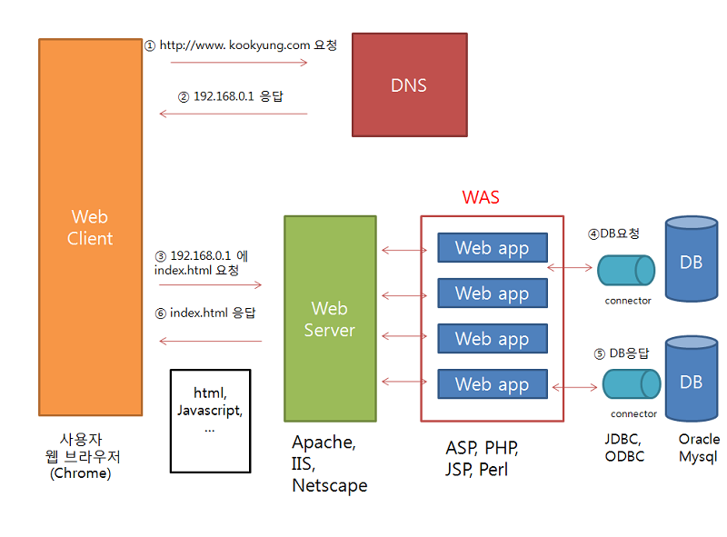
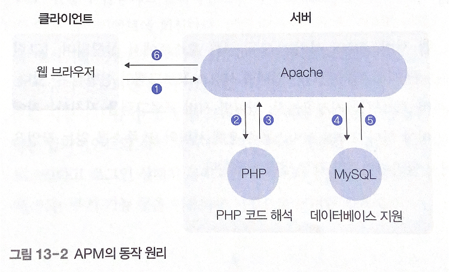
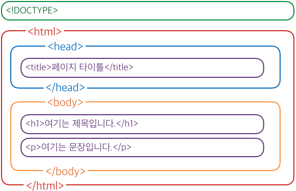

# 13. 웹(WWW)

# 01 웹의 구조

www 서버의 TCP 포트 번호: 80번

클라이언트와 서버는 사용자의 정보 요구가 발생할 때마다 새로운 연결 설정, 해제

## 1. 클라이언트 서버 모델

사용자가 URL 주소를 새로 입력/링크 클릭 → 클라이언트와 서버의 연결 설정 해제 과정 반복

URL(Uniform Resource Locator): 클라이언트가 웹 서버를 지칭할 때 사용하는 주소

세 부분으로 표현 - 프로토콜, 서버의 호스트 이름, 서버 내부의 파일 경로명

포트 번호 80번 사용

- 임의의 서버 호스트에서 웹 서비스를 구축하는 방법
    - 해당 호스트를 대표하여 웹 서버 구축
    - 서버에 등록된 사용자별로 웹 서버 구축

HTTP(HyperText Transfer Protocol): 클라이언트의 요청과 서버의 응답 정보를 전송하기 위한 목적으로 구현된 프로토콜

- 클라이언트가 서버에 보내는 요청 메시지, 서버의 응답 메시지 전송을 위해 사용

클라이언트와 서버 사이에 메시지 전송 완료 → TCP 연결 즉시 해제 

사용자가 화면을 보는 시점에는 클라이언트와 서버 사이의 연결 x



[https://all-young.tistory.com/21](https://all-young.tistory.com/21)

1. 사용자가 웹 브라우저에 URL 주소 입력
2. 클라이언트(웹 브라우저): 서버의 호스트 이름을 DNS 서버에 전송 - IP 주소를 얻어냄
3. 웹 브라우저는 IP 주소와 포트 번호(80)을 사용하여 웹 서버와 TCP 연결 시도
4. TCP 연결 설정, 클라이언트가 GET 명령 전송
5. 웹 문서를 웹 브라우저에 회신(응답)
6. 연결 해제, 웹 브라우저가 화면에 표시

## 2. APM의 웹 서비스 구조

APM: PHP, Apache, MySQL을 통칭

- PHP: 유닉스, 리눅스 환경에서 웹 서비스 기능을 향상
- Apache: 웹 서버 프로그램
- MySQL: 데이터베이스 기능 지원

PHP: HTML 언어 기능 보완, HTML 문서 내부에 PHP 코드 추가

cf. ASP(Active Server Page): MS 윈도우즈 서버에서 제공하는 다양한 컴포넌트를 사용할 수 있음

PHP: 모든 종류의 운영체제에서 지원

### APM의 동작 원리



(1) 웹 브라우저가 Apache 모듈과 연결 설정하여 웹 문서 요청

(2)

- HTML만으로 구성: Apache 모듈이 웹 브라우저에 문서 내용 회신(6)
- PHP 코드를 사용: PHP 모듈에 해당 코드 전송, HTML 코드로 변환하도록 요청(2)
    - PHP 모듈이 Apache 모듈에 반환(3)
    - 클라이언트에 회신(6)
- MySQL 데이터 필요: MySQL에 데이터를 보내고(4) 데이터를 받음(5)

### PHP 코드의 처리

HTML 문서 내용의 일부로 작성

`<? ?>` 구분자를 사용하여 HTML 코드와 구분함

# 02 HTML의 기초

## 1. HTML 문서의 기초



[https://www.devkuma.com/docs/html/html-기본-구조/](https://www.devkuma.com/docs/html/html-%EA%B8%B0%EB%B3%B8-%EA%B5%AC%EC%A1%B0/)

# 03 HTTP 프로토콜

HTTP: 분산 하이퍼미디어 환경에서 빠르고 간편하게 데이터를 전송하는 프로토콜

TCP 프로토콜의 80번 포트를 사용

사용자는 URL 가장 왼쪽에 사용할 프로토콜을 표현함

## 1. HTTP의 요청과 응답

HTTP 1.1

- HTTP 클라이언트가 서버에 요청(요청 메서드, URL, HTTP 버전 포함)
- HTTP 서버는 응답 코드(요청 처리 결과)가 포함된 상태 정보 회신

### 비상태 연결

TCP 연결 설정 → 요청/응답 → TCP 연결 해제

둘 사이에 연결 존재에 따른 상태 정보 존재x - 단발성 연결 방식

### MIME 유사 메시지

MIME(Multipurpose Internet Message Extensions) 유사 구조를 사용해 데이터 전송

HTTP MIME 유사 개체: Content-Length 라는 헤더 필드 존재, 

Content-Encoding과 Transfer-Encoding 필드 사용

### 요청 메시지

요청문 - 헤더 - 공백 한 줄 - 본문(Body)

- 요청문: 요청메서드, URL, HTTP 버전
- 헤더: 헤더 이름: 헤더 값

**요청 메서드의 명령**

- GET: 서버에 URL이 가리키는 웹 문서의 내용을 전송하도록 요구, 문서 내용은 서버가 회신하는 응답 메시지의 바디에 포함
- HEAD: 문서 내용보다 특정 문서의 정보를 원할 때 사용
- POST: 클라이언트가 서버에 정보를 전송
- PUT: 클라이언트가 서버에 문서를 전달하려고 사용. 문서 내용은 바디에 포함됨

### 응답 메시지

상태문 - 헤더 - 공백 한 줄 - 본문

- 상태문: <HTTP 버전> <상태 코드> <상태 이름>

**HTTP 상태 코드**

- 200: OK, 요청이 성공적으로 수행됨
- 202: Accepted, 클라이언트의 요청 수신, 즉각 실행되지 않고 있음
- 400: Bad Request, 요청 메시지의 내용에 문법 오류가 있음
- 401: Unauthorized, 요청을 실행하는 데 필요한 적절한 권한이 존재하지 않음
- 403: Forbidden, 서비스 요청이 거부됨
- 404: Not Found, 원하는 문서를 찾을 수 없다
- 500: Interner Server Error, 서버 내부에 불가피한 오류 발생
- 501: Not Implemented, 요청 사항을 수행할 수 없다

## 2. HTTP의 동작 과정

### 요청 메시지

예시

```c
GET /index.php HTTP/1.1 요청문
Host: uu.ac.kr    헤더
공백 한 줄
```

### 응답 메시지

```c
HTTP/1.1 200 OK 상태문
Date: ~~
Server: ~~
X-Powered-By: ~~
Transfer-Encoding: ~~
Content-Type: ~~
// 헤더
공백 한 줄
바디
<html>
~~
</html>
```

# 04 CGI

CGI(Common Gateway Interface): 웹 브라우저에서 사용자가 입력하는 정보를 처리하기 위한 기능

HTML에서 form 태그