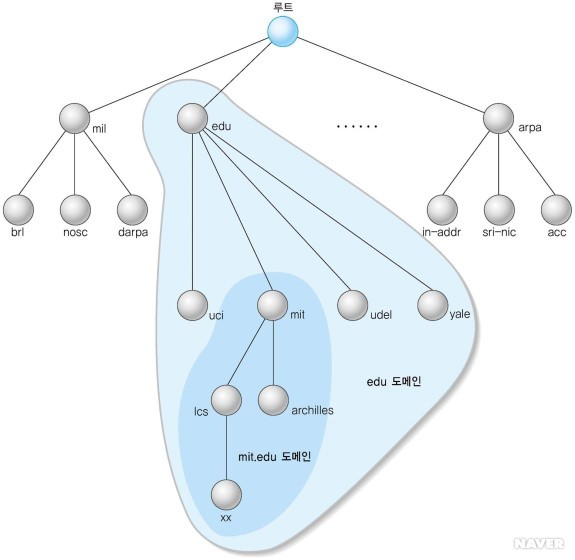
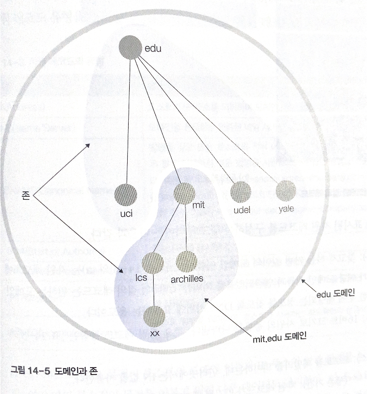
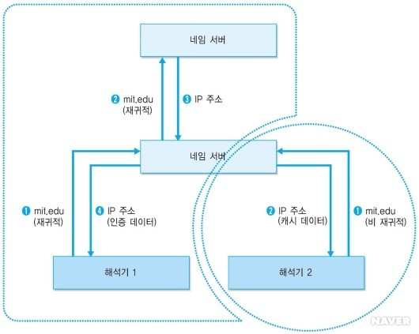
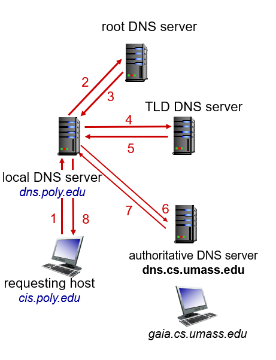
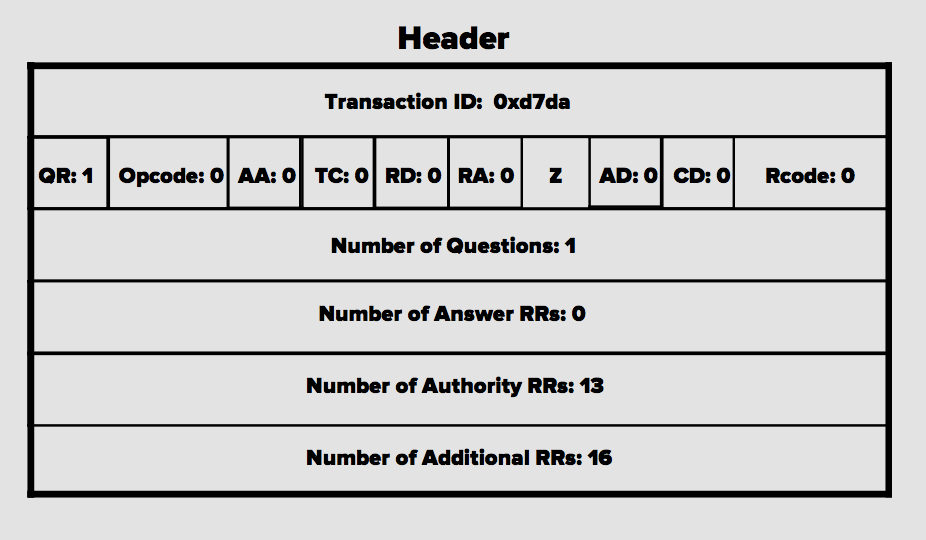

# 14. DNS

# 01 주소의 변환

## 1. IP 주소 체계

32비트의 이진수로 된 IP 주소로 호스트 구분

**IP 주소 클래스**
| 표 | IP 주소 범위 | 네트워크 주소 | 호스트 주소 |
| --- | --- | --- | --- |
| A | 0~127 | www | xxx.yyy.zzz |
| B | 128~191 | www.xxx | yyy.zzz |
| C | 192~223 | www.xxx.yyy | zzz |

호스트 주소: 임의로 사용 가능한 주소

A: 주소 범위가 2^24 → 많은 호스트 수용 가능

## 2. DNS 필요성

인터넷 사용자가 호스트 지칭: 문자형의 도메인 이름으로 주소 표현

→ IP 주소로 변환 필요

한 시스템에서 모든 호스트의 정보를 유지하기 어려움 → DNS 서비스 고안

**DNS**

계층 구조를 지원하는 도메인 기반의 주소 표기 방법을 위한 분산 데이터베이스 시스템

목적: 도메인 이름 → IP 주소 얻기

ex. 유닉스 시스템 nslookup 명령

**구성 요소**

- 네임 스페이스
    - 데이터에 대한 이름 관련 규칙 정의
    - 트리에 연결된 호스트: 자원 레코드라는 정보 집합체로 표현
    - 이 집합체에서 특정 유형의 정보를 얻음
- 네임 서버
    - 네임 스페이스의 트리 구조와 트리에 보관된 정보 집합체 관리 프로그램
    - 자신이 관리하는 도메인 공간에 대한 정보 책임
    - 네임 서버 포인터: 전체 도메인 구조의 다르 부분 정보를 제공하기 위한 네임 서버 포인터를 가지고 있음
- 해석기
    - 네임 서버로부터 클라이언트의 요청 정보를 얻어내는 프로그램
    - 네임 서버의 정보를 이용해 응용 프로그램의 질의에 응답

# 02 네임 스페이스

네임 스페이스: DNS가 저장 관리하는 계층적 데이터베이스

네임 스페이스의 호스트: 레이블(크기가 최대 63바이트)을 이름으로 가짐, 루트 호스트=널 레이블

도메인 이름은 점으로 구분한 호스트 레이블의 연속

## 1. 네임 스페이스의 구조

[https://copycode.tistory.com/124](https://copycode.tistory.com/124)

ex. [media.korea.com](http://media.korea.com) com=기구 성격, korea=기구 이름, media=기구 내부 하부 조직 이름

최상위부터 순차적으로 계층적 소속 관계를 나타냄

계층적 트리 구조 지원

그림에서 xx 호스트의 도메인 이름: [xx.lcs.mit.edu](http://xx.lcs.mit.edu) → 상위 노드로 이동하면서 점으로 구분한 레이블 이름을 붙임

**TLD**(Top Level Domain)=최상위 도메인: 루트 바로 밑에 위치한 호스트(ex. edu), 도메인 이름의 맨 오른쪽에 위치

루트: 이름이 없는 호스트

**동일 노드** 아래에서 **레벨이 같은 호스트**는 **이름이 유일**해야 한다

도메인: 도메인 네임 스페이스에서 하부 트리 전체를 의미, [mit.edu](http://mit.edu) 도메인과 edu 도메인의 차이

- 최상위 도메인의 분류
    - net: 네트워크 관련 기관(네트워크 지원 센터)
    - com: 상업적 기관
    - biz: com과 유사한 비즈니스 목적 회사
    - info: 정보 서비스 제공자
    - coop: 협동 조합
    - pro: 전문가 관련 기관
    - aero: 항공 관련 기관
    - int: 국제 기관
    - edu: 교육 기관
    - org: 비영리 기관
    - museum: 박물관 관련 기관
    - gov: 미국 연방정부 기관
    - mil: 미국 국방성 기관
    - name: 개인
- 국가 코드 최상위 도메인도 사용

## 2. 데이터베이스 서비스

각 하부 도메인을 관리하는 서버에 이름, 주소 검색 권한을 위임 → DNS 구조가 단순해짐

### 계층 구조의 네임 서버

전 세계에 흩어져 있는 네임 서버를 계층 구조 형식으로 관리

권한의 위임 과정 → 하부 구조 전체에 대해 재귀적으로 적용

이웃하는 네임 서버끼리 정보 교환이 필요할 때는 상위 네임 서버의 중개를 통해 정보를 얻는다

### 도메인과 존

존(Zone): 임의의 네임 서버가 관리하는 영역

도메인인과 존은 유사하면서도 다르다

edu 도메인 하부에 mi.edu라는 도메인이 존재하기 때문에 edu 도메인에는 서로 구분되는 존이 2개 존재 (edu와 mit.edu)

특정 네임 서버가 자신의 하위에 있는 도메인을 전적으로 관리한다면 도메인=존 (mit.edu 하위에 도메인이 없다면)

## 3. 자원 레코드

자원 레코드(RR, Resource Record): 이름과 주소 정보를 위한 데이터베이스이므로 레코드 개념이 필요

네임 서버: 자원 레코드를 이용해 정보 보관

해석기: 질의 레코드를 이용해 네임 서버에 정보 요청

**자원 레코드**

| Name | 찾으려는 가변 길이의 도메인 이름, 보관된 정보가 해당 도메인 이름과 연관 |
| --- | --- |
| Type | 16비트 크기, 자원의 종류를 나타냄 |
| Class | 프로토콜 패밀리 의미, 인터넷에서 IN 사용 |
| Time To Live | 자원 레코드가 만기될 때까지의 유효 시간 |
| RD Length | 자원 데이터의 길이를 바이트로 |
| RD | 자원 레코드와 관계된 데이터 |

**질의 레코드**

| Name | 찾으려는 가변 길이의 도메인 이름, 원하는 도메인 이름을 기록하여 DNS 서버에 요청 |
| --- | --- |
| Type | 16비트 크기, 자원의 종류를 나타냄 |
| Class | 프로토콜 패밀리 의미, 인터넷에서 IN 사용 |

**자원 레코드의 유형**

- A(Address): 호스트의 IP 주소
- NS(Name Server): 네임 서버
- CNAME(CAnonical Name): 별명을 갖고 있는 호스트의 정식 이름
- SOA(Start of Authority): 존의 시작
- WKS(Well-known Services): 호스트가 제공하는 네트워크 서비스 정의
- PTR(Pointer): 도메인 이름을 가리키는 포인터, IP→도메인 변환 시 사용
- HINFO(Host Information): 호스트 정보

다른 부수적인 목적: 메일 교환 정보의 활용(Mail Exchange)

MX 레코드: 특정 메일 주소로 전송된 인터넷 메일을 다르 주소로 재전송

# 03 네임 서버와 해석기

DNS 서비스에서 중요한 것: 분산 네트워크 서비스 지원

## 1. 해석기

해석기(Resolver)에 정보 제공 요청 → 가장 가까운 네임 서버와 접촉해 정보 제공 요청 → 정보가 없으면 정보를 찾는 과정을 반복

### 인증 데이터

다수의 네임 서버 지원 → 도메인 데이터에 대해 인증 데이터, 캐시 데이터

**인증 데이터(Authoritative Data**

해당 데이터를 직접 관리할 책임이 있는 네임 서버로부터 받은 정보

**캐시 데이터(Cached Data)**

이전 요청에 의해 호스트가 보관하던 데이터, 재사용할 목적으로 저장

캐시 데이터가 현재 데이터와 다른 정보를 제공할 수 있어서 TTL 제공

### 존

존: 자원 레코드에 포함되는 인증 데이터의 집합체

포함 요소

- 존에 속하는 모든 호스트의 전체 자원 레코드 집합체
- 존에 포함된 최상위 호스트
- 위임 서브 존: 자신의 존에 속하지만, 인증이 위임된 경우
- 위임된 서브 존에 관한 글루 데이터: 서브 존의 네임 서버에 접근할 수 있도록 해줌

네임 서버는 다른 네임 서버로부터 수신한 캐시데이터 유지 → 자신의 네임 스페이스 + 관리 밖에 있는 호스트의 정보도 인증 가능

→ 존을 적절히 관리하는 것이 중요

****예시****

[mit.edu](http://mit.edu) 존 아래에 위치한 서브 존 info.mit.edu

서브 존의 네임 서버가 서브 존 도메인 내부에 위치하면 해석기에 혼란

mit.ed 도메인의 네임 서버인 dns.mit.edu가 해석기에 [dns.info.mit.edu](http://dns.info.mit.edu)에 주소 정보를 문의 하라고 응답 → 해석기가 IP 주소를 알 수 있도록 서브 존의 위임에 관련된 글루 데이터가 사용됨

상위 존의 네임 서버는 위임된 서브 존의 네임 서버에 관한 도메인 이름과 주소를 유지 → 정보를 얻음

## 2. 요청의 처리

같은 도메인에 있는 호스트의 정보 요청 → 간단히 처리

다른 도메인에 소속된 호스트의 정보 요청 → 가장 관련 있는 인근 네임 서버와 연결

가장 적절한 인근 네임 서버: 네임 서버가 관장하는 존의 상위에 위치 → 원하는 정보를 찾을 때까지 반복

- 호스트가 DNS 정보를 요청할 때 인증 데이터의 필요 여부를 명시, 인증 데이터가 필요한 경우가 아니라면 캐시 데이터 사용
- 해석기는 질의 요청이 재귀적으로 처리되는지 명시할 수 있음
    - 비재귀적 요청을 받은 경우: 인증 데이터를 가지고 있다면 회신 or 다른 네임 서버의 포인트 정보 회신

### 재귀적 처리

재귀적 요청을 받은 네임 서버는 해석기와 같은 클라이언트 역할 수행 → 최초의 해석기가 자신에게 요청한 것과 동일한 질의 요청을 다른 네임 서버에 전송

[https://copycode.tistory.com/125](https://copycode.tistory.com/125)

### 반복적 처리

로컬 네임 서버가 여러 네임서버를 직접 접촉

[https://wogh8732.tistory.com/24](https://wogh8732.tistory.com/24)

# 04 DNS 프로토콜

DNS 호스트도 클라이언트와 서버 기능을 동시에 수행

## 1. DNS 메시지

호스트는 DNS 데이터 요청, 또는 DNS 메시지 전송

### DNS 메시지의 구조

- Header: 12바이트, 필수 사항
- Question: 질의 레코드, 질의 메시지와 응답 메시지에서 모두 사용
- Answer: 서버가 클라이언트에 회신하는 응답, 응답 메시지에서 사용
- Additional: 응답 메시지로 사용, 해석기에 필요한 추가 정보 제공

### DNS 헤더

[https://www.catchpoint.com/blog/how-dns-works](https://www.catchpoint.com/blog/how-dns-works)

- Identification: 클라이언트의 질의에 대해 회신된 응답이 서로 연관되는지 확인
- QR: Query Response, 메시지 종류를 나타냄 0=질의, 1=응답
- OPcode: 질의나 응답의 종류, 0=표준 요청, 1=역방향 요청, 2=서버 상태에 대한 요청
- AA: Authoritative Answer, 네임 서버가 인증 권한이 있는 서버임을 나타냄(응답 메시지에만 사용)
- TC: Truncated, 1로 지정하면 응답의 크기가 512바이트(UDP 프로토콜 최대크기)를 초과하여 잘렸음을 알려줌
- RD(Recursion Desired): 1이면 재귀적인 응답을 원함, 질의 메시지에서 사용
- RA(Recursion Available): 응답 메시지에서 사용, 네임 서버가 재귀적인 응답을 지원한다
- Z: 예약 필드, 000으로 지정
- Rcde: 응답 메시지에서 응답 오류를 나타냄, 0이면 오류가 없다
- QUCOUNT: DNS 메시지의 Question 필드에 있는 질의 레코드의 개수
- ANCOUNT: 응답용 DNS 메시지에서 Answer자원 레코드의 개수
- AUCOUNT: 응답용 DNS 메시지에서 Authority 자원 레코드의 개수
- ARCOUNT: 응답용 DNS 메시지에서 Additional 자원 레코드의 개수

### UDP 프로토콜

해석기, 네임 서버: 53번 포트를 사용하여 UDP 프로토콜로 DNS 전송

DNS 메시지가 512바이트보다 크면 TCP 사용

## 2. DNS 프로토콜 동작 과정

해석기가 [www.korea.co.kr](http://www.korea.co.kr) 이라는 호스트이 IP 주소를 찾는 과정

### 질의 메시지

로컬 네임 서버에 질의 메시지 전송

Identification: 메시지 식별자

플래그: 0x0100(QR=0: 질의 메시지, OPcode=0: 표준 질의, RD=1: 재귀적 응답)

QUCOUNT=1 → 질의 레코드 하나만 있다

질의 레코드 전송

### 응답 메시지

Identification: 질의 메시지와 동일

플래그: 0x8180(QR=1: 응답 메시지, OPcode: 표준 질의, RD=1, RA=1: 재귀적 질의 응답, 오류 발생x)

QUCOUNT:1, ANCOUNT:2 , AUCOUNT:2, ARCOUNT:0

재귀적 응답이 포함되어 있음

응답 메시지에 Answer 자원 레코드 2개 존재

→ type:C