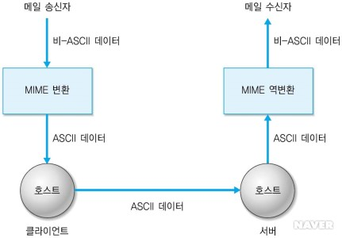
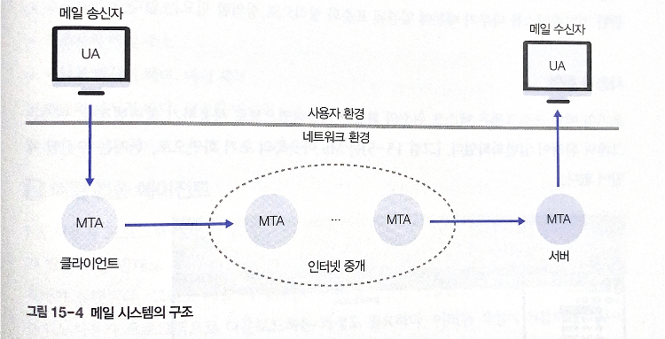
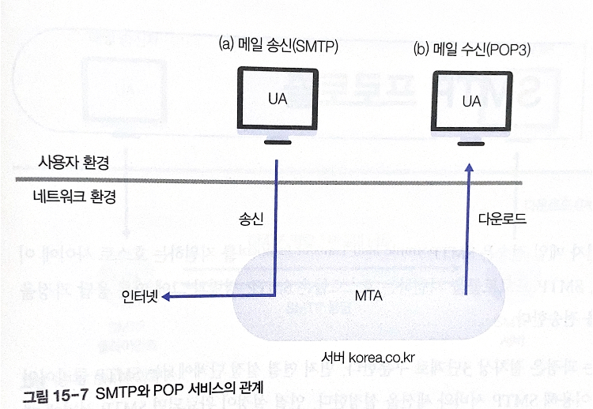
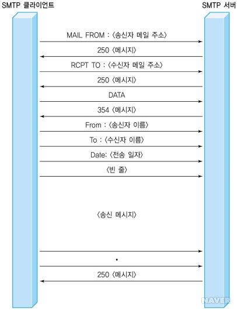
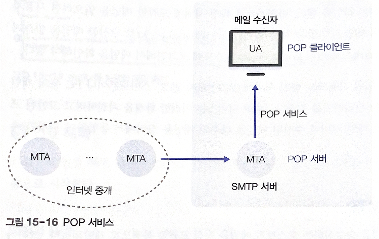

# 15. 전자 메일

# 01 사용자 환경

**전자 메일을 이용한 작업**

- 메일 편집
- 메일 내용 읽기
- 수신 메일 관리
- 전달 여부 통지
- 메일 전달: TCP 사용

## 1. 메일 처리

전자 메일 주소

```
<로그인 이름> @ <메일 서버 이름>
```

로그인 이름: 호스트에 등록된 사용자 구분자

메일 서버 이름: 메일이 전송되는 최종 목적지 호스트의 도메인 이름

## 2. 메일 형식

ASCII 기반 텍스트 형식 + 멀티미디어 데이터

SMTP 프로토콜: 메시지 헤더 + 메시지 내용

**사용자 헤더의 종류**

- To: 수신자의 전자 메일 주소
- CC: 참조 수신자의 전자 메일 주소
- BCC:참조 수신자의 전자 메일 주소, CC와 유사, 메일 내용에 포함x
- From: 송신자의 이름
- Sender: 송신자의 전자 메일 주소
- Date: 메일 전송 시간
- Subject: 메시지 제목

## 3. MIME

멀티미디어 환경 확대 → 이진 데이터 형식의 실행 파일, 영상 음성 데이터

MIME(Multipurpose Internet Mail Extensions)

SMTI 프로토콜에서 사용하던 ASCII 기반 메시지 형식 유지

+멀티미디어 데이터 인코딩 방법 추가로 정의



[https://naon.me/posts/til133](https://naon.me/posts/til133)

결과적으로 모든 메일 데이터는 ASCII 형식 으로만 전송, 중간의 메일 전송 과정은 SMTP 프로토콜이 처리

**MIME 헤더**

- MIME-Version: MIME 버전, 이 필드 값이 없으면 이후 데이터를 텍스트로 간주
- Content-Description: 메시지 내용 설명, 수신자는 이 값을 이용해 메시지 내용 파악
- Content-Id: 구분자
- Content-Transfer-Encoding: 전송 시 메시지 내용의 형식
- Content-Type: 메시지 유형, 메시지의 데이터 종류 구분, `<타입>/<서브타입; 매개변수>` 형식

# 02 시스템 구조



- 사용자 환경
    - 메일 내용을 읽고 편집하는 일을 담당하는 사용자 인터페이스
    - 사용자 에이전트(UA, User Agent)
    - PC에서 메일을 송수신 하는 프로그램
- 네트워크 환경
    - 메일 전송 에이전트(MTA, Mail Transfer Agent)
    - 인터넷에서 메일을 송수신하고 중개

## 1. 사용자 에이전트

메일을 송수신하기 위해 이용하는 프로그램

### 사용자 화면

### 메일 프로그램 입력 정보

- 송신자의 메일 주소
- 수신자의 메일 주소
- 참조자의 메일 주소
- 메일의 메시지 헤더: 메일 제목
- 메일의 메시지 바디: 전송할 메일의 내용

## 2. 메일 전송 에이전트

전자 메일을 실제로 수신자에게 전송하기 위해 필요

목적지 호스트에서 메일을 수신하고 보관하는 작업

### MTA 정보 설정

POP(Post Office Protocol) 서비스: UA와 MTA 서버 사이의 연계 프로토콜, 헌재 POP3

SMTP(Simple Mail Transfer Protocol): UA 사용자 프로그램의 송신자 모듈이 메일을 전송하기 위해 전자 메일 서버에 전송 요청 의뢰, 이때 사용하는 프로토콜

### SMTP와 POP 서비스의 관계



PC는 받는 메일 서버(PO3)로 설정된 POP 서버로부텉 메일을 다운로드

메일 송신: 보내는 메일 서버(SMTP)로 설정된 SMTP 클라이언트의 메일 송신 기능 필요

일반 환경을 기준으로 메일 프로그램은 송신용 UA, 수신용 UA 기능 함께 구현

# 03 SMTP 프로토콜

전자 메일 전송: SMTP 프로토콜을 지원하는 호스트 사이에 이루어짐

1. 연결 설정 단계: SMTP 클라이언트가 TCP를 이용해 SMTP 서버와 세션 설정
2. 데이터 전송 단계: SMTP 서버에 메일을 보냄
3. 연결 해제 단계: TCP 연결 종료, SMTP 세션 종료

## 1. SMTP 구조


메일을 전송하는 SMTP 클라이언트와 메일을 수신하는 SMTP 서버 사이의 데이터 전송에 대한 규칙

SMTP 서버에 대한 접근 가능성 확인, 서버와 연결 설정, 메일 전송

## 2. SMTP의 명령과 응답

**SMTP 명령**

- HELO + <송신자의 호스트 이름>: SMTP 세션 시작, 송신자의 호스트 이름 전송 → 서버에 자신의 신분을 알림
- MAIl + <송신자의 메일 주소>: 송신자의 메일 주소를 서버에 통지
- RCPT + <수신자의 메일 주소>: 수신자의 메일 주소 통지
- DATA + <메시지의 내용>: 메일 메시지를 서버에 송신
- QUIT: SMTP 세션 종료
- RSET: 현재 연결 상태가 종료되었음을 통지, 연결 재설정
- VRFY + <수신자의 메일 주소>: 수신자의 주소 조회
- NOOP: 수신자의 상태 검사

**SMTP 응답**

- 2yz: 긍정적 완료 응답
- 3yz: 긍정적 중간 응답
- 4yz: 임시 부정적 완료 응답
- 5yz: 영구 부정적 완료 응답

## 3. SMTP 세션 연결

SMTP 클라이언트가 SMTP 서버의 Well-known 포트인 25번 포트로 TCP 연결을 만든다

### 명령과 응답

TCP 연결 요청 → SMTP 서버

SMTP 서버: SMTP 클라이언트에 220 <메시지> 전달(메일 수신할 준비가 됨)

SMTP 클라이언트: HELO<송신자 호스트> → SMTP 서버

SMTP 서버: 250 <메시지> → SMTP 클라이언트 (세션 연결 절차 완료)

## 4. 데이터 전송

### 명령과 응답



[https://naon.me/posts/til136](https://naon.me/posts/til136)

- 송수신자의 메일 주소 확인(MAIL FROM 명령, RCPT TO 명령)
    - SMTP 클라이언트가 SMTP 서버에 송신자와 수신자의 메일 주소 전달
    - MAIL 명령-송신자 메일 주소 전달
    - RCPT 명령-수신자 메일 주소 전송
    - SMTP 서버: 긍정 응답(수신자 메일 주소가 자신의 호스트에 등록된 사용자인지 확인)
- 메일 헤더 정보의 전송(From, To, Date)
- 메일 메시지의 전송
    - 더 이상 전송할 데이터가 없으면 마지막을 의미하는 점(.) 전송

## 5. 연결 해제

QUIT 명령 전송으로 시작

### 명령과 응답

클라이언트가 QUIT 명령 전송

SMTP 서버: 221<메시지> 회신

# 04 POP 서비스

POP 서비스: 메일 서버에 로그인하지 않고, 개인용 장비에서 메일 관리

다수의 메일 서버에 수신된 메일을 다수의 개인용 장비에서 통합하여 관리

## 1. POP와 SMTP

SMTP: 호스트 사이의 메일 교환 프로토콜

POP: SMTP 서버와 PC/스마트폰 연동



SMTP 서버에 메일 도착

→ POP 서비스에서 SMTP 서버가 POP 서버로 동작

POP 프로토콜을 사용해 POP 클라이언트(개인용 장비)로 메일을 다운로드

### POP와 SMTP 비교

POP 특징

- 클라이언트와 서버 사이 동작: SMTP처럼 명령과 응답
    - POP: 110번 포트 사용
- 메일을 송신하는 과정(SMTP 클라이언트가 서버와 연결)은 수신자로부터 사전 인증 허가를 받지 않고도 가능
- 수신된 메일을 읽을 때(POP 클라이언트가 POP 서버와 연결)는 로그인 절차에 의한 인증과정이 반드시 필요

## 2. POP 명령과 응답

POP 클라이언트가 POP 서버에 명령 전송 → POP 서버가 명령 실행 → 그 결과를 응답 형식으로 만들어 클라이언트에 회신

**POP3 명령**

- USER + <POP3 서버의 로그인 이름>: 사용자 인증 절치에 필요한 정보(서버에 등록된 매일 주소의 로그인 이름) 전송
- PASS + <POP3 서버의 로그인 암호>: 사용자 인증 절차에 필요한 정보(POP3 서버에 등록된 로그인 이름의 암호) 전송
- STAT: 로그인 사용자에게 POP3 서버에 보관된 메일 개수를 회신
- LIST +<일련번호>: 일련번호를 생략-도착한 메일 정보를 일련번호와 함께 출력, 일련번호O-해당 메일의 정보만 출력
- RETR + 〈일련번호〉: 일련번호에 해당하는 메일을 POP 서버로부터 읽음, 명령 성공시 POP 클라이언트로 메일 복사
- DELE +<일련번호>: RETR 명령으로 읽은 메일을 POP서버에서 삭제
- QUIT: POP 세션을 종료

**POP3 응답**

- +OK: 요구한 명령을 성공적으로 처리
- -ERR: 명령 처리 실패

## 3. POP 동작 시나리오

### TCP 연결의 설정과 인증

![D20E5CA6-FFA1-4B07-8897-D519054C91DB.jpeg](./img/ch15-7.jpeg