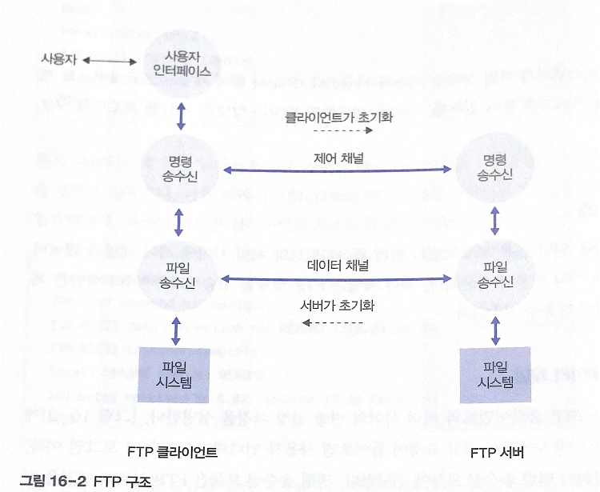
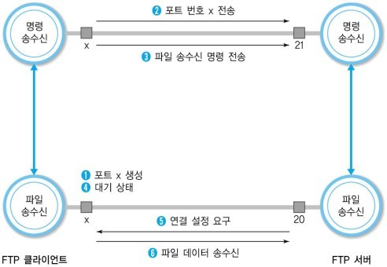
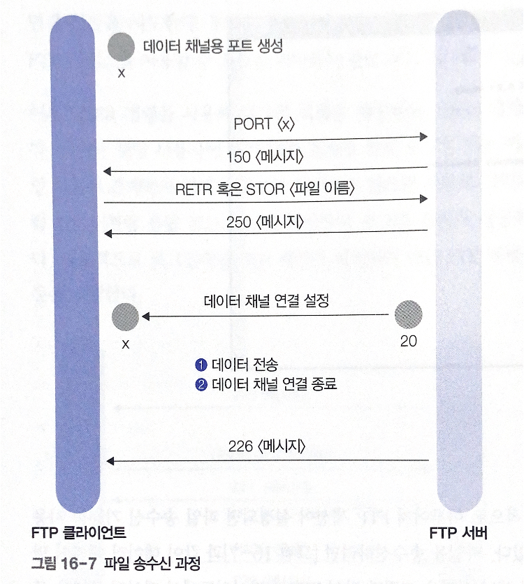
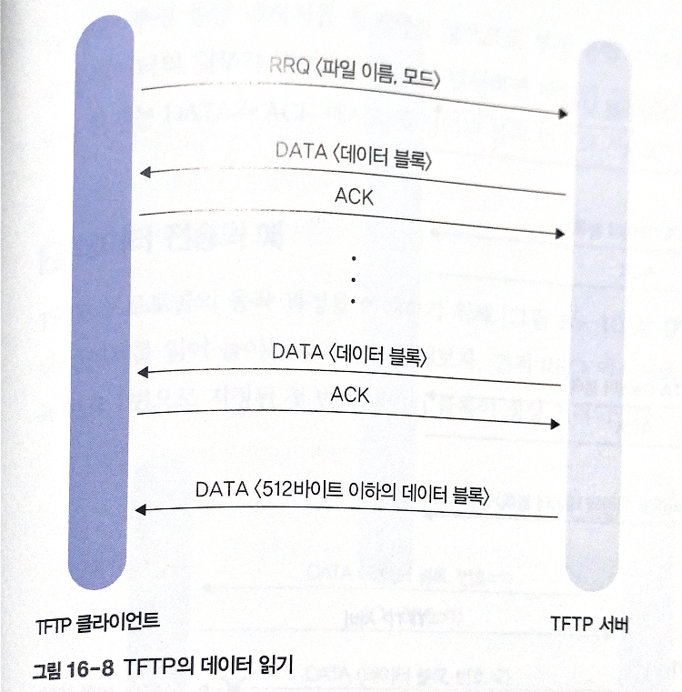
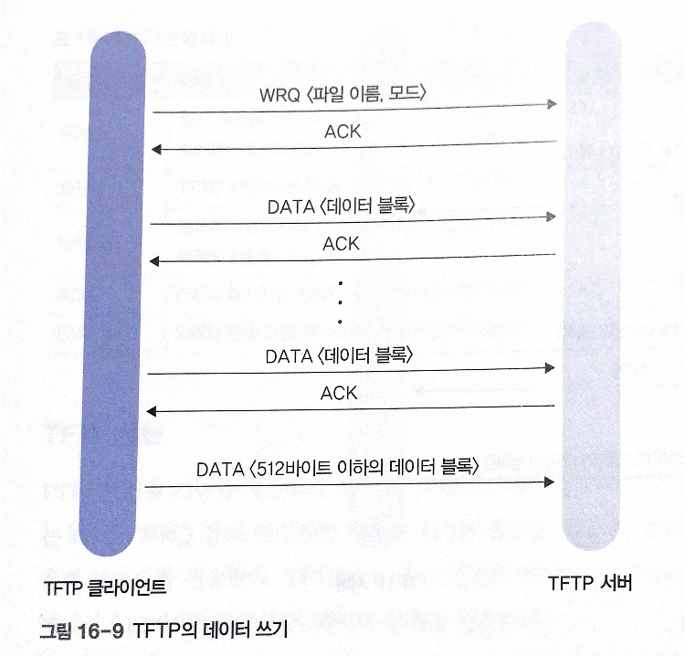

# 16. 파일 전송

# 01 FTP 응용 프로그램

FTP 프로그램: 인터넷에 연결된 호스트 간의 파일 복사 기능 제공

## 1. FTP 로그인

File Transfer Protocol: 원격 파일 시스템과의 파일 송수신 기능 지원

원격 시스템에 접속하기 위해 FTP 서버에 등록된 로그인 계정과 암호가 필요

FTP 서버에 접속하기 위해 FTP 서버의 호스트 주소와 포트 번호를 알아야한다

### 익명 FTP 로그인

익명 FTP 서비스: 다중 사용자에게 파일 서비스를 제공하기 위해 로그인 계정을 일일이 부여하는 것은 불가능 → 로그인 이름: anonymous, 로그인 암호: 전자 메일 주소

### FTP 로그인

유닉스, 리눅스 시스템에서 로그인

FTP 서버와 연결 시도 → 서버는 관련 메시지 출력, 로그인 이름과 암호 입력 요구 → 로그인 이름과 암호를 FTP 서버에 인증 → 로그인 절차 완료

## 2. FTP 명령어

********************FTP 명령********************

- get: 원격 시스템에서 파일 수신
- put: 원격 시스템으로 파일 송신
- ls: 현재 디렉터리 아래에 존재하는 파일 목록 출력
- cd: 원격 시스템의 현재 작업중인 디렉터리를 이동
- lcd: 로컬 시스템의 현재 작업중인 디렉터리를 이동
- bin: 8비트 송수신 기능 지정
- quit: FTP 프로그램 종료

# 02 FTP 프로토콜

## 1. FTP 구조

클라이언트와 서버 사이에 제어 채널, 데이터 채널이라는 두 가지 연결 사용

제어 채널: FTP 명령 전송

데이터 채널: 복사하려는 파일으 내용 전송

### 제어 채널과 데이터 채널

1. FTP 사용자에게 연결 요청
2. 사용자 인터페이스 모듈: 로그인 이름, 암호 해석하여 명령 송수신 모듈에 전달
3. 명령 송수신 모듈: FTP 서버와 연결 시도 - 제어 채널 설정
4. 사용자로부터 데이터 전송 요구 발생 - 데이터 채널 추가 설정
- 데이터 채널: 연결 설정 요구가 FTP 클라이언트가 아니라 서버에서 발생 → 클라이언트가 파일 송수신 요청 → 서버가 데이터 채널 설정

포트 번호: 데이터 채널 관련 포트=20번

### 데이터 채널의 설정

[https://copycode.tistory.com/157](https://copycode.tistory.com/157)

1. 사용자의 파일 송수신 명령 입력 - FTP 클라이언트가 데이터 채널을 위한 포트 생성
2. PORT 명령: 제어 채널을 통해 생성된 포트 번호 x를 서버에 전송
3. 데이터 송수신 명령이 제어 채널을 통해 전송 (STOR(파일 송신), RETR(파일 수신), LIST(파일 목록 수신)
4. FTP 클라이언트는 FTP 명령을 전송하고 포트 번호 x에서 대기 상태
5. FTP 서버: 제어 채널을 통해 수신한 포트 번호 x로 연결 설정 시도
6. 연결 설정 → 클라이언트와 서버가 데이터 채널을 통해 파일 데이터 송수신

## 2. FTP 명령과 응답

FTP 명령을 처리하기 위해 제어 채널 사용

### FTP 명령

| 명령어 | 설명 |
|---|---|
| USER <로그인 이름> | 인증 사용자 이름 |
| PASS <암호>	| 암호 전송 |
| QUIT	|연결 끊기, 로그아웃
| CWD <디렉터리>	| 작업 디렉터리 변경
| CDUP	| 상위 디렉터리로 이동
| PWD	| 현재 디렉터리 위치 회신
| MKD	| 디렉터리 만들기
| RMD	| 디렉터리 제거
| DELE	| 파일 삭제
| LIST	| FTP 서버에서 인수로 지정한 디렉터리 목록 정보 요청
| RNFR	| 이름 변경 원본 이름
| RNTO	| 이름 변경 대상 이름
| RETR	| 파일 복사본 전송
| STOR	| 데이터 입력 및 서버 쪽 파일로 저장.

### FTP 응답

| 응답코드 | 설명 |
| -- | -- |
| 125	| 데이터 채널 설정, 이어서 데이터 전송을 시작할 예정이다
| 200	| 명령 처리 완료
| 230	| 사용자 로그인 처리
| 250	| 요청한 파일 동작 처리
| 331	| 로그인 이름 정상적 처리, 이제 암호 처리
| 425	| 데이터 채널의 연결이 이루어지지 않음
| 426	| 연결 취소
| 450	| 파일 관련 처리를 하지 못함
| 500	| 잘못된 명령어
| 501	| 명령의 인수가 잘못되었다

### 로그인 과정

클라이언트는 FTP 서버의 21번 포트와 TCP 연결 설정 시도

→ 성공: 220 응답 코드 수신

USER 명령으로 로그인 이름, PASS 명령으로 로그인 암호 전송

→ 정상: 230 응답 코드 회신

### 파일 송수신 과정

데이터 채널 설정(클라이언트에서 데이터 채널용 포트 생성)

포트 번호 서버로 전달

클라이언트: 파일 송수신 명령을 서버에 전송

FTP 서버가 20번 포트로 FTP 클라이언트 포트번호 x에 연결 설정

파일 송수신 명령 전송

FTP 서버가 데이터 채널 연결 설정 시도 → 성공하면 데이터 전송

# 03 TFTP 프로토콜

TFTP(Trivial File Transfer Protocol): 임의의 시스템이 원격 시스템으로부터 부팅 코드를 다운로드하는 데 사용하는 프로토콜

자체적으로 하드디스크를 보유하지 못한 네트워크 터미널이 원격 서버에 저장된 부팅 이미지를 다운로드해 시스템 초기화

## 1. 동작 원리

UDP 69번 포트를 통해 데이터 전송

### TFTP 메시지

- RRQ: TFTP 서버로부터 데이터를 읽기 위한 세션 설정
- WRQ: 서버에 데이터를 쓰기위한 세션 설정
- DATA: 클라이언트나 서버가 데이터 블록을 전송할 목적으로 사용
- ACK: DATA 메시지로 전송된 데이터 블록을 수신하였음을 응답
- ERROR: 데이터 전송 과정에서 오류가 발생했을 때 사용

### TFTP 세션

UDP: 연결 기능x, 데이터 블록을 독립적으로 전송

### 데이터 전송 오류의 처리

UDP - 데이터의 신뢰성, 순서 제어 기능 지원x

- 데이터 도착 순서: 연속형 전송 기능 지원x, 하나의 DATA 메시지에 대해 ACK 메시지가 순차적으로 완료됨, 데이터 블록 전송을 하나씩 처리
- 데이터 분실: 모든 DATA와 ACK 메시지를 분실하면 송신자가 타임아웃 기능 수행

