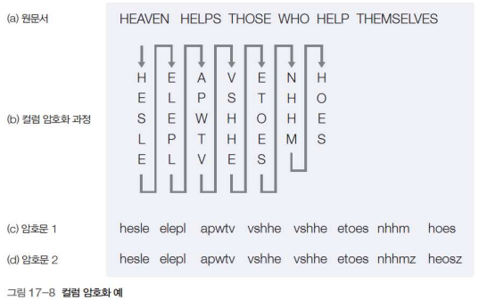
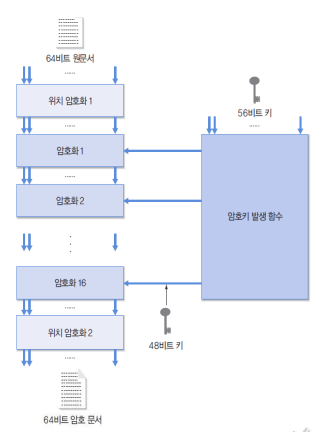
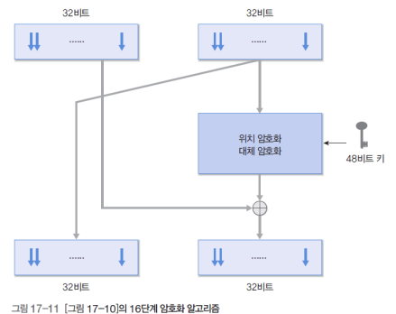
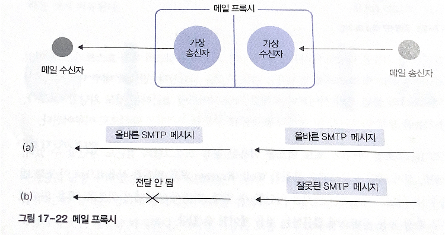

# 17. 암호화와 네트워크 보안

# 01 암호화의 이해

## 1. 용어의 정의

네트워크는 기본적으로 개방형 시스템, 제3자가 임의로 접근 가능, 전송 메시지는 외부 접근에 노출되어 있음

**외부 침입자가 전송 메시지에 가하는 공격 행동**

- 메시지 읽기
    - 전송 선로에서 흐르는 신호를 도청하여 메시지의 내용을 읽는다
    - 암호화 기법으로 해결
- 전송 방해
    - 전송 메시지가 수신자에게 도착하지 못하게 함으로써 송수신자 간의 통신 방해
    - 방화벽 기능, 무선 통신에서 교란 전파 발사
- 메시지 수정
    - 전송되는 메시지의 내용 수정

### 암호화 용어

암호화: 메시지의 내용을 임의로 조작하여 원래의 의미를 알아볼 수 없도록 변형하는 작업

원문서: 암호화 전의 원본 문서

암호문: 원문서를 암호화한 문서

### 암호키

**암호키**: 송신 호스트에서 암호화 알고리즘에 필요한 키

**해독키**: 수신 호스트에서 해독 알고리즘에 필요한 키

**대칭키(단일키)**: 송수신 호스트 외의 제3자가 키값을 알지 못하도록 하는 것이 중요

**비대칭키**: 송수신 호스트가 서로 다른 키 사용

## 2. 대체 암호화

대체 암호화: 임의의 문자를 특정한 문자로 대체하는 암호화

### 시저 암호화

알파벳 문자를 순차적으로 세 문자씩 오른쪽으로 이동하면서 대체 문자를 사용

장점: 단순함

단점: 외부 침입자도 쉽게 해독

### 키워드 암호화

키워드로 지정한 단어를 문자 변환표의 앞줄에 먼저 적고 키워드로 사용한 문자를 뺀 나머지 문자를 알파벳 순으로 기술

```
A B C D E F G H I J K L M N O P ...
s e o u l a b c d f g h i j k m ...
```

키워드를 모르면 시저 암호화보다 추측하기 어려움

대체 문자 변환표의 오르쪽으로 갈수록 원문과 암호문의 문자가 같아질 확률이 높다

### 복수 개의 문자 변환표

문자 변환표를 둘 이상사용

ex. 홀수 / 짝수 문자 변환표를 다르게

## 3. 위치 암호화

문자의 배열 순서를 변경해 암호화

각 문자의 모양은 그대로 유지, 문자의 배열 위치를 임의로 변경

### 컬럼 암호화

전체 문장을 제한된 길이의 컬럼을 갖는 표에 작성, 컬럼을 기준으로 재배치



컬럼 길이가 7인 컬럼 암호화 방식

### 키워드 암호화

중복된 문자를 포함하지 않는 임의의 단어를 암호키로 제공


NETWORK의 각 문자에 알파벳 순으로 일련번호 부여

그 아래에 원문서 문자를 차례대로 적고 키워드의 일련번호에 따라 워눔ㄴ서 배치

# 02 암호화 시스템

## 1. DES 알고리즘

암호키와 해독키가 동일

이 키는 외부에 유출x → **비밀키**, 양쪽이 동일키 사용 → **대칭키**

비공개키 알고리즘: 외부 사용자에게 노출되지 않아야 하는 암호키로 암호화하는 알고리즘

암호화를 64비트 단위로 수행, 암호키의 크기는 56비트

### 동작 방식

64비트인 데이터블록을 32비트씩 둘로 나누어 독립적으로 처리

32비트 블록 하나를 암호키로 암호화, 두 블록의 위치를 맞바꾸는 과정을 16번 반복



위치 암호화: 시작과 끝 두 번 수행

### 16단계의 암호화



이전 단계에서 주어진 입력 데이터의 오른쪽 32비트: 아무 작업 없이 왼쪽 비트로 나감

오른쪽 출력의 43비트 계산

- 48비트의 암호키와 32비트의 입력 이용
- 임의의 함수 F를 이용해 32비트의 결과를 얻음
- 이 값과 입력 데이터의 왼쪽 32비트를 배타적 논리합(XOR)으로 계싼하여 오른쪽 32비트의 출력

### 3DES 알고리즘

세 번의 DES 알고리즘을 수행

구현하기 쉬움, 기존 DES 시스템 사용

DES 알고리즘에 비해 3배 이상 속도가 느리다

매 단계에서 서로 다른 56비트의 키가 사용 → 전체적으로 168비트의 키 지원

K1: 암호화, K2: 해독, K3: 암호화

**3DES의 암호키 옵션**
- 3개의 키가 모두 독립적: 168비트의 키, 보안 기능 가장 뛰어남
- K1과 K2는 독립적, K3=K1: 112비트의 키가 사용
- K1=K2=K3: DES와 동일

## RSA 알고리즘

공개키 알고리즘: 암호키와 해독키가 동일하지 않도록 고안

암호키가 외부에 공개되어도 해독키를 모르면 암호문 해독 불가능

수신 호스트는 암호문을 해독하기 위해 비공개키 사용 → 비공개키는 공개키와 다른 값

ex. 은행: 은행 계좌번호와 비밀번호 등의 정보를 포함하는 암호문은 은행 본점만 해독

## 3. 전자 서명

인터넷 환경에서 특정 사용자를 인증

cf. 권한과 다르 특징(Authorization)

전자 서명의 인증 과정: RSA 알고리즘과 반대

비공개키 알고리즘 + 공개키 알고리즘의 조합을 사용

자신을 다수의 타인에게 증명 → **암호화 과정: 비밀키(전자 서명) 사용,** **해독 과정: 공개키 사용**

### 암호화 과정

1. 전자 서명 알고리즘으로 자신을 인증 비공개키 암호화 단계
2. 전자 서명의 정보 전송 - RSA 알고리즘을 사용하는 공개키 암호화 단계

### 해독 과정

1. RSA 알고리즘의 비공개키로 해독하여 전자 서명문을 얻음
2. 송신 호스트의 인증에 필요한 전자 서명 공개키를 사용해 해독

# 03 보안 프로토콜

## 1. 보안 프로토콜의 개요

### 감청

허가받지 않은 자가 직간접적인 방법으로 전송 중인 데이터를 얻는 것

넓은 의미의 감청: 불법으로 획득한 정보를 변경한 후 이를 통신 과정에 다시 입력 → 송수신 호스트의 내용을 왜곡

**전통적 형태의 감청**

- 유선의 통신 선로
- 인터넷: 이더넷 선로에 감청장비를 연결해 패킷을 훔쳐냄 (이더넷:브로드캐스팅 방식 - 감청에 취약)
- 스마트폰 무선 데이터: 무선 신호가 넓은 범위로 전파 - 물리적 감청이 훨씬 용이함

### 암호화

**데이터 링크 계층 암호화**: 물리 계층에서 데이터를 송신하기 전에 암호화 - 전송 선로에서 감청 위협으로부터 데이터를 안전하게 보호

응용~네트워크 계층: 암호화 기능x, 전송 직전인 데이터 링크 계층에서 암호화

단점: 네트워크 계층에서 데이터가 암호화되지 않음 - 송수신 호스트 사이의 라우터에서 보안x

오직 송수신 호스트와 라우터들 사이의 전송 선로에서만 보안 유지

→  **암호화**

: 송수신 과정의 끝단에 위치한 응용 계층에서 암호화

### 트래픽 제어

특정 호스트가 누구와 통신을 많이 하는지에 대한 정보

무의미한 가공의 데이터를 여러 호스트에서 주기적으로 발생 → 통계 자료에 혼선

## 2. 방화벽

방화벽(Firewall): 개방적인 공중 인터넷망과 제한된 사용자 그룹에 허가된 사설망 사이에 보안 기능

사설망을 외부로부터 보호 → 외부망 끊기

방화벽: 사설망과 인터넷 사이에 출입문을 두어 양쪽 모두의 출입을 통제

**기술**

- 패킷 필터링 방법: 방화벽이 패킷의 헤더/내용을 검색하여 적절하지 못한 패킷 배제, 라우터에서 구현
- 사용자 감시

### 라우터를 이용한 방화벽 구현

호스트들은 외부 통신망과 연결하기 위해 반드시 라우터의 중개 과정을 거침

라우터는 네트워크로부터 입력도니 패킷의 정보 분석 → 위장 패킷이 내부 네트워크로 유입되는 것을 차단할 수 있음

**사용할 수 있는 곳**

- 특정 호스트가 스팸 메일 자주 전송 - 이 호스트를 발신자로 하는 패킷 차단
- 내부 네트워크에서 외부 네트워크의 불법 도박 사이트 접근 차단

→ 라우터가 IP 패킷의 송수신 IP 주소 분석

+포트 번호를 이용한 응용 프로그램의 접근 차단

### 프록시를 이용한 방화벽 구현

라우터의 방화벽 기능: 메일 내용처럼 **패킷 내부**에 포함되는 응용 데이터 제한x (헤더 정보의 IP 주소, 포트 번호에 기초)

프록시: 응용 환경에서 적절하게 처리할 수 있는 정보만 수신하도록 가상의 응용 프로그램을 시뮬레이션하는 방화벽



메일 송신자와 수신자 사이에 메일 프록시 설치

프록시: 메일 송신자의 SMTP 메시지 해석 → 올바르게 작성된 경우 수신자에게 전달

잘못된 메시지 / 해킹 코드 의심 → 메시지차단