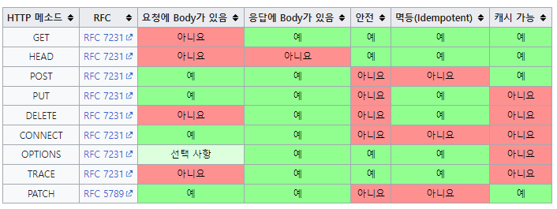

# 4. HTTP 메서드

## HTTP API를 만들어보자

### API URI 고민

URI(Uniform Resource Identifier)

- 리소스의 의미?
  - 회원을 등록, 수정, 조회하는 게 리소스가 아님
  - ex) 미네랄을 캐라 → 미네랄이 리소스
  - **회원**이라는 개념 자체가 리소스
- 리소스는 어떻게 식별?
  - 회원을 등록 수정 조회 → 모두 배제
  - “회원”이라는 리소스만 식별 → 회원 리소스를 URI에 매핑

### 리소스와 행위를 분리

가장 중요한 것은 리소스를 식별하는 것

- URI는 리소스만 식별
- **리소스**와 해당 리소스를 대상으로 하는 **행위**를 분리
  - 리소스: 회원
  - 행위: 조회, 등록, 삭제, 변경
- 리소스는 명사, 행위는 동사
- 행위(메서드)는 어떻게 구분?

## HTTP 메서드 - GET, POST

주요 메서드

- GET: 리소스 조회
- POST: 요청 데이터 처리, 주로 등록에 사용
- PUT: 리소스를 대체, 해당 리소스가 없으면 생성
- PATCH: 리소스부분 변경
- DELETE: 리소스 삭제

기타 메서드

- HEAD: GET과 동일하지만 메시지 부분을 제외하고, 상태 줄과 헤더만 반환
- OPTIONS: 대상 리소스에 대한 통신 가능 옵션(메소드)을 설명(주로 CORS에서 사용)
- CONNECT: 대상 자원으로 식별되는 서버에 대한 터널을 설정
- TRACE: 대상 리소스에 대한 경로를 따라 메시지 루프백 테스트를 수행

### GET

- 리소스 조회
- 서버에 전달하고 싶은 데이터는 query(쿼리 파라미터, 쿼리 스트링)를 통해서 전달
- 메시지 바디를 사용해서 데이터를 전달할 수 있지만, 지원하지 않는 곳이 많아서 권장하지 않음

### POST

- 요청 데이터 처리
- **메시지 바디를 통해 서버로 요청 데이터 전달**
- 서버는 요청 데이터를 처리
  - 메시지 바디를 통해 들어온 데이터를 처리하는 모든 기능을 수행
- 주로 전달된 데이터로 신규 리소스 등록, 프로세스 처리에 사용

스펙: POST 메서드는 **대상 리소스가 리소스의 고유한 의미 체계에 따라 요청에 포함된 표현을 처리하도록 요청**한다

예시

- HTML 양식에 입력된 필드와 같은 데이터 블록을 데이터 처리 프로세스에 제공
  - ex) HTML FORM에 입력한 정보로 회원 가입, 주문 등
- 게시판, 뉴스 그룹, 메일링 리스트, 블로그 또는 유사한 기사 그룹에 메시지 게시
  - ex) 게시판 글쓰기, 댓글 달기
- 서버가 아직 식별하지 않은 새 리소스 생성
  - ex) 신규 주문 생성
- 기존 자원에 데이터 추가
  - ex) 한 문서 끝에 내용 추가

→ 이 리소스 URI에 POST 요청이 오면 요청 데이터를 어떻게 처리할지 리소스마다 따로 정해야 한다

—정리

1. 새 리소스 생성(등록): 서버가 아직 식별하지 않은 새 리소스 생성
2. 요청 데이터 처리
   - 단순히 데이터를 생성, 변경을 넘어서 프로세스를 처리해야 하는 경우
   - ex. 주문에서 결제 완료 → 배달 시작 → 배달 완료처럼 프로세스의 상태가 변경되는 경우
   - POST의 결과로 새로운 리소스가 생성되지 않을 수도 있음
3. 다른 메서드로 처리하기 애매한 경우
   - 예) JSON으로 조회 데이터를 넘겨야 하는데, GET 메서드를 사용하기 어려운 경우
   - 애매하면 POST

## HTTP 메서드 - PUT, PATCH, DELETE

### PUT

- 리소스를 대체
  - 리소스가 있으면 대체, 없으면 생성
- \***\*클라이언트가 리소스를 식별**
  - 클라이언트가 리소스 위치를 알고 URI 지정
  - POST와 차이점
- 주의! 리소스를 **완전히 대체함**
  - 기존 리소스: “username”: “young”, “age”: 20
  - 새로운 리소스 PUT: “age”: 50
  - 결과: “age”: 50

### PATCH

리소스 **부분 변경**

- 기존 리소스: “username”: “young”, “age”: 20
- 새로운 리소스 PUT: “age”: 50
- 결과: “username”: young, “age”: 50

### DELETE

리소스 제거

## HTTP 메서드의 속성

### 안전 Safe

- 호출해도 **리소스를 변경하지 않는다**
- ex. GET, HEAD

### 멱등 Idempotent

f(f(x)) = f(x)

한 번 호출하든 두 번 호출하든 100번 호출하든 결과가 똑같다

- GET: 한 번 조회하든, 두 번 조회하든 같은 결과가 조회됨
- PUT: 결과를 대체, 같은 요청을 여러번 해도 최종 결과는 같음
- DELETE: 결과를 삭제, 같은 요청을 여러번 해도 삭제된 결과는 똑같음
- POST: 멱등이 아니다, 두 번 호출하면 같은 결제가 중복해서 발생할 수 있다 (ex. 결제, 등록 .. )

**활용**

- 자동 복구 메커니즘을 쓸 수 있는지 여부
- 서버가 TIMEOUT 등으로 정상 응답을 못 주었을 때, 클라이언트가 같은 요청을 다시 해도 되는가? - 판단 근거가 됨

외부 요인으로 중간에 리소스가 변경되는 것까지는 고려하지 않음

### 캐시 가능 Cacheable

응답 결과 리소스를 캐시해서 사용해도 되는가?

- GET, HEAD, POST, PATCH 캐시 가능
- 실제로는 GET, HEAD 정도만 캐시로 사용
- POST, PATCH는 본문 내용까지 캐시 키로 고려해야 해서 구현이 쉽지 않다
