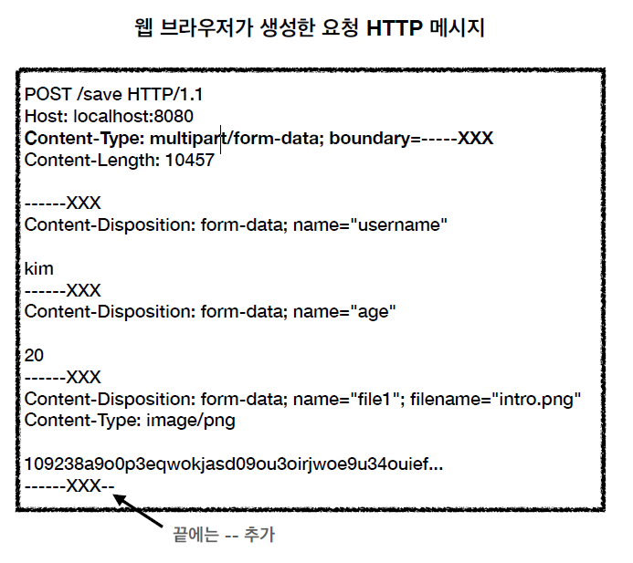

## 클라이언트에서 서버로 데이터 전송

### 데이터 전달 방식

- 쿼리 파라미터를 통한 데이터 전송
  - GET
  - 주로 정렬 필터(검색어)
- 메시지 바디를 통한 데이터 전송
  - POST, PUT, PATCH
  - 회원 가입, 상품 주문, 리소스 등록, 리소스 변경

**4가지 상황**

### 정적 데이터 조회

쿼리 파라미터 미사용

- 이미지, 정적 텍스트 문서
- 조회는 GET 사용
- 정적 데이터는 일반적으로 쿼리 파라미터 없이 **리소스 경로**로 단순하게 조회 가능

### 동적 데이터 조회

쿼리 파라미터 사용

ex. https://www.google.com/search?q=hello&hl=ko

쿼리 파라미터를 기반으로 정렬 필터해서 결과를 동적으로 생성

- 주로 검색, 게시판 목록에서 정렬 필터 (검색어)
- 조회 조건을 줄여주는 필터, 조회 결과를 정렬하는 정렬 조건에 주로 사용
- 조회는 GET 사용
- GET은 쿼리 파라미터 사용해서 데이터를 전달

### HTML Form 데이터 전송

POST 전송- 저장

form 데이터 전송 요청 시 HTTP 메시지

```xml
<form action="/save" method="POST">
	<input type="text" name="username"/>
...
</form>
```

```
POST /save HTTP/1.1
HOST: localhost:8080
Content-Type: application/x-www-form-urlencoded

username=kim&age=20
```

쿼리 파라미터와 유사한 스타일로 http body에 넣음 → 서버에 전송

content-type: application/x-www-form-urlencoded

cf. Form 데이터 전송 시 GET 요청

```
GET /save?username=kim&age=20 HTTP/1.1
Host: localhost:8080
```

message body를 쓰지 않고 쿼리 파라미터로 넣음 → 서버에 전달

\*\*GET은 조회에서만 사용하기

- multipart/form-data

파일 전송

byte로 되어 있는 파일 전송



boundary가 값에 따라 경계를 나눠줌

주로 binary data를 보낼 때 사용

다른 종류의 여러 파일과 폼의 내용 함께 전송 가능 (그래서 이름이 multipart)

\*\*HTML Form 전송은 GET, POST만 지원

### HTTP API 데이터 전송

- 서버 to 서버
  - 백엔드 시스템 통신
- 앱 클라이언트
  - 아이폰, 안드로이드
- 웹 클라이언트
  - HTML에서 Form 전송 대신 자바 스크립트를 통한 통신에 사용(AJAX)
- POST, PUT, PATCH: 메시지 바디를 통해 데이터 전송
- GET: 조회, 쿼리 파라미터로 데이터 전달
- Content-Type: application/json을 주로 사용(사실상 표준)
  - TEXT, XML, JSON 등등

## HTTP API 설계 예시

회원 관리 시스템

- 회원 목록 /members → GET
- 회원 등록 /members → POST
- 회원 조회 /members/{id} → GET
- 회원 수정 /members/{id} → PATCH, PUT, POST
- 회원 삭제 /members/{id} → DELETE

### POST - 신규 자원 등록 특징

클라이언트는 등록될 리소스의 URI를 모른다

- 회원 등록 /members → POST
- POST /members

**서버가 새로 등록될 리소스 URI를 생성**

- HTTP/1.1 201 Created Location :/members/100

컬렉션

- 서버가 관리하는 리소스 디렉토리
- 서버가 리소스의 URI를 생성하고 관리
- 여기서 컬렉션은 /members

### PUT 기반 등록

파일 관리 시스템

- 파일 목록 /files → GET
- 파일 조회 /files/{filename} → GET
- 파일 등록 /files/{filename} → PUT
- 파일 삭제 /files/{filename} → DELETE
- 파일 대량 등록 /files → POST

### PUT - 신규 자원 등록 특징

클라이언트가 리소스 URI를 알고 있어야 한다

- 파일 등록 /files/{filename} → PUT
- PUT /files/star.jpg

클라이언트가 직접 리소스의 URI를 지정

스토어 (Store)

- 클라이언트가 관리하는 리소스 저장소
- 클라이언트가 리소스의 URI를 알고 관리
- 여기서 스토어는 /files

### HTML FORM 사용

- HTML FORM은 GET, POST만 지원
- AJAX 같은 기술을 사용해서 해결 가능 → 회원 API 참고
- 여기서는 순수 HTML, HTML FORM 이야기
- GET, POST만 지원하므로 제약이 있음

| 회원 목록    | /members                          | GET  |
| ------------ | --------------------------------- | ---- |
| 회원 등록 폼 | /members/new                      | GET  |
| 회원 등록    | /members/new /members             | POST |
| 회원 조회    | /members/{id}                     | GET  |
| 회원 수정 폼 | /members/{id}/edit                | GET  |
| 회원 수정    | /members/{id}/edit, /members/{id} | POST |
| 회원 삭제    | /members/{id}/delete              | POST |

- 컨트롤 URI
  - GET, POST만 지원하므로 제약
  - 이런 제약을 해결하기 위해 동사로 된 리소스 경로 사용
  - POST의 /new, /edit, /delete가 컨트롤 URI
  - HTTP 메서드로 해결하기 애매한 경우 사용 (HTTP API 포함)

### 참고하면 좋은 URI 설계 개념

- 문서(document)
  - 단일 개념(파일 하나, 객체 인스턴스, 데이터베이스 row)
  - 예) /members/100, /files/star.jpg
- 컬렉션(collection)
  - 서버가 관리하는 리소스 디렉터리
  - 서버가 리소스의 URI를 생성하고 관리
  - 예) /members
- 스토어(store)
  - 클라이언트가 관리하는 자원 저장소
  - 클라이언트가 리소스의 URI를 알고 관리
  - 예) /files
- 컨트롤러(controller), 컨트롤 URI
  - 문서, 컬렉션, 스토어로 해결하기 어려운 추가 프로세스 실행
  - 동사를 직접 사용
  - 예) /members/{id}/delete
