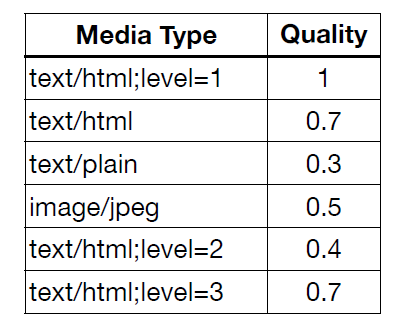

# 7. HTTP 헤더 - 일반헤더

## HTTP 헤더 개요

- header-field = field-name “:” OWS field-value OWS
- file-name은 대소문자 구분이 없음

### 용도

- HTTP 전송에 필요한 모든 부가정보
- 예) 메시지 바디의 내용, 메시지 바디의 크기, 압축, 인증, 요청 클라이언트, 서버 정보, 캐시 관리 정보..
- 표준 헤더가 너무 많음
- 필요시 임의의 헤더 추가 가능

### 분류 - RFC2616 (과거)

- **General 헤더**: 메시지 전체에 적용되는 정보, 예)Connection: close
- **Request 헤더**: 요청 정보, 예) User-Agent: Mozilla/5.0
- **Response 헤더**: 응답 정보, 예) Server: Apache
- **Entity 헤더**: 엔티티 바디 정보, 예) Content-Type: text/html, Content-Length: 3423,

messagy body

- 메시지 본문은 엔티티 본문을 전달하는데 사용 (메시지 본문 안에 엔티티 본문을 담아서 전송)
- 엔티티 본문은 요청이나 응답에서 전달할 실제 데이터
- 엔티티 헤더는 엔티티 본문의 데이터를 해석할 수 있는 정보 제공
  - 데이터 유형(html, json), 데이터 길이, 압축 정보 등등

HTTP 표준 - RFS2616 폐기 → RFC 7230~7235 등장

### RFC723x 변화

- 엔티티(Entity) → 표현(Representation)
- Representation = representation Metadata + Representation Data
- 표현 = 표현 메타데이터 + 표현 데이터

### HTTP BODY - message body (최신)

- 메시지 본문(message body)을 통해 표현 데이터 전달
- 메시지 본문 = 페이로드(payload)
- **표현**은 요청이나 응답에서 전달할 실제 데이터
- **표현 헤더**는 표현 데이터를 해석할 수 있는 정보 제공
  - 데이터 유형(html, json), 데이터 길이, 압축 정보 등등
- 참고: 표현 헤더는 표현 메타데이터와, 페이로드 메시지를 구분해야 하지만, 생략

## 표현

회원이라는 리소스가 있을 때, 이걸 html이라는 표현으로 전달? json 표현으로 전달?

리소스는 추상적 → 이걸 클라이언트와 서버 간에 주고받을 때는 서로 이해할 수 있는 방식으로 전환

- Content-Type: 표현 데이터의 형식 (json/html.. )
- Content-Encoding: 표현 데이터의 압축 방식
- Content-Language: 표현 데이터의 자연 언어 (한국어/영어/..)
- Content-Length: 표현 데이터의 길이

- 표현 헤더는 전송, 응답 둘다 사용

### Content-Type

표현 데이터의 형식 설명

미디어 타입, 문자 인코딩

예시)

- text/html; charset = utf-8
- application/json
- image/png

### Content-Encoding

표현 데이터 인코딩

표현 데이터를 압축하기 위해 사용

데이터를 전달하는 곳에서 압축 후 인코딩 헤더 추가

데이터를 읽는 쪽에서 인코딩 헤더의 정보로 압축 해제

예)

- gzip
- deflate
- identity

### Content-Language

표현 데이터의 자연언어

예) ko, en, en-US

### Content-Length

표현 데이터의 길이

바이트 단위

Transfer-Encoding(전송 코딩)을 사용하면 Content-Length를 사용하면 안됨

## 콘텐츠 협상

contents negotiation

클라이언트가 선호하는 표현을 요청

- Accept: 클라이언트가 선호하는 미디어 타입 전달
- Accept-Charset: 클라이언트가 선호하는 문자 인코딩
- Accept-Encoding: 클라이언트가 선호하는 압축 인코딩
- Accept-Language: 클라이언트가 선호하는 자연 언어

협상 헤더는 **요청 시에만 사용**

### Accept-Language 적용 전

한국어 브라우저 사용 → 외국의 사이트에 접속 `(GET /event)`

서버: 다중 언어 지원, 1. 기본 영어 2. 한국어 지원

클라이언트에는 한국어를 사용한다는 정보가 없으니까 서버는 영어 응답

### Accept-Language 적용 후

접속할 때

`GET /event`

`Accept-Language: ko` (선호하는 언어는 한국어라고 요청)

→ 서버가 한국어로 응답

### 다른 예시 (한국어 지원x)

서버: 기본 독일어, 영어도 지원 O

클라이언트: Accept-Language: ko, (독일어보단 영어를 더 선호함)

→ 서버는 그냥 독일어로 응답

→ **우선순위가 필요함**

### 협상과 우선순위

Quality Values(q) 값 사용

```jsx
GET /event
Accept-Language: ko-KR,ko;q=0.9,en-US;q=0.8;en;q=0.7
```

생략되어 있으면 1

0~1, 클수록 높은 우선순위

1. ko-KR;q=1 (q생략)
2. ko;q=0.9
3. en-US;q=0.8
4. en;q=0.7

구체적인 것이 우선한다

- Accept: text/_, text/plain, text/plain;format=flowed, _/\*

1. text/plain;format=flowed
2. text/plain
3. text/\*
4. **/**

구체적인 것을 기준으로 미디어 타입을 맞춘다

- Accept: text/_;q=0.3, text/html;q=0.7, text/html;level=1, text/html;level=2;q=0.4, _/\*;q=0.5



## 전송 방식

### 단순 전송

메시지 바디에 대한 Content-Length를 지정

한 번에 요청 → 한 번에 전송

### 압축 전송

Content-Encoding으로 압축

Content-Length가 감소

Content-Encoding을 넣어줘서 뭐로 압축했는지 알려줘야 함

### 분할 전송

Transfer-Encoding

(option: chunked, 덩어리로 보냄)

용량이 큰 경우에 사용

Content-Length를 넣으면 안됨 → 처음에 예상할 수 없다, 분할해서 보낼 때 각각의 길이가 다 포함되어 있기 때문

### 범위 전송

Range, Content-Range

이미지를 받을 때, 절반 정도 받았다가 끊김 → 처음부터 요청x, 범위를 지정해서 요청\

클라이언트: Range에 범위 지정

서버: Content-Range에 전송하는 데이터의 범위 표시

## 일반 정보

### From

유저 에이전트의 이메일 정보

일반적으로 잘 사용되지 않음

검색 엔진 같은 곳에서 주로 사용

요청에서 사용

### Referer

현재 요청된 페이지의 이전 웹 페이지 주소

A → B로 이동하는 경우 B를 요청할 때 Referer: A를 포함해서 요청

Referer를 사용해서 유입 경로 분석 가능

요청에서 사용

참고: referer는 단어 referrer의 오타

### User-Agent

유저 에이전트 애플리케이션 정보

클라이언트의 애플리케이션 정보(웹 브라우저 정보 등등)

통계 정보

어떤 종류의 브라우저에서 장애가 발생하는지 파악 가능

(특정 브라우저에만 오류가 생길 때 로그 확인)

요청에서 사용

### Server

요청을 처리하는 ORIGIN 서버의 소프트웨어 정보

ORIGIN? → HTTP 요청을 보내면 중간에 여러 프록시 서버를 거친다, 실제로 http 응답을 보내주는 서버를 의미

- Server: Apache/2.2.22 (Debian)
- server: nginx
- 응답에서 사용

### Date

메시지가 발생한 날짜와 시간

응답에서 사용

## 특별한 정보

### Host

요청한 호스트 정보(도메인)

요청에서 사용, **필수**

하나의 서버가 여러 도메인을 처리해야 할 때

하나의 IP 주소에 여러 도메인이 적용되어 있을 때

IP로만 통신하니까 한 서버에서 어떤 도메인과 관련된 요청인지 구분할 수 없음

Host 헤더 필드를 넣어서 도메인을 표시

### Location

페이지 리다이렉션

웹 브라우저는 3xx 응답의 결과에 Location 헤더가 있으면, Location 위치로 자동 이동(리다이렉트)

응답코드 3xx에서 설명

201(Created): Location 값은 요청에 의해 생성된 리소스 URI

3xx(Redirection): Locaiton 값은 요청을 자동으로 리다이렉션하기 위한 대상 리소스를 가리킴

### Allow

허용 가능한 HTTP 메서드

- 405 (Method Not Allowed) - URL 경로는 있는데, POST를 제공을 안함 → 응답에 Allow를 포함
- Allow: GET, HEAD, PUT (POST는 지원하지 않는다)

### Retry-After

유저 에이전트가 다음 요청을 하기까지 기다려야 하는 시간

- 503 (Servie Unavailable) : 서비스가 언제까지 불능인지 알려줄 수 있음
- 날짜 표기(Fri, 31 Dec 1999 23:59:59 GMT), 초단위 표기(120)

## 인증

### Authorization

클라이언트 인증 정보를 서버에 전달

Authorization: Basic xxxxxxxxxxx

### WWW-Authenticate

리소스 접근시 필요한 인증 방법 정의

401 Unauthorized 응답과 함께 사용, 401에러가 나면 이 헤더를 넣어줘야 한다

## 쿠키

- Set-Cookie: 서버에서 클라이언트로 쿠키 전달(응답)
- Cookie: 클라이언트가 서버에서 받은 쿠키를 저장하고, HTTP 요청시 서버로 전달

### Stateless

HTTP는 무상태 프로토콜

클라이언트와 서버가 요청과 응답을 주고 받으면 연결이 끊어진다

클라이언트가 다시 요청하면 서버는 이전 요청을 기억하지 못한다

클라이언트와 서버는 서로 상태를 유지하지 않는다

쿠키 미사용 → 로그인 정보를 서버가 기억하지 못함

대안: 모든 요청과 링크에 사용자 정보 포함?

### 모든 요청에 정보를 넘기는 문제

- 모든 요청에 사용자 정보가 포함되도록 개발해야 함
- 브라우저를 완전히 종료하고 다시 열면?

→ 쿠키 등장

웹브라우저: user=홍길동으로 로그인

서버: Set-Cookie: user = 홍길동

쿠키 저장소에 user=홍길동 저장

→ 요청을 보낼 때마다 HTTP 헤더에 Cookie: user=홍길동 저장

쿠키

예) set-cookid: sessionId=abcde1234; expires=Sat, 26-Dec … ; path=/; domain=.google.com; Secure

- **사용처**
  - 사용자 로그인 세션 관리
  - 광고 정보 트래킹
- **쿠키 정보는 항상 서버에 전송됨**
  - 네트워크 트래픽 추가 유발
  - 최소한의 정보만 사용(세션 id, 인증 토큰)
  - 서버에 전송하지 않고 웹 브라우저 내부에 데이터를 저장하고 싶으면 웹 스토리지 (localStorage, sessionStorage) 참고
- **주의**
  - 보안에 민감한 데이터는 저장하면 안됨

### 쿠키-생명주기

expires=날짜를넣을 수 있음 - 만료일이 되면 쿠키 삭제

- Set-Cookie: max-age=3600, 초 단위로 지정
  - 0이나 음수를 지정하면 쿠키 삭제
- 세션 쿠키: 만료 날짜를 생략하면 브라우저 종료시까지만 유지
- 영속 쿠키: 만료 날짜를 입력하면 해당 날짜까지 유지

### 쿠키 - 도메인

예) domain=example.org

명시: 명시한 문서 기준 도메인 + 서브 도메인 포함

- domain=example.org를 지정해서 쿠키 생성
  - [example.org](http://example.org) + dev.example.org도 쿠키 접근
- 생략: 현재 문서 기준 도메인만 적용
  - example.org에서 쿠키를 생성, 도메인 지정 생략
  - example.org에서만 쿠키 접근
  - dev.example.org는 쿠키 미접근

### 경로

path=/home

이 경로를 포함한 하위 경로 페이지만 쿠키 접근

일반적으로 path=/루트로 지정

예)

- path=/home 지정
- /home 가능
- /home/level1 가능
- /home/level1/level2 가능
- /hello 불가능

### 보안

**Secure**

- 쿠키는 http, https를 구분하지 않고 전송
- secure를 적용하면 https인 경우에만 전송

**HttpOnly**

- XSS 공격 방지
- 자바스크립트에서 접근 불가(document.cookie)
- HTTP 전송에만 사용

**SameSite**

- XSRF 공격 방지
- 요청 도메인과 쿠키에 설정된 도메인이 같은 경우만 쿠키 전송
