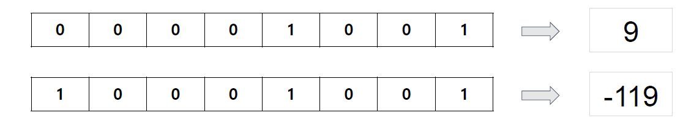

# 기타

## 0718

### 운영체제와 프로그램이란?

- 프로그램: 컴퓨터에서 실행될 때 특정 작업(specific task)을 수행하는 일련의 명령어들의 모음(집합)
- 운영체제: 시스템 하드웨어를 관리할 뿐 아니라 응용 소프트웨어를 실행하기 위하여 하드웨어 추상화 플랫폼과 공통 시스템 서비스를 제공하는 시스템 소프트웨어

하드웨어: 키보드, 마우스, 모니터

### 컴퓨터의 자료표현

- 비트(Bit)

Bit: Binary digit - 이진 데이터, 컴퓨터가 **값을 저장**할 수 있는 최소단위

Byte: 1byte = 8bit, 컴퓨터가 **정보를 처리**하기 위한 최소 단위

용량 단위

- SI- $10^3$ 기준
- IEC- 2^10 기준

500GB SSd → 475GB

1byte 기준

2^8: 256가지, 1byte: 0~255, -128~127: 0포함 256가지

10001001 → 1의 보수법: 01110111=-119 : +0과 -0을 표현함

2의 보수법